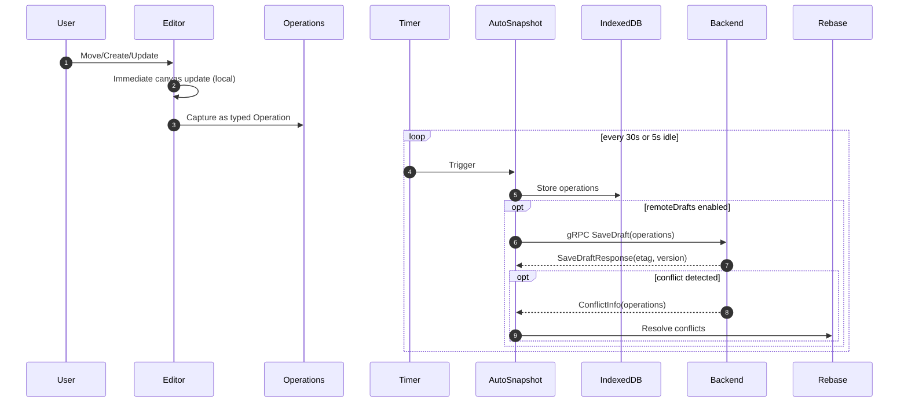
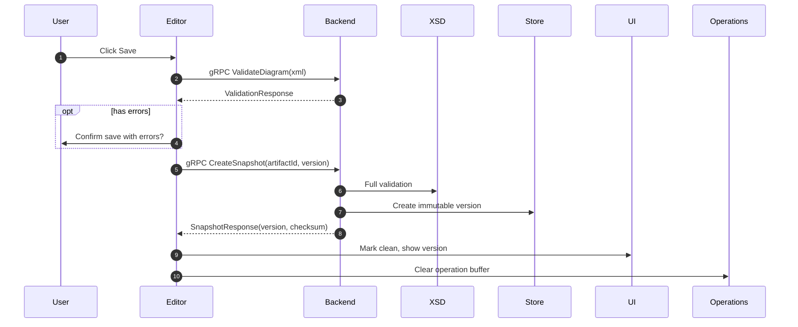
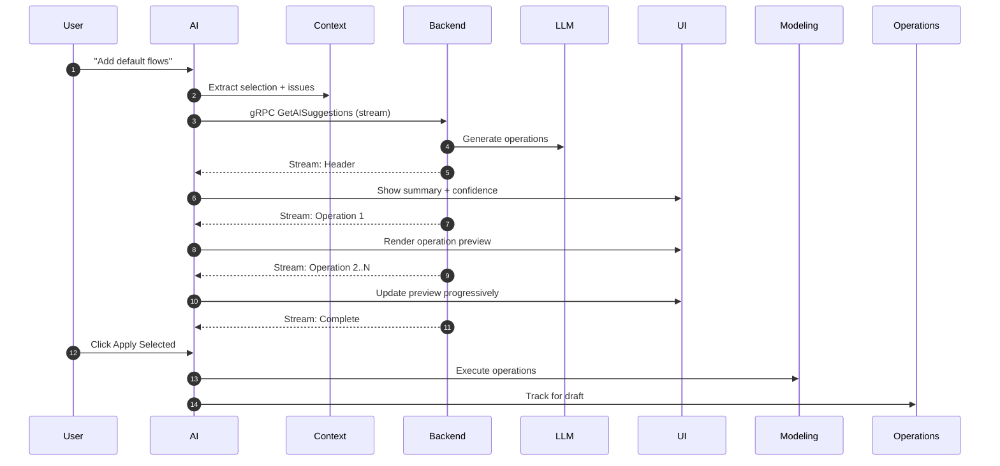

# Client Architecture — Editor, Snapshots, AI

**Status**: Full Integration Complete (2025-08-21)
**Stack**: Connect-ES v2 with Protobuf-generated types  
**Progress**: 
- ✅ SDK exposes raw BPMNEditorService (no wrappers)
- ✅ Full Connect v2 alignment (gRPC codes, modern APIs, ESM-only)
- ✅ Comprehensive tests for streaming, chunking, conflicts
- ✅ README updated with correct transport patterns and bpmn-js notes
- ✅ BpmnJSAdapter translation layer complete (operations ↔ bpmn-js commands)
- ✅ Platform integration with proper TransportProvider setup
- ✅ Dynamic imports for SSR compatibility

## Modules

### Core Editor
- **Modeler**: bpmn-js + modeling API (existing)
- **Lint Overlay**: bpmnlint active; non-blocking visual feedback
- **Command Capture (local)**: semantic/layout typed events for telemetry, AI context, undo-friendly

### AutoSnapshot System (Updated for gRPC)
```typescript
import { createClient } from '@connectrpc/connect';
import { BPMNEditorService } from '@ameideio/ameide-sdk-ts';

class AutoSnapshot {
  private intervalTimer: Timer;  // Every 30s default
  private idleTimer: Timer;      // After 5s idle
  private operations: Operation[] = [];
  private client = createClient(BPMNEditorService, transport);
  
  async snapshot() {
    if (operations.length === 0) return; // Skip if no changes
    
    // Always save locally
    await indexedDB.put('drafts', { 
      diagramId,
      operations: [...operations],
      timestamp: Date.now(),
      version: currentVersion,
      isDraft: true 
    });
    
    // Sync to server with operations (not full XML)
    if (config.remoteDrafts) {
      const response = await client.saveDraft({
        artifactId: diagramId,
        operations,
        expectedVersion: currentVersion,
        etag
      });
      
      if (response.conflict) {
        // Handle conflict with operation rebase
        await this.rebaseOperations(response.conflict);
      }
      
      etag = response.etag;
      operations = []; // Clear after successful save
    }
  }
}
```

### Explicit Save (Using gRPC Snapshot)
```typescript
import { createClient } from '@connectrpc/connect';
import { BPMNEditorService } from '@ameideio/ameide-sdk-ts';

const client = createClient(BPMNEditorService, transport);

async function save() {
  const { xml } = await modeler.saveXML();
  
  // Optional client-side prelint
  if (config.prelintOnSave) {
    const response = await client.validateDiagram({
      xmlContent: xml,
      profile: ValidationProfile.MODELING
    });
    
    if (!response.isValid && !confirm('Save with errors?')) {
      return;
    }
  }
  
  // Create snapshot (immutable version)
  try {
    const response = await client.createSnapshot({
      artifactId: diagramId,
      description: 'User save',
      draftVersion: currentVersion,
      markAsRelease: false
    });
    
    currentVersion = response.version;
    markClean();
    showToast(`Saved as version ${response.version}`);
    
    // Clear local operations after snapshot
    operations = [];
  } catch (error) {
    if (error.code === 'FAILED_PRECONDITION') {
      // Version conflict
      const conflict = error.details;
      if (confirm(`Conflict: server at v${conflict.serverVersion}. Resolve?`)) {
        await resolveConflict(conflict.conflictingOperations);
      }
    }
  }
}
```

### AI Plugin Architecture (Streaming)
```typescript
import { createClient } from '@connectrpc/connect';
import { BPMNEditorService } from '@ameideio/ameide-sdk-ts';

class AIPlugin {
  private client = createClient(BPMNEditorService, transport);
  private controller?: AbortController;
  
  // Context extraction
  getContext(): AIContext {
    return {
      selectedElementIds: getSelectedElements().map(e => e.id),
      lintIssues: getCurrentLintIssues(),
      cursorPosition: getCursorPosition(),
      baseVersion: currentVersion
    };
  }
  
  // Stream AI suggestions with progressive rendering
  async *streamSuggestions(prompt: string) {
    this.controller = new AbortController();
    
    const stream = this.client.getAISuggestions({
      artifactId: diagramId,
      prompt,
      baseVersion: currentVersion,
      selectedElementIds: this.getContext().selectedElementIds,
      lintIssues: this.getContext().lintIssues,
      options: {
        temperature: 0.7,
        maxOperations: 50,
        explainReasoning: true
      }
    }, { signal: this.controller.signal });
    
    for await (const event of stream) {
      switch (event.event.case) {
        case 'header':
          yield { type: 'start', summary: event.event.value.summary };
          break;
        case 'operation':
          yield { type: 'operation', op: event.event.value.operation };
          break;
        case 'complete':
          yield { type: 'done', stats: event.event.value.metrics };
          break;
      }
    }
  }
  
  // Apply operations to canvas
  async applyOperations(operations: Operation[]) {
    modeling.startBatch(); // Group for single undo
    
    for (const op of operations) {
      switch (op.op.case) {
        case 'createElement':
          modeling.createShape(op.op.value);
          break;
        case 'updateElement':
          modeling.updateProperties(op.op.value);
          break;
        case 'createConnection':
          modeling.connect(op.op.value);
          break;
        // ... other operations
      }
    }
    
    modeling.endBatch();
    
    // Track operations for next draft save
    this.operations.push(...operations);
  }
}
```

## Sequences

### A) Edit + Autosnapshot (Operations)


### B) Explicit Save (Snapshot)


### C) AI Suggest & Apply (Streaming)


## Configuration

```typescript
interface EditorConfig {
  autosave: {
    intervalMs: number;      // Default: 30000
    idleMs: number;          // Default: 5000
    remoteDrafts: boolean;   // Default: false (MVP)
    maxDraftSize: number;    // Default: 5MB
  };
  
  ai: {
    enabled: boolean;        // Default: true
    mode: 'HITL' | 'AUTO';  // Default: HITL
    maxCommands: number;     // Default: 50
    contextLimit: number;    // Default: 75KB
    allowlist: string[];     // Auto-apply whitelist
  };
  
  lint: {
    active: boolean;         // Default: true
    profile: string;         // Default: 'recommended'
    showOverlay: boolean;    // Default: true
  };
  
  save: {
    prelintOnSave: boolean;  // Default: false
    confirmOverwrite: boolean; // Default: true
  };
}
```

## MVP Implementation (4 weeks)

### Week 1: Core Editor
```typescript
// Existing bpmn-js works as-is
// Add:
- [ ] bpmnlint integration (2 days)
- [ ] IndexedDB draft storage (1 day)
- [ ] Autosnapshot timer (1 day)
- [ ] Save button + local export (1 day)
```

### Week 2: Backend Integration
```typescript
- [ ] Save endpoint client (1 day)
- [ ] Version tracking (1 day)
- [ ] Conflict handling UI (1 day)
- [ ] Draft recovery modal (2 days)
```

### Week 3: Polish
```typescript
- [ ] Loading states (1 day)
- [ ] Error handling (1 day)
- [ ] Toast notifications (1 day)
- [ ] Keyboard shortcuts (1 day)
- [ ] Performance optimization (1 day)
```

### Week 4: AI Integration
```typescript
- [ ] Context extraction (1 day)
- [ ] Backend proxy client (1 day)
- [ ] Command validation (1 day)
- [ ] Apply UI + animations (1 day)
- [ ] Testing + refinement (1 day)
```

## UX Guarantees

1. **No blocking**: All edits apply instantly
2. **No data loss**: Autosnapshots every 30s to IndexedDB
3. **Clear saves**: Explicit user action creates versions
4. **AI transparency**: All AI edits are badged and undoable
5. **Conflict resolution**: Clear messaging on version conflicts
6. **Draft recovery**: Modal on reload if draft newer than saved

## Performance Targets

- Local edit latency: <16ms (one frame)
- Autosnapshot: <100ms (async, non-blocking)
- Save operation: <500ms for diagrams <500KB
- AI suggestion: <2s end-to-end
- Draft recovery: <200ms to detect and prompt