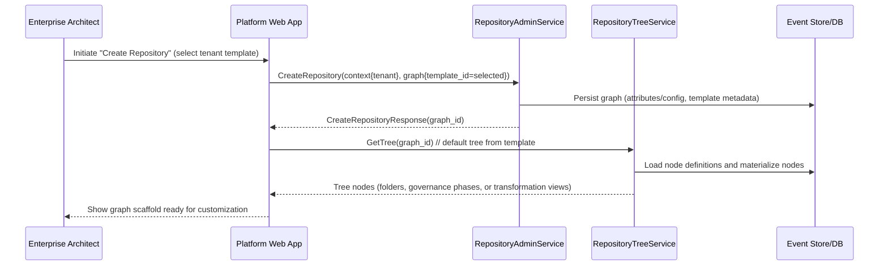
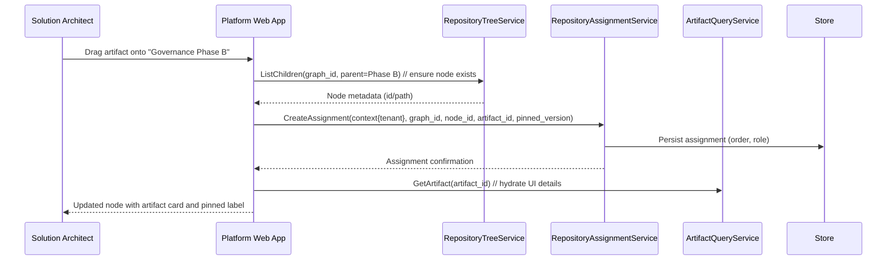
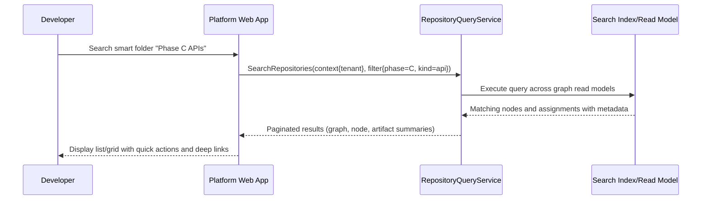

# Executive Summary
Enterprise graph management in Ameide enables each tenant to curate a structured knowledge base of architecture assets—standards, reference architectures, and authoritative current-state baselines following TOGAF 9.2 structure. Each graph now bundles governance policies, access roles, and telemetry sinks so transformations inherit consistent rules, routing, and KPIs. The system operates in three distinct contexts:

1. **Enterprise Repository** (`/org/{orgId}/graph`) - TOGAF-structured organization-level view containing approved, governed architecture assets organized into Architecture Capability, Metamodel, Landscape (Baseline/Target/Transition), Standards Information Base (SIB), Reference Library, Requirements Repository, and Governance Log.

2. **Initiative Workspace** (`/org/{orgId}/transformations/{id}/workspace`) - ADM phase structure (Preliminary, Phases A-H, Requirements Management) for work-in-progress deliverables where teams collaborate on architecture development following the TOGAF ADM cycle.

3. **Initiative Repository View** (`/org/{orgId}/transformations/{id}/graph`) - Filtered, read-only view showing which approved enterprise graph assets a specific transformation references and consumes.

Repositories are tenant resources that anchor the state of the enterprise architecture. Initiatives layer planning views over graph assignments, but governance remains defined once at graph/tenant scope and distributed through `RepositoryAccessRole`, `GovernanceOwnerGroup`, and `RepositorySyncJob` orchestration. This specification focuses on graph capabilities: multi-tenant provisioning, hierarchical navigation, artifact assignment, governance-aware discovery, access control, telemetry, and artifact-centric collaboration. Initiative-specific flows are defined in `backlog/161-transformation-transformations-functional.md`.

# What Problem Does This Solve?
- Fragmented architecture assets dispersed across diagrams, documents, and spreadsheets slow down architectural governance and transformation execution.
- Tenants lack a consistent taxonomy that maps artifacts to TOGAF phases, ArchiMate layers, and governance checkpoints.
- Architects and developers cannot easily discover vetted artifacts or understand their lineage, causing duplication and compliance gaps.
- Governance leads lack transparency into graph usage, preventing KPI tracking and compliance auditing.

# Key Capabilities
- Multi-tenant graph provisioning with `tenant_id` isolation and `(tenant_id, key)` uniqueness guarantees.
- Hierarchical navigation backed by materialized paths for tenant taxonomies, including folders, governance phases, and smart folders (virtual nodes with filter expressions).
- Artifact curation: repositories own the canonical catalog of tenant artifacts (BPMN processes, ArchiMate models, UML diagrams, DMN tables, strategies, documents, code assets). Each artifact carries metadata about kind, lifecycle, owners, and referenced transformations.
- Artifact assignment with version pinning and semantic roles to support governance and reuse.
- gRPC-based CRUD, tree manipulation, search, and stats services consumable via `@ameideio/ameide-sdk-ts`.
- Template-driven graph creation (e.g., Standards Catalog, Reference Architecture, Transformation Initiative collateral) with configurable node types and policies.
- Cross-graph search and smart folder surfacing for knowledge discovery.
- Governance access fabric via `RepositoryAccessRole` and `RepositoryMembership` with automatic governance owner enrollment and SLA targets.
- Sync and telemetry services (`RepositorySyncJob`, `RepositoryIntegrationEndpoint`, `RepositoryStatisticSnapshot`) pushing deltas to knowledge graph, search, and analytics pipelines.
- Retention and data-quality workflows (`AssetRetentionEvent`, survey orchestration) to uphold compliance.
- Audit-ready telemetry: assignment history, queue latency, SLA breaches, graph stats, and governance checkpoints.

# User Personas & Scenarios
- **Enterprise Architect (EA)**: Seeds and curates tenant repositories (standards catalog, reference architecture, transformation collateral), tailors taxonomies, and monitors progress across transformation transformations.
- **Solution Architect (SA)**: Browses graph trees to clone reusable architecture building blocks, verifies dependencies, and aligns new designs with standards.
- **Governance Lead (GL)**: Audits compliance by reviewing phase-specific assignments, checks pinned versions, and exports graph stats for steering committees.
- **Developer (DEV)**: Quickly searches smart folders (e.g., “Phase C approved APIs”) to access implementation-ready artifacts and confirm ownership.

# Functional Requirements
- **FR-1 Repository Lifecycle**: Support create, read, update, delete, and list operations per tenant via `RepositoryAdminService` (proto `graph_service.proto`). Accept template IDs, enforce optimistic locking, and emit audit events.
- **FR-2 Template Application**: Allow EA to initialize repositories from predefined templates (standards catalog, reference architecture, transformation transformation collateral) with default node definitions and config JSON (see `graph.proto` `RepositoryConfig.default_tree`).
- **FR-3 Tenant Isolation**: Every operation must supply `tenant_id` in the request context; backend repositories (`TenantRepository`) must refuse cross-tenant data access except for explicitly authorized admin flows.
- **FR-4 Tree Navigation**: Provide create, update, move, delete, list-children, and get-tree operations via `RepositoryTreeService`, preserving adjacency (`parent_id`) and recomputing materialized `path` (`NodeRepo.compute_path`).
- **FR-5 Smart Folder Support**: Enable virtual nodes with `is_virtual=true` and evaluable `filter_expression` so that governance filters can project artifacts dynamically without duplication.
- **FR-6 Artifact Assignment**: Allow assigning/unassigning artifacts to nodes through `RepositoryAssignmentService` with optional `pinned_version` and `role`, enforcing uniqueness of `(artifact_id, node_id)` per graph and honoring optimistic locking.
- **FR-7 Version Pinning & Audit**: Persist and surface pinned versions; if absent, services must resolve latest artifact state at read time while recording assignment updates for audit logs.
- **FR-8 Cross-Repository Search**: Expose `RepositoryQueryService` endpoints for keyword, attribute, and filter-based queries across repositories, including smart-folder semantics and pagination.
- **FR-9 UI Integration**: The Next.js `RepositoryBrowser` must switch between tree/list/grid views, fetch data via `@ameideio/ameide-sdk-ts`, support drag-and-drop moves, and load artifact details using `artifactQueries` SDK calls. Transformation transformation workspaces layer As-is / To-be perspectives on top of graph assignments.
- **FR-10 Governance Reporting**: Provide stats endpoints (`GetRepositoryStats`) returning node/assignment counts and template-specific aggregations (e.g., by governance phase or catalog family) so Governance Leads can assess adoption and compliance.
- **FR-11 Artifact Lifecycle**: Expose lifecycle state management for artifacts (`draft → in_review → approved → deprecated → archived`). Implement state transitions via the shared artifact command bus described in `backlog/120-artifacts-north-star.md`, so humans and agents issue the same typed commands, optional CRDT collab can feed state changes, and GitHub-style interactions (labels, assignees, subscribers, comments) trigger workflows/webhook automation and governance checks before promotion.
- **FR-12 Node Owners & Approval Rules**: Allow repositories to declare ownership and approval policies (NodeOWNERS) at node and graph scope. Transitions to `approved` must honor rule settings (minimum approvals, owner-required, segregation-of-duties) with audit trails. Governance policies apply tenant-wide across repositories.
- **FR-13 Required Checks & Check Runs**: Register named required checks per graph/node against a canonical check registry and block lifecycle transitions until all check runs succeed. Expose APIs/UI to view, re-run, and diagnose check results akin to GitHub status checks.
- **FR-14 Transition Queue**: Serialize conflicting lifecycle transitions through a priority-aware queue that revalidates approvals and required checks before finalizing state changes; enforce idempotency keys/duplicate guards and surface queue status + SLA metrics in the UI.
- **FR-15 Artifact Releases & Protected Tags**: Support publishing immutable releases with notes and downloadable assets when artifacts reach `approved`. Auto-generate protected semantic tags and enforce retention policies through rulesets.
- **FR-16 Rulesets & Policy Bundles**: Provide reusable rulesets that bundle approval rules, required checks, label policies, and tag protections at tenant, template, or graph scope. Version rulesets and record which version approved each transition.
- **FR-17 Discussions & Decision Records**: Offer threaded discussions, ADR templates, and decision timelines that are anchored to individual artifacts (with links back to nodes/transformations as context), mirroring GitHub Discussions patterns.
- **FR-18 Time-Scoped Assignments & Impact Views**: Capture `effective_from`/`effective_to` windows and scenario tags on assignments to enable as-is/to-be comparisons, roadmap overlays, and impact analysis.
- **FR-19 Initiative Planning Boards**: Deliver table/board/roadmap views for transformation transformations that pull graph assignments, lifecycle state, risk scores, and linked checks into LeanIX-style planning surfaces.
- **FR-20 Surveys & Data Quality**: Provide survey workflows to collect missing metadata from owners, compute data quality scores, and flag overdue updates within governance dashboards.

# Key Workflows
## Create Repository from Tenant Template


## Assign Artifact to Taxonomy Node


## Cross-Repository Search


# Artifact Lifecycle & Governance Triggers
- **State model**: Each artifact carries a lifecycle state (`draft`, `in_review`, `approved`, `deprecated`, `archived`). Transitions require explicit actions (e.g., “Request Review”, “Approve”, “Archive”) and may be conditioned on workflows checks (tests, architectural guardrails).
- **Command bus alignment**: State transitions originate from a unified command bus (human UI, automation, or agents). Each transition packages base version, origin, and validation status to keep graph assignments consistent.
- **GitHub-like interactions**: Artifacts support assignees, reviewers, labels, watchers, and threaded comments. Label updates (e.g., `needs-compliance`, `blocked`) and reviewer requests fire domain events similar to GitHub issue/pull request timelines.
- **Automation hooks**: State changes publish events (`artifact.lifecycle.transitioned`) consumed by workflows engines. Required checks (policy evaluators, CI results) must report status before `approved` transitions succeed; failure reverts to `in_review` with blocking metadata.
- **Governance actions**: Approved artifacts auto-pin their version in critical graph nodes, notify Governance Leads, and schedule periodic recertification tasks. Deprecated artifacts trigger notifications to dependent repositories and flag transformation transformations linked through bidirectional labels.
- **Audit trail**: Maintain chronological activity feeds per artifact (comments, assignments, state transitions, workflows results) to support compliance audits and rollbacks.

# Artifact Taxonomy & Ownership
- **Repository ownership**: A graph is the authoritative home for a tenant’s artifact catalog. Each artifact belongs to exactly one primary graph (e.g., `reference-architecture`), yet can appear in multiple repositories as linked references via assignments and smart folders. Occupancy is tracked via `graph_id` + `artifact_id` pairs, ensuring lineage back to the owning graph.
- **Artifact kinds**: Supported kinds include (non-exhaustive):
  - `bpmn::process`, `bpmn::collaboration`, `bpmn::decision`
  - `archimate::capability`, `archimate::application_component`, `archimate::value_stream`
  - `uml::class_diagram`, `uml::sequence_diagram`
  - `dmn::decision_table`
  - `doc::policy`, `doc::standard`, `doc::playbook`
  - `code::api_contract`, `code::infrastructure_module`
  - `strategy::transformation_brief`, `strategy::roadmap`
- **Metadata envelopes**: Each artifact kind carries standardized metadata: identity (`artifact_id`, `graph_id`, `kind`), lifecycle state, owners, tags (e.g., architectural layer, governance phase), linked transformation transformations (for proposed/WIP context), and cross-references to other artifacts. The metadata schema follows the `ArtifactView` contract in `packages/ameide_core_proto/src/ameide_core_proto/artifacts/v1`.
- **Behavioral contracts**: Artifact kind determines command validation (e.g., BPMN schema validation vs. Markdown lint), preview rendering, and automation hooks. Repositories must store allowed kinds per node (`NodeType.allowed_artifact_kinds`) to enforce taxonomy rules.
- **Initiative links**: Transformation transformations (see `backlog/161-transformation-transformations-functional.md`) maintain bidirectional labels to artifacts. Repositories expose APIs to fetch artifacts by transformation tag and to update transformation status when related artifacts change lifecycle state.

# Governance & Collaboration Enhancements
- **NodeOWNERS & approval flows**: Node-level owner declarations automatically assign reviewers when artifacts move to `in_review`. The UI surfaces owner chips, outstanding approvals, and segregation-of-duties exceptions.
- **Required checks dashboard**: Artifacts show a status banner summarizing required checks (policy evaluations, architecture linters, SAST scans). Users can re-run failed checks or drill into details before approvals.
- **Transition queue visibility**: Lifecycle actions enqueue transitions, and stakeholders see queue position, pending checks, and auto-promotion ETA. Queues also power batch promotions during release windows.
- **Releases tab**: Each artifact exposes a releases tab with immutable notes, downloadable assets (documents, exports, SBOMs), and protected semantic tags.
- **Discussions & ADRs**: Discussions support Q&A, decision threads, and ADR templates. Accepted ADRs link to specific graph nodes and surface in transformation dashboards.
- **Time travel & scenarios**: Repository surfaces effective windows on assignments; transformation workspaces provide the “As-is / To-be / Scenario” toggles and roadmap visualizations (see `backlog/161-transformation-transformations-functional.md`).
- **Initiative integrations**: Repository exposes smart folders, APIs, and governance events that transformation boards/roadmaps consume for lifecycle status, risks, and dependencies.
- **Survey prompts & data quality**: Owners receive survey prompts when required metadata is stale; data quality scores contribute to governance KPIs and can block promotions if thresholds drop.
- **Tenant governance policies**: Governance rules (approval thresholds, required checks, tag protections) are defined at graph/tenant scope. Transformation transformations inherit these policies; transformations may add context-specific visibility but cannot weaken graph-level guardrails.
- **Governance explainability**: Ruleset Inspector panels surface matched policies, required checks, and ruleset version/hash; “Request missing owners” shortcuts auto-assign outstanding reviewers; saved governance views (“Failing checks”, “Needs owners”, “Queued for approval”) behave like smart folders. Governance policies are managed once at graph/tenant layer and transformations consume the outcomes.

# UI Architecture
## Overview
The enterprise graph experience is delivered as a multi-tenant Next.js 15 SPA (React 19, shadcn/ui) consuming gRPC/ConnectRPC services through the `@ameideio/ameide-sdk-ts` client. Repository and transformation modules share the platform shell, design system, and provider stack described earlier. This section captures how the UI implements the functional behaviors above.

## Existing Platform Context
- **App shell**: `app/(app)/layout.tsx` wires `Header`, `AppSidebar`, `SearchProvider`, `TooltipProvider`, `DataStreamProvider`, `UrlSyncGate`, and `DebugProvider`. Repository/transformation routes integrate with this shell instead of redefining providers.
- **Header**: `features/navigation/components/Header.tsx` renders breadcrumbs, scope tabs, notifications, and search. Routes register descriptors via `resolveHeaderDescriptor` to expose relevant tabs/actions.
- **Sidebar**: `features/navigation/components/AppSidebar.tsx` supplies navigation, history, and quick-create modals (e.g., `ArtifactRepositoryBrowser`). Repository and transformation views extend these menus rather than creating parallel sidebars.
- **Providers & telemetry**: Hooks like `useDebug`, `useSearch`, `useSidebar` plus observability utilities are reused. Additional context (Realtime, Scenario state) is composed under `DataStreamProvider` for consistent lifecycle handling.
- **Design system**: shadcn/ui primitives, Lucide icons, and Tailwind tokens remain the styling baseline. Repository-specific components (timeline, governance banners, releases) live in the shared component library for reuse across modules.
- **Routing**: Repository paths `/graph/:graphId` and transformation paths `/transformations/:transformationId` align with `UrlSyncGate` and analytics expectations.

## Component Topology (Repository-Focused)
```
====================================================================================================================
| AppShell (app/(app)/layout.tsx)                                                                                  |
| ---------------------------------------------------------------------------------------------------------------- |
|  Providers: DebugProvider → TooltipProvider → SearchProvider → DataStreamProvider → UrlSyncGate → SDKClient      |
|  Shared UI: Header (breadcrumbs, scope tabs, actions) • AppSidebar (nav, history, quick-create modals)           |
|  Main Content: Routed area for Repository Browser, Governance Dashboards, Artifact Editor Host                   |
====================================================================================================================
          │
          │ layout.tsx renders children here (with --app-header-h spacing)
          ▼
+------------------------------------------------------------------------------------------------------------------+
| Repository Browser ( /graph/:graphId )                                                                 |
|------------------------------------------------------------------------------------------------------------------|
|  ┌────────── Tree Pane ──────────┐  ┌────────────── Main Pane ──────────────┐  ┌───── Governance Sidebar ─────┐ |
|  │ • Virtualized tree            │  │ ┌────────── Assignment List ───────┐ │  │ • NodeOWNERS card             │ |
|  │ • Breadcrumb trail            │  │ │ • Filters: state/tags/init       │ │  │ • Approvals progress          │ |
|  │ • NodeOWNERS badges           │  │ │ • Inline pills (lifecycle/check) │ │  │ • Required checks banner       │ |
|  │ • Drag/drop reorder           │  │ │ • Bulk actions (move/review)     │ │  │ • Queue status + ETA          │ |
|  │ • Filters (type/state)        │  │ │ • Saved views (Failing/Needs/Queued) ││  │ • Data quality score           │ |
|  │ • Effective window indicators │  │ └──────────────────────────────────┘ │  │ • Ruleset inspector link       │ |
|  └───────────────────────────────┘  │ ┌──────────── Artifact Drawer ─────────────┐│                             │ |
                                       │ │ Tabs: Details | Releases | Discussions | ││                             │ |
                                       │ │       Timeline                            ││                             │ |
                                       │ │ • Details → metadata, lifecycle, tags     ││                             │ |
                                       │ │ • Releases → versions, assets, tags       ││                             │ |
                                       │ │ • Discussions → ADR threads, comments     ││                             │ |
                                       │ │ • Timeline → events (assign/check/approve ││                             │ |
                                       │ │ • Actions → request review, approve, etc. ││                             │ |
                                       │ │ • Effective window summary (read-only)    ││                             │ |
                                       │ └───────────────────────────────────────────┘│                             │ |
+------------------------------------------------------------------------------------------------------------------+
          │ React Query cache keys: repositories, nodes, assignments, artifactView, owners, checks, queue, releases |
          │ Invalidation via SDK mutations + SSE events + Temporal callbacks                                      |
          ▼
+------------------------------------------------------------------------------------------------------------------+
| Governance Dashboards ( /dashboard → Governance tab )                                                            |
|------------------------------------------------------------------------------------------------------------------|
|  • KPI tiles for adoption, coverage, check success, queue latency, ruleset compliance, survey completion         |
|  • Charts and drilldowns for overdue approvals, failing checks, low data quality nodes                           |
|  • Reuses existing dashboard card/grid patterns                                                                  |
+------------------------------------------------------------------------------------------------------------------+
          │
          ▼
+------------------------------------------------------------------------------------------------------------------+
| Artifact Editor Host ( /artifact/:artifactId )                                                                   |
|------------------------------------------------------------------------------------------------------------------|
|  • Embeds domain editors (BPMN, ArchiMate, Markdown) with shared command bus                                     |
|  • Lifecycle toolbar (state, request review, approve, queue indicator)                                           |
|  • Required checks panel, NodeOWNER info, links back to graph nodes                                         |
|  • Yjs presence for collaborative editing; timeline of edits aligned with graph events                      |
+------------------------------------------------------------------------------------------------------------------+

Legend:
- Outer shell uses existing platform Header/Sidebar providers.
- Repository view includes tree, main pane, and governance sidebar with rich interaction.
- Governance dashboards and artifact editor reuse the same shell; transformation workspace topology lives in the transformation transformation UI spec.
```

## Data Flow & State Management
- **Server interactions**: `RepositoryTreeService.GetTree`, `RepositoryAssignmentService.ListNodeAssignments`, lifecycle command helpers, `GovernanceService` (owners/rulesets), `CheckRunService`, releases/discussions services.
- **React Query caches**: repositories, nodes, assignments, artifactView, governance owners/checks, queue status, releases, discussions; keys scoped by tenant+graph; invalidate via mutations and SSE/WebSocket events.
- **Local state**: view mode (`tree|list|grid`), artifact selection, filters, timeline filters, scenario badges stored in component state or lightweight stores for cross-pane updates.
- **Realtime updates**: SSE/WebSockets push `graph.assignment.*`, `governance.check_run.*`, `graph.transition.*`; optimistic cache updates follow. Yjs manages presence inside collaborative editors.

## Module Responsibilities
- **Repository Browser**: Tree pane (hierarchy, owners, drag/drop); assignment list/grid (filters, saved views, lifecycle chips); artifact drawer (details, releases, discussions, timeline, actions, effective window summary); governance sidebar (approvals, required checks, queue status, data quality); transformation cross-links.
- **Initiative Workspace**: Kanban/table/roadmap views driven by graph assignments; cards surface role assignments, governance status (checks, approvals, queue position), risks, upcoming releases; scenario overlays and As-is/To-be toggles leverage assignment effective windows.
- **Governance Dashboards**: KPIs (adoption, coverage, check success, queue latency, ruleset compliance) and drilldowns (overdue approvals, failing checks, low data quality) reuse platform dashboard components.
- **Artifact Editor Host**: Embeds domain editors with lifecycle toolbar, governance panels, and navigation back to graph nodes via the shared command bus (see backlog/120).

## UI Patterns & Components
- Tree & drag-and-drop (React Virtuoso), tabs/drawers (shadcn/ui), timeline (events with filters), discussions/ADR editors (Lexical/Tiptap), releases list, required-check banners, queue indicator, sidebar integration, Ruleset Inspector slide-over, saved governance views as smart folders.

## Governance UX Considerations
- Automatic reviewer assignment from NodeOWNERS; approval dialogs highlight required roles and segregation warnings.
- Ruleset Inspector communicates blocking policies (version/hash, matched rules, required checks) and remediation guidance.
- Data-quality prompts trigger surveys; completion updates scores. Accessibility (keyboard navigation, ARIA labels, color-safe palettes) remains mandatory.

## Performance & Offline Strategy
- Virtualized lists, cached queries, incremental pagination (`infiniteQuery`); prefetch sibling nodes when expanding tree items to keep perceived latency <100 ms.
- Use Web Workers for graph impact analysis; gracefully fall back to polling when SSE/WebSockets unavailable; coordinate skeleton states with `--app-header-h` to avoid layout shift.

## Telemetry & Instrumentation
- Track node navigation, assignment search, lifecycle transition attempts, check reruns, release downloads, discussion posts.
- Monitor TTFB, TTI, tree render time, assignment grid render, timeline update latency, approval cycle time, check resolution, queue wait time.

## Feature Flagging & Rollout
- Feature flags by stage (`repo_lifecycle`, `repo_governance`, `repo_releases`, `repo_time_travel`) gate features per tenant. Roll out gradually (internal → pilot → GA) while collecting adoption metrics.
- Components honor flags to hide/show panels without redeployments.

## Cross-Cutting Concerns
- Localization readiness, tenant theming via design tokens, RBAC-aware rendering, sanitization for user inputs, component/integration testing (Playwright, Vitest, Chromatic).

## Roadmap Alignment
- Stage mapping:
  1. Repository browser core (tree/assignment UI)
  2. Lifecycle controls, timeline basics, watchers
  3. Governance sidebar, required-check banners, queue indicators
  4. Releases tab, discussions, survey prompts
  5. Initiative time-travel controls, scenario overlays, role-aware boards/roadmaps
  6+. Notifications, external webhooks visualization, AI-assisted suggestions

## Next Steps
- Register graph and transformation routes with contextual navigation descriptors so the header renders correct breadcrumbs/tabs.
- Update sidebar navigation to include graph entry points alongside modal behaviors (e.g., `ArtifactRepositoryBrowser`).
- Catalogue shared components (timeline, releases list, governance banners) and add UI kit stories/tests.

# Success Metrics
| Metric | Target | Persona | Notes |
| --- | --- | --- | --- |
| Repository adoption | ≥ 75% of active tenants create ≥1 graph within 90 days | EA | Track via `repositories` table by tenant. |
| Assignment coverage | ≥ 60% of governance-critical nodes contain ≥1 approved artifact | SA/GL | Use `graph_assignments` counts filtered by `role='primary'` and status. |
| Search efficiency | < 2.5 s P95 for cross-graph searches | DEV | Measure `RepositoryQueryService` latency with telemetry; ensure indexed queries. |
| Governance compliance | 100% of pinned artifacts have explicit version metadata | GL | Validate via nightly audit job scanning `pinned_version` columns. |
| User satisfaction | ≥ 4.2/5 CSAT for graph UI interactions | All | Collect from in-app surveys post key workflows. |

# Decisions & Proposed Approaches
- **Template source & customization**: Manage baseline templates in configuration (`graph.config` JSON) stored alongside code, versioned via migrations. Allow tenants to clone templates into tenant-specific configs persisted in `repositories.config`, and track divergence via template version metadata. Migration tooling should provide diff-and-merge when baseline templates evolve.
- **Smart-folder expression language**: Launch with a constrained JSON filter schema (field + operator + value) validated server-side to avoid arbitrary CEL risks. Roadmap CEL support behind a feature flag once governance validation and sandboxing are in place.
- **Soft delete exposure**: Extend `BaseEntity` with `deleted_at`/`deleted_by` fields and add `List...` filters to include/exclude soft-deleted rows; surface delete endpoints as soft delete by default, with hard delete restricted to admin tooling and captured via audit events.
- **RBAC model**: Integrate with tenant IAM where graph permissions are granted through roles (`graph.admin`, `graph.editor`, `graph.viewer`). Editors manage nodes and assignments; admins manage templates and lifecycle; viewers have read access. Enforce via request context before invoking storage operations.
- **Change notifications & workflows**: Emit domain events (e.g., `graph.assignment.created`) to the platform event bus so downstream services (notifications, workflows automation) can subscribe. In the short term, integrate with existing notification service to alert stakeholders when governance KPIs breach thresholds.
