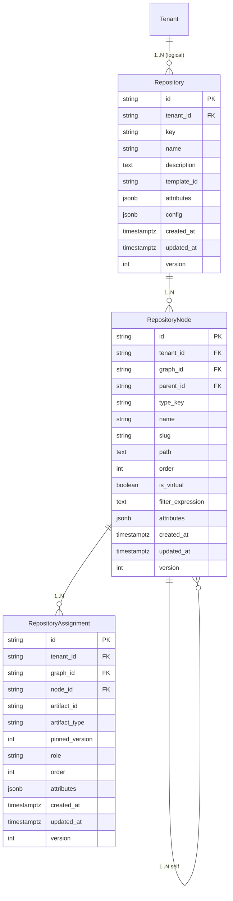

# ER Diagram


# Schema DDL
The Alembic migration `migrations/versions/platform/010_graph.py` provisions the graph schema. Field sizes align with SQLAlchemy model metadata in `packages/ameide_core_storage/src/ameide_core_storage/sql/models/graph.py`.

## repositories
```sql
CREATE TABLE repositories (
    id           VARCHAR(255) PRIMARY KEY,
    tenant_id    VARCHAR(255) NOT NULL,
    deleted_at   TIMESTAMPTZ,
    deleted_by   VARCHAR(255),
    legal_hold   BOOLEAN      NOT NULL DEFAULT FALSE,
    created_at   TIMESTAMPTZ  NOT NULL DEFAULT NOW(),
    updated_at   TIMESTAMPTZ,
    version      INTEGER      NOT NULL DEFAULT 0,
    key          VARCHAR(128) NOT NULL,
    name         VARCHAR(255) NOT NULL,
    description  TEXT,
    template_id  VARCHAR(255),
    attributes   JSONB,
    config       JSONB
);
```

## graph_nodes
```sql
CREATE TABLE graph_nodes (
    id                VARCHAR(255) PRIMARY KEY,
    tenant_id         VARCHAR(255) NOT NULL,
    deleted_at        TIMESTAMPTZ,
    deleted_by        VARCHAR(255),
    legal_hold        BOOLEAN      NOT NULL DEFAULT FALSE,
    created_at        TIMESTAMPTZ  NOT NULL DEFAULT NOW(),
    updated_at        TIMESTAMPTZ,
    version           INTEGER      NOT NULL DEFAULT 0,
    graph_id     VARCHAR(255) NOT NULL REFERENCES repositories(id) ON DELETE CASCADE,
    parent_id         VARCHAR(255) REFERENCES graph_nodes(id) ON DELETE CASCADE,
    type_key          VARCHAR(128) NOT NULL,
    name              VARCHAR(255) NOT NULL,
    slug              VARCHAR(128),
    path              VARCHAR(2048),
    path_ltree        LTREE,
    "order"           INTEGER      NOT NULL DEFAULT 0,
    is_virtual        BOOLEAN      NOT NULL DEFAULT FALSE,
    filter_expression TEXT,
    attributes        JSONB
);
-- Requires `CREATE EXTENSION IF NOT EXISTS ltree;` in the migration.
```

## graph_assignments
```sql
CREATE TABLE graph_assignments (
    id             VARCHAR(255) PRIMARY KEY,
    tenant_id      VARCHAR(255) NOT NULL,
    deleted_at     TIMESTAMPTZ,
    deleted_by     VARCHAR(255),
    legal_hold     BOOLEAN      NOT NULL DEFAULT FALSE,
    created_at     TIMESTAMPTZ  NOT NULL DEFAULT NOW(),
    updated_at     TIMESTAMPTZ,
    version        INTEGER      NOT NULL DEFAULT 0,
    graph_id  VARCHAR(255) NOT NULL REFERENCES repositories(id) ON DELETE CASCADE,
    node_id        VARCHAR(255) NOT NULL REFERENCES graph_nodes(id) ON DELETE CASCADE,
    artifact_id    VARCHAR(255) NOT NULL,
    artifact_type  VARCHAR(255) NOT NULL,
    pinned_version INTEGER,
    effective_from TIMESTAMPTZ,
    effective_to   TIMESTAMPTZ,
    scenario_tag   VARCHAR(64),
    role           VARCHAR(64),
    "order"        INTEGER      NOT NULL DEFAULT 0,
    attributes     JSONB
);
ALTER TABLE graph_assignments
  ADD CONSTRAINT uq_assign_per_node UNIQUE (graph_id, node_id, artifact_id);
ALTER TABLE graph_assignments
  ADD CONSTRAINT chk_pinned_positive CHECK (pinned_version IS NULL OR pinned_version > 0);
ALTER TABLE graph_assignments
  ADD CONSTRAINT chk_artifact_type_not_empty CHECK (length(artifact_type) > 0);
ALTER TABLE graph_assignments
  ADD CONSTRAINT chk_assignment_effective
    CHECK (
      (effective_from IS NULL AND effective_to IS NULL)
      OR (effective_from IS NOT NULL AND (effective_to IS NULL OR effective_from < effective_to))
    );
-- Optional: requires btree_gist extension
-- ALTER TABLE graph_assignments
--   ADD CONSTRAINT ex_assignment_window
--   EXCLUDE USING gist (
--     graph_id WITH =,
--     node_id       WITH =,
--     artifact_id   WITH =,
--     COALESCE(scenario_tag,'') WITH =,
--     tstzrange(effective_from, effective_to) WITH &&
--   ) WHERE (effective_from IS NOT NULL OR effective_to IS NOT NULL);
```

# Governance & Collaboration Tables

## graph_node_owners
```sql
CREATE TABLE graph_node_owners (
    id             VARCHAR(255) PRIMARY KEY,
    tenant_id      VARCHAR(255) NOT NULL,
    graph_id  VARCHAR(255) NOT NULL REFERENCES repositories(id) ON DELETE CASCADE,
    node_id        VARCHAR(255) NOT NULL REFERENCES graph_nodes(id) ON DELETE CASCADE,
    principal_id   VARCHAR(255) NOT NULL,
    principal_type VARCHAR(32)  NOT NULL, -- user, group, team, service
    pattern        VARCHAR(255),
    created_at     TIMESTAMPTZ  NOT NULL DEFAULT NOW(),
    attributes     JSONB
);
CREATE INDEX idx_node_owner_node ON graph_node_owners (graph_id, node_id);
```

## approval_rules
```sql
CREATE TABLE approval_rules (
    id                    VARCHAR(255) PRIMARY KEY,
    tenant_id             VARCHAR(255) NOT NULL,
    scope_type            VARCHAR(32)  NOT NULL, -- graph, node, template
    scope_id              VARCHAR(255) NOT NULL,
    min_approvals         INTEGER      NOT NULL DEFAULT 1,
    require_owners        BOOLEAN      NOT NULL DEFAULT TRUE,
    allow_self_approval   BOOLEAN      NOT NULL DEFAULT FALSE,
    segregation_rules     JSONB,
    created_at            TIMESTAMPTZ  NOT NULL DEFAULT NOW(),
    created_by            VARCHAR(255),
    version               INTEGER      NOT NULL DEFAULT 0
);
CREATE INDEX idx_approval_scope ON approval_rules (scope_type, scope_id);
```

## required_checks & check_runs
```sql
CREATE TABLE required_checks (
    id          VARCHAR(255) PRIMARY KEY,
    tenant_id   VARCHAR(255) NOT NULL,
    scope_type  VARCHAR(32)  NOT NULL, -- graph, node, ruleset
    scope_id    VARCHAR(255) NOT NULL,
    name        VARCHAR(255) NOT NULL,
    registry_id VARCHAR(255),
    run_on      VARCHAR(32)  NOT NULL, -- assign, transition, periodic
    attributes  JSONB,
    created_at  TIMESTAMPTZ  NOT NULL DEFAULT NOW()
);
ALTER TABLE required_checks
  ADD CONSTRAINT fk_required_checks_registry
  FOREIGN KEY (registry_id) REFERENCES check_registry(id);

CREATE TABLE check_runs (
    id            VARCHAR(255) PRIMARY KEY,
    tenant_id     VARCHAR(255) NOT NULL,
    subject_type  VARCHAR(32)  NOT NULL, -- artifact, assignment, node
    subject_id    VARCHAR(255) NOT NULL,
    name          VARCHAR(255) NOT NULL,
    status        VARCHAR(32)  NOT NULL, -- queued, in_progress, completed
    conclusion    VARCHAR(32),
    details_url   TEXT,
    payload_json  JSONB,
    started_at    TIMESTAMPTZ,
    completed_at  TIMESTAMPTZ,
    created_at    TIMESTAMPTZ  NOT NULL DEFAULT NOW()
);
CREATE INDEX idx_check_runs_subject ON check_runs (subject_type, subject_id);
```

## check_registry
```sql
CREATE TABLE check_registry (
    id          VARCHAR(255) PRIMARY KEY,
    tenant_id   VARCHAR(255) NOT NULL,
    name        VARCHAR(255) NOT NULL UNIQUE,
    source      VARCHAR(32)  NOT NULL, -- opa | ci | manual | external
    description TEXT,
    metadata    JSONB,
    created_at  TIMESTAMPTZ  NOT NULL DEFAULT NOW(),
    retired_at  TIMESTAMPTZ
);
```

## transition_queue
```sql
CREATE TABLE transition_queue (
    id             VARCHAR(255) PRIMARY KEY,
    tenant_id      VARCHAR(255) NOT NULL,
    graph_id  VARCHAR(255) NOT NULL,
    artifact_id    VARCHAR(255) NOT NULL,
    node_id        VARCHAR(255),
    desired_state  VARCHAR(32)  NOT NULL,
    enqueued_at    TIMESTAMPTZ  NOT NULL DEFAULT NOW(),
    status         VARCHAR(32)  NOT NULL DEFAULT 'queued',
    priority       INTEGER      NOT NULL DEFAULT 0,
    attempts       INTEGER      NOT NULL DEFAULT 0,
    last_attempt_at TIMESTAMPTZ,
    idempotency_key VARCHAR(255) NOT NULL,
    metadata       JSONB
);
CREATE INDEX idx_transition_queue_repo ON transition_queue (graph_id, status);
CREATE UNIQUE INDEX uq_transition_request
  ON transition_queue (graph_id, artifact_id, desired_state)
  WHERE status IN ('queued','in_progress');
CREATE UNIQUE INDEX uq_transition_idempotency ON transition_queue (idempotency_key);
```

## artifact_releases & release_assets
```sql
CREATE TABLE artifact_releases (
    id            VARCHAR(255) PRIMARY KEY,
    tenant_id     VARCHAR(255) NOT NULL,
    artifact_id   VARCHAR(255) NOT NULL,
    version       INTEGER      NOT NULL,
    notes         TEXT,
    is_immutable  BOOLEAN      NOT NULL DEFAULT TRUE,
    created_by    VARCHAR(255),
    created_at    TIMESTAMPTZ  NOT NULL DEFAULT NOW(),
    metadata      JSONB
);
CREATE INDEX idx_releases_artifact ON artifact_releases (artifact_id, version);

CREATE TABLE release_assets (
    id             VARCHAR(255) PRIMARY KEY,
    release_id     VARCHAR(255) NOT NULL REFERENCES artifact_releases(id) ON DELETE CASCADE,
    name           VARCHAR(255) NOT NULL,
    content_type   VARCHAR(255),
    storage_uri    TEXT NOT NULL,
    sha256         VARCHAR(128),
    created_at     TIMESTAMPTZ NOT NULL DEFAULT NOW()
);
```

## graph_rulesets
```sql
CREATE TABLE graph_rulesets (
    id         VARCHAR(255) PRIMARY KEY,
    tenant_id  VARCHAR(255) NOT NULL,
    scope      VARCHAR(32)  NOT NULL, -- tenant, template, graph
    scope_id   VARCHAR(255),
    status     VARCHAR(32)  NOT NULL DEFAULT 'active',
    def_json   JSONB        NOT NULL,
    created_at TIMESTAMPTZ  NOT NULL DEFAULT NOW(),
    version    INTEGER      NOT NULL DEFAULT 1
);
CREATE INDEX idx_ruleset_scope ON graph_rulesets (scope, scope_id, status);
```

## discussions & posts
```sql
CREATE TABLE discussions (
    id            VARCHAR(255) PRIMARY KEY,
    tenant_id     VARCHAR(255) NOT NULL,
    subject_type  VARCHAR(32)  NOT NULL, -- artifact, node, transformation
    subject_id    VARCHAR(255) NOT NULL,
    title         VARCHAR(255) NOT NULL,
    body          TEXT,
    state         VARCHAR(32)  NOT NULL DEFAULT 'open',
    created_by    VARCHAR(255),
    created_at    TIMESTAMPTZ  NOT NULL DEFAULT NOW(),
    attributes    JSONB
);

CREATE TABLE discussion_comments (
    id             VARCHAR(255) PRIMARY KEY,
    discussion_id  VARCHAR(255) NOT NULL REFERENCES discussions(id) ON DELETE CASCADE,
    body           TEXT NOT NULL,
    created_by     VARCHAR(255),
    created_at     TIMESTAMPTZ NOT NULL DEFAULT NOW(),
    attributes     JSONB
);
```

## model_edges
```sql
CREATE TABLE model_edges (
    id             VARCHAR(255) PRIMARY KEY,
    tenant_id      VARCHAR(255) NOT NULL,
    src_type       VARCHAR(32)  NOT NULL,
    src_id         VARCHAR(255) NOT NULL,
    relationship   VARCHAR(64)  NOT NULL,
    dst_type       VARCHAR(32)  NOT NULL,
    dst_id         VARCHAR(255) NOT NULL,
    attributes     JSONB,
    effective_from TIMESTAMPTZ,
    effective_to   TIMESTAMPTZ
);
CREATE INDEX idx_edges_src ON model_edges (src_type, src_id);
CREATE INDEX idx_edges_dst ON model_edges (dst_type, dst_id);
```

## surveys & responses
```sql
CREATE TABLE metadata_surveys (
    id            VARCHAR(255) PRIMARY KEY,
    tenant_id     VARCHAR(255) NOT NULL,
    subject_type  VARCHAR(32)  NOT NULL,
    subject_id    VARCHAR(255) NOT NULL,
    schema_json   JSONB        NOT NULL,
    state         VARCHAR(32)  NOT NULL DEFAULT 'open',
    created_at    TIMESTAMPTZ  NOT NULL DEFAULT NOW(),
    due_at        TIMESTAMPTZ,
    created_by    VARCHAR(255)
);

CREATE TABLE survey_responses (
    id             VARCHAR(255) PRIMARY KEY,
    survey_id      VARCHAR(255) NOT NULL REFERENCES metadata_surveys(id) ON DELETE CASCADE,
    responder_id   VARCHAR(255) NOT NULL,
    payload_json   JSONB        NOT NULL,
    submitted_at   TIMESTAMPTZ  NOT NULL DEFAULT NOW()
);
```

# Indices & Constraints
- `repositories`: `uq_repo_tenant_key` enforces unique `(tenant_id, key)`; `idx_repo_tenant_name` accelerates lookups by tenant and name. Soft-delete columns (`deleted_at`, `deleted_by`, `legal_hold`) support tombstoning and legal hold workflows.
- `graph_nodes`: `idx_node_repo_parent` supports child listings; `idx_node_repo_path` and the optional `idx_node_repo_path_ltree` (requires `ltree`) optimize subtree queries; `idx_node_tenant_type` and `idx_node_repo_type` enable filtering by type. Path updates must run in a single transaction to keep `path`/`path_ltree` aligned.
- `graph_assignments`: `idx_assign_repo_node` and `idx_assign_artifact` accelerate navigation; `idx_assign_repo_type_state` supports artifact-type filtering. `uq_assign_per_node` (graph, node, artifact) prevents duplicates; `chk_pinned_positive` and `chk_artifact_type_not_empty` enforce data hygiene. When `btree_gist` is available, the optional exclusion constraint on `tstzrange(effective_from, effective_to)` blocks overlapping time windows per scenario.
- `required_checks`: `chk_check_names_nonempty` ensures non-empty names; `registry_id` ties checks to `check_registry`, preventing drift.
- `check_registry`: unique constraint on `name` prevents duplicate registrations and enables soft retirement (`retired_at`).
- `transition_queue`: `idx_transition_queue_repo` feeds per-graph workers; `uq_transition_request` (queued/in-progress) avoids duplicate queue entries; `uq_transition_idempotency` enforces global idempotency per request.
- `check_runs`: subject index supports timeline retrieval; store `started_at`/`completed_at` for SLA analysis.
- All tables inherit optimistic locking via the `version` column (`__mapper_args__` in `BaseEntity`) and capture timestamps for auditing.
- Extensions: migrations should enable `ltree` and `btree_gist` where supported to back subtree queries and time-window exclusion constraints.

# Data Patterns
- **Materialized paths**: `graph_nodes.path` stores a dot-delimited lineage; `NodeRepo.compute_path` recomputes descendants during moves. `path_ltree` mirrors `path` for efficient subtree queries using GIST indexes.
- **Adjacency plus hierarchy**: Combining `parent_id`, `path`, and `path_ltree` allows simple CRUD with performant reads. Redis caches invalidate by path prefix whenever nodes move.
- **Virtual nodes (smart folders)**: `is_virtual + filter_expression` provide saved queries; enforcement occurs in services using ArtifactView filters.
- **Optimistic concurrency**: `version` columns across entities ensure API consumers detect conflicting writes.
- **Soft delete & legal hold**: `deleted_at`, `deleted_by`, and `legal_hold` enable reversible deletes, legal retention, and audit trails; default queries exclude soft-deleted rows.
- **Artifact ownership**: Repositories remain the system of record; assignments reference artifacts by ID/type while respecting per-node allowed kinds.
- **Time-scoped assignments**: `effective_from`, `effective_to`, and `scenario_tag` deliver first-class roadmap support. Exclusion constraints (with `btree_gist`) prevent overlapping windows; scenario tags let tenants compare future plans. Transformation transformations reference these canonical fields via assignment identifiers rather than duplicating the data in transformation tables.
- **Initiative tagging**: Store transformation links in assignment attributes or dedicated tables to power transformation boards; updates propagate to transformation transformation services.
- **Ownership resolution cache**: Combine `graph_node_owners` inheritance with graph-level defaults to fetch approvers quickly; cached outputs feed governance sidebar.
- **Ruleset inheritance**: `graph_rulesets` define approvals, checks, tag protections. Transitions log ruleset `id+version+hash` to guarantee provenance.
- **Canonical check registry**: `check_registry` centralizes allowed check names/sources. `required_checks.registry_id` must reference active entries; retiring a check prevents new associations.
- **Check run lineage**: `check_runs` store workflows correlation IDs, details URLs, and payloads for audit. Failed runs tie back to governance dashboards.
- **Transition queue semantics**: Queue entries record desired state, priority, attempts, last attempt timestamp, idempotency key, and metadata for diagnostics. Per-graph workers process entries FIFO while respecting priority and idempotency guards, with dead-letter handling for exceeded attempts.
- **Release immutability**: `artifact_releases` + `release_assets` ensure versioned artifacts remain immutable; SHA-256 hashes verify downloads; protected tags managed via rulesets.
- **Graph edges & impact analysis**: `model_edges` represent relationships with effective windows. Event consumers refresh edges to support impact queries.
- **Survey lifecycle**: `metadata_surveys` gather missing data; responses adjust assignment attributes and data quality scores; governance dashboards highlight outstanding surveys.
- **Database isolation**: PostgreSQL Row-Level Security (optional) enforces tenant boundaries at the database layer, complementing application-level guards.

# Multi-Repository Support
- **Tenant isolation**: Application-level repositories (`TenantRepository` in `packages/ameide_core_storage/.../tenant_graph.py`) inject tenant scopes into every query, preventing cross-tenant leakage even without database-level tenant FKs.
- **Key uniqueness per tenant**: `(tenant_id, key)` uniqueness lets tenants host multiple repositories (ADM cycle, Standards, Reference Architecture) with predictable slugs while avoiding collisions across tenants.
- **Cascade semantics**: `ON DELETE CASCADE` on `graph_id` and `parent_id` keeps hierarchy integrity when repositories or branches are removed. Assignments follow nodes automatically, avoiding orphaned rows.
- **Cross-graph references**: `assignment.artifact_id` intentionally omits an FK so that artifacts managed by other bounded contexts (Archimate, BPMN, documents) can be linked without circular migrations. The combination of `artifact_id`, `artifact_type`, and optional `pinned_version` enables cross-graph reuse with deterministic version pinning.
- **Admin operations**: `TenantRepository.get_cross_tenant` and `.migrate_to_tenant` enable support for managed service operations (e.g., moving a graph to a new tenant) while default services enforce isolation.
- **Row-level security (optional)**: PostgreSQL RLS policies can be enabled per tenant (`app.tenant_id`) for regulated deployments; application-level guards remain to provide defense in depth.
- **Soft delete defaults**: Services filter on `deleted_at IS NULL` by default; purge and legal-hold operations are limited to governance administrators and emit explicit audit events.

# Sample Data Examples
- **Seed graph (Alembic 011_graph_seed)**:
  | Entity | ID | Key Fields |
  |--------|----|-----------|
  | Repository | `repo-demo` | tenant `demo-tenant`, key `default`, name `Default ADM Repository` |
  | Node | `n-cycle-2024` | root folder `ADM Cycle 2024`, path `n-cycle-2024`, order `0` |
  | Node | `n-phase-a` | child of `n-cycle-2024`, type `phase`, slug `phase-a`, path `n-cycle-2024.n-phase-a` |
  | Assignment | `a-seed-1..3` | node `n-phase-a`, artifacts `artifact-1..3`, types `doc::document`, `archimate::capability`, `bpmn::process` |

- **Smart folder filter expression**:
  ```json
  {
    "is_virtual": true,
    "filter_expression": "artifact.phase == 'A' && artifact.layer == 'Business'",
    "attributes": {
      "adm_phase": "A",
      "archimate_layer": "Business"
    }
  }
  ```
  Store alongside a node to surface all business-layer artifacts tagged to ADM Phase A, regardless of their physical placement.

- **Version-pinned assignment**:
  ```json
  {
    "artifact_id": "arch-vision-2025",
    "artifact_type": "archimate::architecture_vision",
    "pinned_version": 7,
    "effective_from": "2025-01-01T00:00:00Z",
    "scenario_tag": "baseline",
    "role": "primary",
    "order": 0
  }
  ```
  Ensures graph reviews always open the approved version—even if the artifact aggregate advances.

- **Cross-graph reference map**:
  Using the optional `config` JSON, tenants can declare graph types:
  ```json
  {
    "graph_type": "standards-catalog",
    "default_tree": [
      {"type_key": "standard", "name": "Security Standards"},
      {"type_key": "standard", "name": "Data Governance Standards"}
    ]
  }
  ```
  Services can inspect `config.graph_type` to apply tenant-specific business rules (e.g., only allow standards repositories to expose smart folders scoped by compliance domain).
- **Artifact metadata view**:
  Artifact services expose union views keyed by `artifact_id` and `artifact_type`. Sample representation:
  ```json
  {
    "artifact_id": "arch-vision-2025",
    "graph_id": "repo-reference-arch",
    "kind": "archimate::capability",
    "lifecycle_state": "approved",
    "owners": ["emma.wilson"],
    "tags": ["archimate:business", "governance:phase-b"],
    "linked_transformations": ["init-supply-chain"],
    "last_revision": {
      "version": 7,
      "updated_at": "2025-02-14T09:28:00Z"
    }
  }
  ```
  Repository read models denormalize key fields (state, owners, tags) into assignment `attributes` for fast filtering while relying on the artifacts bounded context for authoritative content.
- **Check run timeline**:
  ```json
  [
    {
      "name": "policy:security-controls",
      "status": "completed",
      "conclusion": "success",
      "detailsUrl": "https://governance.internal/runs/abc",
      "completedAt": "2025-02-15T10:02:00Z"
    },
    {
      "name": "lint:bpmn-schema",
      "status": "completed",
      "conclusion": "failure",
      "detailsUrl": "https://ci.example/job/123",
      "payload": {"validationErrors": ["Missing lane owner"]}
    }
  ]
  ```
- **Ruleset definition snippet**:
  ```json
  {
    "name": "standards-catalog-default",
    "approvalRules": {
      "minApprovals": 2,
      "requireOwners": true,
      "segregationOfDuties": {"blockSelfApproval": true}
    },
    "requiredChecks": [
      {"name": "policy:compliance", "runOn": "transition"},
      {"name": "security:vulnerability-scan", "runOn": "periodic"}
    ],
    "tagProtections": [{"pattern": "standards/*", "roles": ["graph.admin"]}]
  }
  ```
- **Transition queue entry**:
  ```json
  {
    "artifactId": "arch-vision-2025",
    "desiredState": "approved",
    "queuedAt": "2025-02-16T08:15:00Z",
    "requiredChecks": {"policy:compliance": "pending", "security:vulnerability-scan": "success"},
    "approvals": ["emma.wilson", "li.chen"],
    "rulesetVersion": 3,
    "priority": 10,
    "attempts": 2,
    "idempotencyKey": "req-8c1d23"
  }
  ```
- **Scenario overlay**:
  ```json
  {
    "artifact_id": "arch-vision-2025",
    "scenario_tag": "future-state-q3",
    "effective_from": "2025-07-01T00:00:00Z",
    "effective_to": "2025-09-30T23:59:59Z"
  }
  ```
  Supports transformation As-is / To-be toggles without graph traversal for simple filters.
