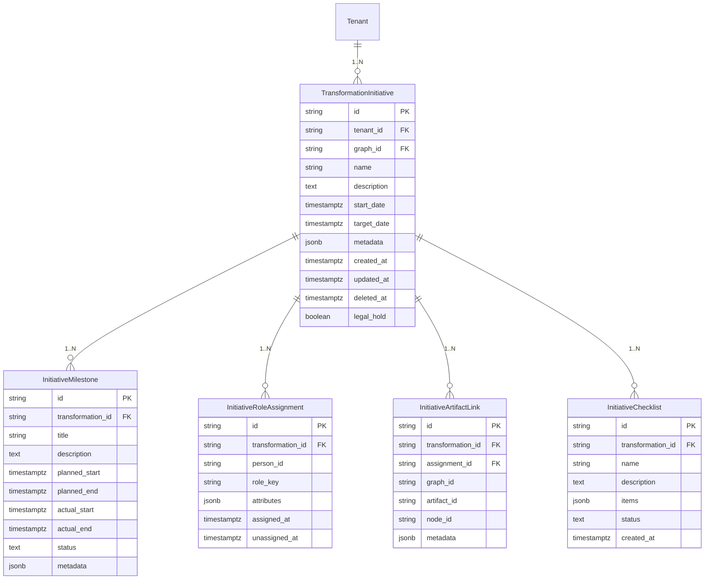

# Transformation Initiatives Information Architecture

## ER Diagram

## Schema Highlights
- **transformation_transformations**: Master record per transformation. Stores graph linkage, lifecycle dates, descriptive metadata, soft-delete/legal-hold state.
- **transformation_milestones**: Template-driven milestones (Discover, Design, Build, Launch) with planned/actual windows and status.
- **transformation_role_assignments**: Mapping of people to roles (sponsor, transformation_lead, lead_architect, product_owner, reviewer, contributor). `person_id` references corporate directory GUID when available; attributes include email, department, availability.
- **transformation_artifact_links**: Junction table that associates transformations with graph assignments. Stores the canonical `assignment_id` (which already carries effective windows/scenario tags), optional milestone references, and transformation-level metadata.
- **transformation_checklists**: Optional per-transformation checklists (e.g., compliance gates, funding approvals) stored as JSON arrays with individual item status.
- **Derived views**: Materialized views for dashboards (e.g., milestone completion %, approval cycle time, check run aggregations) fed from graph governance events.

## Indices & Constraints
- Unique `(tenant_id, name)` per transformation to prevent duplicates.
- Foreign keys back to repositories ensure transformations cannot reference artifacts outside the linked graph.
- Role assignments enforce `(transformation_id, person_id, role_key, unassigned_at IS NULL)` uniqueness to avoid overlapping active roles.
- Artifact links enforce `(transformation_id, assignment_id)` uniqueness to avoid duplicate references. Effective windows and scenario tags remain canonical on the graph assignment record.
- Soft-delete columns (`deleted_at`, `legal_hold`) propagate through queries; views default to active records only.

## Data Flows
1. **Initiative creation**: Inserts record, optional milestones from template, default role placeholders.
2. **Role assignment**: Upserts into `transformation_role_assignments`; emits events for notifications and directory sync.
3. **Artifact linking**: Adds entries into `transformation_artifact_links` referencing graph assignments (via `assignment_id`) and optional milestone association.
4. **Governance consumption**: Jobs subscribe to graph governance events to update transformation dashboards (check outcomes, approvals, queue status) without duplicating governance logic.
5. **Reporting**: Read models aggregate milestone progress, role coverage, risk flags, and scenario impacts (joins with `model_edges` for dependency graphs).

## Soft Delete & Legal Hold
- Initiatives, milestones, role assignments, and artifact links support soft-delete. Legal hold prevents purge operations and keeps historical data available for audit.
- Background jobs periodically purge soft-deleted records outside legal-hold scope after retention thresholds.

## Directory Integration Considerations
- `person_id` stores canonical GUID from corporate directory; attributes include snapshot of display name and email to cover offline scenarios.
- Sync jobs reconcile assigned roles with directory changes (e.g., replacement of Sponsor) and emit events when conflicts arise.

## Governance Alignment
- Initiatives do not redefine governance rules; instead, `transformation_artifact_links` store `assignment_id` references and cached governance snapshots (latest approval status, required check completion). Dashboards fetch authoritative status from graph APIs/events.

## Next Steps
- Finalize JSON schemas for `transformation_checklists` and milestone templates.
- Define API contracts for role assignment CRUD, artifact linking, and milestone updates.
- Model transformation-level KPIs (cycle times, risk scoring) in analytical views fed from this schema plus graph events.
