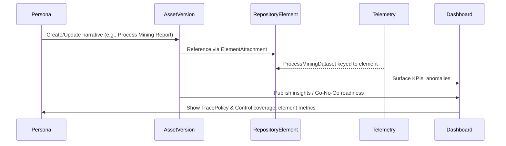

# User Journey Index

This index catalogues end-to-end user journeys across the Ameide platform domains. Each linked document expands the steps, touchpoints, telemetry, and supporting backlog references.

## Journey Map Overview
- Journeys capture real user intent across graph, governance, transformation, and telemetry surfaces.
- Each journey is grounded in backlog functional requirements (FRs/FIs) and entity models for traceability.
- Journey docs double as validation scripts and onboarding aids for new contributors.
- RepositoryElements are first-class across every journey; assets/transformations narrate or manipulate elements while telemetry proves the impact of those element changes.

| Domain Context | Primary Personas | Journey Doc | Highlights |
| --- | --- | --- | --- |
| Enterprise Repository | Governance Lead, Enterprise Architect, Product Owner, Repository Admin | [231-graph-user-journeys](231-graph-user-journeys.md) | Provision governance bundle, curate assets, run approvals, publish releases, monitor graph health. |
| Asset Lifecycle & Knowledge Graph | Enterprise Architect, Solution Architect, Contributor | [232-asset-user-journeys](232-asset-user-journeys.md) | Register assets, collaborate on drafts, classify & version, sync to graph/search, manage retention & bulk operations. |
| Governance & Compliance Fabric | Governance Lead, Reviewer, Compliance Officer, Automation Bot | [233-governance-user-journeys](233-governance-user-journeys.md) | Configure policies and routing, triage reviews, manage checks, orchestrate surveys/recertification, handle escalations & SLA resilience. |
| Transformation Initiatives | Product Owner, Program Manager, Lead Architect, Sponsor | [234-transformation-user-journeys](234-transformation-user-journeys.md) | Spin up transformations, scope work from graph, track blockers, deliver readiness, align portfolio telemetry. |
| Strategy & Change Enablement | Sponsor, Strategy Lead, Change Manager, Communications Lead | [246-strategy-adoption-user-journeys](246-strategy-adoption-user-journeys.md) | Align vision and funding, orchestrate change enablement, measure value realisation and adoption health. |
| Analytics & Telemetry Ops (cross-cutting) | Platform Analyst, Reliability Engineer, PMO Analyst | [235-telemetry-user-journeys](235-telemetry-user-journeys.md) | Observe sync jobs, investigate anomalies, reconcile KPIs across graph/transformation metrics, and surface outcome deltas. |
| Extended Variations & Negative Paths | Enterprise Architect, Governance Lead, Repository Admin, Sponsor | [238-extended-journeys](238-extended-journeys.md) | Multi-graph collaboration, ADR workflows, API publishing, emergency overrides, quarterly reviews, and negative paths (243-245). |

Use this index when authoring experience specs, aligning backlog items, or planning validation scenarios. Each journey document nests acceptance criteria and KPIs that connect directly to the 220-series entity models and 150/160-series business playbooks.

## Journey System View


## User Stories vs Journeys

### Relationship
- **User Journey** = Complete end-to-end workflows (5–15 minutes of user time).
- **User Story** = Individual capability within a journey (hours/days of implementation).
- **Task** = Engineering activity that delivers part of a user story.

### Example: Journey 231 Contains Multiple Stories
```
Journey 231: Draft to Baseline
├─ US-231.1: Create Draft Asset (Alice)
├─ US-231.2: Submit for Review (Alice)
├─ US-231.3: Request Changes (Bob)
├─ US-231.4: Address Feedback (Alice)
├─ US-231.5: Approve Asset (Bob, Bob2)
└─ US-231.6: View Approved Baseline (Frank)
```
Each journey document lists its user stories inside the “Journey Steps” section to keep traceability explicit.

## Terminology

| Term | Definition | Example |
|------|------------|---------|
| **Epic** | Large feature set spanning months of delivery | Governance Workflow |
| **User Journey** | Complete E2E workflows (minutes for the user) | Draft to Baseline |
| **User Story** | Single user capability tied to a persona | As Alice, I want to submit for review so governance can assess the draft |
| **Acceptance Criteria** | Testable conditions proving a story is done | Review case created with state `in_review` and SLA timer set |
| **Test Assertion** | Code-level verification in automated tests | `expect(reviewCase.state).toBe('open')` |

## Epic → Journey Mapping

| Epic | Journeys | FR Coverage |
|------|----------|-------------|
| **E1: Asset Lifecycle Management** | 231, 232 (AJ1-AJ6), 237, 240, 243, 245 | FR-6, FR-8, FR-11, FR-13 |
| **E2: Governance Workflows** | 231 (JR2, JR4, JR5), 233 (GJ1-GJ6), 234 (IJ4), 236, 239, 241, 244 | FR-12, FR-14, FR-15, FR-16, FR-20 |
| **E3: Initiative Management** | 233 (IJ1-IJ6), 242 | FI-01, FI-03 |
| **E4: Landscape & Reporting** | 232 (AJ3, AJ4), 235 (TJ1-TJ4), 238 | FR-18 |
| **E5: Strategy & Change Enablement** | 246 (SJ1-SJ3) | backlog/160-transformation-transformations-business-scenario.md; backlog/113-8-appendices.md |

## Persona Journey Matrix

| Persona | Primary Journeys | Supporting Journeys |
|---------|------------------|---------------------|
| Alice (Architect/Creator) | 231 (creator), 232 (owner), 237 (bulk) | 233 (architect lens), 234 (remediate) |
| Bob (Reviewer) | 231 (reviewer), 236 (SLA resilience) | 232, 234 |
| Carol (Program Manager) | 233 (planning) | — |
| David (Repository Admin) | 232 (admin), 236 (escalation) | 237 (bulk oversight) |
| Eve (Compliance Lead) | 234 (compliance) | 232 (policy impact) |
| Frank (Stakeholder) | 235 (stakeholder view) | — |
| Grace (Change Manager) | 246 (change enablement) | 234 (blockers), 235 (adoption telemetry) |
| Henry (Sponsor) | 246 (strategy alignment) | 234 (readiness), 242 (quarterly review) |

## Prerequisite Configuration (Detailed)

### Repository Setup
```typescript
const enterpriseRepo = {
  graph_id: 'repo-001',
  name: 'Enterprise Repository',
  governance_profile_id: 'profile-001',
  visibility: 'private',
  classifications: [
    { code: 'SIB', label: 'Standards Information Base', partition_type: 'standards' },
    { code: 'Landscape.Baseline', label: 'Baseline Architecture', partition_type: 'landscape_baseline' },
    { code: 'Landscape.Target', label: 'Target Architecture', partition_type: 'landscape_target' },
    { code: 'Requirements', label: 'Architecture Requirements Repository', partition_type: 'requirements' },
    { code: 'Governance.Log', label: 'Governance Log', partition_type: 'governance_log' },
    { code: 'Reference.Library', label: 'Reference Library', partition_type: 'reference' }
  ]
};

const eaBoard = {
  owner_group_id: 'group-001',
  name: 'Enterprise Architecture Board',
  graph_id: 'repo-001',
  membership: [bob.id, bob2.id],
  quorum_rules: { required_approvals: 2 }
};
```

## Journey Variations (Future)

Detailed definitions for Journeys 238–245 now live in [238-extended-journeys.md](238-extended-journeys.md). Use them for roadmap shaping and failure-mode rehearsals.

## Why This Matters
- Aligns product, engineering, and governance teams on what “done” means for real user workflows.
- Provides backlog traceability from epics → journeys → user stories → acceptance tests.
- Accelerates onboarding by bundling personas, prerequisites, and variations in one hub.
- Supports portfolio planning by exposing which journeys deliver which FRs and where future investments (variations) land.
- Connects strategic intent, change enablement, and telemetry so digital transformation value is evidenced end-to-end.
