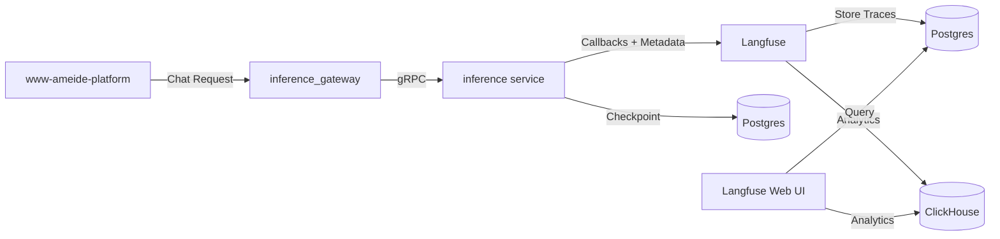

# LLM Observability & Evaluations (Langfuse)

**Status**: ✅ Implemented
**Priority**: High
**Owner**: Platform AI/Inference
**Last Updated**: April 2026

---

## Intent

Provide comprehensive observability for LangGraph agents with tracing, metrics, and evaluation capabilities. This enables teams to understand agent behavior, debug tool usage, measure performance, and validate prompt changes before they reach production.

---

## Why Now

1. Inference agents keep shipping without measurable expectations, making regressions invisible until customers complain.
2. Prompt and tool changes lack a safe place to compare "before vs after" outputs.
3. Debugging agent failures requires visibility into tool calls, LLM requests, and execution flow.
4. Cost and latency optimization needs detailed per-request breakdowns.

---

## Solution: Langfuse Integration

Instead of building a custom evaluation portal, we've integrated **Langfuse** (open-source LLM observability platform) which provides:

- **Trace Visualization**: See every agent execution with full tool call hierarchy
- **Session Grouping**: Thread-based conversation tracking with metadata
- **User Attribution**: Link traces to users and tenants
- **Cost Tracking**: Per-request token usage and cost breakdown
- **Latency Analysis**: Identify slow tool calls and LLM requests
- **Metadata Filtering**: Search by agent_id, model, graph, etc.
- **Prompt Management**: Version and compare prompts (future)
- **Evaluation Framework**: Manual and automated scoring (future)

This gives us 80% of the required functionality immediately while we validate requirements for custom evaluation workflows.

---

## Architecture



### Components

**Inference Service** (`services/inference/`)
- Builds LangGraph agents with Langfuse callback handlers
- Injects metadata: `session_id`, `user_id`, `agent_id`, `model`, `tenant_id`, `graph_id`
- Passes callbacks to LangChain LLMs for automatic tracing
- All 4 endpoints instrumented: gRPC Generate, HTTP invoke, HTTP stream, WebSocket

**Langfuse Platform** (Helm chart: `langfuse/langfuse`)
- Web UI for trace exploration and analysis
- Worker service for async event processing
- PostgreSQL for trace storage and user data
- ClickHouse for time-series analytics
- Redis for caching and queue management

**Observability Module** (`services/inference/observability/langfuse.py`)
- Factory for creating Langfuse callback handlers
- Builds metadata dict with special keys for Langfuse 3.x
- Gracefully degrades if disabled or misconfigured

---

## Setup & Configuration

### 1. Bootstrap (Helm-managed)

A dedicated Helm chart (`langfuse-bootstrap`) seeds:
- Admin user (`bootstrap.admin.*` values)
- Default organization/project
- Project-scoped API key for inference telemetry

sk-lf-dd6bfc54-31d6-4417-ae4f-cd153fdc4ff8
Public Key

pk-lf-7865aea5-9215-4cc6-b3bb-f48a6d843649
Host


Secrets are delivered via Azure Key Vault (`inference-db-credentials`) or a local override secret. To inspect the materialised values:

```bash
kubectl get secret inference-db-credentials -n ameide \
  -o jsonpath='{.data.LANGFUSE_PUBLIC_KEY}' | base64 -d && echo
kubectl get secret inference-db-credentials -n ameide \
  -o jsonpath='{.data.LANGFUSE_SECRET_KEY}' | base64 -d && echo
```

The inference deployment loads these environment variables automatically from the `inference-db-credentials` secret.

### 2. Access Langfuse UI

- Local: https://evals.dev.ameide.io
- Staging: https://evals.staging.ameide.io
- Production: https://evals.ameide.io

Admin accounts and the inference API key are bootstrapped per environment via `langfuse-bootstrap`.
* Local defaults: admin email `admin@dev.ameide.io`, password from the secret (`LANGFUSE_ADMIN_PASSWORD`), API key pair `pk-lf-local` / `sk-lf-local`.
* Staging/Production: credentials pulled from Azure Key Vault secrets (`langfuse-admin-password`, `langfuse-api-public-key`, `langfuse-api-secret-key`). Rotate passwords post-login.

### 3. Verify Tracing

After deploying or updating inference:

1. Send a threads message in the platform (e.g., in element editor modal)
2. Check inference logs for confirmation:
   ```bash
   kubectl logs -n ameide deployment/inference --tail=50 | grep -i langfuse
   ```
   Should show: `INFO:...Langfuse tracing enabled for agent=...`

3. Open Langfuse UI and navigate to **Traces** tab
4. You should see traces with metadata:
   - Session ID (thread_id)
   - User ID
   - Agent ID (e.g., `graph-analyst`)
   - Model name
   - Tenant ID
   - Repository ID
   - Custom metadata (temperature, etc.)

---

## Implementation Details

### Langfuse Callback Integration (Langfuse 3.x)

The implementation uses Langfuse's LangChain callback handler to automatically trace all agent executions.

**Key Files**:
- `services/inference/observability/langfuse.py` - Handler factory
- `services/inference/app.py` - Endpoint instrumentation
- `services/inference/agents/default.py` - Agent graph builder

**Metadata Flow**:
1. `build_agent_graph()` creates handler + metadata dict
2. Returns tuple: `(graph, langfuse_metadata)`
3. Metadata injected into LangGraph config at invocation:
   ```python
   config = {
       "configurable": {"thread_id": thread_id},
       "metadata": {
           "langfuse_session_id": thread_id,
           "langfuse_user_id": user_id,
           "agent_id": agent_id,
           "model": model,
           "temperature": temperature,
           "tenant_id": tenant_id,
           "graph_id": graph_id,
           "tags": [agent_id, model]
       }
   }
   ```

### Inference Service Runtime (Current Implementation)

- **Request Validation**  
  - `AgentRequest` requires a non-zero UUID `thread_id`; Pydantic rejects missing/zero IDs early (`services/inference/app.py:189-203`).  
  - gRPC requests go through `_from_proto_request`, which enforces the same contract and surfaces `INVALID_ARGUMENT` when absent (`services/inference/app.py:453-478`).

- **Graph Construction**  
  - `build_agent_graph` derives prompt + tools, creates Langfuse handler/metadata, and forwards callback tuples to both custom agents and the default ReAct graph (`services/inference/app.py:212-295`).  
  - Custom agents registered in `services/inference/agents/registry.py` receive the `AgentRuntimeConfig`, which now includes callbacks so bespoke factories can attach to Langfuse seamlessly.

- **Runtime Wiring**  
  - All surfaces (HTTP invoke/stream, WebSocket, gRPC) call `build_agent_graph`, then invoke LangGraph with:  
    ```python
    config = {
        "configurable": {"thread_id": str(thread_id)},
        "metadata": langfuse_metadata,
        "callbacks": list(langfuse_callbacks),
    }
    ```  
    ensuring checkpoints, Langfuse sessions, and callback handlers share the same context (`services/inference/app.py:488-509`, `613-706`, `768-804`).

- **Credential Enforcement**  
  - OpenAI credentials are required; if `OPENAI_API_KEY` is absent or still a placeholder value the service now raises a runtime error instead of falling back to a stubbed `_FakeGraph`.

- **Observability Adapter**  
  - `create_langfuse_handler` checks env flags, resolves legacy `LANGFUSE_HOST`, raises informative warnings when misconfigured, and returns both handler + metadata (`services/inference/observability/langfuse.py:16-103`).  
  - Metadata adds `langfuse_session_id`, `langfuse_user_id`, agent/model tags, tenant and graph identifiers—matching notebook patterns but centralized server-side.

- **Session Storage**  
  - `configurable.thread_id` plugs into the LangGraph checkpointer (`AsyncPostgresSaver`), so persisted state, traces, and downstream analytics remain keyed by the same UUID (`services/inference/app.py:84-120`, `498`, `630`, `700`, `787`).

### Session Handling

- Platform clients **must** generate a stable, non-zero UUID `thread_id` before the first turn of a conversation and include it on every subsequent request.
- The inference service now validates this contract across all transport surfaces (HTTP invoke/stream, WebSocket, gRPC Generate). Missing IDs are rejected at parse time (HTTP 422, gRPC `INVALID_ARGUMENT`) with the message: *"thread_id must be a non-zero UUID generated by the client"*.
- A zero UUID (common placeholder) is treated as invalid to prevent unrelated conversations from collapsing into a single checkpoint or Langfuse session.
- Client SDKs (TS/Python) expose helpers (`createThreadId()`, `generate_thread_id()`) and persist the value for reconnects; product teams should store the identifier in local state (e.g., Redux/query cache) so tabs reuse the same session.
- The thread ID is forwarded to both LangGraph (`configurable.thread_id`) and Langfuse (`langfuse_session_id`), keeping checkpoints, observability, and analytics aligned without relying on server-generated identifiers.
- Langfuse sessions and exports now retain the platform thread ID, enabling one-click correlation with downstream telemetry (DataDog logs, product analytics).
- Follow-on items: extend propagation for agent-to-agent escalations (nested LangGraph invocations) and document how/when clients should rotate IDs for “start new threads” UX.

**Instrumented Endpoints**:
- `Generate` (gRPC) - Streaming agent responses
- `/agents/invoke` (HTTP POST) - Synchronous invocation
- `/agents/stream` (HTTP POST) - SSE streaming
- `/ws` (WebSocket) - Real-time threads

### LangGraph Evaluation Notebook Review

- Recent LangGraph + Langfuse evaluation notebooks (March 2025) mirror our tracing strategy by passing `CallbackHandler()` through `config={"callbacks": [...]}` on LangGraph invocations. To keep parity, expose the handler via `AgentRuntimeConfig` in `services/inference/agents/registry.py` so every registered agent can opt into tracing without bespoke wiring.
- Notebook samples embed Langfuse/OpenAI secrets directly in code. Update developer docs to require loading credentials from the same environment variables our inference deployment uses, preventing accidental leakage in commits or Langfuse traces.
- The offline evaluation flow (Langfuse datasets + Hugging Face benchmarks) is a good candidate for regression testing. We should ship a thin wrapper around `build_registered_agent(...)` that links Langfuse dataset items to trace IDs and records scores, enabling side-by-side comparisons of prompts/models before rollout.
- Action item: publish a “Local agent evaluation” guide that reuses our Langfuse handler factory, lists supported OpenAI models, and explains how to push evaluation results back into shared dashboards for parity with production metrics.

### Helm Configuration

**Langfuse Chart** (`infra/kubernetes/values/platform/langfuse.yaml`):
- Uses platform PostgreSQL (not bundled subchart)
- Uses platform Redis for caching
- Uses ClickHouse (Plausible) for analytics
- Sign-up enabled for local dev (disabled in production)
- Ingress at `evals.dev.ameide.io`

**Inference Chart** (`infra/kubernetes/values/platform/inference.yaml`):
- Langfuse configuration via environment variables
- `LANGFUSE_ENABLED`, `LANGFUSE_HOST`, `LANGFUSE_PUBLIC_KEY`, `LANGFUSE_SECRET_KEY`
- Graceful degradation if API keys not configured

### Data Storage

**Langfuse Database** (PostgreSQL `langfuse`):
- `users` - User accounts and admin flags
- `traces` - Top-level execution traces
- `observations` - Individual LLM calls, tool invocations, spans
- `projects` - Project configuration and API keys
- `scores` - Manual and automated evaluation scores
- `prompts` - Versioned prompt templates (future)

**ClickHouse Analytics**:
- Time-series aggregations for dashboards
- Cost trends, latency percentiles, error rates
- Trace volume by agent/model/tenant

---

## Usage Patterns

### Viewing Traces

1. **By Session**: Filter by thread_id to see full conversation
2. **By Agent**: Filter by agent_id tag to see all graph-analyst executions
3. **By User**: Filter by user_id to track specific user behavior
4. **By Repository**: Search metadata for graph_id

### Debugging Failures

1. Find failing trace in Langfuse UI
2. Expand observation tree to see tool call sequence
3. Check input/output of each tool invocation
4. Review LLM requests/responses
5. Examine error messages and stack traces
6. Check latency breakdown to identify bottlenecks

### Cost Analysis

1. Navigate to **Dashboard** tab
2. View cost breakdown by:
   - Model (gpt-4, gpt-3.5-turbo)
   - Agent (graph-analyst vs general-threads)
   - Time period (last 7d, 30d)
3. Export data for budget tracking

### Manual Scoring (Future)

1. Open trace in Langfuse
2. Click **"Add Score"**
3. Select score type (quality, correctness, helpfulness)
4. Rate 0-1 or add categorical label
5. Add comment with rationale
6. Scores feed into aggregate metrics

---

## Future Enhancements

### Short Term
- [ ] Configure API keys in production environments
- [ ] Create default dashboards for each agent
- [ ] Add custom scores for agent-specific quality metrics
- [ ] Document prompt versioning workflows

### Medium Term
- [ ] Automated evaluation runs on prompt changes
- [ ] CI integration for regression detection
- [ ] Baseline comparison views
- [ ] Cost alerts and budgets

### Long Term
- [ ] LLM-as-judge evaluators
- [ ] Synthetic test suite execution
- [ ] A/B testing for prompt variations
- [ ] Custom evaluation portal (if needed after validation)

---

## Related Documentation

- Langfuse Documentation: https://langfuse.com/docs
- Langfuse Python SDK: https://langfuse.com/docs/sdk/python
- LangChain Integration: https://langfuse.com/docs/integrations/langchain/tracing
- Agent Registry: `services/inference/agents/registry.py`
- Context Caching: `backlog/304-context.md`
