# 312: Complete Agent Designer Plugin for Element Editor

**Status**: Planned
**Priority**: P1 (Critical Path - Frontend)
**Assignee**: TBD
**Created**: 2025-10-28
**Updated**: 2025-10-28
**Depends On**: [310-agents-v2.md](310-agents-v2.md) (P0-P1 complete)
**Blocks**: Full agents platform UI functionality

---

## 📋 **Executive Summary**

Complete the existing `editor-agent` plugin to provide a production-ready visual designer for AI agents. The plugin leverages the established element editor framework (used successfully for ArchiMate, Document, Canvas, and Properties editors) to provide a consistent, familiar authoring experience.

**Current State**: ~30% complete
- ✅ Plugin registered in `elementEditorRegistry.ts`
- ✅ Basic session management (`AgentSession.ts`)
- ✅ Skeleton canvas component (`AgentDesignerCanvas.tsx`)
- ✅ Basic toolbar stub (`AgentToolbar.tsx`)
- ❌ Property inspector (not built)
- ❌ Node palette (not built)
- ❌ Tool connection UI (not built)
- ❌ Test console (not built)
- ❌ Routing configuration (not built)
- ❌ Publish workflows (not built)

**Target State**: Full-featured agent designer matching ArchiMate plugin quality with:
- Visual node-based canvas (React Flow)
- Dynamic property inspector driven by `PropertySchema` from proto
- Drag-drop node palette (agents, tools, LLMs, chains)
- Test console with streaming execution
- Routing rules configuration
- Publish workflows → artifact compilation + MinIO upload

---

## 🎯 **Objectives**

1. **Consistency**: Match ArchiMate plugin UX patterns (palette, canvas, inspector, toolbar)
2. **Proto-Driven**: Render forms from `PropertySchema` in node definitions (no hardcoded UI)
3. **Real-Time Testing**: Integrated test console using inference service streaming
4. **Production-Ready**: Handle errors, loading states, versioning, concurrent edits

---

## 🏗️ **Architecture**

### **Plugin Structure** (Follows ArchiMate Pattern)

```
features/editor-agent/
├── plugin/
│   └── index.tsx                     # ✅ Plugin registration
├── session/
│   └── AgentSession.ts               # ✅ Session management (basic)
├── canvas/
│   ├── AgentCanvas.tsx               # ❌ React Flow integration (needs enhancement)
│   ├── nodes/
│   │   ├── AgentNode.tsx             # ❌ Custom node renderer
│   │   ├── ToolNode.tsx              # ❌ Tool node renderer
│   │   ├── LLMNode.tsx               # ❌ LLM node renderer
│   │   └── ChainNode.tsx             # ❌ Chain node renderer
│   └── edges/
│       ├── registry.ts               # ❌ Edge type mappings
│       └── ToolConnectionEdge.tsx    # ❌ Custom edge renderer
├── inspector/
│   ├── PropertyInspector.tsx         # ❌ Right sidebar properties panel
│   ├── fields/
│   │   ├── PropertyField.tsx         # ❌ Main field dispatcher
│   │   ├── StringField.tsx           # ❌ STRING type handler
│   │   ├── TextAreaField.tsx         # ❌ TEXT type handler
│   │   ├── NumberField.tsx           # ❌ NUMBER type handler
│   │   ├── BooleanField.tsx          # ❌ BOOLEAN type handler
│   │   ├── OptionsField.tsx          # ❌ OPTIONS type handler
│   │   ├── CollectionField.tsx       # ❌ COLLECTION type handler
│   │   ├── FixedCollectionField.tsx  # ❌ FIXED_COLLECTION type handler
│   │   ├── JsonEditorField.tsx       # ❌ JSON type handler
│   │   ├── CredentialField.tsx       # ❌ CREDENTIAL type handler
│   │   └── NoticeField.tsx           # ❌ NOTICE/CALLOUT type handler
│   └── tabs/
│       ├── PropertiesTab.tsx         # ❌ Node properties
│       ├── ToolsTab.tsx              # ❌ Assigned tools list
│       └── RoutingTab.tsx            # ❌ Routing rules
├── palette/
│   ├── NodePalette.tsx               # ❌ Left sidebar node catalog
│   ├── DraggableNodeCard.tsx         # ❌ Drag-to-canvas node
│   └── NodeKindFilter.tsx            # ❌ Filter by NodeKind enum
├── toolbar/
│   └── AgentToolbar.tsx              # ⚠️ Partial (needs save/publish/test actions)
├── testing/
│   ├── TestConsole.tsx               # ❌ Bottom drawer test pane
│   ├── MessageBubble.tsx             # ❌ Chat message renderer
│   └── ToolCallLog.tsx               # ❌ Tool execution display
├── routing/
│   ├── RoutingRulesEditor.tsx        # ❌ Visual rule builder
│   ├── RuleConditionEditor.tsx       # ❌ Condition form
│   └── RoutingSandbox.tsx            # ❌ Test routing logic
├── hooks/
│   ├── useAgentDesigner.ts           # ❌ State management
│   ├── useNodeCatalog.ts             # ❌ Fetch catalog
│   ├── usePropertySchema.ts          # ❌ Schema → form mapping
│   └── useAgentPublish.ts            # ❌ Publish workflows
└── stores/
    ├── designerStore.ts              # ❌ Zustand store (canvas state)
    └── testConsoleStore.ts           # ❌ Test console history
```

---

## 🏗️ **AMEIDE UI Architecture**

**Key Constraints**:
- ✅ **Chat panel is on the RIGHT** (RightSidebarTabs: Chat/Properties/Automations)
- ✅ **Plugin-specific subheader** for actions (like ArchiMateHeader)
- ✅ **EditorModalChrome** provides: header (title, badge, actions, close button)
- ✅ **Element editor modal** hosts the plugin

**Actual Layout**:
```
┌────────────────────────────────────────────────────────────────┐
│ Element Title | agent | [Actions] [Fullscreen] [Close]        │ ← EditorModalChrome
├────────────────────────────────────────────────────────────────┤
│ [Subheader Actions: Add Node | Layout | Test | Save | Publish]│ ← AgentToolbar (plugin-specific)
├──────────────┬────────────────────────────┬────────────────────┤
│              │                            │ [Chat | Props | …] │
│  Node        │     React Flow Canvas     │ ──────────────────│
│  Palette     │   ┌──────┐                │                    │
│              │   │Agent │                │ Agent Parameters:  │
│ Search:      │   │ Bot  │───┐            │ Name: _________   │
│ ________     │   └──────┘   │            │ Model: [Select]   │
│              │              ▼            │ Temp: 0.7         │
│ ▼ Agents     │        ┌─────────┐        │ Tools: [2]        │
│  [Card]      │        │  Tool   │        │                    │
│  [Card]      │        │ Query   │        │ [Add Tool]        │
│ ▼ Tools      │        └─────────┘        │                    │
│  [Card]      │                            │                    │
│  [Card]      │                            │                    │
│              │                            │ [Test Agent]      │
├──────────────┴────────────────────────────┴────────────────────┤
│ Test Console                                     [−] [×]       │ ← Bottom drawer (optional)
│ User: Hello → AI: Response...                                  │
└────────────────────────────────────────────────────────────────┘
```

**Why This Works**:
- Node palette on LEFT (threads is on right)
- Properties in RIGHT sidebar "Properties" tab (reuses existing tab)
- Test console as collapsible bottom drawer (doesn't block canvas)
- Toolbar in plugin-specific subheader (like ArchiMate does)

---

## 🎨 **n8n UI Patterns (Reference Code)**

Based on analysis of `/workspace/reference-code/n8n/packages/frontend/editor-ui/` (adapted for AMEIDE):

### **Key Patterns to Adopt**

1. **Node Creator** ([NodeCreator.vue](../reference-code/n8n/packages/frontend/editor-ui/src/components/Node/NodeCreator/NodeCreator.vue)):
   - Sliding panel from right (400-500px width)
   - Scrim overlay when active
   - Close button + keyboard shortcuts (Escape, Tab)
   - Prevents drag-drop outside panel bounds
   - Uses `NodesListPanel` for catalog display

2. **Parameter Input** ([ParameterInput.vue](../reference-code/n8n/packages/frontend/editor-ui/src/components/ParameterInput.vue)):
   - **58,166 LOC** mega-component handling all parameter types
   - Type-driven rendering: `INodeProperties.type` → component
   - Expression support: inline `={{ }}` syntax
   - Type options: `loadOptionsMethod`, `editor`, `editorLanguage`, `password`, `rows`
   - Integrated with expression editor modal
   - Handles validation, remote options loading, credential selection

3. **Collection Types**:
   - **FixedCollectionParameter**: Grouped fields with fixed keys ([FixedCollectionParameter.vue](../reference-code/n8n/packages/frontend/editor-ui/src/components/FixedCollectionParameter.vue))
   - **CollectionParameter**: Dynamic arrays with add/remove ([CollectionParameter.vue](../reference-code/n8n/packages/frontend/editor-ui/src/components/CollectionParameter.vue))
   - **MultipleParameter**: Multi-value inputs ([MultipleParameter.vue](../reference-code/n8n/packages/frontend/editor-ui/src/components/MultipleParameter.vue))

4. **Canvas Architecture** ([composables/useCanvasOperations.ts](../reference-code/n8n/packages/frontend/editor-ui/src/composables/useCanvasOperations.ts)):
   - Composable-based operations (add node, delete node, connect, etc.)
   - Vue Flow integration with custom node types
   - Event bus for cross-component communication
   - Canvas layout algorithms (auto-layout, fit-to-view)

5. **Resource Locator** ([ResourceLocator.vue](../reference-code/n8n/packages/frontend/editor-ui/src/components/ResourceLocator/ResourceLocator.vue)):
   - Special component for selecting resources (IDs, names, URLs)
   - Mode switcher (ID, Name, URL, Expression)
   - Async option loading

### **Mapping n8n → AMEIDE Agents**

| n8n Pattern | AMEIDE Equivalent | Implementation |
|-------------|-------------------|----------------|
| `NodeCreator` | `NodePalette` | Sliding panel with agent/tool catalog |
| `ParameterInput` | `PropertyField` | Type dispatcher for `PropertySchema` |
| `FixedCollectionParameter` | `FixedCollectionField` | Grouped parameters (e.g., HTTP headers) |
| `CollectionParameter` | `CollectionField` | Dynamic tool arrays |
| `INodeProperties` | `PropertySchema` (proto) | Parameter metadata |
| `INodeTypeDescription` | `NodeDefinition` (proto) | Node metadata |
| `useCanvasOperations` | `useAgentDesigner` (composable) | Canvas state management |
| Expression editor (`{{ }}`) | Optional future | Expression support in parameters |

---

## 📐 **Component Specifications**

### **1. Canvas Enhancement** ⚠️ **Priority: P0** (2 weeks)

**Location**: `canvas/AgentCanvas.tsx`

**Current Issues**:
- Basic React Flow setup exists but lacks node type renderers
- No custom edge styling
- Missing drag-drop from palette
- No connection validation

**Requirements**:
- Custom node components for each `NodeKind`:
  - `AgentNode`: Primary agent (bot icon, name, version badge)
  - `ToolNode`: Tool (wrench icon, tool name, parameter count)
  - `LLMNode`: LLM provider (brain icon, model name, token limits)
  - `ChainNode`: Chain/workflows (link icon, step count)
  - `MemoryNode`: Memory store (database icon, type)
  - `RetrieverNode`: Retrieval (search icon, source)
- Edge types:
  - `AI_TOOL`: Agent → Tool (solid arrow, blue)
  - `LLM`: Agent → LLM (dashed arrow, purple)
  - `DATA_FLOW`: Tool → Tool (dotted arrow, gray)
- Handle placement:
  - Agent: Inputs (top), Outputs (bottom), LLM (left), Tools (right)
  - Tool: Inputs (top), Outputs (bottom)
- Validation:
  - Prevent circular dependencies
  - Enforce connection kind rules (e.g., only LLMs connect to agent's LLM port)
  - Max connections per port type

**Implementation Pattern** (combining ArchiMate + n8n patterns):
```tsx
// canvas/nodes/AgentNode.tsx
export function AgentNode({ data, selected }: NodeProps<AgentNodeData>) {
  const nodeTypesStore = useNodeTypesStore();

  return (
    <div className={cn(
      'bg-primary/10 border-2 rounded-lg p-4 min-w-[180px]',
      selected && 'border-primary ring-2 ring-primary/20',
      'transition-all duration-150', // n8n pattern: smooth transitions
    )}>
      <Handle type="target" position={Position.Top} id="input" />
      <Handle type="target" position={Position.Left} id="llm" />

      <div className="flex items-center gap-2 mb-2">
        <NodeIcon icon={data.icon} kind={data.kind} /> {/* n8n pattern: icon component */}
        <span className="font-semibold truncate">{data.displayName}</span>
      </div>

      {data.version && (
        <Badge variant="outline" className="text-xs">v{data.version}</Badge>
      )}

      {/* n8n pattern: show parameter count */}
      {data.parametersSet > 0 && (
        <div className="text-xs text-muted-foreground mt-1">
          {data.parametersSet} parameters configured
        </div>
      )}

      <Handle type="source" position={Position.Right} id="tools" />
      <Handle type="source" position={Position.Bottom} id="output" />
    </div>
  );
}
```

**n8n-style Node Operations** (composable):
```tsx
// hooks/useAgentDesigner.ts
export function useAgentDesigner() {
  const addNode = (nodeId: string, position: { x: number; y: number }) => {
    // n8n pattern: optimistic UI update
    const tempNode = { id: uuid(), nodeId, position, data: {} };
    setNodes((prev) => [...prev, tempNode]);

    // Then persist
    await saveAgent();
  };

  const deleteNode = (id: string) => {
    // n8n pattern: confirmation for configured nodes
    if (hasParameters(id)) {
      const confirmed = await confirmDelete();
      if (!confirmed) return;
    }

    setNodes((prev) => prev.filter(n => n.id !== id));
    await saveAgent();
  };

  return { addNode, deleteNode, connectNodes };
}
```

---

### **2. Property Inspector** ❌ **Priority: P0** (2-3 weeks)

**Location**: `inspector/PropertyInspector.tsx`

**AMEIDE Integration**: Use **existing RightSidebarTabs "Properties" tab** instead of new sidebar!

**Implementation Strategy**:
- Render property fields in the **Properties tab** of RightSidebarTabs
- This tab already exists ([RightSidebarTabs.tsx:59-66](../services/www_ameide_platform/features/editor/RightSidebarTabs.tsx#L59-L66))
- Replace placeholder with `<AgentPropertyInspector>` when agent node selected

**Requirements**:
- Detects selected node from canvas (via selection store)
- Loads node definition + property schema
- Renders dynamic form based on `PropertySchema`
- Supports all property types (see n8n patterns above)
- **Shares space with Chat tab** (user toggles between them)
  - Map `PropertyType` enum → React components
  - Handle all 12 property types from proto:
    - `STRING` → `<Input>`
    - `TEXT` → `<Textarea>`
    - `NUMBER` → `<Input type="number">`
    - `BOOLEAN` → `<Switch>`
    - `OPTIONS` → `<Select>` with `options[]`
    - `COLLECTION` → Dynamic array with add/remove
    - `FIXED_COLLECTION` → Grouped fields
    - `JSON` → CodeMirror editor
    - `CREDENTIAL` → Vault picker + masked input
    - `NOTICE` → Alert box (info/warning)
    - `CALLOUT` → Highlighted tip
    - `MULTI_OPTIONS` → Multi-select
  - Support `displayOptions` for conditional visibility:
    - `show.if`: Show field when condition met
    - `show.when`: Show based on other field values
  - Validation:
    - `required` flag
    - `min`/`max` for numbers
    - `pattern` for strings
    - Custom validators
  - Hints:
    - `description` → Help text below field
    - `hint_markdown` → Markdown tips
    - `placeholder`

**Implementation Pattern** (n8n-inspired):
```tsx
// inspector/fields/PropertyField.tsx (inspired by n8n's ParameterInput.vue)
export function PropertyField({ property, value, onChange, context }: PropertyFieldProps) {
  const [isFocused, setIsFocused] = useState(false);
  const [remoteOptions, setRemoteOptions] = useState<PropertyOption[]>([]);
  const [isLoadingOptions, setIsLoadingOptions] = useState(false);

  // n8n pattern: display conditions
  const isVisible = usePropertyVisibility(property.displayOptions, context);
  if (!isVisible) return null;

  // n8n pattern: remote options loading
  useEffect(() => {
    if (property.type === PropertyType.OPTIONS && property.loadOptionsMethod) {
      loadRemoteOptions(property.loadOptionsMethod);
    }
  }, [property]);

  // n8n pattern: expression support (future)
  const isExpression = typeof value === 'string' && value.startsWith('={{');

  // n8n pattern: validation
  const validationErrors = useParameterValidation(property, value, context);

  // Main type dispatcher
  const renderInput = () => {
    switch (property.type) {
      case PropertyType.STRING:
        return <StringField property={property} value={value} onChange={onChange} />;

      case PropertyType.TEXT:
        // n8n pattern: multiline with row count from typeOptions
        const rows = property.typeOptions?.rows || 4;
        return <Textarea rows={rows} value={value} onChange={onChange} />;

      case PropertyType.NUMBER:
        // n8n pattern: min/max from typeOptions
        return (
          <N8nInputNumber
            modelValue={value}
            min={property.typeOptions?.minValue}
            max={property.typeOptions?.maxValue}
            step={property.typeOptions?.numberStepSize || 1}
            onUpdate:modelValue={onChange}
          />
        );

      case PropertyType.OPTIONS:
        // n8n pattern: remote or local options
        const options = remoteOptions.length > 0 ? remoteOptions : property.options;
        return (
          <Select value={value} onValueChange={onChange}>
            {options.map((opt) => (
              <SelectItem key={opt.value} value={opt.value}>
                {opt.name}
              </SelectItem>
            ))}
          </Select>
        );

      case PropertyType.COLLECTION:
        // n8n pattern: dynamic array with add/remove
        return <CollectionField property={property} value={value} onChange={onChange} />;

      case PropertyType.FIXED_COLLECTION:
        // n8n pattern: grouped fields
        return <FixedCollectionField property={property} value={value} onChange={onChange} />;

      case PropertyType.JSON:
        // n8n pattern: code editor with language
        return (
          <JsonEditor
            modelValue={value}
            language={property.typeOptions?.editorLanguage || 'json'}
            readOnly={property.typeOptions?.editorIsReadOnly}
            onUpdate:modelValue={onChange}
          />
        );

      case PropertyType.CREDENTIAL:
        // n8n pattern: credential selector
        return <CredentialsSelect credentialType={property.credentialType} value={value} onChange={onChange} />;

      case PropertyType.NOTICE:
      case PropertyType.CALLOUT:
        // n8n pattern: informational displays
        return (
          <Alert variant={property.type === PropertyType.NOTICE ? 'default' : 'info'}>
            <AlertDescription>{property.description}</AlertDescription>
          </Alert>
        );

      default:
        console.warn(`Unknown property type: ${property.type}`);
        return null;
    }
  };

  return (
    <div className="space-y-2">
      {/* n8n pattern: label with tooltip */}
      {!property.hideLabel && (
        <Label className="flex items-center gap-2">
          {property.displayName}
          {property.required && <span className="text-destructive">*</span>}
          {property.description && (
            <TooltipProvider>
              <Tooltip>
                <TooltipTrigger>
                  <Info className="h-3 w-3 text-muted-foreground" />
                </TooltipTrigger>
                <TooltipContent className="max-w-xs">
                  <p>{property.description}</p>
                </TooltipContent>
              </Tooltip>
            </TooltipProvider>
          )}
        </Label>
      )}

      {/* Main input */}
      <div className={cn('relative', isFocused && 'ring-2 ring-primary/20 rounded')}>
        {renderInput()}
      </div>

      {/* n8n pattern: inline hint */}
      {property.hint && (
        <p className="text-xs text-muted-foreground">
          {property.hint}
        </p>
      )}

      {/* n8n pattern: validation errors */}
      {validationErrors.length > 0 && (
        <Alert variant="destructive" className="py-2">
          <AlertDescription className="text-xs">
            {validationErrors[0]}
          </AlertDescription>
        </Alert>
      )}

      {/* n8n pattern: markdown hint with details */}
      {property.hintMarkdown && (
        <details className="text-xs text-muted-foreground">
          <summary className="cursor-pointer">More info</summary>
          <div className="mt-2 prose prose-sm">
            <Markdown>{property.hintMarkdown}</Markdown>
          </div>
        </details>
      )}
    </div>
  );
}
```

**Display Options Logic**:
```tsx
function usePropertyVisibility(
  displayOptions: DisplayOptions | undefined,
  context: Record<string, unknown>
): boolean {
  if (!displayOptions?.show) return true;

  const { show } = displayOptions;

  // Example: show.if = { "model": ["gpt-4", "claude-3"] }
  if (show.if) {
    for (const [field, values] of Object.entries(show.if)) {
      if (!values.includes(context[field])) {
        return false;
      }
    }
  }

  return true;
}
```

---

### **3. Node Palette** ❌ **Priority: P0** (1 week)

**Location**: `palette/NodePalette.tsx`

**AMEIDE-Specific Layout**:
- **LEFT sidebar** (280px width, collapsible) - RIGHT is taken by threads!
- Always visible (not a sliding overlay like n8n)
- Integrates with ArchiMate-style layout

**Requirements** (adapted n8n patterns):
- Search bar at top (filters by name/description/nodeId)
- **View modes** (n8n pattern):
  - **By Category**: Collapsible sections (Agents, Tools, LLMs, etc.)
  - **By Action**: Flat list sorted by popularity/recent
  - **By Kind**: Filter tabs (All | Agents | Tools | LLMs | Chains | Memory | Retrievers)
- Node cards:
  - Icon (from `catalog.icon` or default by kind)
  - Display name
  - Description (2 lines, truncated)
  - Version badge
  - Categories (max 3 shown)
  - **Drag handle** (n8n pattern: clear affordance)
- Drag-to-canvas:
  - Native HTML5 drag (n8n uses `dataTransfer.setData(DRAG_EVENT_DATA_KEY)`)
  - Ghost preview while dragging
  - Drop creates node at cursor position
  - Prevent drop outside canvas bounds
- Loading states (skeleton cards)
- Error handling (empty state, retry button)
- **Collapse button** (hide palette for more canvas space)

**Implementation** (AMEIDE pattern):
```tsx
// palette/NodePalette.tsx
export function NodePalette({ isOpen, onToggle }: NodePaletteProps) {
  const { data: catalog } = useQuery({
    queryKey: ['agents', 'catalog'],
    queryFn: async () => {
      const client = getAgentsClient();
      return await client.listNodes({});
    },
    staleTime: 5 * 60 * 1000,
  });

  if (!isOpen) {
    return (
      <div className="w-10 border-r bg-muted/30 flex items-center justify-center">
        <Button variant="ghost" size="sm" onClick={onToggle}>
          <ChevronRight className="h-4 w-4" />
        </Button>
      </div>
    );
  }

  return (
    <div className="w-[280px] border-r bg-muted/30 flex flex-col">
      {/* Header with collapse */}
      <div className="flex items-center justify-between p-3 border-b">
        <h3 className="font-semibold text-sm">Add Node</h3>
        <Button variant="ghost" size="sm" onClick={onToggle}>
          <ChevronLeft className="h-4 w-4" />
        </Button>
      </div>

      {/* Search */}
      <div className="p-3 border-b">
        <Input placeholder="Search nodes..." />
      </div>

      {/* Scrollable list */}
      <ScrollArea className="flex-1">
        <div className="p-3 space-y-2">
          {/* n8n pattern: collapsible categories */}
          <Collapsible>
            <CollapsibleTrigger className="flex items-center gap-2 w-full">
              <ChevronDown className="h-4 w-4" />
              <span className="font-medium">Agents</span>
            </CollapsibleTrigger>
            <CollapsibleContent className="space-y-2 mt-2">
              {agentNodes.map((node) => (
                <DraggableNodeCard key={node.nodeId} node={node} />
              ))}
            </CollapsibleContent>
          </Collapsible>
          {/* Repeat for Tools, LLMs, etc. */}
        </div>
      </ScrollArea>
    </div>
  );
}
```

**Drag Handler** (n8n pattern):
```tsx
// palette/DraggableNodeCard.tsx
export function DraggableNodeCard({ node }: { node: NodeDefinition }) {
  const handleDragStart = (event: React.DragEvent) => {
    event.dataTransfer.setData(
      DRAG_EVENT_DATA_KEY,
      JSON.stringify({ nodeId: node.nodeId, kind: node.kind })
    );
    event.dataTransfer.effectAllowed = 'copy';
  };

  return (
    <div
      draggable
      onDragStart={handleDragStart}
      className="border rounded-lg p-3 hover:bg-muted cursor-grab active:cursor-grabbing"
    >
      <div className="flex items-center gap-2">
        <NodeIcon icon={node.icon} kind={node.kind} />
        <div className="flex-1 min-w-0">
          <p className="font-medium text-sm truncate">{node.displayName}</p>
          <p className="text-xs text-muted-foreground line-clamp-1">
            {node.description}
          </p>
        </div>
      </div>
    </div>
  );
}
```

---

### **4. Test Console** ❌ **Priority: P1** (1-2 weeks)

**Location**: `testing/TestConsole.tsx`

**Requirements**:
- Bottom drawer (300-600px height, resizable, collapsible)
- Message input with:
  - Multiline textarea
  - Send button
  - Keyboard shortcut (Cmd+Enter)
  - Disable while streaming
- Message list (scrollable, auto-scroll to bottom):
  - User messages (right-aligned, blue)
  - AI responses (left-aligned, gray)
  - Tool calls (indented, with spinner → checkmark)
  - Errors (red border, error icon)
- Streaming display:
  - Token-by-token rendering
  - Typing indicator
  - Stop button
- Metadata panel (collapsible):
  - Token usage (prompt + completion + total)
  - Latency (time to first token, total time)
  - Model used
  - Cost estimate

**Stream Integration**:
```tsx
async function testAgent(agentInstanceId: string, message: string) {
  const response = await fetch('/api/agents/stream', {
    method: 'POST',
    body: JSON.stringify({
      agentInstanceId,
      messages: [{ role: 'user', content: message }],
    }),
  });

  const reader = response.body?.getReader();
  const decoder = new TextDecoder();

  while (true) {
    const { done, value } = await reader!.read();
    if (done) break;

    const chunk = decoder.decode(value);
    const events = chunk.split('\n\n').filter(Boolean);

    for (const event of events) {
      const data = JSON.parse(event.replace('data: ', ''));

      if (data.event?.token) {
        appendToken(data.event.token.text);
      } else if (data.event?.toolStart) {
        addToolCall(data.event.toolStart);
      } else if (data.event?.usage) {
        setUsage(data.event.usage);
      }
    }
  }
}
```

---

### **5. Routing Configuration** ❌ **Priority: P2** (1 week)

**Location**: `routing/RoutingRulesEditor.tsx`

**Requirements**:
- Visual rule builder (inspector tab "Routing")
- Rule list (priority-ordered):
  - Drag handle to reorder
  - Priority number (auto-assigned by position)
  - Condition summary (e.g., "Repository page + Viewer role")
  - Edit/Delete buttons
- Add rule dialog:
  - **UI Page**: Select from enum (Repository, Initiatives, Reports, etc.)
  - **User Role**: Select (Viewer, Editor, Admin)
  - **Requires Repository**: Checkbox
  - **Requires Selection**: Checkbox
  - **Element Kind**: Optional select (ArchiMate type)
  - **Custom Metadata**: Key-value pairs
- Routing sandbox (below rules):
  - Form to simulate context
  - "Test" button → shows which rule matches
  - Result: Matched rule + agent instance + priority

**Data Model**:
```tsx
interface RoutingRule {
  ruleId: string;
  priority: number;
  condition: RoutingCondition;
}

interface RoutingCondition {
  uiPage?: string;
  userRole?: string;
  requiresRepository?: boolean;
  requiresSelection?: boolean;
  elementKind?: string;
  customMetadata?: Record<string, string>;
}
```

---

### **6. Toolbar (Plugin Subheader)** ⚠️ **Priority: P1** (3 days)

**Location**: `toolbar/AgentToolbar.tsx`

**AMEIDE Pattern**: Follows [ArchiMateHeader.tsx](../services/www_ameide_platform/features/editor-archimate/toolbar/ArchiMateHeader.tsx) structure

**Current State**: Stub exists but no actions

**Requirements** (matching ArchiMate pattern):
- Rendered in plugin-specific subheader area (below EditorModalChrome)
- Horizontal layout with grouped buttons
- Tooltips on all actions

**Button Groups**:

1. **Node Operations** (left):
   - Add Node button → Opens node palette OR adds from shortcut menu
   - Auto-Layout button → Runs dagre/elk layout algorithm
   - Fit View button → Zooms to fit all nodes

2. **Canvas Controls** (left-center, separator):
   - Zoom Out
   - Zoom In
   - Fit to View (duplicate of above, or 100% reset)

3. **Agent Operations** (center):
   - Save button (Cmd+S) → `UpdateAgent` RPC
   - Publish button → `PublishAgent` RPC + artifact compilation
   - Test toggle → Show/hide test console drawer

4. **History** (right-center, if undo/redo implemented):
   - Undo button (Cmd+Z)
   - Redo button (Cmd+Shift+Z)

**Implementation** (AMEIDE pattern):
```tsx
// toolbar/AgentToolbar.tsx
export function AgentToolbar({ elementId }: AgentToolbarProps) {
  const zoomIn = useAgentDesignerStore((s) => s.zoomIn);
  const zoomOut = useAgentDesignerStore((s) => s.zoomOut);
  const fitView = useAgentDesignerStore((s) => s.fitView);
  const autoLayout = useAgentDesignerStore((s) => s.autoLayout);
  const [isTestConsoleOpen, setIsTestConsoleOpen] = useState(false);

  return (
    <header className="flex bg-background py-1.5 items-center px-2 gap-2 border-b">
      {/* Node operations */}
      <div className="flex gap-1">
        <Tooltip>
          <TooltipTrigger asChild>
            <Button variant="ghost" size="sm" onClick={() => setNodePaletteOpen(true)}>
              <Plus className="h-4 w-4 mr-1" />
              Add Node
            </Button>
          </TooltipTrigger>
          <TooltipContent>Open node palette (Cmd+K)</TooltipContent>
        </Tooltip>

        <Tooltip>
          <TooltipTrigger asChild>
            <Button variant="ghost" size="sm" onClick={autoLayout}>
              <LayoutGrid className="h-4 w-4" />
            </Button>
          </TooltipTrigger>
          <TooltipContent>Auto-layout nodes</TooltipContent>
        </Tooltip>
      </div>

      {/* Zoom controls */}
      <div className="flex gap-1 ml-2 border-l pl-2">
        <Tooltip>
          <TooltipTrigger asChild>
            <Button variant="ghost" size="sm" onClick={zoomOut} className="h-8 w-8 p-0">
              <ZoomOut size={16} />
            </Button>
          </TooltipTrigger>
          <TooltipContent>Zoom Out</TooltipContent>
        </Tooltip>

        <Tooltip>
          <TooltipTrigger asChild>
            <Button variant="ghost" size="sm" onClick={zoomIn} className="h-8 w-8 p-0">
              <ZoomIn size={16} />
            </Button>
          </TooltipTrigger>
          <TooltipContent>Zoom In</TooltipContent>
        </Tooltip>

        <Tooltip>
          <TooltipTrigger asChild>
            <Button variant="ghost" size="sm" onClick={fitView} className="h-8 w-8 p-0">
              <Maximize size={16} />
            </Button>
          </TooltipTrigger>
          <TooltipContent>Fit to View</TooltipContent>
        </Tooltip>
      </div>

      {/* Agent operations */}
      <div className="flex gap-1 ml-2 border-l pl-2">
        <Button variant="outline" size="sm" onClick={handleSave}>
          <Save className="h-4 w-4 mr-1" />
          Save
        </Button>

        <Button variant="default" size="sm" onClick={handlePublish}>
          <Rocket className="h-4 w-4 mr-1" />
          Publish
        </Button>

        <Button
          variant={isTestConsoleOpen ? 'secondary' : 'outline'}
          size="sm"
          onClick={() => setIsTestConsoleOpen(!isTestConsoleOpen)}
        >
          <TestTube className="h-4 w-4 mr-1" />
          Test
        </Button>
      </div>
    </header>
  );
}
```

**Publish Workflow**:
```tsx
async function publishAgent(agentInstanceId: string) {
  toast.loading('Publishing agent...', { id: 'publish' });

  try {
    const client = getAgentsClient();
    const response = await client.publishAgent({ agentInstanceId });

    if (response.agent?.publishedAt) {
      toast.success('Agent published successfully', { id: 'publish' });
      // Broadcast to inference service via catalog stream
    }
  } catch (error) {
    toast.error('Failed to publish agent', { id: 'publish' });
  }
}
```

---

## 🔄 **Data Flow**

### **Load Agent** (Session Initialization)

```mermaid
graph LR
    A[User clicks agent] --> B[ElementEditor opens]
    B --> C[EditorPluginHost]
    C --> D[resolveElementEditorDescriptor]
    D --> E[Load agent-designer plugin]
    E --> F[openSession]
    F --> G[AgentSession.loadMetadata]
    G --> H[fetch /api/agents/instances/:id]
    H --> I[AgentSession.loadContent]
    I --> J[Convert tools → nodes + edges]
    J --> K[Render AgentCanvas]
```



### **Edit Property** (Property Inspector)

```mermaid
graph LR
    A[User changes field] --> B[PropertyField.onChange]
    B --> C[designerStore.setParameter]
    C --> D[Mark as dirty]
    D --> E[Enable Save button]
    E --> F[User clicks Save]
    F --> G[dispatch updateAgent command]
    G --> H[POST /api/agents/instances]
    H --> I[Agents service UpdateAgent RPC]
    I --> J[Update postgres agents.instances]
    J --> K[Broadcast catalog update]
```



### **Publish Agent** (Artifact Compilation)

```mermaid
graph LR
    A[User clicks Publish] --> B[PublishAgent RPC]
    B --> C[Agents service: GetAgent]
    C --> D[Fetch NodeDefinition + NodeVersion]
    D --> E[Compiler.Compile]
    E --> F[Build LangGraphPlan]
    F --> G[Fetch tool grants]
    G --> H[Add middleware]
    H --> I[SHA256 hash]
    I --> J[Upload to MinIO]
    J --> K[Update agents.instances]
    K --> L[Broadcast catalog]
    L --> M[Inference service syncs]
```



### **Test Agent** (Streaming Execution)

```mermaid
graph LR
    A[User sends message] --> B[TestConsole.handleSend]
    B --> C[POST /api/agents/stream]
    C --> D[agents_runtime routing.select_agent]
    D --> E[Fetch AgentInstance]
    E --> F[LangGraphRuntime.stream]
    F --> G[Fetch artifact from MinIO]
    G --> H[Build LangGraph]
    H --> I[Stream events]
    I --> J[TestConsole renders tokens]
```



---

## 🧪 **Testing Requirements**

### **Unit Tests**
- Property field rendering for each `PropertyType`
- Display options visibility logic
- Node creation from drag-drop
- Connection validation rules
- Routing condition matching

### **Integration Tests**
- Load agent → render canvas → edit property → save
- Add tool node → connect to agent → publish
- Test console → send message → receive stream
- Routing sandbox → test condition → match correct rule

### **E2E Tests** (Playwright)
```typescript
test('agent designer workflows', async ({ page }) => {
  await page.goto('/org/atlas-org/element/new-agent-123?kind=agent');

  // Wait for plugin to load
  await page.waitForSelector('[data-testid="agent-canvas"]');

  // Add a tool from palette
  await page.dragAndDrop(
    '[data-testid="node-palette-tool-query"]',
    '[data-testid="agent-canvas"]'
  );

  // Configure tool in inspector
  await page.fill('[data-testid="property-endpoint"]', 'https://api.example.com');

  // Save agent
  await page.click('[data-testid="toolbar-save"]');
  await page.waitForSelector('text=Agent saved');

  // Test agent
  await page.click('[data-testid="toolbar-test"]');
  await page.fill('[data-testid="test-console-input"]', 'Hello agent');
  await page.press('[data-testid="test-console-input"]', 'Enter');
  await page.waitForSelector('[data-testid="message-ai"]');
});
```

---

## 📦 **Dependencies**

### **External Libraries** (Already Installed)
- ✅ `@xyflow/react` - Canvas rendering
- ✅ `@radix-ui/*` - UI primitives
- ✅ `@tanstack/react-query` - Data fetching
- ✅ `codemirror` - JSON editor
- ✅ `zustand` - State management
- ✅ `sonner` - Toast notifications

### **Internal Dependencies**
- ✅ Agents service (Go) - CRUD operations
- ⚠️ agents_runtime (Python) - Needs LangGraph runtime
- ✅ Generated TypeScript SDK - gRPC client
- ✅ Element editor framework - Plugin host

---

## 📅 **Implementation Timeline**

| Week | Focus | Deliverables |
|------|-------|--------------|
| **1** | Canvas nodes | Custom node components, edge types, connection validation |
| **2** | Property inspector | PropertyField dispatcher, 12 field types, display options |
| **3** | Property inspector | Tabs (Properties, Tools, Routing), validation, hints |
| **4** | Node palette | Searchable list, filters, drag-to-canvas, loading states |
| **5** | Test console | Message UI, streaming, tool call visualization, metadata |
| **6** | Routing editor | Rule builder, condition editor, sandbox preview |
| **7** | Toolbar | Save/publish actions, version history, layout controls |
| **8** | Polish | Error handling, loading states, keyboard shortcuts, responsive |
| **9-10** | Testing | Unit tests, integration tests, E2E tests, bug fixes |

**Total**: 8-10 weeks

---

## 🚀 **Quick Start (Week 1)**

### **Day 1: Canvas Nodes**
1. Create `canvas/nodes/AgentNode.tsx`
2. Register in `canvas/nodes/registry.ts`
3. Update `AgentCanvas.tsx` to use custom nodes

### **Day 2: Tool Nodes**
1. Create `canvas/nodes/ToolNode.tsx`
2. Create `canvas/nodes/LLMNode.tsx`
3. Update session to map tools → nodes

### **Day 3: Edges**
1. Create `canvas/edges/ToolConnectionEdge.tsx`
2. Register edge types
3. Add connection validation

### **Day 4-5: Property Inspector Foundation**
1. Create `inspector/PropertyInspector.tsx` layout
2. Create `inspector/fields/PropertyField.tsx` dispatcher
3. Implement `StringField`, `NumberField`, `BooleanField`

---

## ✅ **Success Criteria**

1. ✅ User can browse agent catalog in palette
2. ✅ User can drag nodes to canvas
3. ✅ User can connect agent to tools/LLMs
4. ✅ User can edit node properties in inspector
5. ✅ User can configure routing rules
6. ✅ User can test agent in console with streaming
7. ✅ User can save draft changes
8. ✅ User can publish agent → triggers compilation
9. ✅ Published agent appears in inference runtime immediately
10. ✅ All 12 PropertyType values render correctly

---

## 🔗 **Related Documents**

- [309-agents.md](309-agents.md) - Initial n8n-inspired architecture
- [310-agents-v2.md](310-agents-v2.md) - Comprehensive platform design
- [311-ai-implementation-plan.md](311-ai-implementation-plan.md) - Backend implementation
- `features/editor/plugins/CLAUDE.md` - Plugin system guide
- `features/editor-archimate/CLAUDE.md` - Reference implementation

---

## 🎨 **Design Mockups**

### **Layout Overview**
```
┌─────────────────────────────────────────────────────────────┐
│ ← Back | Agent Name (editable) | v1.0 | Save | Publish | … │ ← Toolbar
├──────────┬──────────────────────────────────────┬───────────┤
│          │                                      │           │
│  Node    │         React Flow Canvas           │ Property  │
│ Palette  │                                      │ Inspector │
│          │   ┌──────┐                           │           │
│ Search:  │   │Agent │                           │ ┌──────┐  │
│ ________│   │ Bot  │───────┐                   │ │Props │  │
│          │   └──────┘       │                   │ │Tools │  │
│ All      │                  ▼                   │ │Route │  │
│ Agents   │            ┌─────────┐               │ └──────┘  │
│ Tools    │            │  Tool   │               │           │
│ LLMs     │            │ Query   │               │ Name:     │
│          │            └─────────┘               │ ________  │
│ ┌─────┐  │                                      │           │
│ │Agent│  │                                      │ Model:    │
│ └─────┘  │                                      │ [Select]  │
│ ┌─────┐  │                                      │           │
│ │Tool │  │                                      │ Temp:     │
│ └─────┘  │                                      │ 0.7       │
│          │                                      │           │
├──────────┴──────────────────────────────────────┴───────────┤
│ Test Console                                       [−] [×]   │
│ ┌──────────────────────────────────────────────────────────┐│
│ │ User: Hello agent                                        ││
│ │ AI: Hello! I can help you query graph data...      ││
│ │   ⚙ Tool: query_graph(...) → Success               ││
│ └──────────────────────────────────────────────────────────┘│
│ Type a message...                                   [Send]   │
└─────────────────────────────────────────────────────────────┘
```

---

## 📝 **Notes**

- **Reuse ArchiMate Patterns**: Copy successful patterns from `editor-archimate`:
  - URL coordination
  - Selection store integration
  - Command validation
  - Optimistic UI updates

- **Proto-Driven UI**: The property inspector should be 100% generated from proto schemas. No hardcoded forms for specific node types.

- **Graceful Degradation**: Handle missing backend features:
  - If LangGraph runtime not ready, show "Coming soon" in test console
  - If artifact compilation fails, allow save as draft
  - If catalog stream disconnects, show warning + retry

- **Keyboard Shortcuts**:
  - `Cmd+S` - Save
  - `Cmd+Shift+P` - Publish
  - `Cmd+T` - Toggle test console
  - `Delete` - Delete selected node
  - `Space` - Pan mode
  - `Cmd+Z` / `Cmd+Shift+Z` - Undo/Redo

- **Accessibility**:
  - Keyboard navigation for palette
  - ARIA labels for all interactive elements
  - Screen reader announcements for status changes
  - High contrast mode support

---

**Ready to start implementation!** 🚀
