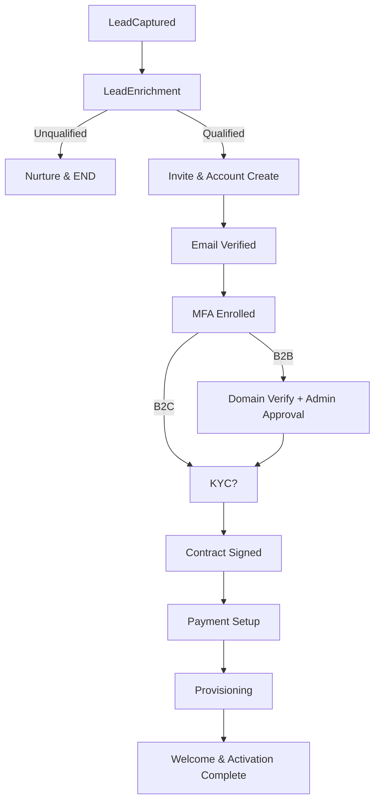

> **DEPRECATED**: This backlog has been superseded by [428-onboarding.md](./428-onboarding.md).
>
> The content below is retained for historical reference. All new work should follow backlog 428.

---

Below is a complete, implementation‑ready specification for a **Temporal** (temporal.io) workflows that takes a customer from **unqualified lead** to **fully registered and provisioned**. It's structured as a deterministic orchestration with activities, retries, signals, queries, timeouts, and compensations (Sagas).

---

## 0) Scope & assumptions

* Audience: platform/identity/payments/provisioning teams implementing activities; workflows engineers wiring orchestration.
* Covers B2C and B2B (with optional admin/domain verification).
* Integrations: CRM, email/SMS, IdP, fraud/KYC, payments, contract e‑sign, provisioning, notifications, analytics.
* Design principles: idempotency everywhere, deterministic workflows, side‑effects in activities, human‑in‑the‑loop via Signals.

### Carry-over from onboarding v3 backlog

We shipped telemetry support in v3 to provide end-to-end traceability of the onboarding journey. The frontend and platform services now stamp every onboarding run with `app.onboarding.id`, propagate it through Temporal, gRPC, Keycloak/DB activity spans, and surface it in Grafana/Tempo dashboards (`traceId()` queries, “Latest onboarding trace” panel, derived log fields). This TS4 spec assumes that foundation exists; no additional backlog work is required here other than keeping spans/attributes consistent with the activity catalog below.

---

## 1) High‑level state machine (business view)

```
LeadCaptured
 ├─▶ LeadEnrichment
 │     ├─▶ Unqualified → Nurture/Recycle → END
 │     └─▶ Qualified
 └─▶ Invite/RegistrationKickoff
        └─▶ PortalAccountCreated
              └─▶ EmailVerified
                     └─▶ MFAEnrolled
                            └─▶ (Optional) KYC/AML Passed
                                   └─▶ Contract/TOS Accepted
                                          └─▶ PaymentMethodSet (and initial charge/3DS if needed)
                                                 └─▶ ServiceProvisioned
                                                        └─▶ Welcome/ActivationComplete → END
```

**Lateral/branching paths**

* **B2B**: after EmailVerified → **DomainVerification** → **AdminApproval**.
* **Upsell/cross‑sell**: after ServiceProvisioned → optional **AddOnsProvisioned**.
* **Abandonment**: Reminder timers at key gates; expiry → **RecycleLead**.

---

## 2) Temporal model

### 2.1 Workflows (parents/children)

* **CustomerOnboardingWorkflow** *(parent)*
  Orchestrates the end‑to‑end journey.

* **Child workflows** (invoked where steps may be long‑running/independent):

  * `LeadLifecycleWorkflow`
  * `IdentityEnrollmentWorkflow` (account create + email verify)
  * `MFAEnrollmentWorkflow`
  * `KYCPipelineWorkflow`
  * `ContractWorkflow`
  * `PaymentSetupWorkflow`
  * `ProvisioningWorkflow`
  * `WelcomeAndActivationWorkflow` (notifications, analytics)

> Rationale: improved isolation/retries, cleaner compensation, and independent observability.

### 2.2 Activities (integration boundaries)

Each external call is an **Activity** with:

* **Inputs**: strongly typed DTOs + `idempotencyKey` (derived from `workflowsId` + domain key).
* **Timeouts & Retries**: see §5. Defaults below unless overridden.
* **Idempotency**: activities must be safe to retry; use provider idempotency keys if available.

**Core activity catalog **

| Activity                             | Purpose                                | Typical Timeout | Retry Policy (default)                                  |
| ------------------------------------ | -------------------------------------- | --------------: | ------------------------------------------------------- |
| `crm.upsertLead`                     | Create/update lead; attach UTM; dedupe |              5s | exp backoff start 1s, max 10 attempts, max interval 30s |
| `enrichment.enrichLead`              | Firmographic/email risk                |             10s | same                                                    |
| `email.sendTemplate`                 | Send invite/verify/reminder            |              5s | same; handle 4xx vs 5xx selectively                     |
| `identity.createAccount`             | Create IdP user (Auth0/Cognito/Custom) |             10s | same                                                    |
| `identity.generateEmailVerification` | Create token + email                   |              5s | same                                                    |
| `identity.markEmailVerified`         | Mark verified (idempotent)             |              5s | same                                                    |
| `mfa.startEnrollment`                | Start TOTP/SMS/WebAuthn enrollment     |             10s | same                                                    |
| `mfa.confirmEnrollment`              | Confirm factor                         |             10s | same                                                    |
| `kyc.submit`                         | Submit KYC                             |             10s | same                                                    |
| `kyc.pollStatus`                     | Poll or webhook handshake              |              5s | 30s interval, 60 attempts (30 min)                      |
| `contract.sendForSignature`          | E‑sign                                 |              5s | same                                                    |
| `contract.pollStatus`                | Poll for signed                        |              5s | 60s interval, 240 attempts (4h)                         |
| `payments.attachMethod`              | Create/attach PM                       |             10s | same                                                    |
| `payments.initiateSetupIntent`       | SCA/3DS handshake                      |             10s | same                                                    |
| `payments.captureInitialCharge`      | Charge or preauth                      |             10s | same                                                    |
| `provisioning.requestResources`      | Provision core service                 |            30s+ | exp backoff start 2s, max 12 attempts                   |
| `provisioning.pollReady`             | Wait until ready                       |              5s | 30s interval, 240 attempts (2h)                         |
| `notifications.send`                 | SMS/email/in‑app                       |              5s | same                                                    |
| `analytics.track`                    | Instrumentation                        |              3s | best‑effort; few attempts                               |

---

## 3) Signals & Queries

**Signals (external events / user actions)**

* `Signal: EmailVerified(emailVerificationToken)` (also support activity‑based verification)
* `Signal: MFAEnrollmentCompleted(factorType, meta)`
* `Signal: KYCUpdated(status, reason)`
* `Signal: ContractSigned(documentId)`
* `Signal: PaymentMethodAttached(methodId)`
* `Signal: SetupIntentResult(status, nextAction?)`
* `Signal: ProvisioningEvent(state, payload)` (webhook bridge)
* `Signal: UserAborted(reason)` / `Signal: AdminApproved()` / `Signal: AdminRejected(reason)`
* `Signal: ResendEmail(kind)` (human support trigger)
* `Signal: ChangePlan(newPlanId)` (pre‑provisioning)

**Queries (introspection)**

* `Query: CurrentStage() -> enum`
* `Query: Timeline() -> list<Event>` (for support/debug)
* `Query: IsComplete() -> bool`
* `Query: CustomerSummary() -> DTO`

---

## 4) Search attributes (for visibility/routing)

Set at start and update as you learn more:

* `LeadId`, `Email`, `CustomerId`, `AccountType (B2C/B2B)`, `CompanyDomain`,
  `PlanId`, `Region`, `KYCStatus`, `PaymentStatus`, `ProvisioningStatus`,
  `LifecycleStage` (mirrors high‑level state), `Locale`, `Channel (utm_source)`.

Enables Temporal Web search (“show me all onboarding stuck in KYC > 30m”, etc.).

---

## 5) Timeouts, retries, and backoffs (defaults)

**ActivityOptions (defaults; override as needed):**

* `ScheduleToCloseTimeout`: 1m (provisioning up to 5m+)
* `StartToCloseTimeout`: same as above
* `RetryPolicy`: `{ initialInterval: 1s, backoffCoefficient: 2.0, maximumInterval: 30s, maximumAttempts: 10, nonRetryableErrorTypes: ['ValidationError','HardBounce','Unrecoverable'] }`

**Workflow timers (human steps / waiting for signals):**

* Email verification wait: 48h (reminders at 1h, 24h)
* MFA enrollment wait: 24h (reminder at 1h)
* KYC decision window: up to 24h with polling or webhook‑signal bridge
* Contract signature SLA: 7 days (reminders at 24h, 72h)
* Payment SCA window: 15m (per PSD2 typical flow)
* Provisioning readiness: up to 2h (progressively increasing polling intervals)
* Abandonment expiry: 14 days → recycle lead

---

## 6) Compensation (Saga) & failure policy

For any partial success, register compensations:

* If provisioning succeeds but payment capture ultimately fails → **de‑provision** (grace period optional).
* If KYC fails after account creation → **disable account** and purge PII per policy.
* If contract unsigned after expiry → **cancel account & notify**.
* If user aborts during setup → roll back any resource reservations.

> Compensations run in reverse order of successful steps; keep them idempotent.

---

## 7) Detailed orchestration (parent workflows pseudocode)

> **Language:** Temporal TypeScript pseudocode; adapt to Java/Go/.NET as needed.

```ts
// CustomerOnboardingWorkflow.ts
import { proxyActivities, sleep, condition, ChildWorkflowHandle, startChild } from '@temporalio/workflows';
import * as types from './types';

const {
  upsertLead, enrichLead, sendTemplate, createAccount,
  generateEmailVerification, markEmailVerified, startEnrollment, confirmEnrollment,
  submitKyc, pollKycStatus, sendForSignature, pollContract,
  attachMethod, initiateSetupIntent, captureInitialCharge,
  requestResources, pollReady, notify, track
} = proxyActivities<types.Activities>({
  startToCloseTimeout: '1 minute',
  retry: { initialInterval: '1s', backoffCoefficient: 2, maximumAttempts: 10, maximumInterval: '30s',
           nonRetryableErrorTypes: ['ValidationError','HardBounce','Unrecoverable'] }
});

export interface OnboardingInput {
  leadId?: string;
  email: string;
  locale: string;
  planId: string;
  accountType: 'B2C'|'B2B';
  companyDomain?: string;
  region: string;
  utm?: Record<string,string>;
}

export async function CustomerOnboardingWorkflow(input: OnboardingInput): Promise<types.Result> {
  // 1) Lead capture & enrichment
  const lead = await upsertLead({ ...input, idempotencyKey: workflowsInfo().workflowsId });
  const enrich = await enrichLead({ leadId: lead.id });
  if (!enrich.qualified) {
    await sendTemplate({ to: input.email, template: 'nurture_unqualified', locale: input.locale });
    return { status: 'UNQUALIFIED', leadId: lead.id };
  }

  // 2) Identity & email verification (child workflows encapsulates reminders & signals)
  const identityHandle: ChildWorkflowHandle<types.IdentityResult> =
     await startChild('IdentityEnrollmentWorkflow', { args: [ { email: input.email, locale: input.locale } ] });
  const identityRes = await identityHandle.result(); // waits for EmailVerified + account created
  // MFA
  const mfaHandle = await startChild('MFAEnrollmentWorkflow', { args: [ { userId: identityRes.userId } ] });
  await mfaHandle.result();

  // 3) B2B gates (optional)
  if (input.accountType === 'B2B') {
    const domainVerified = await startChild('DomainVerificationWorkflow', { args: [ { domain: input.companyDomain! } ] }).result();
    if (!domainVerified.ok) throw new Error('Unrecoverable: DomainVerificationFailed');
    const adminApproved = await startChild('AdminApprovalWorkflow', { args: [ { userId: identityRes.userId } ] }).result();
    if (!adminApproved.ok) throw new Error('Unrecoverable: AdminRejected');
  }

  // 4) KYC (optional toggle per region/plan)
  const kyc = await startChild('KYCPipelineWorkflow', { args: [ { userId: identityRes.userId, region: input.region } ] }).result();
  if (kyc.status === 'FAILED') throw new Error('Unrecoverable: KYCFailed');

  // 5) Contract & payment setup in parallel (join when both done)
  const contractWf = startChild('ContractWorkflow', { args: [ { userId: identityRes.userId, planId: input.planId } ] });
  const paymentWf  = startChild('PaymentSetupWorkflow', { args: [ { userId: identityRes.userId, planId: input.planId } ] });

  const [contract, payment] = await Promise.all([contractWf.result(), paymentWf.result()]);
  if (!contract.signed) throw new Error('Unrecoverable: ContractExpired');
  if (payment.status !== 'READY') throw new Error('PaymentSetupFailed');

  // 6) Provisioning (with Saga compensation)
  let provisioned: types.ProvisioningResult | undefined;
  try {
    provisioned = await startChild('ProvisioningWorkflow', { args: [ { userId: identityRes.userId, planId: input.planId, region: input.region } ] }).result();
  } catch (e) {
    // compensation: cancel PM, disable account, etc. Or start deprovision child safely if partial success.
    await startChild('DeprovisioningWorkflow', { args: [ { userId: identityRes.userId } ] }).result().catch(() => {});
    throw e;
  }

  // 7) Welcome & activation
  await startChild('WelcomeAndActivationWorkflow', { args: [ { userId: identityRes.userId, locale: input.locale } ] }).result();
  await track({ event: 'onboarding_completed', userId: identityRes.userId, planId: input.planId });

  return { status: 'COMPLETED', userId: identityRes.userId, resources: provisioned.resources };
}
```

> All external effects are proxied activities. Child workflows encapsulate their own wait/notify logic and reminders.

---

## 8) Child workflows (patterns & critical details)

### 8.1 IdentityEnrollmentWorkflow

* **Steps**

  1. `identity.createAccount(email)` → returns `userId` (idempotent on email).
  2. `identity.generateEmailVerification(userId)` → send verify mail via `email.sendTemplate`.
  3. Wait for **EmailVerified** either via:

     * Workflow wait on `Signal: EmailVerified(token)` (emitted by a webhook bridge), optionally with a timer-driven poll loop if webhooks are unavailable, or
     * Direct activity `identity.markEmailVerified(token)`.
  4. Reminder timers at 1h and 24h. Expire at 48h → signal parent (timeout).
* **Signals**: `EmailVerified(token)`, `ResendEmail('verification')`, `UserAborted`.
* **Query**: `Status` (PENDING/VERIFIED/EXPIRED).
* **Timeouts/Retry**: email send & account creation use default policy.

### 8.2 MFAEnrollmentWorkflow

* **Steps**: `mfa.startEnrollment` → wait for `MFAEnrollmentCompleted` signal (user scans QR/approves push) → `mfa.confirmEnrollment`.
* **Timers**: reminder at 1h, expiry at 24h → abort or allow “skip” if policy allows.
* **Signals**: `MFAEnrollmentCompleted(factorType, meta)`.

### 8.3 KYCPipelineWorkflow

* **Steps**: `kyc.submit(userId, docs)` → loop:

  * `kyc.pollStatus` every 30s until `APPROVED/FAILED/REVIEW`.
  * On `REVIEW` continue polling (cap 24h) or await `Signal: KYCUpdated`.
* **Outcome**: `APPROVED` (ok), `FAILED` (unrecoverable), `EXPIRED` (ask user to resubmit).

### 8.4 ContractWorkflow

* **Steps**: `contract.sendForSignature(userId, plan)` → wait:

  * Poll every 60s or receive `Signal: ContractSigned(documentId)`.
  * Reminders at 24h, 72h; expiry at 7d → return `signed = false`.

### 8.5 PaymentSetupWorkflow

* **Steps**:

  1. `payments.attachMethod` (PM attached to customer) – idempotent by payment provider key.
  2. If SCA required: `payments.initiateSetupIntent` → **wait for Signal:** `SetupIntentResult`.
  3. Optional initial charge/preauth: `payments.captureInitialCharge`.
* **Compensation**: on failure after capture → `payments.refund` (activity).
* **Non-retryable**: card declined with terminal reason.

### 8.6 ProvisioningWorkflow

* **Steps**: `provisioning.requestResources(userId, plan, region)` → loop:

  * `provisioning.pollReady(resourceId)` until `READY/FAILED/TIMEOUT`.
  * When the plan requires a dedicated Keycloak realm (default for self-serve tenants), invoke `identity.createTenantRealm` which now **must**:
    - assign the `realm-management/realm-admin` role to the `platform-app-master` service account inside the newly created realm using the Vault-backed master admin credentials (per backlog/362).
    - immediately invalidate and refresh the admin token cache so the follow-up `configureRealmClient`/`provisionRealmAdmin` calls run with a token that carries the realm-scoped permissions. Skipping this step regresses into the 403s seen in v3.
  * Persist per-tenant secrets (client secret, admin bootstrap) via the existing ExternalSecret/Vault contract—never inline values in workflows code.
* **Signals**: optional `ProvisioningEvent` to short‑circuit polling on webhook.
* **Compensation**: `provisioning.deprovision(resourceId)` if later steps fail.

### 8.7 WelcomeAndActivationWorkflow

* **Steps**: `notifications.send('welcome')`, `notifications.send('getting_started')`; `analytics.track('activation')`.
* **Non-blocking**: treat analytics as best‑effort (retries capped).

---

## 9) Error classes & retry/skip rules

* **Retryable (transient)**: network/timeouts/5xx, rate limits; apply exponential backoff.
* **Non‑retryable (terminal)**: validation errors, 4xx hard bounce, KYC failed, admin rejected, contract expired unsigned after SLA, user aborted.
* **Bulk‑head/Rate‑limit**: configure Activity task queues per integration (e.g., `payments-tq`, `idp-tq`) with concurrency limits.

---

## 10) Idempotency & deduplication

* **Workflow IDs**: use deterministic `onboarding-{email-or-userId}` to dedupe concurrent starts.
* **Activity idempotency**: include `idempotencyKey` (workflowsId + logical action); map to provider’s idempotency feature.
* **Reentrancy**: queries & signals allow support to resume stalled workflows without restarting.

---

## 11) Security & compliance

* Encrypt payloads at rest (Temporal supports data converter / encryption codec).
* Avoid PII in logs; use opaque IDs in search attributes where possible.
* Data retention policies: purge on KYC failure or user request (GDPR).
* Mask secrets; keep tokens ephemeral and scoped.

---

## 12) Observability & runbook

* Emit metrics: time-in-stage histograms, success/failure counters, retries.
* Add **search attributes** to mark SLA breaches (`SlaBreached=true`).
* Runbook: common failure codes → recommended support actions (e.g., resend email signal, reset MFA, manual KYC review signal).

---

## 13) ASCII flow (activity-level)

```
[LeadCaptured] 
  -> crm.upsertLead -> enrichment.enrichLead
     -> if !qualified: email.send(nurture) -> END
     -> email.send(invite)

[Identity]
  -> identity.createAccount -> identity.generateEmailVerification
  -> wait EmailVerified (signal/timer reminders)
  -> MFA: mfa.startEnrollment -> wait MFAEnrollmentCompleted -> mfa.confirmEnrollment

[B2B?]
  -> DomainVerificationWorkflow -> AdminApprovalWorkflow

[KYC?]
  -> kyc.submit -> poll/Signal until APPROVED

[Contract & Payment in parallel]
  -> contract.sendForSignature -> wait/poll signed
  || payments.attachMethod -> (maybe) initiateSetupIntent -> Signal SetupIntentResult
     -> captureInitialCharge

[Provisioning]
  -> provisioning.requestResources -> pollReady/Signal

[Activation]
  -> notifications.send(welcome) -> END
```

---

## 14) Example activity interface (TypeScript)

```ts
export interface Activities {
  upsertLead(i: UpsertLeadInput): Promise<Lead>;
  enrichLead(i: { leadId: string }): Promise<{ qualified: boolean; score: number }>;
  sendTemplate(i: { to: string; template: string; locale: string; params?: any }): Promise<void>;
  createAccount(i: { email: string }): Promise<{ userId: string }>;
  generateEmailVerification(i: { userId: string }): Promise<{ token: string }>;
  markEmailVerified(i: { token: string }): Promise<void>;
  startEnrollment(i: { userId: string, factor: 'TOTP'|'SMS'|'WebAuthn' }): Promise<{ enrollmentId: string }>;
  confirmEnrollment(i: { enrollmentId: string, code?: string }): Promise<void>;
  submitKyc(i: { userId: string, region: string }): Promise<{ kycId: string }>;
  pollKycStatus(i: { kycId: string }): Promise<{ status: 'APPROVED'|'FAILED'|'REVIEW' }>;
  sendForSignature(i: { userId: string, planId: string }): Promise<{ envelopeId: string }>;
  pollContract(i: { envelopeId: string }): Promise<{ signed: boolean }>;
  attachMethod(i: { userId: string, pmToken: string }): Promise<{ pmId: string }>;
  initiateSetupIntent(i: { userId: string, pmId: string }): Promise<{ clientSecret: string }>;
  captureInitialCharge(i: { userId: string, amount: number, currency: string }): Promise<{ chargeId: string }>;
  requestResources(i: { userId: string, planId: string, region: string }): Promise<{ resourceId: string }>;
  pollReady(i: { resourceId: string }): Promise<{ state: 'READY'|'FAILED' }>;
  notify(i: { channel: 'email'|'sms'|'inapp', to: string, template: string }): Promise<void>;
  track(i: { event: string; userId: string; properties?: any }): Promise<void>;
}
```

---

## 15) Operational policies (what to configure in code)

* **ActivityOptions overrides** (per activity where appropriate):

  * `provisioning.requestResources`: `StartToCloseTimeout: 5m`, `maximumAttempts: 12`.
  * `kyc.pollStatus`: interval 30s, attempts 60 (30m).
  * `contract.pollStatus`: interval 60s, attempts 240 (4h).
  * `notifications.send`: `maximumAttempts: 5` (avoid spam bursts).

* **Task queues**

  * `onboarding-tq` (workflows)
  * `crm-tq`, `email-tq`, `idp-tq`, `kyc-tq`, `payments-tq`, `provisioning-tq`, `notify-tq`.
  * Concurrency limits per queue to respect partner SLAs.

* **Workflow versioning**

  * Use `patch`/`deprecatePatch` (TS/Java) when modifying control flow; never break determinism.

---

## 16) Edge cases & branches to implement

* **Duplicate email**: if an account exists, short‑circuit to login/forgot password. Still mark lead as “converted”.
* **Email hard bounce**: mark lead unreachable, switch to SMS if phone present, stop retrying email sends.
* **Social login**: Identity step becomes “federated”; still require email verified depending on IdP claims.
* **Phone‑only verification**: swap email verification for OTP SMS activities (same timers/signals).
* **Card SCA failed**: allow user to retry within 15 minutes window; after expiry, mark payment as incomplete and pause.
* **Provisioning partial success**: e.g., DB ready but API gateway failed → continue polling; on timeout run Deprovisioning compensation.
* **Admin rejected (B2B)**: close workflows with terminal state; send rationale to sales via CRM.

---

## 17) Test plan (happy & unhappy paths)

1. **Happy path B2C**: qualified → email verify within 5 min → TOTP enrolled → KYC n/a → contract signed in 10 min → card attached + charge ok → provision in 3 min → welcome.
2. **Abandon email**: no verification → reminders sent → expire at 48h → lead recycled.
3. **MFA stalled**: not completed in 24h → expire; user can re‑enter workflows (same WorkflowId) and resume.
4. **KYC review to approved**: simulate `REVIEW` for 30 min then `APPROVED` via signal.
5. **SCA required then failed**: ensure retries and cancellation clean up.
6. **Provisioning fail then compensation**: request ok, `pollReady` → `FAILED` → deprovision invoked.
7. **B2B domain verification**: domain verified then admin rejects → terminal state with notifications.

---

## 18) Deliverables to implement

* [ ] Activity implementations per integration with idempotency keys.
* [ ] Child workflows as listed with their timers/signals.
* [ ] Parent orchestration and Sagas.
* [ ] Search attributes and application‑level indexes.
* [ ] Runtime config for ActivityOptions & task queues.
* [ ] Observability dashboards & alerting thresholds.
* [ ] Runbooks for support (signal names and how to trigger them).

---

## 19) Minimal mermaid diagram (optional)



---

### Ready‑to‑code notes

* Keep **all** network I/O in activities; workflows only manage state, timers, and await signals.
* Use **deterministic time** (`workflows.now`/`Workflow.currentTimeMillis`) and `sleep` for reminders.
* Attach **SLA timers** at each human step and send reminder emails via activities.
* Store **audit events** (via `analytics.track`) at state transitions for compliance.

---

If you’d like, I can turn this into a **starter graph layout** (TypeScript or Java) with stubs for each activity and workflows, plus a local dev harness and sample unit tests.
