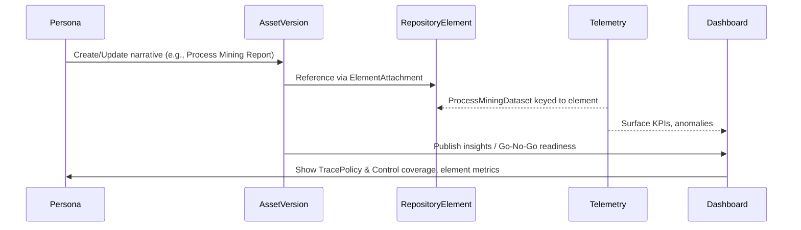

# Combined Backlog (2xx Series)

Generated on: 2025-12-05 15:47:49 UTC

---

## 211-repository-architecture.md

Title: Configurable Architecture Repository (TOGAF ADM) — Design & Plan

Status: Draft

Goals

- Multi-tenant, multi-graph organization of all architecture artifacts (BPMN, ArchiMate, UML, DMN, documents, etc.)
- UI organized as a TOGAF ADM-style graph, but fully configurable by end users
- Flexible hierarchy with both concrete folders and smart (virtual) folders
- Strong linking to existing artifacts.v1 Aggregate/ArtifactView and cross-references

Key Decisions

- Domain modeled as a distinct Repository bounded context with its own protos and services
- Store tree as materialized path (ltree-compatible string) for efficient queries; parent_id maintained for adjacency
- Assignments link graph nodes to artifacts; one artifact can appear in multiple nodes
- Configurable node types and constraints (allowed children, allowed artifact kinds)
- Smart folders are virtual nodes with a filter expression over ArtifactView (server-evaluated)

Protobufs

- Files: `packages/ameide_core_proto/src/ameide_core_proto/graph/v1/`
  - `graph.proto`: Repository, RepositoryConfig, NodeType, Node, Assignment, NodeDefinition, RepositoryStats
  - `graph_service.proto`: RepositoryAdminService, RepositoryTreeService, RepositoryAssignmentService, RepositoryQueryService
- Integration: keeps artifact identity (`artifact_id`, `artifact_type`) and uses existing `artifacts.v1` query APIs to fetch details when needed

DB Schema (PostgreSQL)

- Table: `repositories`
  - `id` (uuid/text pk), `tenant_id`, `key` (slug, unique per tenant), `name`, `description`, `template_id` (nullable), `attributes` (jsonb), `config` (jsonb), timestamps, `version`
  - Indexes: `(tenant_id,key) unique`, `(tenant_id,name)`
- Table: `graph_nodes`
  - `id`, `tenant_id`, `graph_id` fk, `parent_id` fk null, `type_key`, `name`, `slug`, `path` (ltree/text), `order` (int), `is_virtual` (bool), `filter_expression` (text), `attributes` (jsonb), timestamps, `version`
  - Indexes: `(graph_id,parent_id)`, `(graph_id,path)`, `(tenant_id,type_key)`
  - Consider `ltree` extension for path and a GIST index if available
- Table: `graph_assignments`
  - `id`, `tenant_id`, `graph_id` fk, `node_id` fk, `artifact_id`, `artifact_type`, `pinned_version` (int), `role` (text), `order` (int), `attributes` (jsonb), timestamps, `version`
  - Indexes: `(graph_id,node_id)`, `(artifact_id)`, `(tenant_id,artifact_type)`
- Optional: `graph_templates` (id, tenant_id nullable, name, description, definition jsonb, is_default)

Multi-Tenancy

- All tables include `tenant_id` and enforce tenant filters in repositories
- Unique constraints scoped by tenant for keys
- `TenantRepository` helper can be reused for isolation

Hierarchy & Configurability

- Node types define constraints and UI hints (e.g., icon, color)
- Default template seeds a tree (ADM Cycles, Phases, Architecture Landscape, Standards, Reference Library, Governance, Requirements, Solutions)
- End users can add/move/rename nodes when `allow_custom_nodes` is enabled
- Smart folders evaluate server-side queries (initially parameterized filters; later CEL)

UI Integration (services/www_ameide_platform)

- Replace current mock graph with backend calls:
  - `RepositoryQueryService.GetTree` to build the left tree
  - `RepositoryAssignmentService.ListNodeAssignments` to list contents
  - Use `ArtifactQueryService` for details (name, tags, status) or denormalize minimal fields in assignment
- Support drag-and-drop to `AssignArtifact` / `UnassignArtifact`
- Provide views by ADM phases, by cycles, and by type as predefined nodes

Phased Implementation Plan

1) Protos & Docs (this change)
   - Add graph domain protos and design doc

2) Storage Layer
   - SQLAlchemy models + repositories for `repositories`, `graph_nodes`, `graph_assignments`
   - Alembic migration: tables + ltree extension (if used)

3) Minimal Service
   - New service `services/core_graph` (Python gRPC) implementing Admin/Tree/Assignment APIs
   - Integrate auth/tenant from `RequestContext`

4) Frontend Wiring
   - Replace `mock-graph` with SDK client calls
   - Tree, list, grid, search; DnD assignments; badges by type/status

5) Smart Folders & Policies
   - Add virtual folders with simple filter configuration (server-side evaluation)
   - Add per-node RBAC inheritance (optional)

6) Advanced: Templates & Imports
   - Tenant-defined templates; bulk seed; export/import templates as JSON

Runtime Notes

- Consistency: optimistic versioning on entities; simple `MoveNode` recalculates `path` for subtree in a transaction
- Performance: index `path` for subtree reads, paginate assignments; cache stats in Redis (existing infra)
- Backfill: migration script to seed a default ADM graph for each tenant (optional)

Open Questions

- Expression language for smart folders (CEL vs. simple filter DSL) — start with filter map in proto, evolve later
- Denormalization scope in `Assignment` to minimize cross-service calls for ArtifactView fields
- Whether to expose a consolidated `RepositoryBrowser` query that returns nodes + minimal artifact views in one request

---

## 212-progressive-quality-gate-strategy.md

# 212: Progressive Quality Gate Strategy

**Status:** Draft
**Priority:** High
**Effort:** 3-4 days
**Impact:** Developer Experience, CI/CD Performance

## Problem Statement

The current quality gate strategy has several performance and usability issues:

1. **No local validation**: Developers discover issues only after pushing to CI
2. **Sequential CI execution**: All checks run in a single job (~10-15 minutes)
3. **Redundant verification**: Quality checks duplicated across workflows
4. **No test tier strategy**: All 1,506 Python tests + full JS suite run on every push
5. **Slow feedback loop**: PRs wait 10-15 minutes for basic lint/type errors

**Current State:**
- Single workflows: [`.github/workflows/ci-core-quality.yml`](../.github/workflows/ci-core-quality.yml)
- Runs on all `push` and `pull_request` events
- Sequential execution: setup → lint → typecheck → tests
- No pre-commit or pre-push validation
- Same checks run for feature branches and main branch

## Goals

1. **Fast local feedback**: Catch formatting/lint errors before commit (< 10s)
2. **Pre-push validation**: Run unit tests before pushing (< 60s)
3. **Rapid PR feedback**: Parallel CI checks complete in 3-5 minutes
4. **Comprehensive main validation**: Full test suite + E2E on merge (8-12 minutes)
5. **No wasted CI time**: Skip irrelevant jobs based on changed files

## Proposed Solution: 5-Tier Quality Gate

### Tier 1: Pre-commit Hook (< 10 seconds)
**Goal:** Auto-fix formatting, catch obvious errors
**Trigger:** `git commit`
**Tools:** `pre-commit` framework

**Checks:**
- ✅ Ruff format (Python) - auto-fix
- ✅ Prettier (JS/TS/JSON/YAML) - auto-fix
- ✅ Trailing whitespace, EOF newlines
- ✅ Ruff check on staged Python files only
- ✅ ESLint on staged JS/TS files only
- ❌ No type checking, no tests, no builds

**Implementation:**
```yaml
# .pre-commit-config.yaml
repos:
  - repo: https://github.com/astral-sh/ruff-pre-commit
    rev: v0.8.9
    hooks:
      - id: ruff-format
      - id: ruff
        args: [--fix, --exit-non-zero-on-fix]

  - repo: https://github.com/pre-commit/mirrors-prettier
    rev: v4.0.0-alpha.8
    hooks:
      - id: prettier
        types_or: [javascript, jsx, ts, tsx, json, yaml, markdown]

  - repo: https://github.com/pre-commit/pre-commit-hooks
    rev: v4.5.0
    hooks:
      - id: trailing-whitespace
      - id: end-of-file-fixer
      - id: check-yaml
      - id: check-json

  - repo: local
    hooks:
      - id: eslint
        name: eslint (pnpm exec)
        entry: pnpm exec eslint
        language: system
        types_or: [javascript, jsx, ts, tsx]
        args: [--max-warnings=0, --cache]
      - id: pre-push-quality-gate
        name: pre-push quality gate
        entry: scripts/git-hooks/pre-push
        language: script
        stages: [pre-push]
```

**Benefits:**
- Eliminates "fix formatting" commits
- Immediate feedback (< 10s)
- Reduces CI failures from lint errors

---

### Tier 2: Pre-push Hook (< 60 seconds)
**Goal:** Validate code quality before pushing to remote
**Trigger:** `git push`
**Tools:** Version-controlled pre-push hook (installed via `pre-commit`'s `pre-push` stage)

**Checks:**
- ✅ Type checking on affected files:
  - `mypy` on changed Python packages
  - `tsc --noEmit` on changed TS packages
- ✅ Unit tests for affected code:
  - `pytest` targeted to src/tests touched in the branch (fast fail, max 3 errors)
  - `jest --findRelatedTests --bail` on changed JS/TS files
- ❌ No integration tests, no E2E, no builds

**Implementation:**
```bash
#!/usr/bin/env bash
# scripts/git-hooks/pre-push
set -euo pipefail

echo "Running pre-push checks..."

DEFAULT_BRANCH="${DEFAULT_BRANCH:-main}"
UPSTREAM_REF="$(git rev-parse --abbrev-ref --symbolic-full-name @{upstream} 2>/dev/null || true)"

if [[ -n "$UPSTREAM_REF" ]]; then
  BASE_COMMIT="$(git merge-base HEAD "$UPSTREAM_REF")"
else
  echo "Fetching origin/${DEFAULT_BRANCH} to establish diff base..."
  git fetch --quiet origin "${DEFAULT_BRANCH}"
  BASE_COMMIT="$(git merge-base HEAD "origin/${DEFAULT_BRANCH}")"
fi

CHANGED_FILES="$(git diff --name-only "${BASE_COMMIT}" HEAD)"

if [[ -z "${CHANGED_FILES}" ]]; then
  echo "No relevant changes detected; skipping pre-push checks."
  exit 0
fi

mapfile -t PY_FILES < <(printf '%s\n' "${CHANGED_FILES}" | grep -E '\.py$' || true)
mapfile -t TS_FILES < <(printf '%s\n' "${CHANGED_FILES}" | grep -E '\.(ts|tsx)$' || true)
mapfile -t JS_FILES < <(printf '%s\n' "${CHANGED_FILES}" | grep -E '\.(js|jsx|ts|tsx)$' || true)

if (( ${#PY_FILES[@]} )); then
  echo "Type checking Python (targeted modules)..."
  mapfile -t PY_TARGETS < <(python - <<'PY'
import sys
from pathlib import Path
targets = {str(Path(path).parent) for path in sys.argv[1:] if path.endswith(".py")}
print("\n".join(sorted(targets)))
PY
    "${PY_FILES[@]}")
  if (( ${#PY_TARGETS[@]} )); then
    uvx mypy --config-file mypy.ini "${PY_TARGETS[@]}"
  fi

  echo "Running Python unit tests (changed scope)..."
  mapfile -t PY_TEST_TARGETS < <(python - <<'PY'
import sys
from pathlib import Path
def candidate(raw: str) -> str | None:
    path = Path(raw)
    if "tests" in path.parts:
        return str(path)
    guess = path.parent / "tests"
    return str(guess) if guess.exists() else None
targets: list[str] = []
seen: set[str] = set()
for raw in sys.argv[1:]:
    value = candidate(raw)
    if value and value not in seen:
        targets.append(value)
        seen.add(value)
if not targets:
    print("tests/unit")
else:
    print("\n".join(targets))
PY
    "${PY_FILES[@]}")
  uv run pytest --maxfail=3 -q "${PY_TEST_TARGETS[@]}"
fi

if (( ${#TS_FILES[@]} )); then
  echo "Type checking TypeScript..."
  pnpm exec tsc --noEmit --incremental --pretty false
fi

if (( ${#JS_FILES[@]} )); then
  echo "Running JS unit tests (related tests)..."
  pnpm exec jest --ci --bail --findRelatedTests --passWithNoTests "${JS_FILES[@]}"
fi
```

The hook is tracked in `scripts/git-hooks/pre-push` and executed through `pre-commit`'s managed `pre-push` stage, so onboarding simply requires `pre-commit install --hook-type pre-push`. The lightweight Python helper prefers nearby `tests/` directories and falls back to a shared smoke target, keeping the runtime tight while still exercising the code that changed.

**Benefits:**
- Prevents pushing broken code
- Fast feedback (30-60s typical)
- Reduces CI load from obvious failures

---

### Tier 3: PR Quality Gate (3-5 minutes)
**Goal:** Comprehensive validation with parallel execution
**Trigger:** `pull_request` events
**Workflow:** `.github/workflows/pr-quality-gate.yml`

**Job Topology (change filter + up to 6 parallel jobs):**

```yaml
jobs:
  determine-changes:
    runs-on: ubuntu-latest
    outputs:
      python: ${{ steps.filter.outputs.python }}
      javascript: ${{ steps.filter.outputs.javascript }}
      typescript: ${{ steps.filter.outputs.typescript }}
    steps:
      - uses: actions/checkout@v5
        with:
          fetch-depth: 0
      - uses: dorny/paths-filter@v3
        id: filter
        with:
          filters: |
            python:
              - 'packages/**/*.py'
              - 'services/**/*.py'
              - 'pyproject.toml'
              - 'mypy.ini'
              - '.ruff.toml'
            javascript:
              - '**/*.js'
              - '**/*.jsx'
              - 'package.json'
            typescript:
              - '**/*.ts'
              - '**/*.tsx'
              - 'package.json'

  lint-python:
    needs: determine-changes
    runs-on: ubuntu-latest
    steps:
      - name: Skip (no Python changes)
        if: needs.determine-changes.outputs.python != 'true'
        run: echo "No Python changes detected; skipping lint."
      - uses: actions/checkout@v5
        if: needs.determine-changes.outputs.python == 'true'
      - uses: astral-sh/setup-uv@v7
        if: needs.determine-changes.outputs.python == 'true'
        with:
          enable-cache: true
      - run: uvx ruff check .
        if: needs.determine-changes.outputs.python == 'true'
    # Duration: ~35s when enabled

  lint-js:
    needs: determine-changes
    runs-on: ubuntu-latest
    steps:
      - name: Skip (no JS/TS changes)
        if: >
          needs.determine-changes.outputs.javascript != 'true' &&
          needs.determine-changes.outputs.typescript != 'true'
        run: echo "No JS/TS changes detected; skipping lint."
      - uses: actions/checkout@v5
        if: >
          needs.determine-changes.outputs.javascript == 'true' ||
          needs.determine-changes.outputs.typescript == 'true'
      - uses: pnpm/action-setup@v4
        if: >
          needs.determine-changes.outputs.javascript == 'true' ||
          needs.determine-changes.outputs.typescript == 'true'
      - uses: actions/setup-node@v5
        if: >
          needs.determine-changes.outputs.javascript == 'true' ||
          needs.determine-changes.outputs.typescript == 'true'
        with:
          node-version: 22
          cache: pnpm
      - run: pnpm install --no-frozen-lockfile
        if: >
          needs.determine-changes.outputs.javascript == 'true' ||
          needs.determine-changes.outputs.typescript == 'true'
      - run: pnpm exec eslint . --ext .js,.jsx,.ts,.tsx --max-warnings=0 --cache
        if: >
          needs.determine-changes.outputs.javascript == 'true' ||
          needs.determine-changes.outputs.typescript == 'true'
    # Duration: ~55s when enabled

  typecheck-python:
    needs: determine-changes
    runs-on: ubuntu-latest
    steps:
      - name: Skip (no Python changes)
        if: needs.determine-changes.outputs.python != 'true'
        run: echo "No Python changes detected; skipping mypy."
      - uses: actions/checkout@v5
        if: needs.determine-changes.outputs.python == 'true'
      - uses: astral-sh/setup-uv@v7
        if: needs.determine-changes.outputs.python == 'true'
      - run: uvx mypy --config-file mypy.ini packages
        if: needs.determine-changes.outputs.python == 'true'
    # Duration: ~2min when enabled

  typecheck-ts:
    needs: determine-changes
    runs-on: ubuntu-latest
    steps:
      - name: Skip (no TS changes)
        if: needs.determine-changes.outputs.typescript != 'true'
        run: echo "No TypeScript changes detected; skipping typecheck."
      - uses: actions/checkout@v5
        if: needs.determine-changes.outputs.typescript == 'true'
      - uses: pnpm/action-setup@v4
        if: needs.determine-changes.outputs.typescript == 'true'
      - uses: actions/setup-node@v5
        if: needs.determine-changes.outputs.typescript == 'true'
        with:
          node-version: 22
          cache: pnpm
      - run: pnpm install --no-frozen-lockfile
        if: needs.determine-changes.outputs.typescript == 'true'
      - run: pnpm -r --if-present run typecheck
        if: needs.determine-changes.outputs.typescript == 'true'
    # Duration: ~1-2min when enabled

  test-python:
    needs: determine-changes
    runs-on: ubuntu-latest-4-cores
    steps:
      - name: Skip (no Python changes)
        if: needs.determine-changes.outputs.python != 'true'
        run: echo "No Python changes detected; skipping package tests."
      - uses: actions/checkout@v5
        if: needs.determine-changes.outputs.python == 'true'
      - uses: astral-sh/setup-uv@v7
        if: needs.determine-changes.outputs.python == 'true'
        with:
          enable-cache: true
      - run: uv sync --group test
        if: needs.determine-changes.outputs.python == 'true'
      - run: |
          uv pip install pytest-xdist
          uv run pytest -n auto packages/ \
            --junit-xml=.test-results/pytest-packages.xml \
            --cov=./ --cov-report=xml:.coverage/coverage-python.xml
        if: needs.determine-changes.outputs.python == 'true'
      - uses: codecov/codecov-action@v5
        if: needs.determine-changes.outputs.python == 'true'
        with:
          files: .coverage/coverage-python.xml
    # Duration: ~3-4min (parallel execution) when enabled

  test-js:
    needs: determine-changes
    runs-on: ubuntu-latest-4-cores
    steps:
      - name: Skip (no JS/TS changes)
        if: >
          needs.determine-changes.outputs.javascript != 'true' &&
          needs.determine-changes.outputs.typescript != 'true'
        run: echo "No JS/TS changes detected; skipping tests."
      - uses: actions/checkout@v5
        if: >
          needs.determine-changes.outputs.javascript == 'true' ||
          needs.determine-changes.outputs.typescript == 'true'
      - uses: pnpm/action-setup@v4
        if: >
          needs.determine-changes.outputs.javascript == 'true' ||
          needs.determine-changes.outputs.typescript == 'true'
      - uses: actions/setup-node@v5
        if: >
          needs.determine-changes.outputs.javascript == 'true' ||
          needs.determine-changes.outputs.typescript == 'true'
        with:
          node-version: 22
          cache: pnpm
      - run: pnpm install --no-frozen-lockfile
        if: >
          needs.determine-changes.outputs.javascript == 'true' ||
          needs.determine-changes.outputs.typescript == 'true'
      - run: |
          pnpm --filter @ameide/core-proto run build
          pnpm --filter @ameideio/ameide-sdk-ts run build
        if: >
          needs.determine-changes.outputs.javascript == 'true' ||
          needs.determine-changes.outputs.typescript == 'true'
      # www_ameide_platform tests
      - run: |
          pnpm -C services/www_ameide_platform run test:unit -- \
            --ci --coverage --coverageReporters=lcov
          pnpm -C services/www_ameide_platform run test:integration -- \
            --ci --coverage=false
        if: >
          needs.determine-changes.outputs.javascript == 'true' ||
          needs.determine-changes.outputs.typescript == 'true'
      # ameide_sdk_ts tests
      - run: |
          pnpm -C packages/ameide_sdk_ts run test --ci --coverage
        if: >
          needs.determine-changes.outputs.javascript == 'true' ||
          needs.determine-changes.outputs.typescript == 'true'
      - uses: codecov/codecov-action@v5
        if: >
          needs.determine-changes.outputs.javascript == 'true' ||
          needs.determine-changes.outputs.typescript == 'true'
        with:
          files: |
            .coverage/www_ameide_platform/lcov.info
            .coverage/ameide_sdk_ts/lcov.info
    # Duration: ~2-3min when enabled
```

**Path Filters (optimize for changed files):**
```yaml
on:
  pull_request:
    paths:
      - '**.py'
      - '**.js'
      - '**.ts'
      - '**.tsx'
      - 'pyproject.toml'
      - 'package.json'

jobs:
  determine-changes:
    runs-on: ubuntu-latest
    outputs:
      python: ${{ steps.filter.outputs.python }}
      javascript: ${{ steps.filter.outputs.javascript }}
      typescript: ${{ steps.filter.outputs.typescript }}
    steps:
      - uses: actions/checkout@v5
        with:
          fetch-depth: 0
      - uses: dorny/paths-filter@v3
        id: filter
        with:
          filters: |
            python:
              - 'packages/**/*.py'
              - 'services/**/*.py'
              - 'pyproject.toml'
            javascript:
              - '**/*.js'
              - 'package.json'
            typescript:
              - '**/*.ts'
              - '**/*.tsx'
              - 'package.json'
```

Each job executes a cheap "skip" step when its language is untouched, so required checks still report `success` while the expensive steps short-circuit.

**What runs:**
- ✅ All linting (Python + JS)
- ✅ All type checking
- ✅ **Package tests only** (1,506 Python tests)
- ✅ Frontend unit + integration tests
- ✅ Coverage collection
- ❌ No service tests (14 files)
- ❌ No E2E tests
- ❌ No Docker builds

**Branch Protection:**
- Require the lint/typecheck/test jobs below to pass before merge
- No stale reviews
- Require linear history

**Benefits:**
- 60-70% faster than current (3-5min vs 10-15min)
- Parallel execution maximizes GitHub Actions resources
- Path filters skip irrelevant jobs
- Coverage still collected and uploaded

---

### Tier 4: Main Branch Gate (8-12 minutes)
**Goal:** Final comprehensive validation on merge to main
**Trigger:** `push` to `main` branch
**Workflow:** `.github/workflows/main-quality-gate.yml`

**Jobs:**
All Tier 3 jobs PLUS:

```yaml
jobs:
  test-python-services:
    runs-on: ubuntu-latest
    needs: [test-python]  # Run after package tests pass
    steps:
      - uses: actions/checkout@v5
      - uses: astral-sh/setup-uv@v7
        with:
          enable-cache: true
      - run: uv sync --all-packages
      - run: |
          uv run pytest services/ \
            --junit-xml=.test-results/pytest-services.xml
    # Duration: ~2-3min
    # Runs: 14 service test files

  test-e2e:
    runs-on: ubuntu-latest-4-cores
    needs: [test-js]
    steps:
      - uses: actions/checkout@v5
      - uses: pnpm/action-setup@v4
      - uses: actions/setup-node@v5
      - uses: actions/cache@v4
        with:
          path: ~/.cache/ms-playwright
          key: playwright-${{ runner.os }}-${{ hashFiles('**/package.json') }}
      - run: pnpm install --no-frozen-lockfile
      - run: pnpm -C services/www_ameide_platform exec playwright install --with-deps
      - run: |
          pnpm -C services/www_ameide_platform run test:e2e:auth
          pnpm -C services/www_ameide_platform run test:e2e:archimate
          pnpm -C services/www_ameide_platform run test:e2e:bpmn
          pnpm -C services/www_ameide_platform run test:e2e:threads
    # Duration: ~5-7min

  security-scan:
    runs-on: ubuntu-latest
    steps:
      - uses: actions/checkout@v5
      - uses: aquasecurity/trivy-action@0.33.1
        with:
          scan-type: 'fs'
          scan-ref: '.'
          format: 'sarif'
          output: 'trivy-results.sarif'
      - uses: github/codeql-action/upload-sarif@v4
        with:
          sarif_file: trivy-results.sarif
    # Duration: ~1-2min

  validate-docker-builds:
    runs-on: ubuntu-latest
    strategy:
      matrix:
        service: [
          www-ameide,
          www_ameide_platform,
          platform,
          graph,
          threads,
          agents,
          agents_runtime,
          inference,
          inference_gateway,
          workflows,
          workflows_runtime
        ]
    steps:
      - uses: actions/checkout@v5
      - uses: docker/setup-buildx-action@v3
      - uses: docker/build-push-action@v6
        with:
          context: .
          file: services/${{ matrix.service }}/Dockerfile
          push: false
          cache-from: type=gha
          cache-to: type=gha,mode=max
    # Duration: ~5-8min (parallel)
```

**What runs:**
- ✅ Everything from Tier 3
- ✅ Service-level integration tests
- ✅ End-to-end Playwright tests
- ✅ Security vulnerability scanning
- ✅ Docker build validation (no push)
- ❌ No image push to registry (separate workflows)

**Benefits:**
- High confidence before merge
- Catches integration issues
- Validates Docker builds work
- Security scanning on every main commit

---

### Tier 5: Release Pipeline (15-20 minutes)
**Goal:** Build, scan, and deploy production images
**Trigger:** Git tags (`v*`) or manual dispatch
**Workflow:** Existing `.github/workflows/cd-service-images.yml`

**Jobs:**
1. **verify** (subset of Tier 3 - quick validation)
2. **build** (matrix of 9 services)
   - Build Docker images
   - Push to ACR registry with SHA tags
   - Comprehensive Trivy scanning
   - Upload SARIF results

**Changes needed:**
- Remove redundant verification (rely on main branch gate)
- Add image signing with Cosign
- Update deployment manifests with new digests

**Benefits:**
- Fast path to production (verification already done)
- Immutable image tags (SHA256 digests)
- Security scanning results uploaded to GitHub Security

---

## Test Organization Summary

### Python Tests
```
Total: 1,506 test files in packages/ + 14 in services/

Distribution:
  - Pre-push: pytest targeted modules/directories (maxfail=3) from changed files
  - PR CI: pytest -n auto packages/ (1,506 files, parallel)
  - Main CI: pytest -n auto packages/ + pytest services/
  - Release: Quick smoke tests only
```

### JavaScript Tests
```
Total: 25+ test directories in www_ameide_platform

Distribution:
  - Pre-push: jest --findRelatedTests --bail
  - PR CI: Unit (with coverage) + Integration (no coverage)
  - Main CI: Full suite + E2E (auth, archimate, bpmn, threads)
  - Release: Smoke tests only
```

### Coverage Strategy
```
- Pre-commit: No coverage
- Pre-push: No coverage
- PR CI: Full coverage, uploaded to Codecov
- Main CI: Full coverage with threshold enforcement
- Release: No coverage (already validated)
```

---

## Performance Comparison

| Workflow | Current | Optimized | Speedup |
|----------|---------|-----------|---------|
| **Pre-commit** | N/A | 5-10s | ∞ (new) |
| **Pre-push** | N/A | 30-60s | ∞ (new) |
| **PR Checks** | 10-15min | 3-5min | **66% faster** |
| **Main Merge** | 10-15min | 8-12min | 20% faster |
| **Release** | 20-25min | 15-20min | 25% faster |

**Developer Impact:**
- Discover lint/format errors in < 10s (not 10min)
- PR feedback in 3-5min instead of 10-15min
- Reduced CI queue time from fewer failures
- Higher confidence with local validation

---

## Implementation Plan

### Phase 1: Pre-commit Setup (Day 1)
- [ ] Install pre-commit framework
- [ ] Create `.pre-commit-config.yaml`
- [ ] Test with sample commits
- [ ] Document in CLAUDE.md
- [ ] Add installation to onboarding guide

**Files to create:**
- `.pre-commit-config.yaml`
- `.git/hooks/pre-commit` (auto-generated)

**Testing:**
- Commit with formatting errors → auto-fixed
- Commit with lint errors → blocked with helpful message

---

### Phase 2: Pre-push Hook (Day 1)
- [ ] Create pre-push hook script under `scripts/git-hooks/pre-push`
- [ ] Wire hook into `pre-commit` with `stages: [pre-push]`
- [ ] Test with failing unit tests
- [ ] Document in CLAUDE.md

**Files to create:**
- `scripts/git-hooks/pre-push`
- `.pre-commit-config.yaml` entry for `pre-push` stage

**Testing:**
- Run `pre-commit install --hook-type pre-push`
- Push with failing tests → blocked
- Push with passing tests → allowed

---

### Phase 3: Split PR Workflow (Day 2)
- [ ] Create `.github/workflows/pr-quality-gate.yml`
- [ ] Implement parallel job matrix
- [ ] Add `determine-changes` job with `dorny/paths-filter` for optimization
- [ ] Test with sample PR

**Files to create:**
- `.github/workflows/pr-quality-gate.yml`

**Files to modify:**
- `.github/workflows/ci-core-quality.yml` → rename to `main-quality-gate.yml`

**Testing:**
- Create PR with Python changes → JS jobs skip
- Create PR with JS changes → Python jobs skip
- Verify parallel execution in Actions UI

---

### Phase 4: Optimize Test Execution (Day 2)
- [ ] Add `pytest-xdist` to dev dependencies
- [ ] Update pytest commands to use `-n auto`
- [ ] Configure jest for optimal CI performance
- [ ] Verify coverage still collected correctly

**Files to modify:**
- `pyproject.toml` - add pytest-xdist
- `.github/workflows/pr-quality-gate.yml` - update pytest commands
- `.github/workflows/main-quality-gate.yml` - update pytest commands

**Testing:**
- Run pytest locally with `-n auto`
- Verify coverage reports complete
- Check test duration improvement

---

### Phase 5: Main Branch Workflow (Day 3)
- [ ] Update `main-quality-gate.yml` with additional jobs
- [ ] Add service tests job
- [ ] Add E2E tests job
- [ ] Add security scanning job
- [ ] Add Docker build validation

**Files to modify:**
- `.github/workflows/main-quality-gate.yml`

**Testing:**
- Push to main → full suite runs
- Verify E2E tests execute
- Check Docker builds succeed

---

### Phase 6: Branch Protection (Day 3)
- [ ] Configure GitHub branch protection for `main`
- [ ] Require PR reviews
- [ ] Require status checks to pass
- [ ] Require linear history
- [ ] Document protection rules

**GitHub Settings:**
```yaml
Protection rules for main:
  - Require pull request reviews: 1
  - Require status checks:
    - lint-python
    - lint-js
    - typecheck-python
    - typecheck-ts
    - test-python
    - test-js
  - Require branches to be up to date
  - Require linear history
  - Do not allow bypassing
```

---

### Phase 7: Documentation & Training (Day 4)
- [ ] Update CLAUDE.md with new workflows
- [ ] Create CONTRIBUTING.md
- [ ] Document pre-commit setup
- [ ] Add troubleshooting guide
- [ ] Team training session

**Files to create/update:**
- `CONTRIBUTING.md`
- `CLAUDE.md` (Development Workflow section)
- `.github/PULL_REQUEST_TEMPLATE.md`

---

## Rollout Strategy

### Week 1: Soft Launch
1. Enable pre-commit hooks (optional, documented)
2. Run new PR workflows in parallel with old (don't enforce)
3. Monitor performance and failure rates
4. Gather feedback from team

### Week 2: Gradual Enforcement
1. Make pre-commit hooks required for new developers
2. Enable branch protection with new status checks
3. Deprecate old quality gate workflows
4. Continue monitoring

### Week 3: Full Migration
1. Remove old workflows
2. Make pre-commit hooks mandatory
3. Document lessons learned
4. Measure performance improvements

---

## Success Metrics

**Performance Targets:**
- [ ] Pre-commit hooks run in < 10s
- [ ] PR checks complete in < 5min (90th percentile)
- [ ] Main checks complete in < 12min (90th percentile)
- [ ] 50% reduction in "fix lint" commits
- [ ] 30% reduction in CI failures from preventable errors

**Developer Experience:**
- [ ] 90% of developers using pre-commit hooks
- [ ] Positive feedback on local validation
- [ ] Reduced "waiting for CI" complaints
- [ ] Faster PR merge times

**Cost Savings:**
- [ ] 40-50% reduction in GitHub Actions minutes
- [ ] Fewer wasted CI runs from simple errors
- [ ] Better resource utilization (parallel jobs)

---

## Risks & Mitigations

### Risk: Pre-commit hooks too slow
**Mitigation:** Only run on staged files, provide opt-out for large commits

### Risk: False positives in pre-push
**Mitigation:** Provide `--no-verify` escape hatch, document in error messages

### Risk: Path filters skip critical tests
**Mitigation:** Always run full suite on main branch, careful filter design

### Risk: Parallel jobs cause race conditions
**Mitigation:** Ensure jobs are truly independent, use job dependencies where needed

### Risk: Team resistance to hooks
**Mitigation:** Make hooks helpful (auto-fix), provide clear error messages, gather feedback

---

## Dependencies

**External:**
- GitHub Actions (existing)
- pre-commit framework (new)
- pytest-xdist (new)

**Internal:**
- Existing test suites must pass
- Docker builds must be working
- Branch protection permissions

**Breaking Changes:**
- None (all changes are additive)

---

## Follow-up Items

1. **Test Impact Analysis**: Track which tests are affected by code changes
2. **Test Sharding**: Further optimize large test suites
3. **Self-hosted Runners**: Consider for even faster builds
4. **Cache Optimization**: Investigate remote caching for dependencies
5. **Flaky Test Detection**: Implement automatic retry and flake tracking

---

## References

- Current workflows: [`.github/workflows/ci-core-quality.yml`](../.github/workflows/ci-core-quality.yml)
- Build workflows: [`.github/workflows/cd-service-images.yml`](../.github/workflows/cd-service-images.yml)
- Python config: [`pyproject.toml`](../pyproject.toml)
- Ruff config: [`.ruff.toml`](../.ruff.toml)
- MyPy config: [`mypy.ini`](../mypy.ini)
- Jest config: [`services/www_ameide_platform/jest.config.js`](../services/www_ameide_platform/jest.config.js)

---

## Appendix: Example PR Workflow

```yaml
# .github/workflows/pr-quality-gate.yml
name: PR Quality Gate

on:
  pull_request:
    types: [opened, synchronize, reopened]

concurrency:
  group: ${{ github.workflows }}-${{ github.ref }}
  cancel-in-progress: true

jobs:
  determine-changes:
    name: Determine Changed Paths
    runs-on: ubuntu-latest
    outputs:
      python: ${{ steps.filter.outputs.python }}
      javascript: ${{ steps.filter.outputs.javascript }}
      typescript: ${{ steps.filter.outputs.typescript }}
    steps:
      - uses: actions/checkout@v5
        with:
          fetch-depth: 0
      - uses: dorny/paths-filter@v3
        id: filter
        with:
          filters: |
            python:
              - 'packages/**/*.py'
              - 'services/**/*.py'
              - 'pyproject.toml'
              - 'mypy.ini'
              - '.ruff.toml'
            javascript:
              - '**/*.js'
              - '**/*.jsx'
              - 'package.json'
            typescript:
              - '**/*.ts'
              - '**/*.tsx'
              - 'package.json'

  lint-python:
    name: Lint Python
    runs-on: ubuntu-latest
    needs: determine-changes
    steps:
      - name: Skip lint
        if: needs.determine-changes.outputs.python != 'true'
        run: echo "No Python changes detected; skipping lint."
      - uses: actions/checkout@v5
        if: needs.determine-changes.outputs.python == 'true'
      - uses: astral-sh/setup-uv@v7
        if: needs.determine-changes.outputs.python == 'true'
        with:
          enable-cache: true
      - run: uvx ruff check .
        if: needs.determine-changes.outputs.python == 'true'

  lint-js:
    name: Lint JavaScript/TypeScript
    runs-on: ubuntu-latest
    needs: determine-changes
    steps:
      - name: Skip lint
        if: >
          needs.determine-changes.outputs.javascript != 'true' &&
          needs.determine-changes.outputs.typescript != 'true'
        run: echo "No JS/TS changes detected; skipping lint."
      - uses: actions/checkout@v5
        if: >
          needs.determine-changes.outputs.javascript == 'true' ||
          needs.determine-changes.outputs.typescript == 'true'
      - uses: pnpm/action-setup@v4
        if: >
          needs.determine-changes.outputs.javascript == 'true' ||
          needs.determine-changes.outputs.typescript == 'true'
      - uses: actions/setup-node@v5
        if: >
          needs.determine-changes.outputs.javascript == 'true' ||
          needs.determine-changes.outputs.typescript == 'true'
        with:
          node-version: 22
          cache: pnpm
      - run: pnpm install --no-frozen-lockfile
        if: >
          needs.determine-changes.outputs.javascript == 'true' ||
          needs.determine-changes.outputs.typescript == 'true'
      - run: pnpm exec eslint . --ext .js,.jsx,.ts,.tsx --max-warnings=0 --cache
        if: >
          needs.determine-changes.outputs.javascript == 'true' ||
          needs.determine-changes.outputs.typescript == 'true'

  typecheck-ts:
    name: TypeScript Type Check
    runs-on: ubuntu-latest
    needs: determine-changes
    steps:
      - name: Skip typecheck
        if: needs.determine-changes.outputs.typescript != 'true'
        run: echo "No TypeScript changes detected; skipping typecheck."
      - uses: actions/checkout@v5
        if: needs.determine-changes.outputs.typescript == 'true'
      - uses: pnpm/action-setup@v4
        if: needs.determine-changes.outputs.typescript == 'true'
      - uses: actions/setup-node@v5
        if: needs.determine-changes.outputs.typescript == 'true'
        with:
          node-version: 22
          cache: pnpm
      - run: pnpm install --no-frozen-lockfile
        if: needs.determine-changes.outputs.typescript == 'true'
      - run: pnpm run typecheck
        if: needs.determine-changes.outputs.typescript == 'true'

  typecheck-python:
    name: Python Type Check (MyPy)
    runs-on: ubuntu-latest
    needs: determine-changes
    steps:
      - name: Skip mypy
        if: needs.determine-changes.outputs.python != 'true'
        run: echo "No Python changes detected; skipping mypy."
      - uses: actions/checkout@v5
        if: needs.determine-changes.outputs.python == 'true'
      - uses: astral-sh/setup-uv@v7
        if: needs.determine-changes.outputs.python == 'true'
      - run: uvx mypy --config-file mypy.ini packages
        if: needs.determine-changes.outputs.python == 'true'

  test-python:
    name: Python Tests
    runs-on: ubuntu-latest-4-cores
    needs: determine-changes
    steps:
      - name: Skip tests
        if: needs.determine-changes.outputs.python != 'true'
        run: echo "No Python changes detected; skipping package tests."
      - uses: actions/checkout@v5
        if: needs.determine-changes.outputs.python == 'true'
      - uses: astral-sh/setup-uv@v7
        if: needs.determine-changes.outputs.python == 'true'
        with:
          enable-cache: true
      - run: uv sync --group test
        if: needs.determine-changes.outputs.python == 'true'
      - run: uv pip install pytest-xdist
        if: needs.determine-changes.outputs.python == 'true'
      - run: |
          uv run pytest -n auto packages/ \
            --junit-xml=.test-results/pytest.xml \
            --cov=./ --cov-report=xml:.coverage/coverage-python.xml
        if: needs.determine-changes.outputs.python == 'true'
      - uses: codecov/codecov-action@v5
        if: needs.determine-changes.outputs.python == 'true'
        with:
          files: .coverage/coverage-python.xml

  test-js:
    name: JavaScript/TypeScript Tests
    runs-on: ubuntu-latest-4-cores
    needs: determine-changes
    steps:
      - name: Skip tests
        if: >
          needs.determine-changes.outputs.javascript != 'true' &&
          needs.determine-changes.outputs.typescript != 'true'
        run: echo "No JS/TS changes detected; skipping tests."
      - uses: actions/checkout@v5
        if: >
          needs.determine-changes.outputs.javascript == 'true' ||
          needs.determine-changes.outputs.typescript == 'true'
      - uses: pnpm/action-setup@v4
        if: >
          needs.determine-changes.outputs.javascript == 'true' ||
          needs.determine-changes.outputs.typescript == 'true'
      - uses: actions/setup-node@v5
        if: >
          needs.determine-changes.outputs.javascript == 'true' ||
          needs.determine-changes.outputs.typescript == 'true'
        with:
          node-version: 22
          cache: pnpm
      - run: pnpm install --no-frozen-lockfile
        if: >
          needs.determine-changes.outputs.javascript == 'true' ||
          needs.determine-changes.outputs.typescript == 'true'
      - run: |
          pnpm --filter @ameide/core-proto run build
          pnpm --filter @ameideio/ameide-sdk-ts run build
        if: >
          needs.determine-changes.outputs.javascript == 'true' ||
          needs.determine-changes.outputs.typescript == 'true'
      - run: |
          pnpm -C services/www_ameide_platform run test:unit -- --ci --coverage
          pnpm -C services/www_ameide_platform run test:integration -- --ci --coverage=false
        if: >
          needs.determine-changes.outputs.javascript == 'true' ||
          needs.determine-changes.outputs.typescript == 'true'
      - run: pnpm -C packages/ameide_sdk_ts run test --ci --coverage
        if: >
          needs.determine-changes.outputs.javascript == 'true' ||
          needs.determine-changes.outputs.typescript == 'true'
      - uses: codecov/codecov-action@v5
        if: >
          needs.determine-changes.outputs.javascript == 'true' ||
          needs.determine-changes.outputs.typescript == 'true'
        with:
          files: |
            .coverage/www_ameide_platform/lcov.info
            .coverage/ameide_sdk_ts/lcov.info

  summary:
    name: Quality Gate Summary
    runs-on: ubuntu-latest
    needs: [determine-changes, lint-python, lint-js, typecheck-ts, typecheck-python, test-python, test-js]
    if: always()
    steps:
      - run: |
          echo "Quality gate results:"
          echo "Lint Python: ${{ needs.lint-python.result }}"
          echo "Lint JS: ${{ needs.lint-js.result }}"
          echo "TypeCheck TS: ${{ needs.typecheck-ts.result }}"
          echo "TypeCheck Python: ${{ needs.typecheck-python.result }}"
          echo "Test Python: ${{ needs.test-python.result }}"
          echo "Test JS: ${{ needs.test-js.result }}"
```

---

**Created:** 2025-01-13
**Last Updated:** 2025-01-13
**Author:** Claude (AI Assistant)
**Reviewers:** TBD

---

## 220-ameide-information-architecture.md

# Backlog 220 — Ameide Information Architecture

## Domain Overview
Ameide is an enterprise architecture platform composed of three cooperating surfaces: applications where operational work is executed, repositories that curate reusable architecture knowledge, and artifacts that narrate that knowledge. Repositories are one feature of the broader platform—they manage curated collections of RepositoryElements, classifications, policies, and telemetry. Applications remain the system of record for operational data, while artifacts translate that data into architectural context that can be governed, shared, and published.

## Platform Layers
- **Application layer**: Business applications manage transformations, controls, portfolios, and operational workflows. They expose record-centric UI, own transactional telemetry, and stay independent from ontology identifiers.
- **Repository feature**: Repositories capture intentionally curated knowledge—RepositoryElements, classifications, governance bundles, retention policy references, and sync status. They sit alongside other platform capabilities such as transformation workspaces and governance queues.
- **Artifact library**: Artifacts and ArtifactVersions provide reusable narratives, documents, and presentation bundles. They connect applications to repositories without binding the two data models directly.
- **Ontology & diagrams**: A lightweight ontology service registers element types and relationships that diagrams render. Diagram panels show RepositoryElements with backlinks to the artifacts that present them.
- **Governance service**: Policies, queues, review cases, and notification rules operate across artifact versions, graph elements, and release packages while maintaining an application-first reviewer experience.
- **Telemetry & analytics**: Snapshot tables and join views align application metrics, graph cadence, and diagram overlays using consistent keys so analytics reflect the same architecture story that artifacts present.

## Interaction Contracts
1. Applications emit or reference artifacts whenever architecture context is required.
2. Artifacts attach to RepositoryElements via `ElementAttachment`, enriching diagrams and knowledge views.
3. Repositories synchronise elements, classifications, governance state, and telemetry snapshots for downstream publishing to search, graph, and analytics consumers.
4. Diagrams read RepositoryElements from repositories and surface artifacts as the doorway back into applications.
5. Governance and telemetry services treat artifact versions and graph elements as review subjects while keeping application records in their native flows.

## Repository Feature
Repositories organise curated architecture knowledge.
- **Collections**: RepositoryElements (ontology-backed nodes), RepositoryElementRelationships, classifications, and OntologyAssociations live inside the graph feature.
- **Policies**: Each graph references a `GovernanceProfile`, retention policies, and placement rules that guide artifact lifecycle and diagram eligibility.
- **Visibility & access**: Repository-level visibility flags and membership roles define who can publish, review, or synchronise content.
- **Sync & publishing**: Repositories manage downstream sync to knowledge graph, search, and analytics services, ensuring diagrams and dashboards display the latest approved state.

RepositoryElements themselves are governed objects contained within the graph feature. They carry type, provenance, lifecycle flags, and relationship connectivity. Creation flows include manual curation, internal setup automations, and external publishers. Auto-mirror setups are opt-in per application record type; they map source fields, create or update RepositoryElements, and optionally generate presentation artifacts without altering application UI contracts.

## Artifact Library
Artifacts encapsulate human-readable context, documentation, evidence, and presentation bundles. ArtifactVersions manage lifecycle (`draft → in_review → rework → approved → retired`), classification placement, checks, and evidence attachments. Subtypes—roadmap, decision record, requirement spec, transformation brief, and others—tailor UI layouts and governance rules.

Key behaviours:
- Application records point to artifacts, never directly to RepositoryElements.
- ArtifactVersions attach to RepositoryElements using `ElementAttachment`, declaring presentation intent (primary, supporting, evidence).
- `TraceLink` connects ArtifactVersions to RepositoryElements and to application records for coverage, satisfaction, and accountability chains.

## Ontology & Diagram Service
- **OntologyCatalogue** registers element types, relationship verbs, and cardinality rules (for example `archimate_work_package`, `archimate_requirement`, platform extensions).
- **RepositoryElementRelationship** stores directed, typed connections with cardinality for validation and knowledge graph exports.
- **OntologyAssociation** captures semantic links such as `equivalent_to`, `realises`, or `constrained_by`.
- **Diagrams** render RepositoryElements only; element panels list referencing artifacts which in turn link back to application records.
- **Search** offers record and artifact discovery by default, while ontology search surfaces elements that route through artifacts for deeper exploration.

## Navigation & UX
- Application pages remain record-centric and do not embed raw element chips. When architecture context is needed, the UI links to the relevant artifact detail view.
- Artifact detail views display related RepositoryElements, evidence, and downstream impacts, acting as the bridge between applications and repositories.
- Diagram viewers display element topology, health overlays sourced from artifact telemetry, and backlinks to artifacts for deeper inspection.
- Global navigation provides entry points for applications, repositories, diagrams, and governance queues, keeping the user aware of the current surface.

## Governance & Policy Layer
- `GovernanceProfile` is a versioned bundle of policies, check catalogues, and playbooks; each graph references one active profile.
- Review subjects include `artifact_version`, `graph_element`, and `release_package`, with states `open`, `in_progress`, `on_hold`, `changes_requested`, `escalated`, and `resolved`.
- Notification vocabulary (`review_assignment`, `decision_request`, `resubmission`, `recertification`, `sla_breach`, etc.) is applied consistently across channels.
- Governance queues and dashboards key metrics to `graph_statistic_snapshot_id` for alignment with telemetry snapshots.
- Element-targeted checks surface through the artifacts referencing those elements so reviewers stay in the artifact context.

## Telemetry & Analytics
- Application telemetry keeps its native keys; repositories and diagrams rely on `TelemetryJoinView`, aligning snapshots on `(graph_id, work_package_element_id, captured_at)` with optional strategic theme dimensions.
- Diagram overlays summarise element health using artifact-sourced metrics; raw application records do not feed diagrams directly.
- Outcome, benefit, and theme analytics align to strategic themes and work-package elements using the same joins.

## Journeys & Workflows
- **Draft to Baseline (231)**: Authoring occurs in applications; artifacts capture the narrative, route through review, and promote into graph classifications once approved.
- **Recertification (232)**: GovernanceProfile updates reopen relevant artifact versions and graph elements with refreshed checks while dashboards report backlog and clearance trends.
- **Initiative Workflow (233)**: Boards operate on transformation records. When graph elements exist, diagrams offer architecture views linked back through transformation artifacts.
- **Compliance Violation (234)**: Violations originate in governance queues, remediation evidence is recorded in artifacts, and successful closure updates graph telemetry.
- **Landscape Toggle (235)**: Baseline/target/transition views rely on classification assignments and ArchitectureState aggregates. Element drill-downs rely on artifacts for presentation and navigation.
- **SLA Escalation (236)**: Queue metrics capture breaches, reassignment, and MTTR; telemetry snapshots provide consistent reporting identifiers.
- **Bulk Import (237)**: Import pipelines accept artifact packages that reference graph elements when provided, emitting artifacts, attachments, and trace links that follow graph placement rules.

## Optional Automations
- **Auto-mirror setup**: Configured per record type, specifying ontology type, identity mapping, and optional artifact template. Synchronises RepositoryElements and optional presentation artifacts on eligible record changes.
- **External publishing**: Third-party tools may publish elements or artifacts through curated APIs with provenance metadata that passes OntologyCatalogue validation.
- **Internal curation**: Administrators can seed repositories by scripting element creation, relationship wiring, and artifact scaffolding without altering application schemas.

## Implementation Considerations
- Maintain OntologyCatalogue entries and documentation for supported element types and relationships.
- Ensure telemetry pipelines honour the shared join keys and feed diagram overlays through artifact-derived metrics.
- Keep governance templates current with notification vocabulary, state transitions, and subject polymorphism.
- Provide admin tooling and audit trails for auto-mirror mappings, element provenance, and artifact publication.
- Update meta-model diagrams to depict applications, repositories, and artifacts as peer layers with well-defined interaction contracts.

---

## 220-asset-entity-model-ui.md

# Artifact & Element Entity UI Wireframes

## Navigation Context
```
┌─────────────────────────────────────────────────────────────────────┐
│ ameide > Atlas Org > Enterprise Repository > Artifacts                 │
│ ┌──────────────────────────────────────────────────────────────────┐
│ │ [Artifact Detail] [Versions] [Evidence] [Reviews] [Audit Trail]    │
│ └──────────────────────────────────────────────────────────────────┘
└─────────────────────────────────────────────────────────────────────┘
```

---

## 1. Artifact Detail Page

```
╔══════════════════════════════════════════════════════════════════════╗
║ 📄 2025 Digital Transformation Vision                  [Edit] [...]  ║
╠══════════════════════════════════════════════════════════════════════╣
║  [Overview] [Versions] [Classifications] [Trace Links] [Governance] ║
╠══════════════════════════════════════════════════════════════════════╣
║                                                                       ║
║  ASSET HEADER                                                         ║
║  ┌────────────────────────────────────────────────────────────────┐ ║
║  │ Latest Version: v1.1                 Lifecycle: [● Approved]    │ ║
║  │ Subtype: Phase Deliverable │ ADM Phase: Preliminary             │ ║
║  │ Owner: Alice (Enterprise Architect)                             │ ║
║  │ Created: Jan 10, 2025 │ Last Updated: Jan 15, 2025              │ ║
║  │                                                                 │ ║
║  │ Classifications: (2)                                            │ ║
║  │ [📚 Landscape.Baseline] [🎯 Architecture.Vision]                │ ║
║  │                                                                 │ ║
║  │ Tags: digital-transformation, 2025, strategic                   │ ║
║  │                                                                 │ ║
║  │ Visibility: [🔒 Restricted] │ Sensitivity: Internal             │ ║
║  │ Retention: [● Active] │ Expires: N/A                            │ ║
║  └────────────────────────────────────────────────────────────────┘ ║
║                                                                       ║
║  CURRENT VERSION (v1.1)                                               ║
║  ┌────────────────────────────────────────────────────────────────┐ ║
║  │ State: [● Approved]                   Approved: Jan 15, 2025    │ ║
║  │ Approved by: Bob, Bob2 (EA Board)                               │ ║
║  │ Submitted by: Alice │ Submitted: Jan 12, 2025                   │ ║
║  │                                                                 │ ║
║  │ Governance Status: [✓ Clean]                                    │ ║
║  │ Required Checks: [✓] 3/3 passing                                │ ║
║  │ Scenario: Baseline │ Effective: Jan 15, 2025 → Active           │ ║
║  │                                                                 │ ║
║  │ Document:                                                       │ ║
║  │ ┌────────────────────────────────────────────────────────────┐ │ ║
║  │ │ 📄 digital-transformation-vision-v1.1.pdf (2.4 MB)         │ │ ║
║  │ │ Checksum: sha256:e3b0c44...                                │ │ ║
║  │ │ [Download] [Preview] [View Metadata]                       │ │ ║
║  │ └────────────────────────────────────────────────────────────┘ │ ║
║  │                                                                 │ ║
║  │ Description:                                                    │ ║
║  │ Comprehensive vision document for 2025 digital transformation   │ ║
║  │ transformation. Covers strategic objectives, capability targets...  │ ║
║  │                                                                 │ ║
║  │ [View Full Details] [Compare Versions] [New Version]           │ ║
║  └────────────────────────────────────────────────────────────────┘ ║
║                                                                       ║
║  REPOSITORY ELEMENTS REFERENCED (5)                                   ║
║  ┌────────────────────────────────────────────────────────────────┐ ║
║  │ 🧩 Customer Experience (Capability)                   Page 12   │ ║
║  │ 🧩 Digital Platform (Capability)                      Page 15   │ ║
║  │ 🧩 Data Analytics (Capability)                        Page 18   │ ║
║  │ 🏢 Marketing Department (Business Actor)              Page 24   │ ║
║  │ 💼 CRM System (Application Component)                 Page 31   │ ║
║  │                                                                 │ ║
║  │ [View All Elements] [Element Impact Map]                       │ ║
║  └────────────────────────────────────────────────────────────────┘ ║
║                                                                       ║
║  TRACE LINKS (8)                                                      ║
║  ┌────────────────────────────────────────────────────────────────┐ ║
║  │ Satisfies:    (2 requirements)                                  │ ║
║  │ ├─ REQ-001: Transform customer experience                       │ ║
║  │ └─ REQ-005: Modernize digital capabilities                      │ ║
║  │                                                                 │ ║
║  │ References:   (3 standards)                                     │ ║
║  │ ├─ Cloud-First Principle                                        │ ║
║  │ ├─ Data Governance Standard v2.1                                │ ║
║  │ └─ Security Architecture Standard                               │ ║
║  │                                                                 │ ║
║  │ Builds On:    (1 reference model)                               │ ║
║  │ └─ Enterprise Capability Model v3.0                             │ ║
║  │                                                                 │ ║
║  │ [+ Add Link] [Visualize Dependencies]                          │ ║
║  └────────────────────────────────────────────────────────────────┘ ║
║                                                                       ║
║  INITIATIVES CONSUMING THIS ASSET (2)                                 ║
║  ┌────────────────────────────────────────────────────────────────┐ ║
║  │ ◐ Modernization Pilot           Reference Type: Baseline        │ ║
║  │ ○ Customer Experience Platform  Reference Type: Mandated Std    │ ║
║  └────────────────────────────────────────────────────────────────┘ ║
║                                                                       ║
╚══════════════════════════════════════════════════════════════════════╝
```

---

## 2. Artifact Version Timeline

```
╔══════════════════════════════════════════════════════════════════════╗
║ Version History: 2025 Digital Transformation Vision  [New Version]  ║
╠══════════════════════════════════════════════════════════════════════╣
║                                                                       ║
║  VERSION TIMELINE                                                     ║
║                                                                       ║
║  ┌────────────────────────────────────────────────────────────────┐ ║
║  │ v1.1  ●─────────────────  [● Approved]      Jan 15, 2025        │ ║
║  │       │                   Approved by: Bob, Bob2                 │ ║
║  │       │                   Review: 3 days (within SLA)            │ ║
║  │       │                   Changes: Added financial impact model  │ ║
║  │       │                   [View] [Compare to v1.0]               │ ║
║  │       │                                                          │ ║
║  │       ◐ In Review         Jan 12-15, 2025                        │ ║
║  │       │ Review Case: rc-456789                                   │ ║
║  │       │ Checks: [✓] All passing                                  │ ║
║  │       │                                                          │ ║
║  │       ○ Rework            Jan 11-12, 2025                        │ ║
║  │       │ Changes Requested: Clarify financial impact section      │ ║
║  │       │                                                          │ ║
║  │       ○ Draft             Jan 10-11, 2025                        │ ║
║  │       │                                                          │ ║
║  ├───────┼───────────────────────────────────────────────────────  │ ║
║  │       │                                                          │ ║
║  │ v1.0  ●─────────────────  [● Superseded]    Jan 5, 2025         │ ║
║  │       │                   Was approved: Dec 20, 2024             │ ║
║  │       │                   Superseded by: v1.1                    │ ║
║  │       │                   [View] [Compare to v1.1]               │ ║
║  │       │                                                          │ ║
║  │       ◐ In Review         Dec 18-20, 2024                        │ ║
║  │       │                                                          │ ║
║  │       ○ Draft             Dec 10-18, 2024                        │ ║
║  │       │                                                          │ ║
║  └───────┴───────────────────────────────────────────────────────  │ ║
║                                                                       ║
║  LIFECYCLE EVENTS (v1.1)                                              ║
║  ┌────────────────────────────────────────────────────────────────┐ ║
║  │ Jan 15 │ Approved          Bob2 approved (quorum met)           │ ║
║  │ Jan 14 │ Approval          Bob approved                          │ ║
║  │ Jan 12 │ Submitted         Alice submitted for review            │ ║
║  │ Jan 12 │ Rework Complete   Alice addressed feedback              │ ║
║  │ Jan 11 │ Changes Requested Bob requested changes                 │ ║
║  │ Jan 10 │ Draft Created     Alice created version 1.1             │ ║
║  └────────────────────────────────────────────────────────────────┘ ║
║                                                                       ║
║  [Create New Version] [View All Lifecycle Events]                   ║
║                                                                       ║
╚══════════════════════════════════════════════════════════════════════╝
```

---

## 3. Artifact Classification Manager

```
╔══════════════════════════════════════════════════════════════════════╗
║ Classifications: 2025 Digital Transformation Vision   [+ Assign]    ║
╠══════════════════════════════════════════════════════════════════════╣
║                                                                       ║
║  CURRENT ASSIGNMENTS (v1.1)                                           ║
║                                                                       ║
║  ┌────────────────────────────────────────────────────────────────┐ ║
║  │ 📚 Landscape.Baseline                          [● Published]     │ ║
║  │ ──────────────────────────────────────────────────────────────  │ ║
║  │ Role: Baseline │ Scope: Enterprise                              │ ║
║  │ Visibility: Restricted │ Published: Jan 15, 2025                │ ║
║  │                                                                 │ ║
║  │ Placement Source: Manual assignment by Alice                    │ ║
║  │ Enforced By Rule: Baseline Approval Requirement                 │ ║
║  │ Validation Status: [✓ Clean]                                    │ ║
║  │ Last Validated: Jan 15, 2025 by GovernanceBot                   │ ║
║  │                                                                 │ ║
║  │ Required Checks Met:                                            │ ║
║  │ ✓ Metadata Completeness                                         │ ║
║  │ ✓ TOGAF Compliance Validation                                   │ ║
║  │ ✓ Security Classification Check                                 │ ║
║  │                                                                 │ ║
║  │ [View Placement Rule] [Unassign] [Change Scope]                │ ║
║  └────────────────────────────────────────────────────────────────┘ ║
║                                                                       ║
║  ┌────────────────────────────────────────────────────────────────┐ ║
║  │ 🎯 Architecture.Vision                         [● Published]     │ ║
║  │ ──────────────────────────────────────────────────────────────  │ ║
║  │ Role: Reference │ Scope: Enterprise                             │ ║
║  │ Visibility: Public │ Published: Jan 15, 2025                    │ ║
║  │                                                                 │ ║
║  │ Placement Source: Auto-suggested (accepted by Alice)            │ ║
║  │ Validation Status: [✓ Clean]                                    │ ║
║  │                                                                 │ ║
║  │ [View Details] [Unassign]                                      │ ║
║  └────────────────────────────────────────────────────────────────┘ ║
║                                                                       ║
║  SUGGESTED CLASSIFICATIONS                                            ║
║  ┌────────────────────────────────────────────────────────────────┐ ║
║  │ 💡 Reference.ADM.Preliminary                   [Auto-Suggested]│ ║
║  │ ──────────────────────────────────────────────────────────────  │ ║
║  │ Confidence: 89% │ Reason: ADM phase match + deliverable type   │ ║
║  │                                                                 │ ║
║  │ [Accept] [Reject] [View Reasoning]                             │ ║
║  └────────────────────────────────────────────────────────────────┘ ║
║                                                                       ║
║  SCENARIO TOGGLE                                                      ║
║  ┌────────────────────────────────────────────────────────────────┐ ║
║  │ This artifact represents: ⦿ Baseline  ○ Target  ○ Transition      │ ║
║  │ Effective Window: Jan 15, 2025 → [Always Active]               │ ║
║  │                                                                 │ ║
║  │ [Update Scenario]                                              │ ║
║  └────────────────────────────────────────────────────────────────┘ ║
║                                                                       ║
╚══════════════════════════════════════════════════════════════════════╝
```

---

## 4. Repository Element Browser

```
╔══════════════════════════════════════════════════════════════════════╗
║ Repository Elements                              [+ New Element]     ║
╠══════════════════════════════════════════════════════════════════════╣
║                                                                       ║
║  Filters: [All Types ▾] [ArchiMate 3.2 ▾] [All States ▾] [Search]  ║
║                                                                       ║
║  CAPABILITIES (45)                                                    ║
║                                                                       ║
║  ┌────────────────────────────────────────────────────────────────┐ ║
║  │ 🧩 Customer Experience                         [● Approved]      │ ║
║  │ ──────────────────────────────────────────────────────────────  │ ║
║  │ Type: archimate_capability │ Ontology: ArchiMate 3.2            │ ║
║  │ Owner: EA Board │ Updated: 2 weeks ago                          │ ║
║  │                                                                 │ ║
║  │ Description: End-to-end customer journey management and         │ ║
║  │ experience optimization across all touchpoints...               │ ║
║  │                                                                 │ ║
║  │ Relationships: (12)                                             │ ║
║  │ ├─ Serves: Customer Engagement (Value Stream)                   │ ║
║  │ ├─ Composed of: Digital Channels (Capability)                   │ ║
║  │ ├─ Realized by: CRM System (Application Component)              │ ║
║  │ └─ ... (9 more)                                                 │ ║
║  │                                                                 │ ║
║  │ Referenced by Artifacts: 23                                        │ ║
║  │ Referenced by Initiatives: 2                                    │ ║
║  │                                                                 │ ║
║  │ [View Details] [Edit] [View Impact] [Visualize]                │ ║
║  └────────────────────────────────────────────────────────────────┘ ║
║                                                                       ║
║  ┌────────────────────────────────────────────────────────────────┐ ║
║  │ 🧩 Digital Platform                            [● Approved]      │ ║
║  │ ──────────────────────────────────────────────────────────────  │ ║
║  │ Type: archimate_capability │ Level: 1 (Enterprise)              │ ║
║  │                                                                 │ ║
║  │ Relationships: 8 │ Referenced by: 15 artifacts                     │ ║
║  │                                                                 │ ║
║  │ [View Details] [Edit]                                          │ ║
║  └────────────────────────────────────────────────────────────────┘ ║
║                                                                       ║
║  APPLICATION COMPONENTS (38)                                          ║
║  ┌────────────────────────────────────────────────────────────────┐ ║
║  │ 💼 CRM System                                  [● Approved]      │ ║
║  │ 💼 ERP Platform                                [● Approved]      │ ║
║  │ 💼 Analytics Engine                            [● Approved]      │ ║
║  │ [Show All Application Components]                              │ ║
║  └────────────────────────────────────────────────────────────────┘ ║
║                                                                       ║
║  [Load More] [Export Elements] [Import from Tool]                   ║
║                                                                       ║
╚══════════════════════════════════════════════════════════════════════╝
```

---

## 5. Element Detail & Relationships

```
╔══════════════════════════════════════════════════════════════════════╗
║ 🧩 Customer Experience (Capability)                [Edit] [Deprecate]║
╠══════════════════════════════════════════════════════════════════════╣
║  [Overview] [Relationships] [Associations] [Impact] [History]       ║
╠══════════════════════════════════════════════════════════════════════╣
║                                                                       ║
║  ELEMENT OVERVIEW                                                     ║
║  ┌────────────────────────────────────────────────────────────────┐ ║
║  │ State: [● Approved]                                             │ ║
║  │ Type: archimate_capability │ Ontology: ArchiMate 3.2            │ ║
║  │ Owner: EA Board │ Created: Nov 12, 2024                         │ ║
║  │                                                                 │ ║
║  │ Description:                                                    │ ║
║  │ End-to-end customer journey management and experience           │ ║
║  │ optimization across all touchpoints including marketing,        │ ║
║  │ sales, service, and support interactions.                       │ ║
║  │                                                                 │ ║
║  │ Provenance:                                                     │ ║
║  │ Tool: Archi 5.0 │ Import: capability-model-2024.archimate       │ ║
║  │ Author: Alice (Enterprise Architect)                            │ ║
║  └────────────────────────────────────────────────────────────────┘ ║
║                                                                       ║
║  RELATIONSHIPS (12)                                                   ║
║  ┌────────────────────────────────────────────────────────────────┐ ║
║  │ OUTBOUND (8)                                                    │ ║
║  │ ──────────────────────────────────────────────────────────────  │ ║
║  │ Serves        → Customer Engagement (Value Stream)              │ ║
║  │ Composed Of   → Digital Channels (Capability)                   │ ║
║  │ Composed Of   → Customer Support (Capability)                   │ ║
║  │ Realized By   → CRM System (Application Component)              │ ║
║  │ Realized By   → Contact Center Platform (App Component)         │ ║
║  │ Assigned To   → Marketing Department (Business Actor)           │ ║
║  │ Influences    → Customer Satisfaction (Driver)                  │ ║
║  │ ... (1 more)                                                    │ ║
║  │                                                                 │ ║
║  │ INBOUND (4)                                                     │ ║
║  │ ──────────────────────────────────────────────────────────────  │ ║
║  │ Part Of       ← Business Capabilities (Aggregation)             │ ║
║  │ Constrained By← Privacy Policy (Constraint)                     │ ║
║  │ Influenced By ← Digital Strategy (Goal)                         │ ║
║  │ ... (1 more)                                                    │ ║
║  │                                                                 │ ║
║  │ [+ Add Relationship] [Visualize Graph] [Validate Cardinality]  │ ║
║  └────────────────────────────────────────────────────────────────┘ ║
║                                                                       ║
║  CROSS-ONTOLOGY ASSOCIATIONS                                          ║
║  ┌────────────────────────────────────────────────────────────────┐ ║
║  │ Realizes  → Customer Journey Process (BPMN Process)  [● Appr'd]│ ║
║  │ Authority: ArchiMate-BPMN Mapping Standard v1.0                 │ ║
║  │ Justification: Capability realization pattern                   │ ║
║  │ [View Details]                                                  │ ║
║  └────────────────────────────────────────────────────────────────┘ ║
║                                                                       ║
║  ASSET ATTACHMENTS (23)                                               ║
║  ┌────────────────────────────────────────────────────────────────┐ ║
║  │ 📄 2025 Digital Transformation Vision v1.1    [Mentions, p.12] │ ║
║  │ 📄 Customer Experience Strategy v2.0          [Elaborates]     │ ║
║  │ 📄 CX Capability Roadmap 2025                 [Documents]      │ ║
║  │ 📄 ... (20 more artifacts)                                         │ ║
║  │                                                                 │ ║
║  │ [View All Artifacts] [Add Attachment]                             │ ║
║  └────────────────────────────────────────────────────────────────┘ ║
║                                                                       ║
╚══════════════════════════════════════════════════════════════════════╝
```

---

## 6. Element Projection (View Builder)

```
╔══════════════════════════════════════════════════════════════════════╗
║ Element Projection: Enterprise Capability Map          [Save] [...]  ║
╠══════════════════════════════════════════════════════════════════════╣
║  [Definition] [Layout] [Filters] [Export]                            ║
╠══════════════════════════════════════════════════════════════════════╣
║                                                                       ║
║  PROJECTION SETTINGS                                                  ║
║  ┌────────────────────────────────────────────────────────────────┐ ║
║  │ Name: Enterprise Capability Map                                 │ ║
║  │ Type: [Capability Map ▾]                                        │ ║
║  │ Viewpoint: Capability │ Last Updated: Jan 15, 2025              │ ║
║  └────────────────────────────────────────────────────────────────┘ ║
║                                                                       ║
║  ELEMENT SELECTION                                                    ║
║  ┌────────────────────────────────────────────────────────────────┐ ║
║  │ Include: ⦿ Dynamic Filter   ○ Manual Selection                 │ ║
║  │                                                                 │ ║
║  │ Filter Rules:                                                   │ ║
║  │ ☑ Element Type = archimate_capability                           │ ║
║  │ ☑ Lifecycle State = approved                                    │ ║
║  │ ☑ Ontology Source = ArchiMate                                   │ ║
║  │ ☐ Classification = (any)                                        │ ║
║  │                                                                 │ ║
║  │ Elements Matched: 45                                            │ ║
║  │                                                                 │ ║
║  │ [+ Add Filter] [Preview Selection]                             │ ║
║  └────────────────────────────────────────────────────────────────┘ ║
║                                                                       ║
║  PREVIEW                                                              ║
║  ┌────────────────────────────────────────────────────────────────┐ ║
║  │                                                                 │ ║
║  │  Enterprise Capabilities                                        │ ║
║  │  ┌─────────────────┬─────────────────┬─────────────────┐       │ ║
║  │  │   Customer      │   Product &     │   Operations    │       │ ║
║  │  │   Management    │   Innovation    │   Excellence    │       │ ║
║  │  ├─────────────────┼─────────────────┼─────────────────┤       │ ║
║  │  │ • CX            │ • Product Dev   │ • Supply Chain  │       │ ║
║  │  │ • Marketing     │ • R&D           │ • Manufacturing │       │ ║
║  │  │ • Sales         │ • Portfolio Mgmt│ • Quality       │       │ ║
║  │  │ • Service       │ • Innovation    │ • Logistics     │       │ ║
║  │  └─────────────────┴─────────────────┴─────────────────┘       │ ║
║  │                                                                 │ ║
║  │  ┌─────────────────┬─────────────────┬─────────────────┐       │ ║
║  │  │   Finance &     │   People &      │   Technology &  │       │ ║
║  │  │   Control       │   Culture       │   Data          │       │ ║
║  │  ├─────────────────┼─────────────────┼─────────────────┤       │ ║
║  │  │ • Accounting    │ • HR            │ • IT Services   │       │ ║
║  │  │ • Planning      │ • Learning      │ • Data Mgmt     │       │ ║
║  │  │ • Audit         │ • Culture       │ • Security      │       │ ║
║  │  │ • Compliance    │ • Wellness      │ • Analytics     │       │ ║
║  │  └─────────────────┴─────────────────┴─────────────────┘       │ ║
║  │                                                                 │ ║
║  └────────────────────────────────────────────────────────────────┘ ║
║                                                                       ║
║  [Save Projection] [Export as PDF] [Export as SVG] [Publish]       ║
║                                                                       ║
╚══════════════════════════════════════════════════════════════════════╝
```

---

## 7. Trace Link Visualizer

```
╔══════════════════════════════════════════════════════════════════════╗
║ Trace Links: 2025 Digital Transformation Vision       [+ Add Link]  ║
╠══════════════════════════════════════════════════════════════════════╣
║  [Graph View] [List View] [Coverage Report] [Policies]              ║
╠══════════════════════════════════════════════════════════════════════╣
║                                                                       ║
║  GRAPH VISUALIZATION                                                  ║
║  ┌────────────────────────────────────────────────────────────────┐ ║
║  │                                                                 │ ║
║  │        ┌─────────────────┐                                      │ ║
║  │        │  REQ-001:       │                                      │ ║
║  │        │  Transform CX   │                                      │ ║
║  │        └────────┬────────┘                                      │ ║
║  │                 │ satisfies                                     │ ║
║  │                 ▼                                               │ ║
║  │        ┌─────────────────┐                                      │ ║
║  │        │ ★ Digital       │─────builds_on────> ┌──────────────┐ │ ║
║  │        │ Transformation  │                    │ Enterprise   │ │ ║
║  │        │ Vision v1.1     │                    │ Cap Model    │ │ ║
║  │        └────────┬────────┘                    └──────────────┘ │ ║
║  │                 │ references                                    │ ║
║  │                 ▼                                               │ ║
║  │        ┌─────────────────┐                                      │ ║
║  │        │  Cloud-First    │                                      │ ║
║  │        │  Principle      │                                      │ ║
║  │        └─────────────────┘                                      │ ║
║  │                                                                 │ ║
║  │  Legend: ★ Current Artifact │ 📄 Artifact │ 📋 Standard │ 📌 Req     │ ║
║  │                                                                 │ ║
║  │  [Zoom In] [Zoom Out] [Fit to Screen] [Toggle Labels]          │ ║
║  └────────────────────────────────────────────────────────────────┘ ║
║                                                                       ║
║  TRACE LINKS (8)                                                      ║
║  ┌────────────────────────────────────────────────────────────────┐ ║
║  │ SATISFIES (2)                                                   │ ║
║  │ ──────────────────────────────────────────────────────────────  │ ║
║  │ → REQ-001: Transform customer experience                        │ ║
║  │   Weight: 1.0 │ Confidence: 100% │ Rationale: Direct mapping   │ ║
║  │   [View Requirement] [Edit Link] [Remove]                       │ ║
║  │                                                                 │ ║
║  │ → REQ-005: Modernize digital capabilities                       │ ║
║  │   Weight: 0.8 │ Confidence: 95% │ Rationale: Primary driver    │ ║
║  │   [View Requirement] [Edit Link] [Remove]                       │ ║
║  │                                                                 │ ║
║  │ REFERENCES (3)                                                  │ ║
║  │ ──────────────────────────────────────────────────────────────  │ ║
║  │ → Cloud-First Principle                                         │ ║
║  │ → Data Governance Standard v2.1                                 │ ║
║  │ → Security Architecture Standard                                │ ║
║  │                                                                 │ ║
║  │ BUILDS ON (1)                                                   │ ║
║  │ ──────────────────────────────────────────────────────────────  │ ║
║  │ → Enterprise Capability Model v3.0                              │ ║
║  │                                                                 │ ║
║  │ IMPACTS (2)                                                     │ ║
║  │ ──────────────────────────────────────────────────────────────  │ ║
║  │ → Customer Experience (Capability)                              │ ║
║  │ → Digital Platform (Capability)                                 │ ║
║  └────────────────────────────────────────────────────────────────┘ ║
║                                                                       ║
║  TRACE POLICY COMPLIANCE                                              ║
║  ┌────────────────────────────────────────────────────────────────┐ ║
║  │ Policy: All deliverables must satisfy ≥1 requirement            │ ║
║  │ Status: [✓ Compliant] 2 requirements satisfied                  │ ║
║  │                                                                 │ ║
║  │ Policy: Strategic artifacts must reference ≥2 standards            │ ║
║  │ Status: [✓ Compliant] 3 standards referenced                    │ ║
║  └────────────────────────────────────────────────────────────────┘ ║
║                                                                       ║
╚══════════════════════════════════════════════════════════════════════╝
```

---

## 8. Initiative Artifact Consumption

```
╔══════════════════════════════════════════════════════════════════════╗
║ Initiative: Modernization Pilot              [Browse Repository]    ║
╠══════════════════════════════════════════════════════════════════════╣
║  [Overview] [Referenced Artifacts] [Blockers] [Readiness] [Workspace] ║
╠══════════════════════════════════════════════════════════════════════╣
║                                                                       ║
║  REFERENCED ASSETS (12)                                               ║
║                                                                       ║
║  BASELINE REFERENCES (4)                                              ║
║  ┌────────────────────────────────────────────────────────────────┐ ║
║  │ 📄 2025 Digital Transformation Vision v1.1  [● Approved]        │ ║
║  │ ──────────────────────────────────────────────────────────────  │ ║
║  │ Reference Type: Baseline Reference                              │ ║
║  │ Context: Preliminary Phase │ Added: Jan 10, 2025                │ ║
║  │ Classification: Landscape.Baseline                              │ ║
║  │                                                                 │ ║
║  │ Governance Status: [✓ Clean]                                    │ ║
║  │ Blockers: None                                                  │ ║
║  │                                                                 │ ║
║  │ [View Artifact] [View in Workspace] [Remove Reference]            │ ║
║  ├────────────────────────────────────────────────────────────────┤ ║
║  │ 📄 Enterprise Capability Model v3.0         [● Approved]        │ ║
║  │ Reference Type: Baseline Reference │ Context: Phase A           │ ║
║  │ [View Artifact]                                                    │ ║
║  └────────────────────────────────────────────────────────────────┘ ║
║                                                                       ║
║  MANDATED STANDARDS (5)                                               ║
║  ┌────────────────────────────────────────────────────────────────┐ ║
║  │ 📋 Cloud-First Principle                    [● Approved]        │ ║
║  │ 📋 Data Governance Standard v2.1            [● Approved]        │ ║
║  │ 📋 Security Architecture Standard           [● Approved]        │ ║
║  │ 📋 API Design Guidelines v4.2               [● Approved]        │ ║
║  │ 📋 Testing Standards                        [⚡ Recertifying]   │ ║
║  │   ⚠ Blocker: Standard undergoing recertification               │ ║
║  │   [View Details] [Request Waiver]                              │ ║
║  └────────────────────────────────────────────────────────────────┘ ║
║                                                                       ║
║  DEPENDENCIES (3)                                                     ║
║  ┌────────────────────────────────────────────────────────────────┐ ║
║  │ 📄 Payment Gateway Integration Blueprint   [● Approved]        │ ║
║  │   Source: Payments Repository (Cross-Repository Reference)      │ ║
║  │   Status: [● Active] │ Last Synced: 2 hours ago                │ ║
║  │   [View Artifact] [View Cross-Repo Details]                       │ ║
║  └────────────────────────────────────────────────────────────────┘ ║
║                                                                       ║
║  BLOCKER SUMMARY                                                      ║
║  ┌────────────────────────────────────────────────────────────────┐ ║
║  │ Active Blockers: 1                                              │ ║
║  │ └─ Testing Standards recertification in progress                │ ║
║  │    Impact: Medium │ ETA: Jan 25, 2025                           │ ║
║  │                                                                 │ ║
║  │ Alerts: 0 │ All other artifacts healthy                            │ ║
║  └────────────────────────────────────────────────────────────────┘ ║
║                                                                       ║
║  [Add Artifact Reference] [View Dependency Graph] [Refresh Status]    ║
║                                                                       ║
╚══════════════════════════════════════════════════════════════════════╝
```

---

## Visual Design Tokens

### Artifact Lifecycle States
```
[● Approved]        Green solid badge
[◐ In Review]       Blue half-fill badge
[○ Draft]           Gray outline badge
[⚡ Rework]          Orange lightning badge
[⛔ Rejected]        Red X badge
[📦 Superseded]      Purple archive badge
```

### Element Types (Icons)
```
🧩 Capability
🏢 Business Actor
💼 Application Component
📊 Data Object
⚙️ Technology Service
🔄 Process (BPMN)
🎯 Goal / Driver
```

### Trace Link Types
```
satisfies    →   (solid arrow)
implements   ⇒   (double arrow)
references   ···→ (dotted arrow)
builds_on    ──→  (dashed arrow)
impacts      ⚡→  (lightning arrow)
```

### Governance Health
```
[✓ Clean]           Green checkmark
[⚠ Warning]         Yellow triangle
[⚡ Blocked]         Red lightning
[W] Waived          Purple W
```

---

## 220-asset-entity-model.md

# Artifact, Element & Initiative Entities

## Artifact
### Fields
- `artifact_id` (UUID): canonical identifier.
- `graph_id` (FK): owning graph.
- `name` / `description`: human-readable metadata.
- `artifact_subtype` (enum): requirement, standard, reference_block, phase_deliverable, etc.
- `visibility` (enum): inherited default from graph (`default_artifact_visibility`) with overrides per artifact (public, restricted, confidential).
- `sensitivity_label` (enum): business impact tagging used for access decisions and reporting.
- `originating_phase` (enum): TOGAF ADM phase.
- `owning_unit` (FK): organizational unit responsible for the artifact.
- `continuum_attributes` (jsonb): Architecture/Solutions Continuum tags.
- `tags` (array<string>): faceted search aids.
- `governance_owner_group_id` (FK): default governance steward for artifact lifecycle operations.
- `retention_state` (enum): active, retention_hold, purge_scheduled.
- `retention_expires_at` (timestamp): when retention hold may be lifted or auto-purge executed.
- `created_at` / `updated_at`: audit trail.
### Relationships
- Has many `ArtifactVersion` records.
- Linked to `TraceLink` edges as source/target nodes.
- Referenced by `InitiativeReference` when consumed by transformations.
- Inherits default visibility and SLA expectations from `Repository` configuration; overrides recorded in `ArtifactVisibilityGrant`.
- Associated with `GovernanceOwnerGroup` via `governance_owner_group_id` for lifecycle routing.
### Lifecycle
- **Registered**: minimal metadata captured.
- **Enriched**: subtype-specific fields and ownership completed.
- **Deprecated**: no longer actively versioned, awaiting archival.

### Operational Hooks
- Default visibility, retention, and governance stewards hydrate from graph settings; overrides emit `ArtifactRetentionEvent` entries.
- Auto-classification suggestions leverage graph `auto_classification_mode`; accepted suggestions create pending `ClassificationAssignment` drafts.
- Artifact-level sync metadata (search index hash, knowledge graph node id) is derived from latest approved `ArtifactVersion`.

### Subtypes

#### Requirement
##### Fields
- `requirement_type` (enum): business, system, constraint, assumption.
- `priority` (enum/int): MoSCoW or numeric ranking.
- `source_reference` (string/FK): origin artifact or stakeholder.
- `verification_method` (enum): inspection, analysis, demonstration, test.
##### Relationships
- Trace-linked to `PhaseDeliverableArtifact` via trace type `satisfies` (rendered as `satisfied_by` when viewing the requirement) and to `Initiative` via `implemented_by`.
- In scope of `PlacementRule` enforcing minimum lifecycle states.
##### Lifecycle
- Follows artifact lifecycle with additional checkpoints for verification closure.

#### Standard
##### Fields
- `owning_authority` (FK): standards body or governance board.
- `compliance_category` (enum): technology, security, process.
- `enforcement_level` (enum): mandatory, recommended, deprecated.
- `expiration_date` (date): planned review/recertification.
##### Relationships
- Referenced by transformations through `InitiativeReference` (mandated_standard).
- Linked to `RequiredCheck` ensuring compliance evidence.
##### Lifecycle
- Draft → In Review → Approved → Retired, with scheduled recertification aligned to `expiration_date`.

#### Reference Block
##### Fields
- `applicability_scope` (enum): enterprise, segment, capability.
- `maturity_level` (enum): draft, candidate, approved, legacy.
- `dependency_graph` (jsonb): component dependencies / prerequisites.
##### Relationships
- Reused by `PhaseDeliverableArtifact` via TraceLink (`reuses`, `builds_on`).
- May bundle into `ReleasePackage`.
##### Lifecycle
- Evolves through draft/proposed/approved; legacy blocks remain accessible for audit.

#### Phase Deliverable
##### Fields
- `adm_phase` (enum): Preliminary through H.
- `deliverable_type` (enum): Architecture Vision, Roadmap, Migration Plan, etc.
- `transformation_id` (FK): originating transformation workspace.
- `format_metadata` (jsonb): document URLs, model references.
##### Relationships
- Publishes `ArtifactVersion` snapshots that enter graph governance.
- Linked to `InitiativeMilestone` readiness criteria.
##### Lifecycle
- Drafted in transformation, promoted to approved artifact version upon governance completion.

#### Governance Record
##### Fields
- `record_type` (enum): waiver, contract, compliance assessment, decision minutes.
- `decision_context` (string): meeting or board reference.
- `resolution` (enum): approved, rejected, conditional.
##### Relationships
- Opens or closes `ReviewCase` and attaches to `ApprovalDecision`.
- Trace-linked to impacted artifacts/transformations for audit.
##### Lifecycle
- Captured during governance actions; immutable once published.

#### Decision Record
##### Fields
- `decision_scope` (enum): tactical, strategic, architectural.
- `options_considered` (jsonb): alternatives with scoring.
- `rationale` (text): justification and trade-offs.
##### Relationships
- Linked to `TraceLink` edges (impacts/derives_from) and `InitiativeReference`.
- May produce new `RequiredCheck` obligations.
##### Lifecycle
- Drafted concurrently with review; finalized when decision ratified.

#### Model
##### Fields
- `model_language` (enum): ArchiMate, BPMN, UML, DMN, etc.
- `viewpoint` (string): e.g., Motivation, Application Usage.
- `storage_uri` (string): graph location of the model artifact.
- `render_metadata` (jsonb): thumbnails, diagram dimensions.
##### Relationships
- Linked to `TraceLink` (impacts/derives_from) and `ClassificationAssignment`.
- Referenced by transformations for scenario toggles.
##### Lifecycle
- Versioned through `ArtifactVersion`; re-render triggers new versions.

#### Template / Method Artifact
##### Fields
- `method_context` (enum): capability, governance, delivery.
- `applicable_roles` (array<string>): who uses the template.
- `artifact_uri` (string): document storage path.
##### Relationships
- Shared across transformations via `InitiativeReference` (reusable_pattern).
- May be cited by `GovernancePolicy`.
##### Lifecycle
- Updated as methodologies evolve; older versions retired but accessible.

#### Landscape Definition
##### Fields
- `landscape_role` (enum): baseline, target, transition.
- `scope` (string): system, capability, business unit.
- `time_horizon` (date_range): effective planning window.
##### Relationships
- Feeds `ArchitectureState` aggregates.
- Referenced in scenario toggles by transformations.
##### Lifecycle
- Aligns with planning cycles; transitions superseded or merged as plans evolve.

#### Evidence Artifact
##### Fields
- `evidence_type` (enum): audit_report, test_result, risk_assessment.
- `submitted_by` (FK): contributor providing evidence.
- `validity_window` (date_range): period evidence is considered current.
- `content_hash` (string): cryptographic hash of the evidence payload.
- `signature` (text, optional): detached signature or certificate reference.
- `signed_by` (FK, optional): principal who attested to the evidence.
- `signed_at` (timestamp, optional): time of attestation.
##### Relationships
- Attached to `RequiredCheck` runs and `GovernanceRecord`.
- Supports `ReleasePackage` readiness.
##### Lifecycle
- Issued → Reviewed → Accepted/Rejected; archived after expiration. Expired evidence triggers RequiredChecks to fail until refreshed.

#### Release Package
##### Fields
- `release_version` (string): semantic tag (e.g., v1.2).
- `release_notes` (text): summary of scope and decisions.
- `artifact_bundle_uri` (string): location of packaged artifacts.
- `readiness_status` (enum): planned, candidate, approved, released.
##### Relationships
- Aggregates approved `ArtifactVersion` entries and `Evidence Artifact`.
- Consumed by transformations for Go/No-Go reporting.
##### Lifecycle
- Planned → Candidate → Approved → Released → Retired.

## ArtifactVersion
### Fields
- `artifact_version_id` (UUID): primary key.
- `artifact_id` (FK): parent artifact.
- `version_number` (string/int): semantic version.
- `lifecycle_state` (enum): draft, in_review, rework, approved, superseded, retired.
- `visibility` (enum): public, restricted, confidential; defaults to artifact visibility but can tighten for specific versions.
- `governance_status` (enum): clean, pending_checks, blocked, waived.
- `effective_from` / `effective_to`: time-aware modeling windows.
- `scenario_tag` (enum): baseline, to_be, contingency, scenario label.
- `release_package_id` (FK, optional): associated release.
- `submitted_for_review_at` (timestamp, optional): most recent governance submission time.
- `submitted_by_id` (FK, optional): principal that initiated the current review cycle.
- `approved_at` (timestamp, optional): when the version achieved approved resolution.
- `approved_by_id` (FK, optional): approver recorded when governance quorum closed.
- `provenance` (jsonb): transformation, authoring tool, dataset references.
- `checksum` (string): integrity validation.
- `search_index_hash` (string): fingerprint used by search pipelines for incremental updates.
- `knowledge_graph_node_id` (string): unique node reference in graph projections.
- `sync_cursor` (string): high-water mark consumed by RepositorySyncJobs.
- `archived_at` (timestamp, optional): captured when retention policy removes the version from active queries.
### Relationships
- Drives `ClassificationAssignment`, `TraceLink`, `RequiredCheck` runs.
- Referenced by `InitiativeReference` when consumed.
- Tracked through `LifecycleEvent` history.
- Publishes index payloads to `RepositorySyncJob` executions through `ArtifactSyncPayload`.
- Emits `ArtifactRetentionEvent` entries when archived or restored.
- Links to `ReviewCase` records for submission/approval provenance via `submitted_*` and `approved_*` fields so audit trails can attribute governance decisions to specific principals.
- Visibility inherits from the parent artifact unless tightened; `confidential` versions require the artifact and any ClassificationAssignments to honour matching sensitivity rules.
### Lifecycle
- Inherits artifact lifecycle states; progression managed via governance workflows. `rework` captures change-request loops prior to resubmission, while `superseded` records versions replaced by newer approvals but retained for audit.
- Indexers update `search_index_hash`, `knowledge_graph_node_id`, and `sync_cursor` after successful `RepositorySyncJob` completion.
- Archival workflows move `archived_at` populated versions to cold storage per graph retention policy.
- Review submissions populate `submitted_for_review_at`/`submitted_by_id`; successful approvals stamp `approved_at`/`approved_by_id`, enabling downstream telemetry to reconcile cycle times without querying review queues.

## ClassificationAssignment
### Fields
- `assignment_id` (UUID): primary key.
- `artifact_version_id` (FK): associated version.
- `classification_id` (FK): graph classification value.
- `role` (enum): baseline, target, transition, standard, reference, requirement, governance.
- `scope` (enum): enterprise, segment, capability.
- `visibility` (enum): public, restricted, confidential (confidential entries require matching artifact sensitivity).
- `published_at` (timestamp): when assignment became effective.
- `placement_source` (enum): manual, auto_suggested, auto_enforced, system_migrated.
- `enforced_by_rule_id` (FK, optional): corresponding `PlacementRule`.
- `governance_violation_state` (enum): clean, warning, blocked.
- `last_validated_at` (timestamp): last time governance checks assessed the assignment.
- `last_validated_by` (FK, optional): principal or automation that performed validation.
### Relationships
- Bridges ArtifactVersion with RepositoryClassification.
- Constrained by `PlacementRule` and `GovernancePolicy`.
- Confidential assignments require the parent ArtifactVersion to hold `sensitivity_label=confidential`; compliance jobs validate that visibility never widens beyond graph allowances.
- Target for scenario toggles and transformation queries.
- Referenced by `CheckBinding` to determine required checks.
- Indexed by `RepositorySyncJob` for downstream sync payloads.
### Lifecycle
- Created upon classification; updated when scope/role shifts; retired with ArtifactVersion.
- Validation cycle triggers when PlacementRules or RequiredChecks change; violation states updated via governance jobs.

## ArchitectureState
### Fields
- `architecture_state_id` (UUID): computed view identifier.
- `scope` (string): domain/capability.
- `state_role` (enum): baseline, target, transition.
- `effective_window` (date_range): aggregated from contributing assignments.
- `composition_snapshot` (jsonb): list of contributing assignments/versions.
- `source_graph_id` (UUID): graph context for the aggregation.
- `generated_by_job_id` (FK, optional): originating analytics or sync job.
- `anomaly_flags` (jsonb): deviations detected during aggregation (e.g., missing baseline).
### Relationships
- Derived from `ClassificationAssignment`.
- Referenced by `TraceLink` (impacts, realises).
- Published through `RepositorySyncJob` to analytics feeds and knowledge graph views.
### Lifecycle
- Regenerated on demand or scheduled; versioned for audit.

## ArchitectureStateMaterialized
### Fields
- `materialized_state_id` (UUID): primary key.
- `architecture_state_id` (FK): logical state this snapshot represents.
- `state_hash` (string): hash of composition snapshot for tamper detection.
- `computed_at` (timestamp): when snapshot produced.
- `refresh_reason` (enum): scheduled, change_cascade, manual, anomaly.
- `diff_from_prior` (jsonb): summary of adds/removes/changes compared to previous snapshot.
- `generated_by_job_id` (FK, optional): originating analytics job.
### Relationships
- Provides fast lookup for analytics, dashboards, and APIs requiring stable state representations.
- Referenced by change detection tooling and Portfolio/Telemetry views to highlight capability shifts.
### Lifecycle
- **Active** snapshots retained per retention policy; older snapshots archived but queryable for historical comparisons.

## RepositoryElement
### Fields
- `element_id` (UUID): canonical identifier.
- `graph_id` (FK): owning graph.
- `element_type` (enum): ontology concept (e.g., archimate_capability, archimate_business_actor, bpmn_process, dcat_dataset).
- `ontology_source` (enum): archimate, bpmn, dmn, iso27001, custom_extension.
- `ontology_version` (string): semantic version of the source ontology catalogue.
- `name` / `description`: human-readable metadata.
- `lifecycle_state` (enum): draft, approved, deprecated, retired.
- `provenance` (jsonb): tool/workspace, author, import reference.
- `governance_owner_group_id` (FK, optional): default steward when element changes require review.
- `created_at` / `updated_at`: audit timestamps.
### Relationships
- Belongs to `Repository`; participates in `RepositoryElementRelationship` edges.
- Linked to `OntologyAssociation` for cross-ontology mappings.
- Referenced by `ElementAttachment` when artifacts annotate or discuss the element.
- Projects into `ElementProjection` viewpoints for diagram and impact analysis.
### Lifecycle
- **Draft**: created via modeling tool import or manual registration.
- **Approved**: validated against ontology constraints and governance rules.
- **Deprecated**: superseded but still referenced; raises alerts for dependent artifacts.
- **Retired**: removed from active use; retained for historical traceability.

## RepositoryElementRelationship
### Fields
- `relationship_id` (UUID)
- `graph_id` (FK)
- `source_element_id` / `target_element_id` (FK)
- `relationship_type` (enum): ontology-specific relation (serving, realization, specialization, association, sequence_flow, etc.).
- `ontology_source` (enum): archimate, bpmn, etc.
- `cardinality` (enum): one_to_one, one_to_many, many_to_many; derived from ontology constraints.
- `valid_from` / `valid_to` (timestamp, optional): effective window.
- `confidence` (decimal, optional): support for probabilistic associations when imported from analytics.
- `created_at` / `updated_at`
### Relationships
- Connects RepositoryElements per ontology graph.
- Referenced by `ElementProjection` and knowledge graph exports.
- Cardinality validations enforced against `OntologyCatalogue` relationship constraints to prevent invalid multiplicities.
- May trigger governance workflows when breaking constraints (e.g., invalid ArchiMate relationship).
### Lifecycle
- Created via modeling tooling or through governance-approved updates.
- Updated when ontology rules change; retired when elements are removed.

## OntologyAssociation
### Fields
- `association_id` (UUID)
- `graph_id` (FK)
- `source_element_id` / `target_element_id` (FK)
- `association_type` (enum): equivalent_to, refines, realises, constrained_by, aligns_with.
- `justification` (text): reason for association (standard mapping, manual decision, imported catalog).
- `authority_reference` (string): external standard or decision record backing the association.
- `governance_status` (enum): proposed, approved, deprecated.
- `created_at` / `updated_at`
### Relationships
- Links elements across ontologies and documents lineage to decision records via `TraceLink`.
- Referenced by `ElementProjection` and analytics to create integrated views.
- Surfaces to governance dashboards for ontology gap management.
### Lifecycle
- **Proposed**: association suggested by modeling tools or analysis.
- **Approved**: validated by governance group.
- **Deprecated**: replaced or invalidated; tracked for audit.

## ElementAttachment
### Fields
- `attachment_id` (UUID)
- `artifact_version_id` (FK) or `artifact_id` (FK)
- `element_id` (FK)
- `annotation_type` (enum): mentions, elaborates, constrains, documents, evidence_for.
- `context_location` (jsonb): fragment pointers into the artifact (page, heading, paragraph, diagram reference).
- `created_at` / `updated_at`
### Relationships
- Attaches RepositoryArtifacts/ArtifactVersions to RepositoryElements.
- Enables governance rules ensuring elements referenced in narratives align with latest approved definitions.
- Supports tooling that highlights elements directly within documents or diagrams.
- Allows strategy/change entities (e.g., `CommunicationPlan`, `TrainingPackage`) to cite specific `RepositoryElement` impacts without duplicating ontology data.
### Lifecycle
- Created during authoring/editing workflows; updated when artifact versions change; soft-deleted when artifact or element retires.

## ElementProjection
### Fields
- `projection_id` (UUID)
- `graph_id` (FK)
- `name` / `description`
- `projection_type` (enum): capability_map, value_stream, application_portfolio, data_flow, risk_view, custom.
- `element_ids` (array<UUID>): ordered list of included elements.
- `filters` (jsonb): derived rules for dynamic projections (e.g., include all capabilities in segment X).
- `render_metadata` (jsonb): layout hints, viewpoint, diagram coordinates.
- `generated_from_artifact_version_id` (FK, optional): source document or model if projection is generated.
- `created_at` / `updated_at`
### Relationships
- Builds on RepositoryElements and relationships; may generate RepositoryArtifacts (diagrams) for communication.
- Referenced by transformations and governance workflows to understand scope/impact.
- Exported through `RepositorySyncJob` to knowledge graph or visualization tooling.
### Lifecycle
- Generated or curated; versioned as underlying elements or layout changes; archived when superseded.

## TraceLink
### Fields
- `trace_link_id` (UUID): primary key.
- `source_artifact_version_id` (FK): origin of the link.
- `target_artifact_version_id` (FK): destination of the link.
- `trace_type` (enum): satisfies, implements, reuses, builds_on, duplicates, supersedes, constrains, depends_on, impacts, realises.
- `weight` (decimal): optional strength weighting between 0 and 1.
- `confidence` (decimal): optional confidence score between 0 and 1.
- `valid_from` / `valid_to` (timestamp, optional): window of applicability.
- `rationale` (text): explanation or citation backing the link.
- `created_at` / `updated_at` (timestamp).
### Relationships
- Connects ArtifactVersions (and, via attachments, RepositoryElements) for impact analysis, coverage reporting, and policies.
- Referenced by `TracePolicy`, Release readiness, and dependency overlays in transformations.
- TraceLinks always store the forward intent (e.g., Deliverable `satisfies` Requirement); inverse labels such as `satisfied_by` are derived at presentation time so reporting remains consistent across domains.
### Lifecycle
- Created during authoring or import; updated when rationale or scope changes; archived when superseded by new versions.

## TracePolicy
### Fields
- `trace_policy_id` (UUID): primary key.
- `graph_id` (FK)
- `scope_type` / `scope_id`: classification, artifact subtype, transformation, control, etc.
- `required_trace_type` (enum): link type that must exist (e.g., satisfies, implements).
- `minimum_links` (int): minimum number of links required.
- `enforcement_level` (enum): advisory, warning, blocking.
- `created_at` / `updated_at` (timestamp).
### Relationships
- Evaluated by RequiredChecks; violations produce governance alerts and block release when enforcement is blocking.
- Displayed in dashboards to show traceability coverage and gaps.
### Lifecycle
- Draft → Active → Suspended → Retired, with historical policies retained for audit.

## Visibility & Retention

### ArtifactVisibilityGrant
#### Fields
- `visibility_grant_id` (UUID)
- `artifact_id` (FK)
- `principal_id` (FK)
- `granted_scope` (enum): read, contribute, govern.
- `reason` (enum): default_graph, governance_role, explicit_share, policy_exception.
- `granted_at` / `expires_at` (timestamp)
- `granted_by` (FK)
#### Relationships
- Extends graph-level access governed by `RepositoryAccessRole`.
- Surfaces to governance dashboards for segregation-of-duties validation.
#### Lifecycle
- Auto-provisioned from graph defaults; manually extended for exceptions; revoked or expired per retention rules.

### ArtifactRetentionEvent
#### Fields
- `retention_event_id` (UUID)
- `artifact_id` / `artifact_version_id` (FK)
- `event_type` (enum): hold_applied, hold_released, purge_scheduled, purge_executed, restore_requested.
- `trigger_source` (enum): graph_policy, governance_policy, legal_hold, manual_override.
- `triggered_by` (FK)
- `event_payload` (jsonb): context such as legal case reference or policy id.
- `occurred_at` (timestamp)
#### Relationships
- References graph retention policy entries and governance policies.
- Drives notifications to governance owner groups and compliance teams.
#### Lifecycle
- Logged for every retention state change; immutable for audit fidelity.

## Synchronisation & Analytics

### ArtifactSyncPayload
#### Fields
- `payload_id` (UUID)
- `artifact_version_id` (FK)
- `sync_job_id` (FK)
- `target` (enum): knowledge_graph, search_index, analytics_snapshot, archive_snapshot.
- `payload_hash` (string)
- `payload_metadata` (jsonb): counts, languages, redaction flags.
- `dispatched_at` (timestamp)
#### Relationships
- Joins `RepositorySyncJob` with `ArtifactVersion` to provide replay ability and audit trail.
- Referenced by knowledge-graph and search services for troubleshooting.
#### Lifecycle
- Created during sync job execution; archived when retention window elapses.

### ArtifactSearchDocument
#### Fields
- `document_id` (UUID)
- `artifact_version_id` (FK)
- `language` (string)
- `tokenized_body` (tsvector/jsonb)
- `facets` (jsonb): classification, subtype, risk, owning unit, scenario tags.
- `boost_score` (decimal): ranking weight derived from governance signals.
- `indexed_at` (timestamp)
#### Relationships
- Produced from `ArtifactVersion` via `ArtifactSyncPayload` targeting search index.
- Consumed by search APIs and discovery dashboards.
#### Lifecycle
- Regenerated on artifact updates, classification changes, or governance events; removed when ArtifactVersion archived.

### ProcessMiningDataset
#### Fields
- `dataset_id` (UUID)
- `graph_id` (FK)
- `element_id` (FK): `RepositoryElement` (e.g., archimate_application_component) the telemetry describes.
- `source_system` (string): mining tool or pipeline identifier.
- `captured_range` (daterange): time window of the observation.
- `metrics` (jsonb): aggregated KPIs (throughput, conformance score, variant counts, etc.).
- `raw_artifact_uri` (string, optional): pointer to detailed export for audit.
- `ingested_at` (timestamp)
- `anomaly_flags` (jsonb, optional): deviations detected by analytics.
#### Relationships
- Complements RepositoryElements with operational telemetry without duplicating element semantics.
- Referenced by `OutcomeMetricSnapshot`, dashboards, and narrative artifacts (via `ElementAttachment`) that interpret the mining insights.
#### Lifecycle
- Ingested on schedule or event; superseded datasets retained per telemetry retention policy for trend analysis.


## Initiatives & Related Entities

### Initiative
#### Fields
- `transformation_id` (UUID): primary key.
- `graph_id` (FK): linked graph.
- `name` / `description`: planning metadata.
- `stage` (enum): Stage 1–5 (or ADM phase alignment).
- `health_status` (enum): green, amber, red.
- `cadence` (enum): ADM, agile, hybrid.
- `sponsor_id`, `product_owner_id`, `lead_architect_id` (FKs): key roles.
- `created_at` / `updated_at`.
- `time_zone` (string): defaults from graph but overridable for local execution rhythm.
- `locale` (string): inherits graph default locale for communications and templates.
#### Relationships
- Owns `InitiativeMilestone`, `InitiativeRoleAssignment`, `InitiativeMetricSnapshot`, and aligns to strategy/change constructs (`StrategicThemeAssignment`, `BenefitHypothesis`, `ChangeManagementProfile` defaults).
- Surfaces `InitiativeAlert` signals to highlight upstream governance or policy events that require transformation attention.
- Consumes artifacts via `InitiativeReference`.
- Feeds governance telemetry through blockers and readiness reporting.
- Mirrors graph default SLA expectations for review cycles; breaches emit `SlaBreachEvent`.
#### Lifecycle
- Proposed → Active → Closing → Completed → Archived.

### InitiativeMilestone
#### Fields
- `milestone_id` (UUID)
- `transformation_id` (FK)
- `milestone_type` (enum): discovery, design, build, launch, etc.
- `target_date` / `actual_date`
- `readiness_criteria` (jsonb)
- `status` (enum): planned, in_progress, achieved, slipped.
#### Relationships
- Linked to `PhaseDeliverableArtifact` (scope) and `ReleasePackage`.
- Surfaced on portfolio dashboards with `InitiativeMetricSnapshot`.
#### Lifecycle
- Planned → In Progress → Achieved or Slipped → Closed.

### InitiativeReference
#### Fields
- `reference_id` (UUID)
- `transformation_id` (FK)
- `artifact_version_id` (FK)
- `reference_type` (enum): baseline_reference, mandated_standard, reusable_pattern, dependency.
- `context` (jsonb): phase, sprint, release, rationale.
- `evidence_links` (array<string>)
#### Relationships
- Binds transformations to consumed artifacts.
- Drives blockers, readiness, and dependency overlays.
#### Lifecycle
- Created during planning; updated as scope changes; archived when transformation closes.

### InitiativeRole
#### Fields
- `role_id` (UUID)
- `name` (enum/string): sponsor, program_manager, product_owner, lead_architect, reviewer, contributor, ai_reviewer.
- `governance_responsibilities` (jsonb)
- `notification_defaults` (jsonb)
#### Relationships
- Referenced by `InitiativeRoleAssignment`.
- Mapped to directory roles or groups.
#### Lifecycle
- Managed centrally; evolves as methodology updates.

### InitiativeRoleAssignment
#### Fields
- `assignment_id` (UUID)
- `transformation_id` (FK)
- `role_id` (FK)
- `principal_id` (FK): person or service principal.
- `assignment_state` (enum): invited, accepted, declined, revoked.
- `start_date` / `end_date`
- `directory_sync_source` (string)
#### Relationships
- Feeds blockers funnel ownership and readiness reports.
- Linked to `GovernanceOwnerGroup` when roles overlap.
#### Lifecycle
- Awaiting Acceptance → Active → Reassigned/Ended.

### InitiativeMetricSnapshot
#### Fields
- `snapshot_id` (UUID)
- `transformation_id` (FK)
- `captured_at` (timestamp)
- `board_metrics` (jsonb): blockers outstanding, approvals pending, checks failing.
- `readiness_metrics` (jsonb): release completeness, evidence coverage.
- `scenario_metrics` (jsonb): toggle latency, impacted systems.
- `graph_statistic_snapshot_id` (FK, optional): synchronized graph KPI sample.
- `sla_state` (enum): on_track, warning, breach.
- `anomaly_flags` (jsonb): SLA breaches, capacity warnings, governance gaps.
#### Relationships
- Paired with `GovernanceMetricSnapshot` and `OutcomeMetricSnapshot` for portfolio reporting.
- Consumed by dashboards and analytics.
- Linked to `RepositoryStatisticSnapshot` for combined reporting and alerting.
- Provides inputs to funding guardrail and adoption assessments alongside `AdoptionSignal`.
#### Lifecycle
- Generated on schedule or event-driven; retained for trend analysis.

### InitiativeAlert
#### Fields
- `transformation_alert_id` (UUID)
- `transformation_id` (FK)
- `source_entity_type` / `source_entity_id`: policy, artifact_version, required_check, survey, etc.
- `alert_type` (enum): policy_change, recertification, compliance_violation, sla_breach, telemetry_anomaly.
- `severity` (enum): info, warning, critical.
- `message` (text): human-readable summary surfaced to transformation stakeholders.
- `triggered_at` (timestamp)
- `acknowledged_at` (timestamp, optional)
- `resolved_at` (timestamp, optional)
- `resolution_notes` (jsonb, optional): mitigation plan or linkage to corrective work items.
#### Relationships
- Raised by governance automation (e.g., `RecertificationJob`, `CheckRun`, `SlaBreachEvent`) to notify transformations consuming impacted artifacts.
- Referenced by `InitiativeMetricSnapshot` and blockers funnel dashboards to keep readiness scores aligned with outstanding risks.
- Syncs to `GovernanceNotification` to route alert acknowledgements and proof of response.
#### Lifecycle
- Created when upstream governance or telemetry events impact transformation scope → Acknowledged by transformation owners → Resolved once mitigation completes; retained for portfolio audits and outcome analysis.

---

## 220-ci-automation-patterns-ui.md

# CI & Automation Patterns UI Wireframes

## Navigation Context
```
┌─────────────────────────────────────────────────────────────────────┐
│ ameide > Platform > CI/CD & Automation                              │
│ ┌──────────────────────────────────────────────────────────────────┐
│ │ [Pipelines] [Journey Tests] [Quality Gates] [Monitors] [Config] │
│ └──────────────────────────────────────────────────────────────────┘
└─────────────────────────────────────────────────────────────────────┘
```

---

## 1. Pipeline Dashboard

```
╔══════════════════════════════════════════════════════════════════════╗
║ CI/CD Pipeline Dashboard                           [New Run] [Logs] ║
╠══════════════════════════════════════════════════════════════════════╣
║                                                                       ║
║  PIPELINE HEALTH (LAST 24H)                                           ║
║  ┌─────────────────┬─────────────────┬─────────────────┬──────────┐ ║
║  │   Success Rate  │   Avg Duration  │  Journey Pass   │  Deploys │ ║
║  │      94.2%      │      12m 43s    │     96.7%       │    18    │ ║
║  │  [✓ Healthy]    │  [✓ On Target]  │  [✓ Excellent]  │  (+3)    │ ║
║  └─────────────────┴─────────────────┴─────────────────┴──────────┘ ║
║                                                                       ║
║  RECENT PIPELINE RUNS                                                 ║
║                                                                       ║
║  ┌────────────────────────────────────────────────────────────────┐ ║
║  │ [✓] Build #1247 - feat/governance-waivers      8 minutes ago    │ ║
║  │ ──────────────────────────────────────────────────────────────  │ ║
║  │ Trigger: Pull Request #456 │ Branch: feat/governance-waivers   │ ║
║  │ Author: Alice │ Duration: 11m 32s                               │ ║
║  │                                                                 │ ║
║  │ Stages:                                                         │ ║
║  │ [✓] Lint & Type Check       1m 12s                              │ ║
║  │ [✓] Unit & Contract Tests   4m 45s │ 1,247 tests passed        │ ║
║  │ [✓] Journey E2E (Smoke)     3m 28s │ 12/12 journeys passed     │ ║
║  │ [✓] Package & Gates         1m 42s │ SBOM signed               │ ║
║  │ [✓] Deploy Ephemeral        2m 25s │ Env: pr-456-preview       │ ║
║  │                                                                 │ ║
║  │ Evidence Attached: SBOM, Test Report, Security Scan             │ ║
║  │                                                                 │ ║
║  │ [View Details] [View Logs] [View Evidence] [Approve PR]        │ ║
║  ├────────────────────────────────────────────────────────────────┤ ║
║  │ [⚠] Build #1246 - fix/sla-monitoring            22 minutes ago  │ ║
║  │ ──────────────────────────────────────────────────────────────  │ ║
║  │ Trigger: Push to main │ Duration: 14m 18s                       │ ║
║  │                                                                 │ ║
║  │ Stages:                                                         │ ║
║  │ [✓] Lint & Type Check       1m 08s                              │ ║
║  │ [✓] Unit & Contract Tests   4m 52s                              │ ║
║  │ [⚠] Journey E2E (Smoke)     5m 47s │ 11/12 passed (1 flaky)    │ ║
║  │   ⚠ Journey 236: SLA Escalation flaky (retried, passed)        │ ║
║  │ [✓] Package & Gates         1m 39s                              │ ║
║  │ [✓] Deploy Production       1m 52s                              │ ║
║  │                                                                 │ ║
║  │ Status: [⚠ Passed with Warnings] │ Deployed to production      │ ║
║  │ Action Required: Review flaky test (added to debt backlog)     │ ║
║  │                                                                 │ ║
║  │ [View Details] [View Flaky Test] [Create Debt Card]            │ ║
║  ├────────────────────────────────────────────────────────────────┤ ║
║  │ [⚡] Build #1245 - chore/update-deps            1 hour ago       │ ║
║  │ ──────────────────────────────────────────────────────────────  │ ║
║  │ Trigger: Scheduled │ Duration: Failed at 6m 12s                │ ║
║  │                                                                 │ ║
║  │ Stages:                                                         │ ║
║  │ [✓] Lint & Type Check       1m 15s                              │ ║
║  │ [⚡] Unit & Contract Tests   Failed                              │ ║
║  │   ⚡ 3 tests failed after dependency updates                    │ ║
║  │   ⚡ Incompatible API change in @tanstack/react-query v6        │ ║
║  │                                                                 │ ║
║  │ Status: [⚡ Failed] │ Not deployed                               │ ║
║  │                                                                 │ ║
║  │ [View Failure] [View Logs] [Retry Build] [Revert Changes]     │ ║
║  └────────────────────────────────────────────────────────────────┘ ║
║                                                                       ║
╚══════════════════════════════════════════════════════════════════════╝
```

---

## 2. Journey Test Suite Monitor

```
╔══════════════════════════════════════════════════════════════════════╗
║ Journey Test Suite                             [Run All] [Schedule] ║
╠══════════════════════════════════════════════════════════════════════╣
║                                                                       ║
║  SUITE OVERVIEW                                                       ║
║  ┌────────────────────────────────────────────────────────────────┐ ║
║  │ Total Journeys: 14 │ Smoke Suite: 12 │ Full Suite: 14           │ ║
║  │ Last Run: 8 minutes ago (Build #1247)                           │ ║
║  │ Pass Rate (30d): 96.7% │ Avg Duration: 3m 28s                   │ ║
║  │ Flaky Tests: 2 │ Status: [✓ Healthy]                            │ ║
║  └────────────────────────────────────────────────────────────────┘ ║
║                                                                       ║
║  JOURNEY TEST RESULTS (Last Run - Build #1247)                        ║
║                                                                       ║
║  CORE JOURNEYS (231-237)                                              ║
║  ┌────────────────────────────────────────────────────────────────┐ ║
║  │ [✓] Journey 231: Draft to Baseline             32s              │ ║
║  │     Steps: 6/6 passed │ Last failure: 5 days ago                │ ║
║  │     Coverage: Artifact lifecycle, review workflows, approval        │ ║
║  │     [View Test] [View Journey Doc]                             │ ║
║  ├────────────────────────────────────────────────────────────────┤ ║
║  │ [✓] Journey 232: Policy Recertification        28s              │ ║
║  │     Steps: 5/5 passed │ No recent failures                      │ ║
║  │     [View Test]                                                 │ ║
║  ├────────────────────────────────────────────────────────────────┤ ║
║  │ [✓] Journey 233: Initiative Workflow           41s              │ ║
║  │     Steps: 7/7 passed │ Last failure: 2 days ago                │ ║
║  │     [View Test]                                                 │ ║
║  ├────────────────────────────────────────────────────────────────┤ ║
║  │ [✓] Journey 234: Compliance Violation          36s              │ ║
║  │     Steps: 6/6 passed │ No recent failures                      │ ║
║  │     [View Test]                                                 │ ║
║  ├────────────────────────────────────────────────────────────────┤ ║
║  │ [✓] Journey 235: Landscape Toggle              19s              │ ║
║  │     Steps: 4/4 passed │ No recent failures                      │ ║
║  │     [View Test]                                                 │ ║
║  ├────────────────────────────────────────────────────────────────┤ ║
║  │ [⚠] Journey 236: SLA Escalation                52s (Flaky)      │ ║
║  │     Steps: 6/6 passed (1 retry)                                 │ ║
║  │     ⚠ Flaky: Step 2 "SLA Breach Detection" timing sensitive    │ ║
║  │     Last 10 runs: ✓✓✓⚠✓✓✓✓⚠✓ (80% first-run pass rate)        │ ║
║  │     Action: Added to automation debt backlog                    │ ║
║  │     [View Test] [View Flake Analysis] [View Debt Card]         │ ║
║  ├────────────────────────────────────────────────────────────────┤ ║
║  │ [✓] Journey 237: Bulk Import                   67s              │ ║
║  │     Steps: 8/8 passed │ No recent failures                      │ ║
║  │     [View Test]                                                 │ ║
║  └────────────────────────────────────────────────────────────────┘ ║
║                                                                       ║
║  EXTENDED JOURNEYS (240-243, 246)                                     ║
║  ┌────────────────────────────────────────────────────────────────┐ ║
║  │ [✓] Journey 240: Governance Waiver              45s              │ ║
║  │ [✓] Journey 241: Release Package                58s              │ ║
║  │ [✓] Journey 242: Ontology Stewardship          52s              │ ║
║  │ [✓] Journey 243: Cross-Repository Collab       61s              │ ║
║  │ [✓] Journey 246: Strategy Adoption             44s              │ ║
║  │ [Show Details]                                                  │ ║
║  └────────────────────────────────────────────────────────────────┘ ║
║                                                                       ║
║  TREND (LAST 30 DAYS)                                                 ║
║  ┌────────────────────────────────────────────────────────────────┐ ║
║  │ 100% ┤ ●─●─●─●─●─●─●─●─●─●─●─●─●─●─●─●─●─●─●─●─●─●─●─●─●─●   │ ║
║  │  95% ┤                                                          │ ║
║  │  90% ┤                                                          │ ║
║  │  85% ┤                                                          │ ║
║  │  80% ●───────────────────────────────────────────────────>     │ ║
║  │       1     5    10    15    20    25    30  (days ago)        │ ║
║  │                                                                 │ ║
║  │ Pass Rate: 96.7% │ Target: ≥95% │ [✓ Meeting Target]           │ ║
║  └────────────────────────────────────────────────────────────────┘ ║
║                                                                       ║
╚══════════════════════════════════════════════════════════════════════╝
```

---

## 3. Quality Gates Dashboard

```
╔══════════════════════════════════════════════════════════════════════╗
║ Quality Gates                                      [Configure Gates] ║
╠══════════════════════════════════════════════════════════════════════╣
║                                                                       ║
║  GATE CONFIGURATION                                                   ║
║  ┌────────────────────────────────────────────────────────────────┐ ║
║  │ Pipeline Stage: Package & Compliance Gates                      │ ║
║  │ Enforcement: [Blocking] │ Status: [● Active]                    │ ║
║  └────────────────────────────────────────────────────────────────┘ ║
║                                                                       ║
║  ACTIVE GATES (Build #1247)                                           ║
║                                                                       ║
║  ┌────────────────────────────────────────────────────────────────┐ ║
║  │ [✓] Code Coverage Gate                         [Blocking]       │ ║
║  │ ──────────────────────────────────────────────────────────────  │ ║
║  │ Threshold: ≥80% line coverage                                   │ ║
║  │ Result: 87.3% line coverage │ [✓ Passed]                        │ ║
║  │                                                                 │ ║
║  │ Details:                                                        │ ║
║  │ • Overall: 87.3% (target: 80%)                                  │ ║
║  │ • Frontend: 85.1%                                               │ ║
║  │ • Backend: 91.2%                                                │ ║
║  │ • Changed Files: 92.4% (all new code covered)                   │ ║
║  │                                                                 │ ║
║  │ [View Coverage Report] [Download HTML Report]                  │ ║
║  ├────────────────────────────────────────────────────────────────┤ ║
║  │ [✓] Security Scan Gate                         [Blocking]       │ ║
║  │ ──────────────────────────────────────────────────────────────  │ ║
║  │ Threshold: Zero critical/high vulnerabilities                   │ ║
║  │ Result: 0 critical, 0 high │ [✓ Passed]                         │ ║
║  │                                                                 │ ║
║  │ Findings:                                                       │ ║
║  │ • Critical: 0                                                   │ ║
║  │ • High: 0                                                       │ ║
║  │ • Medium: 2 (allowed)                                           │ ║
║  │ • Low: 5 (allowed)                                              │ ║
║  │                                                                 │ ║
║  │ [View Scan Report] [View SBOM]                                 │ ║
║  ├────────────────────────────────────────────────────────────────┤ ║
║  │ [✓] License Compliance Gate                    [Advisory]       │ ║
║  │ ──────────────────────────────────────────────────────────────  │ ║
║  │ Threshold: Only approved licenses (MIT, Apache-2.0, BSD)        │ ║
║  │ Result: All dependencies compliant │ [✓ Passed]                 │ ║
║  │                                                                 │ ║
║  │ License Breakdown:                                              │ ║
║  │ • MIT: 342 packages                                             │ ║
║  │ • Apache-2.0: 89 packages                                       │ ║
║  │ • BSD-3-Clause: 23 packages                                     │ ║
║  │                                                                 │ ║
║  │ [View License Report]                                          │ ║
║  ├────────────────────────────────────────────────────────────────┤ ║
║  │ [✓] SBOM Signing Gate                          [Blocking]       │ ║
║  │ ──────────────────────────────────────────────────────────────  │ ║
║  │ Requirement: Generate and sign SBOM with Sigstore                │ ║
║  │ Result: SBOM generated and signed │ [✓ Passed]                  │ ║
║  │                                                                 │ ║
║  │ SBOM Details:                                                   │ ║
║  │ • Format: CycloneDX 1.5                                         │ ║
║  │ • Components: 454                                               │ ║
║  │ • Signature: cosign (verified)                                  │ ║
║  │ • Artifact: sbom-build-1247.json                                │ ║
║  │                                                                 │ ║
║  │ [Download SBOM] [Verify Signature]                             │ ║
║  ├────────────────────────────────────────────────────────────────┤ ║
║  │ [✓] Journey Parity Gate                        [Blocking]       │ ║
║  │ ──────────────────────────────────────────────────────────────  │ ║
║  │ Threshold: Core journeys (231-237) must pass                    │ ║
║  │ Result: 7/7 core journeys passed │ [✓ Passed]                   │ ║
║  │                                                                 │ ║
║  │ Coverage:                                                       │ ║
║  │ • Journey 231: Draft to Baseline         [✓]                   │ ║
║  │ • Journey 232: Policy Recertification    [✓]                   │ ║
║  │ • Journey 233: Initiative Workflow       [✓]                   │ ║
║  │ • Journey 234: Compliance Violation      [✓]                   │ ║
║  │ • Journey 235: Landscape Toggle          [✓]                   │ ║
║  │ • Journey 236: SLA Escalation            [✓]                   │ ║
║  │ • Journey 237: Bulk Import               [✓]                   │ ║
║  │                                                                 │ ║
║  │ [View Journey Reports]                                         │ ║
║  └────────────────────────────────────────────────────────────────┘ ║
║                                                                       ║
╚══════════════════════════════════════════════════════════════════════╝
```

---

## 4. Evidence Traceability

```
╔══════════════════════════════════════════════════════════════════════╗
║ Pipeline Evidence: Build #1247                     [Export] [Share] ║
╠══════════════════════════════════════════════════════════════════════╣
║                                                                       ║
║  BUILD METADATA                                                       ║
║  ┌────────────────────────────────────────────────────────────────┐ ║
║  │ Build: #1247                                                    │ ║
║  │ Branch: feat/governance-waivers                                 │ ║
║  │ Commit: a1b2c3d                                                 │ ║
║  │ Triggered: Pull Request #456                                    │ ║
║  │ Duration: 11m 32s │ Status: [✓ Success]                         │ ║
║  │ Timestamp: 2025-01-20 14:32 UTC                                 │ ║
║  └────────────────────────────────────────────────────────────────┘ ║
║                                                                       ║
║  EVIDENCE ARTIFACTS                                                   ║
║                                                                       ║
║  ┌────────────────────────────────────────────────────────────────┐ ║
║  │ 📄 Software Bill of Materials (SBOM)                            │ ║
║  │ ──────────────────────────────────────────────────────────────  │ ║
║  │ Format: CycloneDX 1.5 │ Components: 454                         │ ║
║  │ Signed: ✓ (Sigstore/cosign)                                     │ ║
║  │ File: sbom-build-1247.json (124 KB)                             │ ║
║  │ Hash: sha256:e3b0c44298fc1c149afbf4c8996fb92427ae41e4649b934c │ ║
║  │                                                                 │ ║
║  │ Trace Link: RepositoryArtifact #evt-art-789                        │ ║
║  │ Attached to: Release Candidate v1.2.0-rc.1                      │ ║
║  │                                                                 │ ║
║  │ [Download] [Verify Signature] [View in Repository]             │ ║
║  ├────────────────────────────────────────────────────────────────┤ ║
║  │ 📋 Test Report                                                  │ ║
║  │ ──────────────────────────────────────────────────────────────  │ ║
║  │ Total Tests: 1,259 │ Passed: 1,259 │ Failed: 0                 │ ║
║  │ Coverage: 87.3% lines │ Duration: 4m 45s                        │ ║
║  │ File: test-report-build-1247.html (2.1 MB)                      │ ║
║  │                                                                 │ ║
║  │ Breakdown:                                                      │ ║
║  │ • Unit Tests: 1,047 passed                                      │ ║
║  │ • Integration Tests: 200 passed                                 │ ║
║  │ • Contract Tests: 12 passed                                     │ ║
║  │                                                                 │ ║
║  │ Trace Link: Evidence Artifact #evt-art-790                      │ ║
║  │                                                                 │ ║
║  │ [Download] [View HTML] [View Coverage]                         │ ║
║  ├────────────────────────────────────────────────────────────────┤ ║
║  │ 🔒 Security Scan Report                                         │ ║
║  │ ──────────────────────────────────────────────────────────────  │ ║
║  │ Scanner: Trivy v0.48.0 │ Findings: 7 (0 critical, 0 high)      │ ║
║  │ File: security-scan-build-1247.json (89 KB)                     │ ║
║  │                                                                 │ ║
║  │ Summary:                                                        │ ║
║  │ • Critical: 0                                                   │ ║
║  │ • High: 0                                                       │ ║
║  │ • Medium: 2 (accepted)                                          │ ║
║  │ • Low: 5 (accepted)                                             │ ║
║  │                                                                 │ ║
║  │ Trace Link: Evidence Artifact #evt-art-791                      │ ║
║  │                                                                 │ ║
║  │ [Download] [View Details] [Upload to Repository]               │ ║
║  ├────────────────────────────────────────────────────────────────┤ ║
║  │ 🧪 Journey Test Results                                         │ ║
║  │ ──────────────────────────────────────────────────────────────  │ ║
║  │ Suite: Smoke (12 journeys) │ Passed: 12/12                      │ ║
║  │ Duration: 3m 28s │ All critical paths validated                │ ║
║  │ File: journey-test-report-build-1247.xml (156 KB)               │ ║
║  │                                                                 │ ║
║  │ [Download] [View Report] [View Screenshots]                    │ ║
║  └────────────────────────────────────────────────────────────────┘ ║
║                                                                       ║
║  GOVERNANCE RECORD LINKAGE                                            ║
║  ┌────────────────────────────────────────────────────────────────┐ ║
║  │ This build evidence has been attached to:                       │ ║
║  │                                                                 │ ║
║  │ Artifact: Platform Release Candidate v1.2.0-rc.1                   │ ║
║  │ Governance Record: #gr-456789                                   │ ║
║  │ Review Case: #rc-123456 (Status: In Review)                     │ ║
║  │                                                                 │ ║
║  │ Evidence supports RequiredCheck:                                │ ║
║  │ • CI/CD Quality Gate Compliance (Blocking)                      │ ║
║  │ • Security Scan Completion (Blocking)                           │ ║
║  │                                                                 │ ║
║  │ [View in Repository] [View Review Case]                        │ ║
║  └────────────────────────────────────────────────────────────────┘ ║
║                                                                       ║
╚══════════════════════════════════════════════════════════════════════╝
```

---

## 5. Synthetic Monitoring Dashboard

```
╔══════════════════════════════════════════════════════════════════════╗
║ Synthetic Monitoring                              [Configure] [Alerts]║
╠══════════════════════════════════════════════════════════════════════╣
║                                                                       ║
║  PRODUCTION JOURNEY MONITORS                                          ║
║                                                                       ║
║  ┌────────────────────────────────────────────────────────────────┐ ║
║  │ Critical Journeys (5-minute interval)                           │ ║
║  │ Status: [● Healthy] │ Last Run: 2 minutes ago                   │ ║
║  └────────────────────────────────────────────────────────────────┘ ║
║                                                                       ║
║  ┌────────────────────────────────────────────────────────────────┐ ║
║  │ [✓] Journey 231: Draft to Baseline             [● Healthy]      │ ║
║  │ ──────────────────────────────────────────────────────────────  │ ║
║  │ Last Run: 2m ago │ Duration: 28s │ Status: Passed               │ ║
║  │                                                                 │ ║
║  │ P95 Duration (24h):   32s (baseline: 30s)  [○ Within Range]   │ ║
║  │ Success Rate (24h):   100% (156/156 runs)   [✓ Perfect]        │ ║
║  │ SLA Compliance:       100%                  [✓ On Track]       │ ║
║  │                                                                 │ ║
║  │ Trend (Last 24h):                                               │ ║
║  │ 40s ┤                                                           │ ║
║  │ 35s ┤     ●───●───●───●───●───●───●───●───●───●               │ ║
║  │ 30s ┤ ●───╯                                                     │ ║
║  │ 25s ●─────────────────────────────────────────────>            │ ║
║  │     0h   4h   8h  12h  16h  20h  24h                           │ ║
║  │                                                                 │ ║
║  │ [View Details] [View Logs] [Configure Alerts]                  │ ║
║  ├────────────────────────────────────────────────────────────────┤ ║
║  │ [⚠] Journey 236: SLA Escalation                [⚠ Degraded]    │ ║
║  │ ──────────────────────────────────────────────────────────────  │ ║
║  │ Last Run: 2m ago │ Duration: 58s │ Status: Passed (Slow)       │ ║
║  │                                                                 │ ║
║  │ P95 Duration (24h):   62s (baseline: 45s)  [⚠ +38% slower]    │ ║
║  │ Success Rate (24h):   98.7% (154/156)       [○ Acceptable]     │ ║
║  │ SLA Deviation:        +15% from baseline    [⚠ Warning]        │ ║
║  │                                                                 │ ║
║  │ Alert: Duration exceeded baseline by >20% (3 consecutive runs) │ ║
║  │ Investigation: Database query latency increased (known issue)  │ ║
║  │ Mitigation: Index optimization scheduled for tonight           │ ║
║  │                                                                 │ ║
║  │ [View Alert] [View Investigation] [Acknowledge]                │ ║
║  ├────────────────────────────────────────────────────────────────┤ ║
║  │ [✓] Journey 237: Bulk Import                   [● Healthy]      │ ║
║  │ [✓] Journey 240: Governance Waiver             [● Healthy]      │ ║
║  │ [✓] Journey 241: Release Package               [● Healthy]      │ ║
║  │ [Show All]                                                      │ ║
║  └────────────────────────────────────────────────────────────────┘ ║
║                                                                       ║
║  ALERTS (LAST 24H)                                                    ║
║  ┌────────────────────────────────────────────────────────────────┐ ║
║  │ ⚠ Journey 236 duration degradation (Open)       2 hours ago     │ ║
║  │   Investigation: Database performance issue identified          │ ║
║  │   [View Details] [Add Note] [Resolve]                          │ ║
║  │                                                                 │ ║
║  │ ✓ Journey 233 timeout (Resolved)               14 hours ago    │ ║
║  │   Root Cause: Temporary network latency spike                   │ ║
║  │   Resolution: Auto-recovered, monitoring ongoing                │ ║
║  │   [View Post-Mortem]                                           │ ║
║  └────────────────────────────────────────────────────────────────┘ ║
║                                                                       ║
╚══════════════════════════════════════════════════════════════════════╝
```

---

## 6. Automation Debt Backlog

```
╔══════════════════════════════════════════════════════════════════════╗
║ Automation Debt Backlog                          [+ New Item] [Sort] ║
╠══════════════════════════════════════════════════════════════════════╣
║                                                                       ║
║  Filters: [All Priorities ▾] [All Types ▾] [Active ▾] [Search]      ║
║                                                                       ║
║  HIGH PRIORITY (3)                                                    ║
║                                                                       ║
║  ┌────────────────────────────────────────────────────────────────┐ ║
║  │ ⚠ Journey 236: SLA Escalation - Timing Flakiness  [○ Active]   │ ║
║  │ ──────────────────────────────────────────────────────────────  │ ║
║  │ Type: Flaky Test │ Priority: High │ Created: Today              │ ║
║  │ Owner: Alice │ Target: Sprint 23                                │ ║
║  │                                                                 │ ║
║  │ Issue:                                                          │ ║
║  │ Journey 236 (SLA Escalation) intermittently fails on Step 2     │ ║
║  │ "SLA Breach Detection" due to timing sensitivity. Test expects │ ║
║  │ breach event within 100ms but occasionally takes 150ms.         │ ║
║  │                                                                 │ ║
║  │ Impact:                                                         │ ║
║  │ • 20% flake rate (2/10 runs fail on first attempt)              │ ║
║  │ • Blocks Journey 236 coverage in TracePolicy validation         │ ║
║  │ • Requires manual retries, slowing CI pipeline                  │ ║
║  │                                                                 │ ║
║  │ Proposed Solution:                                              │ ║
║  │ 1. Increase timeout tolerance to 200ms                          │ ║
║  │ 2. Use polling with retry instead of fixed wait                 │ ║
║  │ 3. Mock timer for deterministic test execution                  │ ║
║  │                                                                 │ ║
║  │ Linked:                                                         │ ║
║  │ • Build #1246 (first occurrence)                                │ ║
║  │ • TracePolicy TP-236 (Coverage requirement)                     │ ║
║  │                                                                 │ ║
║  │ [Edit] [Assign] [Start Work] [Close]                           │ ║
║  └────────────────────────────────────────────────────────────────┘ ║
║                                                                       ║
║  MEDIUM PRIORITY (5)                                                  ║
║  ┌────────────────────────────────────────────────────────────────┐ ║
║  │ ○ Noisy Alert: Database Connection Pool Warning  [○ Active]    │ ║
║  │ ──────────────────────────────────────────────────────────────  │ ║
║  │ Type: Noisy Alert │ Priority: Medium │ Created: 3 days ago     │ ║
║  │                                                                 │ ║
║  │ Issue: Alert fires during normal load spikes                    │ ║
║  │ Proposed: Adjust threshold from 80% to 90% pool utilization     │ ║
║  │                                                                 │ ║
║  │ [View Details]                                                  │ ║
║  ├────────────────────────────────────────────────────────────────┤ ║
║  │ ○ Manual Deployment: Production Release Gate   [○ Active]      │ ║
║  │ ──────────────────────────────────────────────────────────────  │ ║
║  │ Type: Manual Task │ Priority: Medium │ Created: 1 week ago     │ ║
║  │                                                                 │ ║
║  │ Issue: Production deployments require manual approval step      │ ║
║  │ Proposed: Automate approval after all gates pass                │ ║
║  │                                                                 │ ║
║  │ [View Details]                                                  │ ║
║  └────────────────────────────────────────────────────────────────┘ ║
║                                                                       ║
║  LOW PRIORITY (12)                                                    ║
║  ┌────────────────────────────────────────────────────────────────┐ ║
║  │ ○ Test Coverage: Add Journey 244 Negative Path  [○ Active]     │ ║
║  │ ○ Refactor: Extract shared test fixtures         [○ Active]     │ ║
║  │ ○ Documentation: Update pipeline README          [○ Active]     │ ║
║  │ ... (9 more)                                                    │ ║
║  │ [Show All]                                                      │ ║
║  └────────────────────────────────────────────────────────────────┘ ║
║                                                                       ║
║  DEBT METRICS                                                         ║
║  ┌────────────────────────────────────────────────────────────────┐ ║
║  │ Active Items: 20 │ Closed (30d): 8 │ Avg Resolution: 4.2 days  │ ║
║  │ Trend: [→ Stable] (no significant increase)                     │ ║
║  └────────────────────────────────────────────────────────────────┘ ║
║                                                                       ║
╚══════════════════════════════════════════════════════════════════════╝
```

---

## 7. Telemetry Integration

```
╔══════════════════════════════════════════════════════════════════════╗
║ CI/CD Telemetry                                [Export] [Dashboard] ║
╠══════════════════════════════════════════════════════════════════════╣
║                                                                       ║
║  PIPELINE METRICS (LAST 30 DAYS)                                      ║
║  ┌────────────────────────────────────────────────────────────────┐ ║
║  │ Build Success Rate                                              │ ║
║  │ 100% ┤                                                          │ ║
║  │  95% ┤ ●─●─●─●─●─●─●─●─●─●─●─●─●─●─●─●─●─●─●─●─●─●─●─●─●─●   │ ║
║  │  90% ┤                                                          │ ║
║  │  85% ┤                                                          │ ║
║  │  80% ●─────────────────────────────────────────────────>       │ ║
║  │       1    5   10   15   20   25   30  (days)                  │ ║
║  │                                                                 │ ║
║  │ Current: 94.2% │ Target: ≥90% │ [✓ Meeting Target]             │ ║
║  └────────────────────────────────────────────────────────────────┘ ║
║                                                                       ║
║  ┌────────────────────────────────────────────────────────────────┐ ║
║  │ Average Build Duration                                          │ ║
║  │ 18m ┤                                                           │ ║
║  │ 15m ┤                                                           │ ║
║  │ 12m ┤ ●─●─●─●─●─●─●─●─●─●─●─●─●─●─●─●─●─●─●─●─●─●─●─●─●─●   │ ║
║  │  9m ┤                                                           │ ║
║  │  6m ●─────────────────────────────────────────────────>        │ ║
║  │      1    5   10   15   20   25   30  (days)                   │ ║
║  │                                                                 │ ║
║  │ P50: 11m 23s │ P95: 14m 58s │ Target: <15m │ [✓ On Target]    │ ║
║  └────────────────────────────────────────────────────────────────┘ ║
║                                                                       ║
║  CORRELATION WITH GOVERNANCE METRICS                                  ║
║  ┌────────────────────────────────────────────────────────────────┐ ║
║  │ Governance Gate Pass Rate vs CI Success Rate                    │ ║
║  │                                                                 │ ║
║  │ Correlation: 0.87 (strong positive)                             │ ║
║  │                                                                 │ ║
║  │ Insight: Builds with governance gate failures have 3.2x higher  │ ║
║  │ likelihood of subsequent Review Case rejection.                 │ ║
║  │                                                                 │ ║
║  │ Recommendation: Enforce blocking gates for all classification   │ ║
║  │ assignments to reduce downstream rework.                        │ ║
║  │                                                                 │ ║
║  │ [View Detailed Analysis] [Export Report]                       │ ║
║  └────────────────────────────────────────────────────────────────┘ ║
║                                                                       ║
║  JOURNEY COVERAGE ALIGNMENT                                           ║
║  ┌────────────────────────────────────────────────────────────────┐ ║
║  │ Journey Test Coverage vs TracePolicy Requirements               │ ║
║  │                                                                 │ ║
║  │ Journey 231: [✓] Covered │ TP-231: Met                         │ ║
║  │ Journey 232: [✓] Covered │ TP-232: Met                         │ ║
║  │ Journey 233: [✓] Covered │ TP-233: Met                         │ ║
║  │ Journey 234: [✓] Covered │ TP-234: Met                         │ ║
║  │ Journey 235: [✓] Covered │ TP-235: Met                         │ ║
║  │ Journey 236: [⚠] Flaky   │ TP-236: Partial (automation debt)   │ ║
║  │ Journey 237: [✓] Covered │ TP-237: Met                         │ ║
║  │                                                                 │ ║
║  │ Overall Compliance: 93% (13/14 policies fully met)             │ ║
║  │                                                                 │ ║
║  │ [View Gap Analysis] [View Debt Items]                          │ ║
║  └────────────────────────────────────────────────────────────────┘ ║
║                                                                       ║
╚══════════════════════════════════════════════════════════════════════╝
```

---

## Visual Design Tokens

### Build Status
```
[✓] Success      Green checkmark
[⚠] Warning      Yellow triangle
[⚡] Failed       Red X
[○] Pending      Gray circle
[◐] Running      Blue spinner
```

### Gate Status
```
[Blocking]       Red badge (must pass)
[Advisory]       Yellow badge (warning only)
[✓ Passed]       Green checkmark
[⚡ Failed]       Red X with details
```

### Test Results
```
✓✓✓✓✓✓✓✓✓✓      All pass (green)
✓✓✓⚠✓✓✓✓⚠✓      Flaky (yellow warning in sequence)
✓✓✓⚡✓✓✓✓✓✓      Failure (red X in sequence)
```

### Priority Badges
```
⚠ High           Red/Orange exclamation
○ Medium         Yellow circle
ℹ Low            Blue info icon
```

---

## 220-ci-automation-patterns.md

# 220 — Continuous Delivery Automation Patterns

## Purpose
This reference note captures quality and automation practices used to keep Ameide’s transformation journeys reliable. It complements the 230-journey series by explaining how end-to-end tests, CI pipelines, and observability hooks should operate across repositories, governance, transformations, and change telemetry.

## Guiding Principles
- **Pipelines mirror production paths.** Every merge request exercises the same promotion stages used in journeys (draft → review → approve → publish) so regressions surface early.
- **Tests follow the journey stack.** Unit and contract tests protect entities; journey tests verify cross-domain behaviour; synthetic monitors watch production flows.
- **Observability is first-class.** Each pipeline stage emits metrics and logs that map back to Repository, Governance, Initiative, and Strategy telemetry snapshots.
- **Feature flags in version control.** Flags are stored next to application code with auditable change history and release toggles aligned to Governance policies.

## Implementation Patterns
### 1. Pipeline Blueprint
1. **Lint & Type Check**: Fast feedback on schema and client/server contracts.
2. **Unit & Contract Tests**: Exercise graph, governance, and telemetry services with mocked integrations.
3. **Journey E2E Suite**: Playwright/Cypress scripts derived from the 230-journey docs; smoke subset runs on every merge, full suite runs nightly.
4. **Packaging & Compliance Gates**: Build artefacts, sign SBOM, execute security and data-quality checks (`RequiredCheck` parity).
5. **Ephemeral Environment Deploy**: Temporary environment seeded with fixtures that mirror journey prerequisites.
6. **Promotion & Observability Hooks**: Push metrics to telemetry (sync latency, check pass rate) and attach pipeline evidence to `GovernanceRecord` artifacts.

### 2. Evidence & Traceability
- Pipeline outcomes upload to an `Evidence Artifact` (SBOM, scan report, test summary) linked via `TraceLink` to the release candidate ArtifactVersion.
- SLA enforcement mirrors ReviewCase timers; pipeline breaches raise `SlaBreachEvent` entries for release management.
- Recertification triggers subscribe to pipeline events so policy changes (e.g., new security scan) reopen affected artifacts automatically.

### 3. Automation Debt Backlog
- Track flaky tests, noisy alerts, and manual deployment tasks in a dedicated backlog lane.
- Prioritise debt items that block journey automation or governance evidence.
- Tag backlog cards with `TracePolicy` identifiers to maintain coverage reporting.

## Observability Expectations
- Publish build/test duration, failure reason, and impacted journeys to telemetry dashboards (TJ1–TJ4).
- Emit structured logs for each governance gate to correlate CI activity with ReviewCase decisions.
- Maintain synthetic monitors for critical journeys (231–237, 246) and alert when step timing or SLA deviates from baseline.

## Integration with Journeys
- Journey 231’s approval flow maps directly to the pipeline’s governance gate.
- Journey 232’s recertification scenario is automated by policy-change hooks that rerun checks inside CI.
- Journey 236 and 244 escalation drills reuse pipeline alerts to simulate SLA breaches.
- Journey 237 bulk import tests populate fixtures used by CI smoke runs to validate analytics ingestion.

## Next Steps
1. Codify the blueprint as reusable CI templates and publish to the developer handbook.
2. Backfill missing pipeline evidence so every release after 2025‑02 contains artefact hashes in the graph.
3. Expand synthetic monitoring coverage to include Strategy & Change dashboards (SJ2/SJ3).

## Revision History
- **2025-02-XX**: Initial draft capturing testing and automation patterns aligned with Ameide’s continuous delivery workflows.

---

## 220-governance-entity-model-ui-extended.md

# Governance Entity UI Extensions - Artifact Lifecycle Integration

## Overview

This document extends [220-governance-entity-model-ui.md](220-governance-entity-model-ui.md) with governance screens that surface artifact lifecycle context, stewardship controls, retention policies, scenario metadata, trace link visibility, and auto-classification oversight. These extensions close critical gaps where artifact-side features exist ([220-artifact-entity-model-ui.md](220-artifact-entity-model-ui.md)) but governance teams lack visibility or management controls.

## Navigation Context
```
┌─────────────────────────────────────────────────────────────────────┐
│ ameide > Governance                                                  │
│ ┌──────────────────────────────────────────────────────────────────┐
│ │ [Reviews] [Policies] [Checks] [Waivers] [Compliance] [Analytics] │
│ └──────────────────────────────────────────────────────────────────┘
└─────────────────────────────────────────────────────────────────────┘
```

---

## 1. Review Case Detail - Extended Context

**Purpose**: Adds stewardship, retention, scenario, and trace link context to review case detail screen to give reviewers complete lifecycle visibility during approval workflows.

**Extends**: [220-governance-entity-model-ui.md#2-review-case-detail](220-governance-entity-model-ui.md#L75-L152)

```
╔══════════════════════════════════════════════════════════════════════╗
║ Review Case: 2025 Digital Transformation Vision v1.1    [Actions ▾]  ║
╠══════════════════════════════════════════════════════════════════════╣
║  [Overview] [Checks] [Decisions] [Context] [Evidence] [Activity]    ║
╠══════════════════════════════════════════════════════════════════════╣
║                                                                       ║
║  📋 CONTEXT TAB - NEW                                                 ║
║                                                                       ║
║  STEWARDSHIP & GOVERNANCE OWNERSHIP                                   ║
║  ┌────────────────────────────────────────────────────────────────┐ ║
║  │ Artifact Owner: Alice (Enterprise Architect)                       │ ║
║  │ Stewardship Group: [Enterprise Architecture Board]             │ ║
║  │                                                                 │ ║
║  │ Current Governance Owner Group: EA Board                        │ ║
║  │ ├─ Lead: David (Governance Lead)                                │ ║
║  │ ├─ Reviewers: Bob, Bob2, Carol (3)                              │ ║
║  │ ├─ Delegates: Eve (on-call backup)                              │ ║
║  │ │                                                                │ ║
║  │ │ Quorum Rules:                                                 │ ║
║  │ │ • Required Approvals: 2/3 reviewers                           │ ║
║  │ │ • Abstain Handling: Count toward quorum                       │ ║
║  │ │ • Tie-Breaking: Lead casts deciding vote                      │ ║
║  │ │                                                                │ ║
║  │ │ Escalation Chain:                                             │ ║
║  │ │ • Level 1 (24h): Primary reviewers (Bob, Bob2, Carol)         │ ║
║  │ │ • Level 2 (48h): Governance Lead (David)                      │ ║
║  │ │ • Level 3 (72h): Fallback delegates (Eve)                     │ ║
║  │                                                                 │ ║
║  │ [View Group Details] [View Escalation History]                 │ ║
║  │                                                                 │ ║
║  │ ⚠ Note: Governance defaults were inherited from graph     │ ║
║  │   settings. Artifact-level overrides: None                         │ ║
║  └────────────────────────────────────────────────────────────────┘ ║
║                                                                       ║
║  RETENTION & LIFECYCLE CONTEXT                                        ║
║  ┌────────────────────────────────────────────────────────────────┐ ║
║  │ Retention State: [● Active]                                     │ ║
║  │ Retention Policy: Repository Default (7 years after retirement) │ ║
║  │ Expiry Date: N/A (active artifact, no expiry)                      │ ║
║  │                                                                 │ ║
║  │ Archival Policy: Azure Archive after 90 days of Retired state  │ ║
║  │ Retention Hold: ☐ Not enabled                                   │ ║
║  │                                                                 │ ║
║  │ ℹ Reviewer Guidance:                                            │ ║
║  │ • Approve only if retention requirements are understood         │ ║
║  │ • Flag if artifact should be exempt from auto-archival             │ ║
║  │ • Request retention hold if regulatory freeze needed            │ ║
║  │                                                                 │ ║
║  │ [View Repository Retention Policy] [Request Retention Hold]    │ ║
║  └────────────────────────────────────────────────────────────────┘ ║
║                                                                       ║
║  SCENARIO CONTEXT                                                     ║
║  ┌────────────────────────────────────────────────────────────────┐ ║
║  │ Scenario Tag: [🏛 Baseline]                                     │ ║
║  │ Effective Window: Jan 15, 2025 → Always Active                  │ ║
║  │                                                                 │ ║
║  │ ℹ This artifact represents the current baseline architecture.      │ ║
║  │   Target scenario artifacts (future state) have separate review   │ ║
║  │   workflows and may reference or supersede this baseline.       │ ║
║  │                                                                 │ ║
║  │ Related Scenario Artifacts:                                        │ ║
║  │ • Target: 2025 Target Architecture Vision v2.0 (Draft)          │ ║
║  │ • Transition: Migration Roadmap v1.3 (In Review)                │ ║
║  │                                                                 │ ║
║  │ [View Scenario Toggle Documentation]                           │ ║
║  └────────────────────────────────────────────────────────────────┘ ║
║                                                                       ║
║  TRACE LINK COVERAGE & DOWNSTREAM IMPACT                              ║
║  ┌────────────────────────────────────────────────────────────────┐ ║
║  │ Trace Policy Compliance: [✓ Compliant]                          │ ║
║  │                                                                 │ ║
║  │ Required Coverage:                                              │ ║
║  │ ✓ All deliverables must satisfy ≥1 requirement (2 satisfied)   │ ║
║  │ ✓ Strategic artifacts must reference ≥2 standards (3 referenced)  │ ║
║  │                                                                 │ ║
║  │ Trace Links Summary: (8 total)                                 │ ║
║  │ ┌────────────────────────────────────────────────────────────┐ │ ║
║  │ │ SATISFIES (2)                                              │ │ ║
║  │ │ → REQ-001: Transform customer experience                   │ │ ║
║  │ │ → REQ-005: Modernize digital capabilities                  │ │ ║
║  │ │                                                            │ │ ║
║  │ │ REFERENCES (3 Standards)                                   │ │ ║
║  │ │ → Cloud-First Principle                                    │ │ ║
║  │ │ → Data Governance Standard v2.1                            │ │ ║
║  │ │ → Security Architecture Standard                           │ │ ║
║  │ │                                                            │ │ ║
║  │ │ BUILDS ON (1)                                              │ │ ║
║  │ │ → Enterprise Capability Model v3.0                         │ │ ║
║  │ │                                                            │ │ ║
║  │ │ IMPACTS (2 Capabilities)                                   │ │ ║
║  │ │ → Customer Experience (Business Capability)                │ │ ║
║  │ │ → Digital Platform (Business Capability)                   │ │ ║
║  │ └────────────────────────────────────────────────────────────┘ │ ║
║  │                                                                 │ ║
║  │ ⚠ Downstream Impact Analysis:                                  │ ║
║  │ Initiatives Consuming This Artifact: 2                             │ ║
║  │ ├─ Modernization Pilot (Baseline Reference)                     │ ║
║  │ └─ Customer Experience Platform (Mandated Standard)             │ ║
║  │                                                                 │ ║
║  │ ⚠ If this review is REJECTED, 2 transformations will be blocked    │ ║
║  │                                                                 │ ║
║  │ [View Full Trace Graph] [View Initiative Impact] [Export]     │ ║
║  └────────────────────────────────────────────────────────────────┘ ║
║                                                                       ║
║  CLASSIFICATION CONTEXT                                               ║
║  ┌────────────────────────────────────────────────────────────────┐ ║
║  │ Current Classifications: (2)                                    │ ║
║  │ ├─ 📚 Landscape.Baseline (Manual, Enforced Rule)                │ ║
║  │ └─ 🎯 Architecture.Vision (Auto-Suggested, Accepted)            │ ║
║  │                                                                 │ ║
║  │ Auto-Classification Status:                                     │ ║
║  │ ✓ All suggestions reviewed by artifact owner                       │ ║
║  │ ✓ No pending auto-classification exceptions                     │ ║
║  │                                                                 │ ║
║  │ [View Classification Details]                                  │ ║
║  └────────────────────────────────────────────────────────────────┘ ║
║                                                                       ║
╚══════════════════════════════════════════════════════════════════════╝
```

---

## 2. Stewardship & Owner Group Administration

**Purpose**: Central management interface for governance owner groups, membership rosters, escalation chains, and quorum rules. Addresses the gap where owner groups appear as static labels without management controls.

**New Screen** (referenced from Repository Settings or Governance nav)

```
╔══════════════════════════════════════════════════════════════════════╗
║ Governance Owner Groups                           [+ New Group]      ║
╠══════════════════════════════════════════════════════════════════════╣
║                                                                       ║
║  ACTIVE GROUPS (5)                                                    ║
║                                                                       ║
║  ┌────────────────────────────────────────────────────────────────┐ ║
║  │ 👥 Enterprise Architecture Board            [● Active]          │ ║
║  │ ──────────────────────────────────────────────────────────────  │ ║
║  │ Scope: Repository-wide governance                               │ ║
║  │ Default for Classifications: (12) including Landscape.*         │ ║
║  │ Active Review Cases: 3 │ P95 Cycle Time: 42h                    │ ║
║  │                                                                 │ ║
║  │ MEMBERSHIP ROSTER                                               │ ║
║  │ ┌────────────────────────────────────────────────────────────┐ │ ║
║  │ │ Lead (1)                                                   │ │ ║
║  │ │ • David (Governance Lead)                   [Edit] [Remove]│ │ ║
║  │ │   Joined: Jan 1, 2024 │ Active cases: 1                    │ │ ║
║  │ │   Repository Role: Admin (auto-granted)                    │ │ ║
║  │ │                                                            │ │ ║
║  │ │ Reviewers (3)                                              │ │ ║
║  │ │ • Bob (Senior Architect)                    [Edit] [Remove]│ │ ║
║  │ │   Joined: Jan 1, 2024 │ Active cases: 2                    │ │ ║
║  │ │   Repository Role: Contributor (auto-granted)              │ │ ║
║  │ │ • Bob2 (Principal Architect)                [Edit] [Remove]│ │ ║
║  │ │   Joined: Jan 1, 2024 │ Active cases: 1                    │ │ ║
║  │ │ • Carol (Solutions Architect)               [Edit] [Remove]│ │ ║
║  │ │   Joined: Feb 15, 2024 │ Active cases: 0                   │ │ ║
║  │ │                                                            │ │ ║
║  │ │ Delegates (1)                                              │ │ ║
║  │ │ • Eve (On-Call Backup)                      [Edit] [Remove]│ │ ║
║  │ │   Joined: Mar 1, 2024 │ Escalation role only               │ │ ║
║  │ │                                                            │ │ ║
║  │ │ [+ Add Member]                                             │ │ ║
║  │ └────────────────────────────────────────────────────────────┘ │ ║
║  │                                                                 │ ║
║  │ QUORUM RULES                                                    │ ║
║  │ ┌────────────────────────────────────────────────────────────┐ │ ║
║  │ │ Required Approvals: [2 ▾] of [3] reviewers                │ │ ║
║  │ │ Abstention Handling: ⦿ Count toward quorum                 │ │ ║
║  │ │                      ○ Do not count (block if too many)    │ │ ║
║  │ │ Tie-Breaking: ⦿ Lead casts deciding vote                   │ │ ║
║  │ │               ○ Escalate to next level                     │ │ ║
║  │ │                                                            │ │ ║
║  │ │ [Test Quorum Scenarios]                                    │ │ ║
║  │ └────────────────────────────────────────────────────────────┘ │ ║
║  │                                                                 │ ║
║  │ ESCALATION CHAIN (3 Levels)                                     │ ║
║  │ ┌────────────────────────────────────────────────────────────┐ │ ║
║  │ │ Level 1: Primary Reviewers           Trigger: 0h (immediate)│ │ ║
║  │ │ • Notify: Bob, Bob2, Carol                                 │ │ ║
║  │ │ • Action: Assign case, send review request                 │ │ ║
║  │ │                                                            │ │ ║
║  │ │ Level 2: Governance Lead             Trigger: 24h overdue  │ │ ║
║  │ │ • Notify: David (Lead)                                     │ │ ║
║  │ │ • Action: Send escalation alert, request prioritization    │ │ ║
║  │ │                                                            │ │ ║
║  │ │ Level 3: Fallback Delegates          Trigger: 48h overdue  │ │ ║
║  │ │ • Notify: Eve (Delegate)                                   │ │ ║
║  │ │ • Action: Auto-assign to fallback, create SLA breach event │ │ ║
║  │ │                                                            │ │ ║
║  │ │ [Edit Chain] [Test Escalation]                             │ │ ║
║  │ └────────────────────────────────────────────────────────────┘ │ ║
║  │                                                                 │ ║
║  │ REPOSITORY ACCESS AUTO-GRANT                                    │ ║
║  │ ┌────────────────────────────────────────────────────────────┐ │ ║
║  │ │ ☑ Auto-grant graph access to members                  │ │ ║
║  │ │   Lead Role:     [Admin ▾]                                 │ │ ║
║  │ │   Reviewer Role: [Contributor ▾]                           │ │ ║
║  │ │   Delegate Role: [Viewer ▾]                                │ │ ║
║  │ │                                                            │ │ ║
║  │ │ Current Grants: 5 active (tracked in Membership table)     │ │ ║
║  │ └────────────────────────────────────────────────────────────┘ │ ║
║  │                                                                 │ ║
║  │ [View Details] [Edit Group] [View Active Cases] [Analytics]   │ ║
║  └────────────────────────────────────────────────────────────────┘ ║
║                                                                       ║
║  ┌────────────────────────────────────────────────────────────────┐ ║
║  │ 👥 Standards Governance Team                 [● Active]          │ ║
║  │ ──────────────────────────────────────────────────────────────  │ ║
║  │ Scope: Standards recertification & compliance                  │ ║
║  │ Default for Classifications: (3) including SIB.Standards       │ ║
║  │ Active Review Cases: 1 │ P95 Cycle Time: 28h                    │ ║
║  │                                                                 │ ║
║  │ Members: 4 (2 Leads, 2 Reviewers) │ Quorum: 2/2                 │ ║
║  │ [View Details] [Edit]                                          │ ║
║  └────────────────────────────────────────────────────────────────┘ ║
║                                                                       ║
║  ┌────────────────────────────────────────────────────────────────┐ ║
║  │ 👥 Security & Privacy Council               [● Active]          │ ║
║  │ Scope: Security, privacy, compliance policies                  │ ║
║  │ Default for: Security & Privacy Policy v1.1                    │ ║
║  │ Members: 6 │ Quorum: 3/5 │ Active Cases: 2                      │ ║
║  │ [View Details] [Edit]                                          │ ║
║  └────────────────────────────────────────────────────────────────┘ ║
║                                                                       ║
╚══════════════════════════════════════════════════════════════════════╝
```

---

## 3. Auto-Classification Exception Queue

**Purpose**: Governance oversight for auto-classification suggestions, exceptions, and validation loops. Allows reviewers to audit automated placement decisions and flag high-confidence suggestions that need manual review before governance approval.

**New Screen** (accessible from Governance Analytics or Checks tab)

```
╔══════════════════════════════════════════════════════════════════════╗
║ Auto-Classification Exception Queue              [Configure Rules]   ║
╠══════════════════════════════════════════════════════════════════════╣
║                                                                       ║
║  Filters: [All Confidence ▾] [All Actions ▾] [All Classifications ▾] ║
║                                                                       ║
║  EXCEPTIONS REQUIRING REVIEW (8)                                      ║
║                                                                       ║
║  ┌────────────────────────────────────────────────────────────────┐ ║
║  │ 🤖 API Gateway Blueprint v2.1                  [⚠ High Priority]│ ║
║  │ ──────────────────────────────────────────────────────────────  │ ║
║  │ Suggested Classification: Landscape.Target                      │ ║
║  │ Confidence: 91% │ Reason: Keywords match + architecture pattern │ ║
║  │ Exception Reason: [⚠ High-confidence baseline override]         │ ║
║  │                                                                 │ ║
║  │ Current State: Pending artifact owner review                       │ ║
║  │ Owner Action: Alice has not yet accepted/rejected suggestion    │ ║
║  │ Classification Mode: Suggested (graph default)             │ ║
║  │                                                                 │ ║
║  │ ⚠ Governance Alert:                                             │ ║
║  │ This suggestion would OVERRIDE existing Landscape.Baseline tag. │ ║
║  │ Review required before accepting to avoid governance conflicts. │ ║
║  │                                                                 │ ║
║  │ Trace Impact: 2 transformations consuming this artifact as baseline    │ ║
║  │                                                                 │ ║
║  │ [View Artifact] [View Suggestion Details] [Flag for Manual Review]│ ║
║  │ [Approve Suggestion] [Reject Suggestion] [Request Owner Review]│ ║
║  └────────────────────────────────────────────────────────────────┘ ║
║                                                                       ║
║  ┌────────────────────────────────────────────────────────────────┐ ║
║  │ 🤖 Customer Data Model v3.2                   [○ Low Priority] │ ║
║  │ ──────────────────────────────────────────────────────────────  │ ║
║  │ Suggested Classification: Reference.DataModel                   │ ║
║  │ Confidence: 67% │ Reason: Document structure analysis           │ ║
║  │ Exception Reason: [○ Below confidence threshold (75%)]          │ ║
║  │                                                                 │ ║
║  │ Current State: Auto-queued for manual review                    │ ║
║  │ Owner: Carol │ Assigned: 2 hours ago                            │ ║
║  │                                                                 │ ║
║  │ [View Artifact] [View Suggestion] [Escalate to Governance]        │ ║
║  └────────────────────────────────────────────────────────────────┘ ║
║                                                                       ║
║  RECENT APPROVALS & REJECTIONS (LAST 7 DAYS)                          ║
║  ┌────────────────────────────────────────────────────────────────┐ ║
║  │ Approved: 34 suggestions │ Avg Confidence: 88%                  │ ║
║  │ Rejected: 5 suggestions  │ Avg Confidence: 72%                  │ ║
║  │ Pending Owner Review: 8                                         │ ║
║  └────────────────────────────────────────────────────────────────┘ ║
║                                                                       ║
║  AUTO-CLASSIFICATION GOVERNANCE RULES                                 ║
║  ┌────────────────────────────────────────────────────────────────┐ ║
║  │ Confidence Threshold: [75% ▾]                                   │ ║
║  │ Below threshold → Queue for manual review                       │ ║
║  │                                                                 │ ║
║  │ Exception Triggers:                                             │ ║
║  │ ☑ Suggestion overrides existing baseline classification         │ ║
║  │ ☑ Suggestion changes governance owner group                     │ ║
║  │ ☑ Artifact has active governance case                              │ ║
║  │ ☑ Classification has enforcement-level placement rules          │ ║
║  │                                                                 │ ║
║  │ Learning Mode: ☑ Update confidence model from user corrections  │ ║
║  │                                                                 │ ║
║  │ [Edit Rules] [View Training Data] [Export Exception Log]       │ ║
║  └────────────────────────────────────────────────────────────────┘ ║
║                                                                       ║
╚══════════════════════════════════════════════════════════════════════╝
```

---

## 4. Governance Analytics - Extended with Trace Coverage & Classification Metrics

**Purpose**: Extends [220-governance-entity-model-ui.md#8-governance-analytics-dashboard](220-governance-entity-model-ui.md#L478-L533) with trace coverage metrics and auto-classification performance to give governance teams visibility into impact-sensitive approvals and automated placement quality.

**Extends**: Governance Analytics Dashboard

```
╔══════════════════════════════════════════════════════════════════════╗
║ Governance Analytics                          [Export] [Date Range▾] ║
╠══════════════════════════════════════════════════════════════════════╣
║                                                                       ║
║  [Key Metrics] [Cycle Time] [Outcomes] [Trace Coverage] [Auto-Class]║
║                                                                       ║
║  📊 TRACE COVERAGE TAB - NEW                                          ║
║                                                                       ║
║  TRACE POLICY COMPLIANCE (LAST 30 DAYS)                               ║
║  ┌────────────────────────────────────────────────────────────────┐ ║
║  │ Total Reviews: 287                                              │ ║
║  │ Trace Policy Violations: 12 (4.2%)           [⚡ Action Needed] │ ║
║  │                                                                 │ ║
║  │ Violation Breakdown:                                            │ ║
║  │ • Missing requirement links: 7 cases                            │ ║
║  │ • Insufficient standard references: 4 cases                     │ ║
║  │ • Orphaned impact links: 1 case                                 │ ║
║  │                                                                 │ ║
║  │ Resolution Status:                                              │ ║
║  │ • Resolved via waiver: 3 cases                                  │ ║
║  │ • Resolved via remediation: 5 cases                             │ ║
║  │ • Pending: 4 cases (in rework)                                  │ ║
║  └────────────────────────────────────────────────────────────────┘ ║
║                                                                       ║
║  TRACE COVERAGE BY CLASSIFICATION                                     ║
║  ┌────────────────────────────────────────────────────────────────┐ ║
║  │ Classification            │ Avg Links │ Policy Compliance      │ ║
║  │ ─────────────────────────────────────────────────────────────  │ ║
║  │ Landscape.Baseline        │    8.2    │ 98.3% [✓ Excellent]   │ ║
║  │ Landscape.Target          │    6.7    │ 94.1% [✓ Good]        │ ║
║  │ Architecture.Vision       │   12.4    │ 99.2% [✓ Excellent]   │ ║
║  │ SIB.Standards             │    4.1    │ 87.3% [○ Fair]        │ ║
║  │ Reference.DataModel       │    5.8    │ 91.7% [✓ Good]        │ ║
║  └────────────────────────────────────────────────────────────────┘ ║
║                                                                       ║
║  HIGH-IMPACT REVIEWS (DOWNSTREAM CONSUMPTION)                         ║
║  ┌────────────────────────────────────────────────────────────────┐ ║
║  │ ⚠ These reviews affect multiple transformations. Prioritize.       │ ║
║  │                                                                 │ ║
║  │ 📄 Cloud Security Standard v3.1          [◐ In Review]         │ ║
║  │    Downstream Impact: 8 transformations consuming (Mandated Std)    │ ║
║  │    Trace Links: 14 (satisfies 6 requirements)                   │ ║
║  │    SLA Status: 36h remaining (on track)                         │ ║
║  │    [View Case]                                                  │ ║
║  │                                                                 │ ║
║  │ 📄 Enterprise Capability Model v3.1      [◐ In Review]         │ ║
║  │    Downstream Impact: 12 transformations (Baseline Reference)       │ ║
║  │    Trace Links: 23 (builds foundation for 18 artifacts)            │ ║
║  │    SLA Status: [⚠ At Risk] 8h remaining                         │ ║
║  │    [View Case] [Escalate]                                       │ ║
║  │                                                                 │ ║
║  │ [View All High-Impact Reviews]                                 │ ║
║  └────────────────────────────────────────────────────────────────┘ ║
║                                                                       ║
║  📊 AUTO-CLASSIFICATION TAB - NEW                                     ║
║                                                                       ║
║  AUTO-CLASSIFICATION PERFORMANCE (LAST 30 DAYS)                       ║
║  ┌────────────────────────────────────────────────────────────────┐ ║
║  │ Suggestions Generated:  127                                     │ ║
║  │ Accepted by Owners:      89 (70.1%)                             │ ║
║  │ Rejected by Owners:      15 (11.8%)                             │ ║
║  │ Pending Review:          23 (18.1%)                             │ ║
║  │                                                                 │ ║
║  │ Avg Confidence: 84.3%                                           │ ║
║  │ Acceptance Rate by Confidence:                                  │ ║
║  │ • 90-100%: 95.2% acceptance (42 suggestions)                    │ ║
║  │ • 80-89%:  78.4% acceptance (51 suggestions)                    │ ║
║  │ • 75-79%:  52.1% acceptance (23 suggestions)                    │ ║
║  │ • Below 75%: Queued for manual review (11 suggestions)          │ ║
║  └────────────────────────────────────────────────────────────────┘ ║
║                                                                       ║
║  GOVERNANCE EXCEPTION QUEUE TRENDS                                    ║
║  ┌────────────────────────────────────────────────────────────────┐ ║
║  │  12   ┤                                                         │ ║
║  │       │                                                         │ ║
║  │  10   ┤     ●                                                   │ ║
║  │       │                 ●                                       │ ║
║  │   8   ┤ ●       ●           ●───●                               │ ║
║  │       │                             ●───●                       │ ║
║  │   6   ┤                                     ●                   │ ║
║  │       │                                         ●               │ ║
║  │   4   ●─┴───┴───┴───┴───┴───┴───┴───┴──>                       │ ║
║  │       W1  W2  W3  W4  W5  W6  W7  W8  W9                       │ ║
║  │                                                                 │ ║
║  │ Exceptions Pending Review: Trending down (Good!)                │ ║
║  │ Learning mode improvements reducing queue backlog.              │ ║
║  └────────────────────────────────────────────────────────────────┘ ║
║                                                                       ║
║  TOP EXCEPTION TRIGGERS (LAST 30 DAYS)                                ║
║  ┌────────────────────────────────────────────────────────────────┐ ║
║  │ Baseline override warnings:      18  █████████░░░░░░░░         │ ║
║  │ Confidence below threshold:      11  ██████░░░░░░░░░░░         │ ║
║  │ Governance owner group change:    7  ███░░░░░░░░░░░░░░         │ ║
║  │ Active case conflict:             3  █░░░░░░░░░░░░░░░░         │ ║
║  │ Enforcement-level rule conflict:  2  █░░░░░░░░░░░░░░░░         │ ║
║  └────────────────────────────────────────────────────────────────┘ ║
║                                                                       ║
║  CLASSIFICATION QUALITY METRICS                                       ║
║  ┌────────────────────────────────────────────────────────────────┐ ║
║  │ Artifact Misclassification Rate: 2.1% (Target: < 5%)  [✓ Healthy] │ ║
║  │ • Detected via governance review rejections                     │ ║
║  │ • Corrected within avg 18 hours                                 │ ║
║  │                                                                 │ ║
║  │ Auto-Suggestion Correction Rate: 11.8%                          │ ║
║  │ • Owners rejecting suggestions (improves learning model)        │ ║
║  │ • Confidence model updated weekly from feedback                 │ ║
║  └────────────────────────────────────────────────────────────────┘ ║
║                                                                       ║
╚══════════════════════════════════════════════════════════════════════╝
```

---

## 5. Retention Policy Enforcement Dashboard

**Purpose**: Governance workspace for monitoring retention state, expiry dates, archival triggers, and retention holds across artifacts. Allows reviewers to enforce purge and hold rules during governance cases.

**New Screen** (accessible from Governance > Compliance or Analytics)

```
╔══════════════════════════════════════════════════════════════════════╗
║ Retention & Archival Enforcement                 [Configure Policy]  ║
╠══════════════════════════════════════════════════════════════════════╣
║                                                                       ║
║  [Active Artifacts] [Pending Expiry] [Retention Holds] [Archive Queue] ║
║                                                                       ║
║  PENDING EXPIRY & ARCHIVAL (NEXT 90 DAYS)                             ║
║                                                                       ║
║  ┌────────────────────────────────────────────────────────────────┐ ║
║  │ Artifacts Approaching Retention Expiry: 12                         │ ║
║  │ Artifacts in Retired State (90+ days): 5                            │ ║
║  │ Retention Holds Active: 3                                        │ ║
║  └────────────────────────────────────────────────────────────────┘ ║
║                                                                       ║
║  ASSETS PENDING ARCHIVAL (5)                                          ║
║  ┌────────────────────────────────────────────────────────────────┐ ║
║  │ 📄 Legacy Payment Gateway Model v1.0        [○ Retired 94 days]│ ║
║  │ ──────────────────────────────────────────────────────────────  │ ║
║  │ Lifecycle State: Retired                                        │ ║
║  │ Retired Date: Oct 18, 2024 (94 days ago)                        │ ║
║  │ Archival Threshold: 90 days (EXCEEDED by 4 days)                │ ║
║  │                                                                 │ ║
║  │ Retention Policy: Repository Default (7 years after retirement) │ ║
║  │ Expiry Date: Oct 18, 2031 (6 years remaining)                   │ ║
║  │ Archival Target: Azure Archive (cold storage)                   │ ║
║  │                                                                 │ ║
║  │ Downstream Impact Check:                                        │ ║
║  │ ✓ No active transformations consuming this artifact                    │ ║
║  │ ✓ Superseded by: Payment Gateway v2.0 (Approved)                │ ║
║  │ ✓ Trace links archived                                          │ ║
║  │                                                                 │ ║
║  │ ⚠ Action Required:                                              │ ║
║  │ Artifact eligible for cold storage archival. Approve transfer?     │ ║
║  │                                                                 │ ║
║  │ [Approve Archival] [Extend Retention] [Request Hold] [Purge]   │ ║
║  └────────────────────────────────────────────────────────────────┘ ║
║                                                                       ║
║  ┌────────────────────────────────────────────────────────────────┐ ║
║  │ 📄 2020 Digital Strategy v3.2                [○ Retired 102d]  │ ║
║  │ Retired: Jul 10, 2024 (102 days) │ Expiry: Jul 10, 2031        │ ║
║  │ Archival Threshold: 90 days (EXCEEDED by 12 days)               │ ║
║  │                                                                 │ ║
║  │ [○] Retention Hold Active (Regulatory Freeze)                   │ ║
║  │ Hold Reason: Legal discovery request (Case-2024-456)            │ ║
║  │ Hold Owner: Legal Team │ Expires: Mar 1, 2025                   │ ║
║  │                                                                 │ ║
║  │ ⚠ HOLD PREVENTS ARCHIVAL - Review required before Mar 1        │ ║
║  │                                                                 │ ║
║  │ [View Hold Details] [Extend Hold] [Release Hold]               │ ║
║  └────────────────────────────────────────────────────────────────┘ ║
║                                                                       ║
║  RETENTION HOLDS (3 ACTIVE)                                           ║
║  ┌────────────────────────────────────────────────────────────────┐ ║
║  │ Hold ID: RH-2024-789                        [● Active]          │ ║
║  │ Artifact: 2020 Digital Strategy v3.2                               │ ║
║  │ Reason: Legal discovery request (Case-2024-456)                 │ ║
║  │ Owner: Legal Team │ Created: Dec 1, 2024 │ Expires: Mar 1, 2025│ ║
║  │ Impact: Blocks archival, purge, and modification                │ ║
║  │ [View Details] [Extend] [Release]                              │ ║
║  ├────────────────────────────────────────────────────────────────┤ ║
║  │ Hold ID: RH-2024-823                        [● Active]          │ ║
║  │ Artifact: Payment Processing Standards v1.1                        │ ║
║  │ Reason: Regulatory audit (SOX Compliance)                       │ ║
║  │ Owner: Compliance Officer │ Expires: Feb 15, 2025               │ ║
║  │ [View Details] [Extend] [Release]                              │ ║
║  └────────────────────────────────────────────────────────────────┘ ║
║                                                                       ║
║  UPCOMING EXPIRIES (NEXT 90 DAYS)                                     ║
║  ┌────────────────────────────────────────────────────────────────┐ ║
║  │ 12 artifacts will reach retention expiry in next 90 days           │ ║
║  │                                                                 │ ║
║  │ 📄 Legacy API Documentation v2.0             Expires: Feb 1     │ ║
║  │ 📄 Old Security Policy v1.3                  Expires: Feb 14    │ ║
║  │ 📄 Deprecated Data Model v4.1                Expires: Mar 5     │ ║
║  │ ... (9 more)                                                    │ ║
║  │                                                                 │ ║
║  │ [View All Expiring Artifacts] [Bulk Extend] [Configure Alerts]    │ ║
║  └────────────────────────────────────────────────────────────────┘ ║
║                                                                       ║
║  RETENTION POLICY SUMMARY                                             ║
║  ┌────────────────────────────────────────────────────────────────┐ ║
║  │ Repository Default Policy:                                      │ ║
║  │ • Active Artifacts: Indefinite retention                           │ ║
║  │ • Retired Artifacts: 7 years after retirement                      │ ║
║  │ • Evidence Artifacts: 5 years                                   │ ║
║  │ • Archival Threshold: 90 days in Retired state                  │ ║
║  │ • Cold Storage Tier: Azure Archive                              │ ║
║  │                                                                 │ ║
║  │ Purge Approval Required: ☑ Governance approval for all purges   │ ║
║  │ Purge Schedule: Monthly (1st of month)                          │ ║
║  │                                                                 │ ║
║  │ [Edit Repository Policy] [View Audit Log]                      │ ║
║  └────────────────────────────────────────────────────────────────┘ ║
║                                                                       ║
╚══════════════════════════════════════════════════════════════════════╝
```

---

## 6. Scenario Context Management

**Purpose**: Governance interface for managing scenario tags (baseline, target, transition) across artifacts and ensuring reviewers understand scenario context during approval workflows. Addresses gap where scenario toggles are visible to artifact editors but not to governance reviewers.

**New Screen** (accessible from Governance > Analytics or Repository Settings)

```
╔══════════════════════════════════════════════════════════════════════╗
║ Scenario Context Management                      [Documentation]     ║
╠══════════════════════════════════════════════════════════════════════╣
║                                                                       ║
║  [Baseline Artifacts] [Target Artifacts] [Transition Artifacts] [Conflicts]  ║
║                                                                       ║
║  SCENARIO TAG DISTRIBUTION                                            ║
║  ┌────────────────────────────────────────────────────────────────┐ ║
║  │ Baseline Artifacts:    247  ████████████████████░░ 78%             │ ║
║  │ Target Artifacts:       52  █████░░░░░░░░░░░░░░░░ 16%              │ ║
║  │ Transition Artifacts:   18  ██░░░░░░░░░░░░░░░░░░░ 6%               │ ║
║  │                                                                 │ ║
║  │ Total Artifacts: 317                                               │ ║
║  └────────────────────────────────────────────────────────────────┘ ║
║                                                                       ║
║  BASELINE ASSETS (247)                                                ║
║  ┌────────────────────────────────────────────────────────────────┐ ║
║  │ 🏛 2025 Digital Transformation Vision v1.1   [● Approved]       │ ║
║  │ ──────────────────────────────────────────────────────────────  │ ║
║  │ Scenario: Baseline │ Effective: Jan 15, 2025 → Always Active    │ ║
║  │ Classification: Landscape.Baseline                              │ ║
║  │                                                                 │ ║
║  │ Related Scenario Artifacts:                                        │ ║
║  │ • Target: 2025 Target Architecture Vision v2.0 (Draft)          │ ║
║  │ • Transition: Migration Roadmap v1.3 (In Review)                │ ║
║  │                                                                 │ ║
║  │ Downstream Consumption:                                         │ ║
║  │ • 2 transformations using as Baseline Reference                     │ ║
║  │ • Referenced by 3 target artifacts (transition planning)           │ ║
║  │                                                                 │ ║
║  │ ℹ Governance Guidance:                                          │ ║
║  │ This artifact represents CURRENT STATE. Changes to baseline artifacts │ ║
║  │ may impact active transformations. Ensure backward compatibility.   │ ║
║  │                                                                 │ ║
║  │ [View Artifact] [View Related Scenarios] [View Impact]            │ ║
║  └────────────────────────────────────────────────────────────────┘ ║
║                                                                       ║
║  TARGET ASSETS (52)                                                   ║
║  ┌────────────────────────────────────────────────────────────────┐ ║
║  │ 🎯 2025 Target Architecture Vision v2.0      [○ Draft]          │ ║
║  │ ──────────────────────────────────────────────────────────────  │ ║
║  │ Scenario: Target │ Effective: Q3 2025 → Q4 2025                 │ ║
║  │ Classification: Landscape.Target                                │ ║
║  │                                                                 │ ║
║  │ Related Scenario Artifacts:                                        │ ║
║  │ • Baseline: 2025 Digital Transformation Vision v1.1 (Approved)  │ ║
║  │ • Transition: Migration Roadmap v1.3 (In Review)                │ ║
║  │                                                                 │ ║
║  │ Gap Analysis:                                                   │ ║
║  │ • 12 new capabilities defined (not in baseline)                 │ ║
║  │ • 5 baseline capabilities deprecated                            │ ║
║  │ • 8 capabilities enhanced                                       │ ║
║  │                                                                 │ ║
║  │ ℹ Governance Guidance:                                          │ ║
║  │ This artifact represents FUTURE STATE. Ensure alignment with       │ ║
║  │ strategic objectives and migration feasibility.                 │ ║
║  │                                                                 │ ║
║  │ [View Artifact] [View Gap Analysis] [Compare to Baseline]         │ ║
║  └────────────────────────────────────────────────────────────────┘ ║
║                                                                       ║
║  SCENARIO CONFLICTS & WARNINGS (2)                                    ║
║  ┌────────────────────────────────────────────────────────────────┐ ║
║  │ ⚠ API Gateway Blueprint v2.1                 [⚠ Conflict]       │ ║
║  │ ──────────────────────────────────────────────────────────────  │ ║
║  │ Issue: Auto-classification suggests BASELINE, but artifact content │ ║
║  │        describes FUTURE STATE capabilities (target scenario)    │ ║
║  │                                                                 │ ║
║  │ Current Scenario Tag: Baseline (manual assignment)              │ ║
║  │ Auto-Suggested Tag: Target (91% confidence)                     │ ║
║  │                                                                 │ ║
║  │ ⚠ Resolution Required:                                          │ ║
║  │ Owner (Alice) should review scenario tag and update if needed.  │ ║
║  │ Governance review BLOCKED until scenario conflict resolved.     │ ║
║  │                                                                 │ ║
║  │ [View Artifact] [Notify Owner] [Override to Target] [Mark Valid]  │ ║
║  └────────────────────────────────────────────────────────────────┘ ║
║                                                                       ║
║  SCENARIO TOGGLE DOCUMENTATION                                        ║
║  ┌────────────────────────────────────────────────────────────────┐ ║
║  │ Scenario Tags Purpose:                                          │ ║
║  │ • Baseline: Current state / as-is architecture                  │ ║
║  │ • Target: Future state / to-be architecture                     │ ║
║  │ • Transition: Migration paths / interim states                  │ ║
║  │                                                                 │ ║
║  │ Governance Implications:                                        │ ║
║  │ • Baseline changes affect active transformations (high impact)      │ ║
║  │ • Target artifacts require strategic alignment review              │ ║
║  │ • Transition artifacts must link to baseline + target              │ ║
║  │                                                                 │ ║
║  │ [View Full Documentation] [View Journey 05: Landscape Toggle]  │ ║
║  └────────────────────────────────────────────────────────────────┘ ║
║                                                                       ║
╚══════════════════════════════════════════════════════════════════════╝
```

---

## Visual Design Tokens

### Scenario Tags
```
🏛 Baseline    Current state architecture
🎯 Target      Future state architecture
🔄 Transition  Migration/interim state
```

### Trace Link Types
```
→ Satisfies     Requirement satisfaction
→ References    Standard/guideline reference
→ Builds On     Foundation dependency
→ Impacts       Downstream capability/element impact
```

### Retention States
```
[● Active]      Artifact in active use, no expiry
[○ Retired]     Artifact retired, retention window active
[⚠ Expiring]    Approaching retention expiry date
[🔒 Hold]       Retention hold (legal/regulatory freeze)
[❄ Archived]    Cold storage archival
```

### Auto-Classification Status
```
🤖 Auto-Suggested      AI-generated suggestion pending review
✓ Auto-Accepted        Owner accepted auto-suggestion
⚠ Exception Queued     Requires manual governance review
○ Manual Only          Auto-classification disabled
```

---

## Integration Points

### With Artifact UI ([220-artifact-entity-model-ui.md](220-artifact-entity-model-ui.md))
1. **Artifact Detail Page**: Stewardship, retention, scenario tags flow into Review Case Context tab
2. **Trace Link Visualizer**: Coverage data surfaces in Governance Analytics Trace Coverage tab
3. **Classification Manager**: Auto-suggestions feed Exception Queue for governance oversight
4. **Version Timeline**: Lifecycle events inform retention expiry calculations

### With Repository UI ([220-graph-entity-model-ui.md](220-graph-entity-model-ui.md))
1. **Owner Group Administration**: Links to Repository Access Control for auto-grant configuration
2. **Retention Policies**: Extends Repository General Settings retention configuration
3. **Classification Mappings**: Auto-classification exceptions reference external taxonomy mappings

### With Existing Governance UI ([220-governance-entity-model-ui.md](220-governance-entity-model-ui.md))
1. **Review Case Detail**: Adds Context tab with stewardship, retention, scenario, trace links
2. **Governance Analytics**: Adds Trace Coverage and Auto-Classification tabs
3. **Policy Manager**: Trace policies reference coverage metrics in analytics
4. **SLA Breach Monitor**: Escalation chains leverage Owner Group escalation configuration

---

## Summary of Gaps Addressed

| Gap | Solution Screen | Integration |
|-----|-----------------|-------------|
| Stewardship defaults only show current assignee without management controls | **Screen 2: Stewardship & Owner Group Administration** | Membership rosters, escalation chains, quorum rules, auto-grant configuration |
| Retention state/expiry tracked in model but not visible in governance workspaces | **Screen 1: Review Case Context Tab** + **Screen 5: Retention Enforcement Dashboard** | Retention context in review cases, archival queue monitoring, hold management |
| Scenario tags absent from case metadata | **Screen 1: Review Case Context Tab** + **Screen 6: Scenario Context Management** | Baseline/target/transition tags in review context, conflict detection, documentation |
| Governance screens omit trace-link visibility | **Screen 1: Review Case Context Tab** + **Screen 4: Analytics Trace Coverage** | Trace link summary in review cases, coverage metrics, high-impact review prioritization |
| Auto-classification suggestions lack governance oversight | **Screen 3: Auto-Classification Exception Queue** + **Screen 4: Analytics Auto-Class Tab** | Exception queue for governance review, confidence metrics, learning mode tracking |

---

## Next Steps

1. **Implement Context Tab in Review Case Detail** to unblock governance teams needing lifecycle visibility during approvals
2. **Deploy Auto-Classification Exception Queue** to provide oversight for automated placement decisions before they affect governance workflows
3. **Extend Governance Analytics** with Trace Coverage and Auto-Classification tabs to enable data-driven prioritization of impact-sensitive reviews
4. **Add Retention Enforcement Dashboard** for compliance teams managing archival, purge, and hold workflows
5. **Integrate Scenario Context Management** to prevent baseline/target conflicts and improve reviewer understanding of architecture evolution

All screens designed for seamless integration with existing governance, artifact, and graph UI patterns established in earlier wireframe documents.

---

## 220-governance-entity-model-ui.md

# Governance Entity UI Wireframes

## Navigation Context
```
┌─────────────────────────────────────────────────────────────────────┐
│ ameide > Governance                                                  │
│ ┌──────────────────────────────────────────────────────────────────┐
│ │ [Reviews] [Policies] [Checks] [Waivers] [Compliance] [Analytics] │
│ └──────────────────────────────────────────────────────────────────┘
└─────────────────────────────────────────────────────────────────────┘
```

---

## 1. Review Queue Dashboard

```
╔══════════════════════════════════════════════════════════════════════╗
║ Review Queue                                  [Filters▾] [Analytics] ║
╠══════════════════════════════════════════════════════════════════════╣
║  [Open (12)] [Assigned to Me (3)] [SLA Breach (1)] [Completed]      ║
╠══════════════════════════════════════════════════════════════════════╣
║                                                                       ║
║  QUEUE FILTERS                                                        ║
║  [All Owners ▾] [All Classifications ▾] [Priority: All ▾] [Search]  ║
║                                                                       ║
║  SLA AT RISK (1)                                                      ║
║  ┌────────────────────────────────────────────────────────────────┐ ║
║  │ ⚠ 2025 Digital Transformation Vision v1.1          [BREACH]     │ ║
║  │ ──────────────────────────────────────────────────────────────  │ ║
║  │ Artifact: Phase Deliverable │ Classification: Landscape.Baseline   │ ║
║  │ Submitted by: Alice │ 52 hours ago                              │ ║
║  │                                                                 │ ║
║  │ SLA Status: [⚠ Breached] 52h / 48h target                       │ ║
║  │ ┌────────────────────────────────────────┐                      │ ║
║  │ │ ██████████████████████████▓▓ BREACH!   │                      │ ║
║  │ └────────────────────────────────────────┘                      │ ║
║  │                                                                 │ ║
║  │ Assigned: EA Board │ Quorum: 1/2 approvals                      │ ║
║  │ Decisions: Bob (Approve) │ Bob2 (pending)                        │ ║
║  │                                                                 │ ║
║  │ [Open Review] [Escalate] [Reassign]                            │ ║
║  └────────────────────────────────────────────────────────────────┘ ║
║                                                                       ║
║  IN PROGRESS (8)                                                      ║
║  ┌────────────────────────────────────────────────────────────────┐ ║
║  │ ● Customer Portal v2.0                      [●●●●●○○○] 24h left │ ║
║  │ ──────────────────────────────────────────────────────────────  │ ║
║  │ Artifact: Phase Deliverable │ Classification: Landscape.Target     │ ║
║  │ Submitted by: Carol │ 18 hours ago                              │ ║
║  │                                                                 │ ║
║  │ Required Checks: [✓] 3/3 passing                                │ ║
║  │ Assigned: EA Board │ Quorum: 0/2 approvals                      │ ║
║  │                                                                 │ ║
║  │ [Open Review] [Claim]                                          │ ║
║  ├────────────────────────────────────────────────────────────────┤ ║
║  │ ● Cloud Security Standard v3.1              [●●●●○○○○] 36h left │ ║
║  │ ──────────────────────────────────────────────────────────────  │ ║
║  │ Artifact: Standard │ Classification: SIB.Standards                 │ ║
║  │ Submitted by: Eve │ 12 hours ago                                │ ║
║  │                                                                 │ ║
║  │ Required Checks: [◐] 2/3 passing (1 running)                    │ ║
║  │ Assigned: Standards Team │ Alice (claimed)                      │ ║
║  │                                                                 │ ║
║  │ [Open Review] [View Checks]                                    │ ║
║  └────────────────────────────────────────────────────────────────┘ ║
║                                                                       ║
║  [Load More] [View All Completed Reviews]                           ║
║                                                                       ║
╚══════════════════════════════════════════════════════════════════════╝
```

---

## 2. Review Case Detail

```
╔══════════════════════════════════════════════════════════════════════╗
║ Review Case: 2025 Digital Transformation Vision v1.1    [Actions ▾]  ║
╠══════════════════════════════════════════════════════════════════════╣
║  [Overview] [Checks] [Decisions] [Evidence] [Activity]              ║
╠══════════════════════════════════════════════════════════════════════╣
║                                                                       ║
║  CASE STATUS                                                          ║
║  ┌────────────────────────────────────────────────────────────────┐ ║
║  │ State: [● In Progress]           Opened: 3 days ago             │ ║
║  │ SLA Status: [⚠ Breached] 76h / 48h target                       │ ║
║  │                                                                 │ ║
║  │ ┌────────────────────────────────────────┐                      │ ║
║  │ │ ██████████████████████████████ BREACH! │                      │ ║
║  │ │ Overdue by 28 hours                    │                      │ ║
║  │ └────────────────────────────────────────┘                      │ ║
║  │                                                                 │ ║
║  │ Artifact: Phase Deliverable - Architecture Vision                  │ ║
║  │ Classification Target: Landscape.Baseline                       │ ║
║  │ Submitted by: Alice (Enterprise Architect)                      │ ║
║  │ Assigned to: Enterprise Architecture Board                      │ ║
║  └────────────────────────────────────────────────────────────────┘ ║
║                                                                       ║
║  REQUIRED CHECKS                                                      ║
║  ┌────────────────────────────────────────────────────────────────┐ ║
║  │ [✓] Metadata Completeness               Blocking │ Passed       │ ║
║  │     Runtime: 1.2s │ Last run: 3 days ago                        │ ║
║  │     ✓ All required fields present                               │ ║
║  │     [View Details]                                              │ ║
║  ├────────────────────────────────────────────────────────────────┤ ║
║  │ [✓] TOGAF Compliance Validation         Blocking │ Passed       │ ║
║  │     Runtime: 3.5s │ Last run: 3 days ago                        │ ║
║  │     ✓ ADM phase alignment correct                               │ ║
║  │     ✓ Deliverable format valid                                  │ ║
║  │     [View Details]                                              │ ║
║  ├────────────────────────────────────────────────────────────────┤ ║
║  │ [⚠] Security Classification Check       Advisory │ Warning      │ ║
║  │     Runtime: 0.8s │ Last run: 3 days ago                        │ ║
║  │     ⚠ Missing security classification tag                       │ ║
║  │     Recommendation: Add "internal" or "confidential" tag        │ ║
║  │     [View Details] [Rerun]                                      │ ║
║  └────────────────────────────────────────────────────────────────┘ ║
║                                                                       ║
║  APPROVAL PROGRESS                                                    ║
║  ┌────────────────────────────────────────────────────────────────┐ ║
║  │ Quorum Required: 2/2 approvals                                  │ ║
║  │ ┌──────────────────────────────────────┐                        │ ║
║  │ │ ██████████████████░░░░░░░░░░░░░░░░░░ │ 1/2                   │ ║
║  │ └──────────────────────────────────────┘                        │ ║
║  │                                                                 │ ║
║  │ ✓ Bob (Reviewer)                        3 days ago              │ ║
║  │   Decision: Approve                                             │ ║
║  │   "Financial impact section addresses previous concern..."      │ ║
║  │   [View Full Rationale]                                         │ ║
║  │                                                                 │ ║
║  │ ○ Bob2 (Reviewer)                       Pending                 │ ║
║  │   Status: Assigned, not yet reviewed                            │ ║
║  │   [Send Reminder]                                               │ ║
║  └────────────────────────────────────────────────────────────────┘ ║
║                                                                       ║
║  YOUR DECISION (Bob2)                                                 ║
║  ┌────────────────────────────────────────────────────────────────┐ ║
║  │ ⦿ Approve    ○ Request Changes    ○ Reject    ○ Abstain        │ ║
║  │                                                                 │ ║
║  │ Rationale:                                                      │ ║
║  │ ┌────────────────────────────────────────────────────────────┐ │ ║
║  │ │ Concur with first reviewer. Vision is comprehensive and    │ │ ║
║  │ │ aligned with enterprise strategy. Ready for baseline.      │ │ ║
║  │ │                                                            │ │ ║
║  │ └────────────────────────────────────────────────────────────┘ │ ║
║  │                                                                 │ ║
║  │ [Submit Decision] [Save Draft] [Request Waiver]                │ ║
║  └────────────────────────────────────────────────────────────────┘ ║
║                                                                       ║
╚══════════════════════════════════════════════════════════════════════╝
```

---

## 3. Governance Policy Manager

```
╔══════════════════════════════════════════════════════════════════════╗
║ Governance Policies                               [+ New Policy]     ║
╠══════════════════════════════════════════════════════════════════════╣
║                                                                       ║
║  ACTIVE POLICIES (4)                                                  ║
║                                                                       ║
║  ┌────────────────────────────────────────────────────────────────┐ ║
║  │ 📋 Security & Privacy Policy v1.1           [● Ratified]        │ ║
║  │ ──────────────────────────────────────────────────────────────  │ ║
║  │ Type: Compliance │ Effective: Jan 1, 2025 → Dec 31, 2025        │ ║
║  │ Owner: Compliance Officer │ 127 artifacts covered                  │ ║
║  │                                                                 │ ║
║  │ Required Evidence:                                              │ ║
║  │ • Privacy Impact Assessment completed                           │ ║
║  │ • Data residency attestation                                    │ ║
║  │ • Security classification tag                                   │ ║
║  │                                                                 │ ║
║  │ Linked Checks: (3)                                              │ ║
║  │ ├─ Privacy Impact Assessment (Blocking)                         │ ║
║  │ ├─ Data Residency Scan (Blocking)                               │ ║
║  │ └─ Security Classification Check (Advisory)                     │ ║
║  │                                                                 │ ║
║  │ Recent Changes:                                                 │ ║
║  │ • v1.1: Added Privacy Impact Assessment (Jan 1, 2025)           │ ║
║  │   Triggered: 45 recertification jobs                            │ ║
║  │                                                                 │ ║
║  │ [View Details] [Edit] [View Impact] [Version History]          │ ║
║  └────────────────────────────────────────────────────────────────┘ ║
║                                                                       ║
║  ┌────────────────────────────────────────────────────────────────┐ ║
║  │ 📋 Architecture Governance Policy v1.0      [● Ratified]        │ ║
║  │ ──────────────────────────────────────────────────────────────  │ ║
║  │ Type: Governance │ Always Effective                             │ ║
║  │ Owner: EA Board │ 1,247 artifacts covered                          │ ║
║  │                                                                 │ ║
║  │ Linked Checks: (4)                                              │ ║
║  │ Default Playbook: Standard Review Workflow v2.0                 │ ║
║  │                                                                 │ ║
║  │ [View Details] [Edit]                                          │ ║
║  └────────────────────────────────────────────────────────────────┘ ║
║                                                                       ║
║  DRAFT POLICIES (1)                                                   ║
║  ┌────────────────────────────────────────────────────────────────┐ ║
║  │ 📋 Data Quality Standard v2.0                [○ Draft]          │ ║
║  │ ──────────────────────────────────────────────────────────────  │ ║
║  │ Type: Quality │ Target Effective: Feb 1, 2025                   │ ║
║  │ Owner: Data Governance Team                                     │ ║
║  │                                                                 │ ║
║  │ Status: Under review by EA Board                                │ ║
║  │ Next Step: Ratification vote scheduled for Jan 25               │ ║
║  │                                                                 │ ║
║  │ [Continue Editing] [Submit for Ratification] [Delete]          │ ║
║  └────────────────────────────────────────────────────────────────┘ ║
║                                                                       ║
╚══════════════════════════════════════════════════════════════════════╝
```

---

## 4. Required Checks Catalogue

```
╔══════════════════════════════════════════════════════════════════════╗
║ Required Checks                                   [+ New Check]      ║
╠══════════════════════════════════════════════════════════════════════╣
║                                                                       ║
║  Filters: [All Types ▾] [All Enforcement ▾] [All Policies ▾] [Search]║
║                                                                       ║
║  BLOCKING CHECKS (8)                                                  ║
║                                                                       ║
║  ┌────────────────────────────────────────────────────────────────┐ ║
║  │ ✓ Metadata Completeness Check               [Blocking]          │ ║
║  │ ──────────────────────────────────────────────────────────────  │ ║
║  │ Type: Automated │ Owner: Platform Team                          │ ║
║  │ Policy: Architecture Governance Policy v1.0                     │ ║
║  │                                                                 │ ║
║  │ Configuration:                                                  │ ║
║  │ • Timeout: 30s                                                  │ ║
║  │ • Retry Policy: 3 attempts with exponential backoff             │ ║
║  │ • Evidence Required: None (auto-validated)                      │ ║
║  │                                                                 │ ║
║  │ Bindings: (5)                                                   │ ║
║  │ ├─ Classification: All                                          │ ║
║  │ ├─ Artifact Subtype: Phase Deliverable                             │ ║
║  │ ├─ Artifact Subtype: Standard                                      │ ║
║  │ └─ ... (2 more)                                                 │ ║
║  │                                                                 │ ║
║  │ Success Rate (30d): 98.7% │ Avg Runtime: 1.2s                  │ ║
║  │                                                                 │ ║
║  │ [View Details] [Edit] [Test Run] [View Bindings]               │ ║
║  └────────────────────────────────────────────────────────────────┘ ║
║                                                                       ║
║  ┌────────────────────────────────────────────────────────────────┐ ║
║  │ ⚠ Privacy Impact Assessment                 [Blocking]          │ ║
║  │ ──────────────────────────────────────────────────────────────  │ ║
║  │ Type: Manual │ Owner: Compliance Officer                        │ ║
║  │ Policy: Security & Privacy Policy v1.1                          │ ║
║  │                                                                 │ ║
║  │ Configuration:                                                  │ ║
║  │ • Timeout: 7 days                                               │ ║
║  │ • Evidence Required: Completed assessment form                  │ ║
║  │ • Evidence Template: Privacy Impact Assessment v2.0             │ ║
║  │                                                                 │ ║
║  │ Bindings: (2)                                                   │ ║
║  │ ├─ Classification: Landscape.Baseline                           │ ║
║  │ └─ Classification: Landscape.Target                             │ ║
║  │                                                                 │ ║
║  │ Completion Rate (30d): 87.3% │ Avg Time: 4.2 days              │ ║
║  │                                                                 │ ║
║  │ [View Details] [Edit] [Download Template] [View Bindings]      │ ║
║  └────────────────────────────────────────────────────────────────┘ ║
║                                                                       ║
║  ADVISORY CHECKS (5)                                                  ║
║  ┌────────────────────────────────────────────────────────────────┐ ║
║  │ ℹ Security Classification Check             [Advisory]          │ ║
║  │ Type: Automated │ Pass Rate: 92.1% │ Avg Runtime: 0.8s         │ ║
║  │ [View Details]                                                  │ ║
║  └────────────────────────────────────────────────────────────────┘ ║
║                                                                       ║
╚══════════════════════════════════════════════════════════════════════╝
```

---

## 5. Governance Waiver Request

```
╔══════════════════════════════════════════════════════════════════════╗
║ Request Governance Waiver                              [Submit]      ║
╠══════════════════════════════════════════════════════════════════════╣
║                                                                       ║
║  WAIVER DETAILS                                                       ║
║  ┌────────────────────────────────────────────────────────────────┐ ║
║  │ Review Case: Customer Portal v2.0                               │ ║
║  │ Failing Check: Privacy Impact Assessment                        │ ║
║  │                                                                 │ ║
║  │ Proposed Expiry: [7 days ▾]                                     │ ║
║  │   From: Jan 20, 2025  →  To: Jan 27, 2025                       │ ║
║  │                                                                 │ ║
║  │ Justification:                                                  │ ║
║  │ ┌────────────────────────────────────────────────────────────┐ │ ║
║  │ │ Need to deploy pilot before full privacy assessment        │ │ ║
║  │ │ completes. Assessment scheduled and will be completed      │ │ ║
║  │ │ within 7 days. Pilot deployment scope limited to internal  │ │ ║
║  │ │ users only with no PII processing enabled.                 │ │ ║
║  │ └────────────────────────────────────────────────────────────┘ │ ║
║  │                                                                 │ ║
║  │ Mitigation Plan:                                                │ ║
║  │ ┌────────────────────────────────────────────────────────────┐ │ ║
║  │ │ 1. Complete Privacy Impact Assessment by Jan 27, 2025      │ │ ║
║  │ │ 2. Deploy only to internal users (no external access)      │ │ ║
║  │ │ 3. Disable all PII collection features during pilot        │ │ ║
║  │ │ 4. Resubmit for full review upon assessment completion     │ │ ║
║  │ └────────────────────────────────────────────────────────────┘ │ ║
║  └────────────────────────────────────────────────────────────────┘ ║
║                                                                       ║
║  APPROVERS REQUIRED                                                   ║
║  ┌────────────────────────────────────────────────────────────────┐ ║
║  │ ✓ Governance Lead (David)       Automatically assigned         │ ║
║  │ ✓ Compliance Officer (Eve)      Automatically assigned         │ ║
║  └────────────────────────────────────────────────────────────────┘ ║
║                                                                       ║
║  CONDITIONS                                                           ║
║  ┌────────────────────────────────────────────────────────────────┐ ║
║  │ ☑ I confirm that mitigation plan will be completed before      │ ║
║  │   waiver expiry                                                 │ ║
║  │ ☑ I understand that waiver expiry will trigger automatic       │ ║
║  │   SLA breach and block deployment if check still failing        │ ║
║  │ ☑ I will provide status updates if completion is at risk       │ ║
║  └────────────────────────────────────────────────────────────────┘ ║
║                                                                       ║
║  [Submit Waiver Request] [Cancel]                                   ║
║                                                                       ║
╚══════════════════════════════════════════════════════════════════════╝
```

---

## 6. SLA Breach Monitoring

```
╔══════════════════════════════════════════════════════════════════════╗
║ SLA Breach Monitor                              [Configure Alerts]   ║
╠══════════════════════════════════════════════════════════════════════╣
║                                                                       ║
║  ACTIVE BREACHES (2)                                                  ║
║                                                                       ║
║  ┌────────────────────────────────────────────────────────────────┐ ║
║  │ ⚠ Review Case: Digital Transformation Vision  [CRITICAL]        │ ║
║  │ ──────────────────────────────────────────────────────────────  │ ║
║  │ Breach Type: Review SLA                                         │ ║
║  │ Detected: 28 hours ago                                          │ ║
║  │ Threshold: 48h │ Actual: 76h │ Overdue: 28h                     │ ║
║  │                                                                 │ ║
║  │ Assigned: EA Board                                              │ ║
║  │ Severity: [⚠ Critical]                                          │ ║
║  │                                                                 │ ║
║  │ Escalation Status:                                              │ ║
║  │ ✓ Primary owner notified (52h ago)                              │ ║
║  │ ✓ Reminder sent (28h ago)                                       │ ║
║  │ ✓ Escalated to Governance Lead (4h ago)                         │ ║
║  │ ◐ Fallback owner assigned (Bob2)                                │ ║
║  │                                                                 │ ║
║  │ Mitigation Plan:                                                │ ║
║  │ Bob2 will complete review by end of day (David, 4h ago)         │ ║
║  │                                                                 │ ║
║  │ [View Review Case] [Acknowledge] [Add Notes] [Resolve]         │ ║
║  └────────────────────────────────────────────────────────────────┘ ║
║                                                                       ║
║  ┌────────────────────────────────────────────────────────────────┐ ║
║  │ ⚡ Check Run: Security Scan - Payment Gateway   [WARNING]       │ ║
║  │ ──────────────────────────────────────────────────────────────  │ ║
║  │ Breach Type: Check Runtime                                      │ ║
║  │ Detected: 2 hours ago                                           │ ║
║  │ Threshold: 60s │ Actual: 127s │ Overdue: 67s                    │ ║
║  │                                                                 │ ║
║  │ Assigned: Security Team                                         │ ║
║  │ Severity: [⚡ Warning]                                           │ ║
║  │                                                                 │ ║
║  │ Status: [◐ Investigating] External scanner experiencing delays  │ ║
║  │                                                                 │ ║
║  │ [View Check Run] [Retry Check] [Create Support Ticket]         │ ║
║  └────────────────────────────────────────────────────────────────┘ ║
║                                                                       ║
║  RESOLVED (LAST 7 DAYS)                                               ║
║  ┌────────────────────────────────────────────────────────────────┐ ║
║  │ ✓ Review Case: Cloud Security Standard (2 days ago)            │ ║
║  │   Time to Resolve: 4 hours                                      │ ║
║  │   Resolution: Approved after escalation                         │ ║
║  │                                                                 │ ║
║  │ ✓ Survey Response: Data Quality Survey (5 days ago)            │ ║
║  │   Time to Resolve: 12 hours                                     │ ║
║  │   Resolution: Response submitted                                │ ║
║  └────────────────────────────────────────────────────────────────┘ ║
║                                                                       ║
║  SLA METRICS (30 DAYS)                                                ║
║  ┌────────────────────────────────────────────────────────────────┐ ║
║  │ Total Breaches:       12                                        │ ║
║  │ Currently Active:      2                                        │ ║
║  │ Mean Time to Recover:  8.3 hours (Target: < 12h)  [✓]          │ ║
║  │ Breach Rate:          4.2% (Target: < 5%)         [✓]          │ ║
║  └────────────────────────────────────────────────────────────────┘ ║
║                                                                       ║
╚══════════════════════════════════════════════════════════════════════╝
```

---

## 7. Compliance Violation Remediation

```
╔══════════════════════════════════════════════════════════════════════╗
║ Compliance Violation: Data Residency Failure           [Remediate]  ║
╠══════════════════════════════════════════════════════════════════════╣
║  [Overview] [Evidence] [Remediation] [Impact] [History]             ║
╠══════════════════════════════════════════════════════════════════════╣
║                                                                       ║
║  VIOLATION DETAILS                                                    ║
║  ┌────────────────────────────────────────────────────────────────┐ ║
║  │ Artifact: Customer Data Processing Model v2.1                      │ ║
║  │ Failing Check: Data Residency Scan                              │ ║
║  │ Detected: 2 hours ago                                           │ ║
║  │ Severity: [⚠ Critical]                                          │ ║
║  │ Status: [○ On Hold] - Awaiting remediation                      │ ║
║  │                                                                 │ ║
║  │ Policy: Security & Privacy Policy v1.1                          │ ║
║  │ Control Framework: GDPR Article 44 (Data Transfer)              │ ║
║  └────────────────────────────────────────────────────────────────┘ ║
║                                                                       ║
║  FAILURE EVIDENCE                                                     ║
║  ┌────────────────────────────────────────────────────────────────┐ ║
║  │ Check Run ID: chk-run-789456                                    │ ║
║  │ Failed At: Jan 20, 2025 14:32 UTC                               │ ║
║  │ Runtime: 8.7s                                                   │ ║
║  │                                                                 │ ║
║  │ Failure Details:                                                │ ║
║  │ ┌────────────────────────────────────────────────────────────┐ │ ║
║  │ │ ⚠ Data storage location references non-EU region           │ │ ║
║  │ │                                                            │ │ ║
║  │ │ Issue: Model references "us-east-1" storage for customer  │ │ ║
║  │ │ data but privacy policy requires EU-only data residency.  │ │ ║
║  │ │                                                            │ │ ║
║  │ │ Impacted Elements:                                         │ │ ║
║  │ │ • Data Store: CustomerRecords (Line 47)                    │ │ ║
║  │ │ • Application Component: DataProcessor (Line 102)          │ │ ║
║  │ └────────────────────────────────────────────────────────────┘ │ ║
║  │                                                                 │ ║
║  │ [Download Full Evidence] [View Model]                          │ ║
║  └────────────────────────────────────────────────────────────────┘ ║
║                                                                       ║
║  IMPACT ASSESSMENT                                                    ║
║  ┌────────────────────────────────────────────────────────────────┐ ║
║  │ Impacted Repository Elements: 2                                 │ ║
║  │ ├─ CustomerRecords (Data Store)                                 │ ║
║  │ └─ DataProcessor (Application Component)                        │ ║
║  │                                                                 │ ║
║  │ Initiatives Consuming This Artifact: 1                             │ ║
║  │ └─ Customer Experience Modernization (Blocker added)            │ ║
║  │                                                                 │ ║
║  │ Risk Rating: [⚠ High] - Deployment blocked                      │ ║
║  └────────────────────────────────────────────────────────────────┘ ║
║                                                                       ║
║  REMEDIATION TASKS                                                    ║
║  ┌────────────────────────────────────────────────────────────────┐ ║
║  │ [○] Update data storage location to EU region   Alice │ Due 1d │ ║
║  │ [○] Refresh privacy data mapping                Alice │ Due 2d │ ║
║  │ [○] Upload new evidence artifact                Alice │ Due 2d │ ║
║  │ [○] Re-request review                           Alice │ Due 3d │ ║
║  │                                                                 │ ║
║  │ [+ Add Task]                                                    │ ║
║  └────────────────────────────────────────────────────────────────┘ ║
║                                                                       ║
║  [Mark Remediation Complete] [Request Waiver] [Escalate]           ║
║                                                                       ║
╚══════════════════════════════════════════════════════════════════════╝
```

---

## 8. Governance Analytics Dashboard

```
╔══════════════════════════════════════════════════════════════════════╗
║ Governance Analytics                          [Export] [Date Range▾] ║
╠══════════════════════════════════════════════════════════════════════╣
║                                                                       ║
║  KEY METRICS (LAST 30 DAYS)                                           ║
║  ┌─────────────────┬─────────────────┬─────────────────┬──────────┐ ║
║  │  P95 Cycle Time │  Check Pass Rate│  Queue Wait Time│ Breaches │ ║
║  │  42h / 48h SLA  │      96.3%      │  18h / 24h SLA  │    12    │ ║
║  │  [✓ Healthy]    │  [✓ Excellent]  │  [✓ Healthy]    │ [○ Fair] │ ║
║  └─────────────────┴─────────────────┴─────────────────┴──────────┘ ║
║                                                                       ║
║  APPROVAL CYCLE TIME TREND                                            ║
║  ┌────────────────────────────────────────────────────────────────┐ ║
║  │  48h  ┤                                      ─ ─ SLA Target     │ ║
║  │       │                         ●─────●                         │ ║
║  │  42h  ┤             ●─────●───╯       ╰───●                    │ ║
║  │       │   ●────●───╯                                            │ ║
║  │  36h  ┤ ╯                                                       │ ║
║  │       │                                                         │ ║
║  │  30h  ●─┴───┴───┴───┴───┴───┴───┴───┴──>                       │ ║
║  │       W1  W2  W3  W4  W5  W6  W7  W8  W9                       │ ║
║  └────────────────────────────────────────────────────────────────┘ ║
║                                                                       ║
║  REVIEW OUTCOMES (LAST 90 DAYS)                                       ║
║  ┌────────────────────────────────────────────────────────────────┐ ║
║  │ Total Reviews: 287                                              │ ║
║  │                                                                 │ ║
║  │ Approved:         234  █████████████████░░░ 82%                │ ║
║  │ Rejected:          12  █░░░░░░░░░░░░░░░░░░ 4%                  │ ║
║  │ Changes Requested: 38  ███░░░░░░░░░░░░░░░░ 13%                 │ ║
║  │ Withdrawn:          3  ░░░░░░░░░░░░░░░░░░░ 1%                  │ ║
║  └────────────────────────────────────────────────────────────────┘ ║
║                                                                       ║
║  CHECK FAILURE CATEGORIES                                             ║
║  ┌────────────────────────────────────────────────────────────────┐ ║
║  │ Metadata Completeness     8   ████░░░░░░░░░░░░░                │ ║
║  │ Privacy Impact Missing   12   ██████░░░░░░░░░░░                │ ║
║  │ Security Classification   5   ██░░░░░░░░░░░░░░░                │ ║
║  │ TOGAF Compliance          3   █░░░░░░░░░░░░░░░░                │ ║
║  │ Data Residency            7   ███░░░░░░░░░░░░░░                │ ║
║  └────────────────────────────────────────────────────────────────┘ ║
║                                                                       ║
║  QUEUE HEALTH                                                         ║
║  ┌────────────────────────────────────────────────────────────────┐ ║
║  │ Current Queue Depth:  12 cases                                  │ ║
║  │ SLA At Risk:           1 case  (8% of queue)                    │ ║
║  │ Breached:              1 case  (8% of queue)                    │ ║
║  │ Avg Wait Time (P50):  14 hours                                  │ ║
║  │ Avg Wait Time (P95):  38 hours                                  │ ║
║  └────────────────────────────────────────────────────────────────┘ ║
║                                                                       ║
╚══════════════════════════════════════════════════════════════════════╝
```

---

## Visual Design Tokens

### SLA Status Indicators
```
[●●●●●○○○] 24h left    Green (safe)
[●●●○○○○○] Warning     Yellow (at risk)
[████████▓▓] BREACH!   Red with pattern (breached)
```

### Decision States
```
⦿ Selected radio button
○ Unselected radio button
☑ Checked checkbox
☐ Unchecked checkbox
```

### Check Status
```
[✓] Passed       Green checkmark
[⚠] Warning      Yellow triangle
[⚡] Failed       Red X
[◐] Running      Blue spinner
[○] Pending      Gray circle
[W] Waived       Purple W badge
```

### Severity Levels
```
[⚠ Critical]     Red badge
[⚡ High]         Orange badge
[○ Medium]       Yellow badge
[ℹ Low]          Blue badge
```

---

## 220-governance-entity-model.md

# Governance Entities

## GovernanceOwnerGroup
### Fields
- `owner_group_id` (UUID): primary key.
- `graph_id` (FK): scope of authority.
- `name` / `description`: surfaced in governance profile banners.
- `coverage_scope` (jsonb): classifications, artifact subtypes, transformations covered.
- `membership` (array<FK>): user/group identifiers with roles (lead, reviewer, delegate).
- `escalation_chain` (array<FK>): ordered backup contacts.
- `quorum_rules` (jsonb): required approvals, abstain handling.
- `linked_graph_role_ids` (array<FK>): associated `RepositoryAccessRole` entries auto-granting governance duties.
- `default_review_sla` (duration): overrides graph default for this coverage scope.
- `created_at` / `updated_at`.
### Relationships
- Assigned to repositories, classifications, and transformations.
- Provides default reviewers on `ReviewCase` creation.
- Linked to `GovernancePolicy` ownership metadata.
- Syncs with `RepositoryAccessRole` grants via `linked_graph_role_ids` for automatic quorum coverage.
### Lifecycle
- Draft → Active → Suspended (coverage gap) → Retired (superseded).

## GovernanceProfile
### Fields
- `governance_profile_id` (UUID): primary key.
- `graph_id` (FK): owning graph.
- `name` / `description`.
- `version` (string): semantic version of the profile bundle.
- `status` (enum): draft, active, deprecated.
- `policy_ids` (array<FK>): cached ordering of `GovernancePolicy` versions included in the bundle (canonical mapping stored in `GovernanceProfilePolicy`).
- `playbook_ids` (array<FK>): associated `GovernanceWorkflowPlaybook` templates.
- `required_check_catalog_id` (FK, optional): default catalogue grouping `RequiredCheck` definitions.
- `default_owner_group_ids` (array<FK>): owner groups applied at activation.
- `change_window` (jsonb): effectiveness period and rollout guidance.
- `activation_notes` (text): rationale, rollout instructions, audit references.
- `created_at` / `updated_at` (timestamp).
### Relationships
- Referenced by `Repository` (`governance_profile_id`) during provisioning.
- Surfaces in governance dashboards so transformations inherit guardrails.
- Coordinates with `RecertificationJob` templates to schedule policy rollouts.
- Published via `RepositorySyncJob` payloads for downstream audit replicas.
- Joined to policies through `GovernanceProfilePolicy` so versions remain auditable and reusable.
### Lifecycle
- **Draft**: assembled by governance leads.
- **Active**: enforced for placement, review, and transformation workflows.
- **Deprecated**: retained for historical traceability once superseded.

## GovernanceProfilePolicy
### Fields
- `governance_profile_id` (FK)
- `policy_id` (FK)
- `sequence_order` (int, optional): ordering guidance when multiple policies apply.
- `created_at` / `updated_at` (timestamp).
### Relationships
- Join table supporting many-to-many between `GovernanceProfile` and `GovernancePolicy`.
- Enables policy bundles to be re-used across repositories.
### Lifecycle
- Entries created when policies are attached to a profile and retired when the profile version is deprecated.

## GovernancePolicy
### Fields
- `policy_id` (UUID)
- `graph_id` (FK)
- `name` / `summary`
- `policy_type` (enum): governance, quality, compliance, risk.
- `effective_from` / `effective_to`
- `required_evidence` (jsonb): checklist items.
- `linked_checks` (array<FK>): default RequiredCheck IDs.
- `status` (enum): draft, ratified, superseded.
- `default_review_playbook_id` (FK, optional): default workflows template for ReviewCases spawned by this policy.
### Relationships
- Owned by `GovernanceOwnerGroup`.
- Drives `PlacementRule` and `RequiredCheck` configuration.
- Triggers `RecertificationJob` when updated.
- Bundled into `GovernanceProfile` records for graph activation.
- References `OntologyCatalogue` entries to enforce approved modeling standards for `RepositoryElement`.
- Coordinates with `ChangeManagementProfile` to ensure change escalations follow governed playbooks.
### Lifecycle
- Authored → Reviewed → Ratified → Monitored → Superseded/Expired.

## ReviewCase
### Fields
- `review_case_id` (UUID)
- `artifact_version_id` (FK)
- `artifact_id` (FK)
- `graph_id` (FK)
- `classification_id` (FK, optional)
- `initiated_by` (FK): submitter
- `assigned_owner_group_id` (FK)
- `sla_target` (duration)
- `sla_due_at` (timestamp): computed deadline derived from `opened_at + sla_target`.
- `required_evidence` (jsonb)
- `state` (enum): open, in_progress, changes_requested, on_hold, resolved, escalated.
- `resolution` (enum, optional): approved, rejected, withdrawn, superseded.
- `resolved_at` (timestamp, optional)
- `resolved_by_id` (FK, optional): final approver/closer recorded when resolution set.
- `opened_at` / `closed_at`
- `last_status_synced_at` (timestamp): last time downstream systems consumed case status.
- `sync_cursor` (string): emitted with `RepositorySyncJob` payloads for downstream replay.
- `graph_statistic_snapshot_id` (FK, optional): linkage to `RepositoryStatisticSnapshot` at creation time.
### Relationships
- Enqueues `PromotionQueueEntry`.
- Collects `ApprovalDecision` and `CheckRun` records.
- Resolves into `GovernanceRecord`.
- Published via `RepositorySyncJob` payloads to knowledge graph and analytics consumers.
- Links to `ElementAttachment` entries when reviews cover specific `RepositoryElement` impacts (e.g., capability changes).
- Provides `sla_due_at` to downstream queues and notifications so SLA monitoring is consistent across touchpoints.
### Lifecycle
- Opened upon review request → In Progress with approvals → Resolved (approved/rejected or other resolution) → Archived.
- SLA monitors produce `SlaBreachEvent` entries when `sla_target`/`sla_due_at` thresholds are exceeded prior to Resolution.

## PromotionQueueEntry
### Fields
- `queue_entry_id` (UUID)
- `review_case_id` (FK)
- `position` (int)
- `priority` (enum/int)
- `escalation_state` (enum): normal, escalated, waived.
- `entered_at` / `processed_at`
- `graph_statistic_snapshot_id` (FK, optional): reference to `RepositoryStatisticSnapshot`.
- `sla_due_at` (timestamp, optional): computed deadline for queue processing.
- `sla_state` (enum): on_track, warning, breach.
### Relationships
- Belongs to a `ReviewCase`.
- Referenced by dashboards and readiness reports.
- Updated by queue management workflows.
- Contributes to `RepositoryStatisticSnapshot` queue depth calculations via `graph_statistic_snapshot_id` and exposes `sla_due_at` for escalation monitoring.
### Lifecycle
- Created when case enters promotion queue → Reordered / Escalated as needed → Processed on approval → Closed.

## ApprovalDecision
### Fields
- `approval_id` (UUID)
- `review_case_id` (FK)
- `approver_id` (FK)
- `decision` (enum): approve, request_changes, abstain.
- `rationale` (text)
- `evidence_links` (array<string>)
- `decided_at` (timestamp)
- `delegated_from_id` (FK, optional): original approver if decision delegated.
- `sla_state` (enum): on_time, late, escalated.
- `notification_id` (FK, optional): associated governance notification record.
### Relationships
- Belongs to `ReviewCase`.
- Summarized in transformation blockers funnel.
- Feeds audit logs and readiness reports.
- Tied to `GovernanceNotification` entries to confirm delivery of decision requests or outcomes.
### Lifecycle
- Pending → Recorded → Immutable (only superseded by new cycle).

## ControlCatalogue
### Fields
- `catalogue_id` (UUID): primary key.
- `graph_id` (FK): scope of catalogue.
- `name` / `description`: displayed in governance configuration UI.
- `frameworks` (array<string>): frameworks included (ISO27001, NIST CSF, SOC2, custom).
- `control_ids` (array<FK>): controls curated within the catalogue.
- `default_recert_interval` (interval, optional): recommended cadence applied when control-specific values absent.
- `evidence_template_ids` (array<FK>): default evidence artefact templates.
- `status` (enum): draft, published, retired.
- `created_at` / `updated_at` (timestamp).
### Relationships
- Referenced by `GovernancePolicy` and `GovernanceProfile` to seed control coverage.
- Tied to `RequiredCheck` definitions ensuring evidence aligns with control expectations.
- Syncs to analytics so dashboards show control coverage by framework.
### Lifecycle
- **Draft**: curated by compliance teams.
- **Published**: available for policy binding and auditing.
- **Retired**: retained for historical traceability when replaced.

## Control
### Fields
- `control_id` (UUID): primary key.
- `framework` (enum/string): control framework identifier (ISO27001, NIST, CIS, custom).
- `control_code` (string): framework-specific code or reference.
- `requirement_text` (text): canonical statement of the control.
- `severity` (enum): low, medium, high, critical.
- `recert_interval` (interval, optional): recommended recertification cadence.
- `evidence_requirements` (jsonb): structured evidence checklist/remediation notes.
- `created_at` / `updated_at` (timestamp).
### Relationships
- Linked to `ControlCatalogue` membership for curated governance bundles.
- Linked to `ControlMapping` which ties controls to RequiredChecks.
- Surfaced in compliance dashboards to show coverage and gaps per framework.
### Lifecycle
- Draft → Approved → Monitored → Superseded, retaining historical versions for audit.

## ControlMapping
### Fields
- `control_id` (FK)
- `check_id` (FK)
- `mapping_type` (enum): verifies, provides_evidence_for, compensating, manual_override.
- `created_at` / `updated_at` (timestamp).
### Relationships
- Many-to-many bridge between `Control` and `RequiredCheck`, enabling coverage reporting and automated attestation.
- Referenced by governance dashboards and policy editors when evaluating control efficacy.
### Lifecycle
- Active mappings adjusted as controls evolve; historical mappings retained.

## RequiredCheck
### Fields
- `check_id` (UUID)
- `name` / `description`
- `check_type` (enum): automated, manual, external.
- `enforcement_level` (enum): blocking, advisory.
- `owner_group_id` (FK)
- `policy_id` (FK, optional)
- `retry_policy` (jsonb)
- `timeout` (duration)
- `evidence_template_id` (FK, optional): structured evidence form required on pass/fail.
- `supports_async_execution` (boolean): indicates whether check runs over long-running external jobs.
- `last_reviewed_at` (timestamp): governance review of check configuration.
### Relationships
- Scoped via `CheckBinding`.
- Executed through `CheckRun`.
- Displayed on readiness dashboards and blockers funnel.
- May evaluate `RepositoryElement` or `ElementProjection` conformance (e.g., capability model standards) when associated via `CheckBinding`.
- Linked through `ControlMapping` to external control frameworks, enabling compliance coverage reporting.
### Lifecycle
- Defined → Published → Iterated → Deprecated.

## CheckBinding
### Fields
- `binding_id` (UUID)
- `check_id` (FK)
- `scope_type` / `scope_id`: classification, policy, transformation, release, etc.
- `activation_state` (enum): active, paused, retired.
- `conditions` (jsonb): conditional expressions (e.g., artifact subtype, risk score).
- `placement_rule_id` (FK, optional): ties binding to a specific placement rule constraint.
- `effective_from` / `effective_to` (timestamp, optional): bounds for temporary enforcement.
- `priority` (int): evaluation order when multiple bindings apply.
### Relationships
- Links RequiredCheck to applicable scope.
- Evaluated during review and promotion.
- When tied to `PlacementRule`, ensures classification enforcement and evidence alignment.
- Supports additional scope types for `RepositoryElement`, `ElementProjection`, or change constructs (e.g., `ChangePlan`) so ontology and adoption rules are governed uniformly.
### Lifecycle
- Configured → Active → Paused → Retired.

## CheckRun
### Fields
- `check_run_id` (UUID)
- `check_id` (FK)
- `artifact_version_id` (FK) or `release_package_id` (FK)
- `status` (enum): pending, running, warning, passed, failed, waived, expired.
- `started_at` / `completed_at`
- `executor` (enum): system, human, external_service.
- `evidence_uri` (string)
- `failure_details` (jsonb)
- `sync_payload_id` (FK, optional): link to `ArtifactSyncPayload` used for the run.
- `requested_by` (FK, optional): initiator of the run or rerun.
- `requested_at` (timestamp)
- `rerun_requested_at` (timestamp, optional)
### Relationships
- Belongs to a RequiredCheck and associated artifact/release.
- Referenced by `ReviewCase` state and readiness reports.
- May trigger `RecertificationJob` if failure severity high.
- Sync payload linkage enables replay during RepositorySyncJob troubleshooting.
- When `supports_async_execution=true`, checks remain in `running` until external completion; SLA monitors compare `requested_at` and `completed_at` against the check timeout to detect latent breaches.
### Lifecycle
- Scheduled → Running → Completed (pass/fail/waived) → Archived.

## DataQualitySurvey
### Fields
- `survey_id` (UUID)
- `policy_id` (FK)
- `target_scope` (jsonb): owner group, classification, artifact subtype.
- `questionnaire_template` (jsonb)
- `due_date` / `reminder_schedule`
- `status` (enum): drafted, issued, closed.
- `graph_statistic_snapshot_id` (FK, optional): contextual metrics captured at issuance.
- `linked_sla_policy_id` (FK, optional): aligns survey obligations with SLA targets.
### Relationships
- Issues `SurveyResponse` requests to artifact owners.
- Outcomes influence `GovernanceMetricSnapshot`.
- May trigger `RecertificationJob`.
- Shares contextual metrics with `RepositoryStatisticSnapshot` for holistic reporting.
- Can target `StakeholderSegment` or `ChangeImpactProfile` cohorts to validate adoption data before key decisions.
### Lifecycle
- Authored → Issued → Responses Collected → Closed → Archived.

## SurveyResponse
### Fields
- `response_id` (UUID)
- `survey_id` (FK)
- `respondent_id` (FK)
- `submitted_at`
- `answers` (jsonb)
- `score` (decimal)
- `flags` (jsonb): follow-up items.
- `linked_review_case_id` (FK, optional): connects response to active governance case.
- `synced_at` (timestamp): when response propagated to analytics and reporting.
### Relationships
- Belongs to `DataQualitySurvey`.
- Updates `GovernanceMetricSnapshot`.
- Alerts GovernanceOwnerGroup when thresholds breached.
- Linked to `ReviewCase` when responses inform active governance decisions.
### Lifecycle
- Pending → Submitted → Validated → Archived.

## RecertificationJob
### Fields
- `recertification_job_id` (UUID)
- `policy_id` (FK)
- `trigger_reason` (enum): policy_change, sla_breach, data_quality_drop.
- `initiated_at` / `completed_at`
- `target_artifacts` (array<FK>)
- `status` (enum): pending, running, completed, aborted.
- `actions_taken` (jsonb): e.g., artifact pushed to in_review.
- `graph_statistic_snapshot_id` (FK, optional): metrics context when job initiated.
- `sync_job_id` (FK, optional): downstream sync publishing recertification outcomes.
### Relationships
- References `ArtifactVersion`, `RequiredCheck`, `ReviewCase`.
- Generates alerts for transformations consuming impacted artifacts.
- Feeds `RepositorySyncJob` when recertification outcomes alter artifact availability.
### Lifecycle
- Triggered → Assessed → Actions Executed → Closed.

## GovernanceMetricSnapshot
### Fields
- `metric_snapshot_id` (UUID)
- `graph_id` (FK)
- `transformation_id` (FK, optional)
- `captured_at` (timestamp)
- `approval_cycle_time` (object): P50/P95 stats.
- `approval_metrics` (jsonb): counts of approvals, rejections, resubmissions, quorum completions.
- `queue_wait_time` (object)
- `check_pass_rate` (decimal)
- `data_quality_score` (decimal)
- `recertification_events` (int)
- `graph_statistic_snapshot_id` (FK, optional): direct link to underlying graph metrics.
- `anomaly_flags` (jsonb): SLA breaches, backlog spikes, data quality regressions.
### Relationships
- Aggregates inputs from `CheckRun`, `SurveyResponse`, `PromotionQueueEntry`.
- Joined with `InitiativeMetricSnapshot` for portfolio analytics.
- References `RepositoryStatisticSnapshot` to align platform-level reporting.
- Correlated with `OutcomeMetricSnapshot` to reconcile governance health with benefit and adoption telemetry.
### Lifecycle
- Captured on schedule → Stored for trending → Archived per retention policy.

## GovernanceBackgroundJob
### Fields
- `background_job_id` (UUID)
- `graph_id` (FK)
- `job_type` (enum): review_sync, evidence_digest, recertification_dispatch, notification_replay, telemetry_harvest, custom.
- `related_entity_type` / `related_entity_id` (optional): review_case, artifact_version, policy, transformation, etc.
- `priority` (enum/int)
- `status` (enum): queued, running, succeeded, failed, cancelled.
- `arguments` (jsonb): serialized payload driving the job.
- `created_at` / `queued_at`
- `started_at` / `completed_at`
- `retry_count` (int)
- `last_error` (jsonb, optional)
- `triggered_by_id` (FK, optional): principal or automation that enqueued the job.
### Relationships
- Orchestrates deferred governance automation, including dispatching `RepositorySyncJob` runs after approvals, scheduling `RecertificationJob`s, and replaying notifications for `ReviewCase` updates.
- Emits telemetry consumed by `GovernanceMetricSnapshot` and `InitiativeAlert` so stakeholders see automation throughput and failures.
- Integrates with `SlaBreachEvent` to escalate stuck jobs and with `GovernanceNotification` to confirm completion to owner groups.
### Lifecycle
- Created when automation enqueues work → Running while processors execute → Succeeded/Failed/Canceled with audit history retained for compliance.

## LifecycleEvent
### Fields
- `lifecycle_event_id` (UUID)
- `artifact_version_id` (FK)
- `actor_id` (FK)
- `from_state` / `to_state`
- `occurred_at`
- `rationale` (text)
- `evidence_links` (array<string>)
- `sync_cursor` (string): emitted for downstream analytics replication.
- `published_at` (timestamp): propagation time to graph sync targets.
### Relationships
- Audit trail for state changes consumed by governance dashboards.
- Referenced by `ReviewCase` and `GovernanceRecord`.
- Published via `RepositorySyncJob` for replication to knowledge graph and analytics stores.
### Lifecycle
- Immutable append-only log; no state transitions beyond recording.

## Routing & Alerts

### GovernanceRoutingRule
#### Fields
- `routing_rule_id` (UUID)
- `graph_id` (FK)
- `trigger_type` (enum): classification_assignment, required_check_failure, survey_flagged, transformation_blocker, manual_submission.
- `condition` (jsonb): expression evaluating scope, risk tier, lifecycle state.
- `owner_group_id` (FK): governance group receiving routed work.
- `fallback_owner_group_id` (FK, optional): backup group if primary lacks quorum.
- `priority` (enum/int)
- `created_at` / `updated_at`
#### Relationships
- Consumed when creating `ReviewCase`, `RecertificationJob`, or `SlaBreachEvent`.
- Aligns with `PlacementRule` and `CheckBinding` to ensure consistent enforcement coverage.
- Extends to change triggers (e.g., adoption decline, change task breach) by integrating `AdoptionSignal` and `ChangeTask` escalations.
#### Lifecycle
- Authored → Validated → Active → Suspended → Retired.

### SlaBreachEvent
#### Fields
- `sla_breach_event_id` (UUID)
- `graph_id` (FK)
- `related_entity_type` / `related_entity_id`: review_case, check_run, survey, transformation.
- `breach_type` (enum): review_sla, queue_wait, check_runtime, survey_response.
- `breach_detected_at` (timestamp)
- `threshold_minutes` (int)
- `actual_minutes` (int)
- `owner_group_id` (FK)
- `severity` (enum): info, warning, critical.
- `resolved_at` (timestamp, optional)
#### Relationships
- Triggers `GovernanceNotification` and may spawn `RecertificationJob`.
- Aggregated into `RepositoryStatisticSnapshot` and `GovernanceMetricSnapshot`.
#### Lifecycle
- Detected → Routed → Mitigated → Closed.

### GovernanceNotification
#### Fields
- `notification_id` (UUID)
- `graph_id` (FK)
- `recipient_id` (FK) or `recipient_channel` (email, webhook, slack, teams)
- `notification_type` (enum): review_assignment, decision_request, review_feedback, review_resubmission, review_outcome, sla_breach, check_failure, survey_due, recertification, retention_event.
- `payload` (jsonb)
- `sent_at` (timestamp)
- `delivery_status` (enum): pending, sent, failed, acknowledged.
- `acknowledged_at` (timestamp, optional)
- `related_entity_type` / `related_entity_id`
#### Relationships
- Linked to `ApprovalDecision`, `ReviewCase`, `SlaBreachEvent`, or `RecertificationJob`.
- Feeds audit trails and activity feeds for accountability.
- Supports change enablement triggers by notifying responsible parties when `AdoptionSignal` trends decline or `ChangeTask` milestones slip, and captures review loops via `review_feedback` / `review_resubmission` plus outcome broadcasts via `review_outcome`.
#### Lifecycle
- Enqueued → Delivered → Acked/Failed; retries logged on failure.

### GovernanceEscalation
#### Fields
- `escalation_id` (UUID)
- `related_entity_type` / `related_entity_id`
- `owner_group_id` (FK)
- `initiated_at` (timestamp)
- `escalation_reason` (enum): quorum_gap, sla_breach, decision_deadlock, evidence_missing.
- `status` (enum): open, acknowledged, mitigated, closed.
- `mitigation_plan` (jsonb)
- `resolved_at` (timestamp, optional)
- `resolved_by` (FK, optional)
#### Relationships
- References `GovernanceNotification` records to ensure stakeholders are informed.
- Updates `PromotionQueueEntry` and `ReviewCase` states upon mitigation.
- Can reference change constructs (e.g., `ChangeTask`, `CommunicationPlan`) when escalations span governance and adoption responsibilities.
#### Lifecycle
- Opened → Routed → Mitigated → Closed, with audit trail retained.

### GovernanceWorkflowPlaybook
#### Fields
- `playbook_id` (UUID)
- `graph_id` (FK)
- `name` / `description`
- `applicability_scope` (jsonb): classification, artifact subtype, policy type.
- `steps` (jsonb): ordered tasks, decision points, automation hooks.
- `default_owner_group_id` (FK)
- `sla_guidance` (jsonb): recommended timelines per step.
- `active` (boolean)
- `version` (string)
#### Relationships
- Referenced by `GovernancePolicy` (`default_review_playbook_id`) and `ReviewCase`.
- Supplies templates for `GovernanceNotification` sequencing and `CheckBinding` orchestration.
#### Lifecycle
- Authored → Approved → Published → Iterated; previous versions retained for audit.

### GovernanceSupportTicket
#### Fields
- `support_ticket_id` (UUID)
- `graph_id` (FK)
- `source` (enum): automation, user_report, integration_monitoring.
- `subject` / `description`
- `severity` (enum): low, medium, high, critical.
- `status` (enum): open, investigating, awaiting_response, resolved, closed.
- `opened_at` / `updated_at` / `closed_at`
- `related_entity_type` / `related_entity_id`
- `assigned_to` (FK, optional)
#### Relationships
- Interfaces with operations/helpdesk tooling; may spawn `GovernanceEscalation`.
- Links back to `RepositoryIntegrationEndpoint` or `RepositorySyncJob` when integration failures occur.
#### Lifecycle
- Opened → Investigated → Resolved → Closed; knowledge base entry created when applicable.

---

## 220-information-architecture-overview.md

# 220 — Information Architecture Overview

## Scope & Intent
- Frame the core domains (Repository, Governance, Artifacts & Initiatives, CI Automation) that compose Ameide's tenant-scoped architecture platform.
- Highlight how policy bundles, catalog metadata, and operational evidence circulate across domains to keep governance, delivery, and observability aligned.
- Provide a reference layout for downstream UX, integration, and analytics work that sits above the detailed entity models.

## Domain Pillars

### Repository Foundation
- Anchors the tenant knowledge base and seeds defaults (visibility, SLA, locale, timezone) consumed throughout the stack.
- Curates vocabularies and placement logic via `RepositoryClassification`, `PlacementRule`, and ontology-backed `RepositoryElement` catalogues.
- Coordinates downstream consistency using `RepositorySyncJob`, `RepositoryIntegrationEndpoint`, `ImportJob`, and `CrossRepositoryReference`.
- Captures operational posture in `RepositoryStatisticSnapshot` and sync states (knowledge graph, search, telemetry caches).
- Hosts governance baseline by binding `GovernanceProfile`, `SlaPolicy`, and `ChangeManagementProfile` bundles that transformations inherit.

### Governance Control Plane
- Manages ownership (`GovernanceOwnerGroup`), guardrails (`GovernancePolicy`, `PlacementRule`), and workflows playbooks that drive review execution.
- Orchestrates decision pipelines through `ReviewCase`, `ApprovalDecision`, `PromotionQueueEntry`, and `GovernanceWorkflowPlaybook`.
- Enforces checks and evidence via `RequiredCheck`, `CheckBinding`, `CheckRun`, and `DataQualitySurvey`, feeding recertification triggers.
- Routes signals and escalations across repositories using `GovernanceRoutingRule`, `SlaBreachEvent`, `GovernanceNotification`, and `GovernanceEscalation`.
- Provides telemetry snapshots (`GovernanceMetricSnapshot`, `RecertificationJob` logs) that synchronize with graph and transformation analytics.

### Artifact & Initiative Execution Layer
- Registers canonical architecture knowledge through `Artifact`, `ArtifactVersion`, subtype-specific schemas (requirement, standard, governance_record), and supporting references.
- Maintains ontology-backed `Element` entities (e.g., ArchiMate Business Actor, BPMN Process) that belong to repositories and provide reusable semantic anchors.
- Governs artifact placement with `ClassificationAssignment`, `TraceLink`, `ArtifactSyncPayload`, and retention/evidence events—artifacts reference elements to ground provenance and modelling detail.
- Connects delivery outcomes to portfolio efforts via `Initiative`, `InitiativeMilestone`, `InitiativeReference`, `InitiativeAlert`, and `InitiativeMetricSnapshot`.
- Ensures transformations share graph defaults (visibility, SLA, locale) while layering transformation-specific cadence, role assignments, and telemetry.
- Aligns change enablement by pairing transformations to `ChangeManagementProfile`, adoption signals, and outcome tracking.

### Automation & Telemetry Fabric
- Applies the CI blueprint (`Lint/Type`, `Unit/Contract`, `Journey E2E`, `Compliance Gates`, `Ephemeral Deploy`, `Promotion Hooks`) across repositories and transformations.
- Publishes pipeline evidence (SBOMs, scan reports, test summaries) as `TraceLink` attachments to `ArtifactVersion` records and governance records.
- Mirrors governance SLAs inside pipelines so breaches raise `SlaBreachEvent` and can trigger `RecertificationJob`.
- Streams observability metrics (build/test duration, gate outcomes, impacted journeys) into telemetry dashboards alongside graph/governance snapshots.
- Maintains synthetic monitors and automation debt registers to sustain coverage and regression defense.

## Cross-Domain Flows

### Artifact Onboarding & Governance
1. Repository defaults (visibility, SLA, owner groups) seed new `Artifact` records while surfacing relevant ontology-backed `Element` anchors for linkage.
2. Auto-placement/placement rules propose `ClassificationAssignment`; governance owner groups review via `ReviewCase` and confirm element references match modelling standards.
3. Required checks execute (`CheckRun`), with evidence stored and linked for audit; failures escalate through routing rules and notifications, and element coverage gaps raise targeted follow-ups.
4. Approved `ArtifactVersion` publishes via `RepositorySyncJob`, updating search, knowledge graph, and analytics caches alongside element relationship projections.

### Policy Change & Recertification
1. Governance teams update `GovernancePolicy` bundles inside `GovernanceProfile`.
2. Activated changes propagate to repositories and transformations; `CheckBinding` enforces new evidence expectations.
3. Recertification automation (`RecertificationJob`) reopens impacted artifacts and transformations, ensuring linked elements still comply with updated ontology and policy guidance; element-only impacts trigger element-focused recertifications, and alerts surface through `InitiativeAlert` and governance notifications.
4. Resulting decisions and evidence refresh graph and governance metric snapshots for telemetry parity.

### Continuous Delivery Evidence Loop
1. CI pipelines execute the automation blueprint, tagging runs with graph and transformation identifiers.
2. Compliance gates reuse governance-required checks, emitting results into `SlaBreachEvent` or `GovernanceNotification` when thresholds miss.
3. Successful runs deposit artefacts linked to `ArtifactVersion` or `GovernanceRecord`, closing the audit trail.
4. Telemetry streams align with `RepositoryStatisticSnapshot` and `InitiativeMetricSnapshot` so dashboards reflect delivery health in near real-time.

## Shared Services & Data Products
- **Knowledge propagation:** Repository sync orchestration publishes deltas to knowledge graph, search index, and archival stores to keep external consumers aligned.
- **Telemetry mesh:** Repository, governance, and transformation snapshots converge with CI observability metrics for SLA analytics, anomaly detection, and readiness reporting.
- **Access & identity:** Repository membership and governance owner groups coordinate role mapping, ensuring decision actors have consistent access across domains.
- **Retention & archival:** Repository-level retention policies drive artifact archival, governance record immutability, and import/export audit trails.
- **Ontology services:** Repository-managed element catalogues keep semantic anchors (e.g., ArchiMate actors, BPMN processes) versioned and reusable across artifacts and analytics.

## Experience Surfaces
- **Repository workspace:** Classification explorers, ontology-backed element libraries, policy bundles, and telemetry health cards sourced from graph and governance entities.
- **Governance workbench:** Review queues, check orchestration, routing configuration, and escalation tooling referencing owner groups, policies, and cases.
- **Initiative cockpit:** Backlog, milestone, and alert views enriched with artifact and element references, metric snapshots, and governance status.
- **Automation console:** Pipeline dashboards, synthetic monitors, and evidence ledgers tied back to governance SLAs and graph sync status.

## Entity Glossary
- **Repository:** Tenant-scoped workspace that anchors defaults (visibility, SLA, locale) and houses classifications, sync states, and integration orchestration.
- **RepositoryClassification:** Vocabulary node structuring placement hierarchies, governance ownership, and navigation ordering.
- **PlacementRule:** Constraint record that validates artifact placement, required evidence, and auto-classification behaviour.
- **GovernanceProfile:** Bundled policy set that activates governance defaults, workflows, and required checks for a graph.
- **GovernanceOwnerGroup:** Steward cohort responsible for reviews, approvals, and escalations across defined coverage scopes.
- **GovernancePolicy:** Guardrail definition capturing compliance expectations, required evidence, and linked workflows playbooks.
- **ReviewCase:** Execution record for governance reviews tracking decisions, SLA timers, and evidence attachments.
- **RequiredCheck:** Automated or manual control that validates policy compliance and produces evidence for review cases and CI gates.
- **RepositorySyncJob:** Orchestrated export pipeline that propagates graph deltas to knowledge graph, search, analytics, and archival systems.
- **Artifact:** Canonical architecture artefact storing graph knowledge, subtype metadata, and governance ownership.
- **ArtifactVersion:** Approved snapshot of an artifact that carries evidence, trace links, and sync payloads for downstream consumers.
- **Element:** Ontology-backed entity owned by a graph, specialised by modelling vocabulary (e.g., ArchiMate Business Actor, BPMN Process) and referenced by artifacts for semantic grounding.
- **TraceLink:** Relationship edge connecting artifacts, elements, transformations, evidence artefacts, and policy records for audit traceability.
- **Initiative:** Execution container for portfolio work that consumes artifacts, tracks milestones, and inherits graph defaults.
- **InitiativeMetricSnapshot:** Periodic telemetry sample summarizing transformation readiness, blockers, and SLA posture.
- **SlaBreachEvent:** Alert event emitted when review, check, or pipeline timers exceed thresholds, driving notifications and escalations.
- **RecertificationJob:** Automation run that revalidates artifacts and elements (and associated transformations) after policy changes or telemetry anomalies.
- **GovernanceNotification:** Communication record that routes decisions, breaches, and survey requests to stakeholders and tools.
- **CheckRun:** Concrete execution of a required check, capturing outcomes, evidence references, and SLA compliance.
- **RepositoryStatisticSnapshot:** Aggregated graph metrics aligning operational health with governance and transformation telemetry.
- **GovernanceEscalation:** Managed escalation record coordinating mitigation plans when governance workflows stall or breach SLAs.

## Implementation Considerations
- Sequence enabling work by hardening graph provisioning (defaults, classifications) before layering governance enforcement and transformation telemetry.
- Ensure data contracts between sync jobs, telemetry snapshots, and CI evidence share consistent identifiers (`graph_id`, `artifact_version_id`, `element_id`, `transformation_id`).
- Prioritize automation of audit trails (TraceLink, evidence artefacts) to keep policy, delivery, and telemetry narratives synchronized.
- Align UX and integration roadmaps to these domain pillars so teams can reason about responsibilities and data flows without diving into low-level entity specs.

---

## 220-repository-entity-model-progress.md

# Implementation Progress (2025-10-20)

**Repository Service MVP**
- ✅ Created standalone `@ameide/graph` Connect service exposing RepositoryAdmin/Tree/Query/Assignment RPCs.
- ✅ Backed service with PostgreSQL tables (`repositories`, `graph_nodes`, `graph_assignments` – Alembic revisions 010 & 011).
- ✅ Handlers now execute real SQL queries, returning typed protobuf messages; create/update write to Postgres.
- ✅ Portal API routes use `AmeideClient` via Connect transport (defaulting to Envoy gateway); graph UI reads live data.
- ✅ Envoy Gateway GRPCRoute publishes graph admin/tree/query services at `api.{env}.ameide.io`.

**Artifacts & Stats**
- ✅ Artifact summaries aggregated from graph assignments with type/node/search filters.
- ✅ Repository stats computed via SQL aggregations for node/assignment counts and artifacts by kind.
- ⚙️ Lifecycle parsing normalizes ad-hoc strings to proto enums.

**Mock Infrastructure**
- ✅ SDK mock transport seeds repositories/nodes/artifacts for local/testing scenarios.
- ✅ React components still functional while service interaction moves to Postgres-backed APIs.

## Next Steps
1. **Command Enhancements**
   - Persist graph events (append-only/outbox) for downstream projections.
   - Implement full mutation support (nodes, assignments, placement rules) with optimistic concurrency.
2. **Artifact Integration**
   - Join with real artifact registry to surface titles, lifecycle state, owners.
   - Enforce placement/gov rules prior to assignment.
3. **Projection Foundations**
   - Introduce event store + projection workers to decouple reads/writes.
   - Emit sync hooks to knowledge graph/search pipelines.
4. **Portal Alignment**
   - Remove remaining mock tree data; fetch classification nodes via API.
   - Implement artifact detail/draft journeys on top of service.
5. **Ops & Observability**
   - Finalize Envoy deployment (service mesh routing, health probes, TLS) and ship Helm chart for `@ameide/graph`.
   - Add metrics/logging dashboards and alerting.

---

## 220-repository-entity-model-ui-extended.md

# Repository Entity UI Wireframes - Extended Administration

## Navigation Context
```
┌─────────────────────────────────────────────────────────────────────┐
│ ameide > Atlas Org > Enterprise Repository > Settings               │
│ ┌──────────────────────────────────────────────────────────────────┐
│ │ [General] [Access] [Owner Groups] [Profiles] [Mappings] [Sync]  │
│ └──────────────────────────────────────────────────────────────────┘
└─────────────────────────────────────────────────────────────────────┘
```

---

## 1. Classification Mapping Manager (Missing Surface)

```
╔══════════════════════════════════════════════════════════════════════╗
║ Classification Mappings                           [+ New Mapping]    ║
╠══════════════════════════════════════════════════════════════════════╣
║  [Internal Mappings] [External Taxonomies] [Cross-Repository] [Log] ║
╠══════════════════════════════════════════════════════════════════════╣
║                                                                       ║
║  CROSS-REPOSITORY MAPPINGS (4)                                        ║
║                                                                       ║
║  ┌────────────────────────────────────────────────────────────────┐ ║
║  │ Enterprise Repository → Payments Repository     [● Active]      │ ║
║  │ ──────────────────────────────────────────────────────────────  │ ║
║  │ Source: Landscape.Baseline                                      │ ║
║  │ Target Repo: Payments Repository (payments-repo-001)            │ ║
║  │ Target Code: Architecture.Current                               │ ║
║  │                                                                 │ ║
║  │ Mapping Type: [Equivalence ▾]                                   │ ║
║  │ Confidence: 95% │ Effective: Jan 1, 2025 → Always               │ ║
║  │                                                                 │ ║
║  │ Usage: 23 cross-graph references rely on this mapping      │ ║
║  │ Last Validated: Jan 15, 2025 by David                           │ ║
║  │                                                                 │ ║
║  │ Validation Rules:                                               │ ║
║  │ ✓ Both classifications exist and are published                  │ ║
║  │ ✓ Placement rules compatible (both require approval)            │ ║
║  │ ✓ No circular mapping chains detected                           │ ║
║  │                                                                 │ ║
║  │ [Edit Mapping] [Test Alignment] [View Usage] [Deprecate]       │ ║
║  └────────────────────────────────────────────────────────────────┘ ║
║                                                                       ║
║  EXTERNAL TAXONOMY MAPPINGS (6)                                       ║
║                                                                       ║
║  ┌────────────────────────────────────────────────────────────────┐ ║
║  │ SIB.Standards → TOGAF Reference                 [● Active]      │ ║
║  │ ──────────────────────────────────────────────────────────────  │ ║
║  │ Source: SIB.Standards (Internal)                                │ ║
║  │ Target: TOGAF 9.2 Standards Information Base                    │ ║
║  │ External Code: SIB                                              │ ║
║  │                                                                 │ ║
║  │ Mapping Type: [Broader ▾]                                       │ ║
║  │   Our classification is more specific than TOGAF SIB            │ ║
║  │                                                                 │ ║
║  │ Authority: TOGAF 9.2 Specification                              │ ║
║  │ Confidence: 100% (Canonical mapping)                            │ ║
║  │                                                                 │ ║
║  │ Import/Export:                                                  │ ║
║  │ ☑ Use when importing from TOGAF tools                           │ ║
║  │ ☑ Include in exported metadata                                  │ ║
║  │                                                                 │ ║
║  │ [Edit] [View Documentation] [Test Import]                      │ ║
║  ├────────────────────────────────────────────────────────────────┤ ║
║  │ Landscape.Target → ISO/IEC 42010 Viewpoint     [● Active]       │ ║
║  │ Mapping Type: Narrower │ Confidence: 85%                        │ ║
║  │ [Edit]                                                          │ ║
║  └────────────────────────────────────────────────────────────────┘ ║
║                                                                       ║
║  DEPRECATED MAPPINGS (2)                                              ║
║  ┌────────────────────────────────────────────────────────────────┐ ║
║  │ Legacy.Architecture → Old TOGAF 8.1             [⛔ Deprecated]  │ ║
║  │ Deprecated: Dec 31, 2024 │ Replaced by: Landscape.Baseline      │ ║
║  │ Still referenced by: 3 archived artifacts (view-only)              │ ║
║  │ [View History] [Purge if Unused]                               │ ║
║  └────────────────────────────────────────────────────────────────┘ ║
║                                                                       ║
║  MAPPING ANALYTICS                                                    ║
║  ┌────────────────────────────────────────────────────────────────┐ ║
║  │ Coverage Score: 87%                                             │ ║
║  │ ├─ All internal classifications mapped                          │ ║
║  │ ├─ 4 cross-graph mappings active                           │ ║
║  │ └─ 6 external taxonomy mappings documented                      │ ║
║  │                                                                 │ ║
║  │ Unmapped Classifications: 2                                     │ ║
║  │ └─ Governance.Experimental (no external equivalent)             │ ║
║  │                                                                 │ ║
║  │ Validation Issues: 0                                            │ ║
║  └────────────────────────────────────────────────────────────────┘ ║
║                                                                       ║
║  [Import Mapping Set] [Export Schema] [Bulk Update] [Validate All] ║
║                                                                       ║
╚══════════════════════════════════════════════════════════════════════╝
```

---

## 2. Governance Owner Groups Administration (Missing Surface)

```
╔══════════════════════════════════════════════════════════════════════╗
║ Governance Owner Groups                           [+ New Group]      ║
╠══════════════════════════════════════════════════════════════════════╣
║                                                                       ║
║  ACTIVE GROUPS (5)                                                    ║
║                                                                       ║
║  ┌────────────────────────────────────────────────────────────────┐ ║
║  │ 👥 Enterprise Architecture Board                [● Active]       │ ║
║  │ ──────────────────────────────────────────────────────────────  │ ║
║  │ Code: ea-board │ Created: Nov 1, 2024                           │ ║
║  │ Default Review SLA: 48 hours (overrides repo default)           │ ║
║  │                                                                 │ ║
║  │ COVERAGE SCOPE                                                  │ ║
║  │ Classifications: (4)                                            │ ║
║  │ ├─ Landscape.Baseline                                           │ ║
║  │ ├─ Landscape.Target                                             │ ║
║  │ ├─ Landscape.Transition                                         │ ║
║  │ └─ Architecture.Vision                                          │ ║
║  │                                                                 │ ║
║  │ Artifact Subtypes: (3)                                             │ ║
║  │ ├─ Phase Deliverable                                            │ ║
║  │ ├─ Model                                                        │ ║
║  │ └─ Landscape Definition                                         │ ║
║  │                                                                 │ ║
║  │ Initiatives: All enterprise transformations                         │ ║
║  │                                                                 │ ║
║  │ MEMBERSHIP (4)                                                  │ ║
║  │ ┌────────────────────────────────────────────────────────────┐ │ ║
║  │ │ Role      │ Member          │ Status    │ Joined          │ │ ║
║  │ │ ──────────┼─────────────────┼───────────┼─────────────── │ │ ║
║  │ │ Lead      │ David (EA Lead) │ [● Active]│ Nov 1, 2024    │ │ ║
║  │ │ Reviewer  │ Bob             │ [● Active]│ Nov 1, 2024    │ │ ║
║  │ │ Reviewer  │ Bob2            │ [● Active]│ Nov 5, 2024    │ │ ║
║  │ │ Delegate  │ Alice           │ [● Active]│ Dec 1, 2024    │ │ ║
║  │ └────────────────────────────────────────────────────────────┘ │ ║
║  │                                                                 │ ║
║  │ [+ Add Member] [Sync from Directory]                           │ ║
║  │                                                                 │ ║
║  │ ESCALATION CHAIN (3 levels)                                     │ ║
║  │ ┌────────────────────────────────────────────────────────────┐ │ ║
║  │ │ 1. Primary: David (EA Lead)                                │ │ ║
║  │ │ 2. Backup: Frank (CTO)                                     │ │ ║
║  │ │ 3. Final: Carol (CEO)                                      │ │ ║
║  │ └────────────────────────────────────────────────────────────┘ │ ║
║  │                                                                 │ ║
║  │ [Edit Chain] [Test Escalation]                                 │ ║
║  │                                                                 │ ║
║  │ QUORUM RULES                                                    │ ║
║  │ ┌────────────────────────────────────────────────────────────┐ │ ║
║  │ │ Required Approvals: 2 (any 2 reviewers)                    │ │ ║
║  │ │ Abstain Handling: [Count as neutral ▾]                     │ │ ║
║  │ │   Options:                                                 │ │ ║
║  │ │   • Count as neutral (does not affect quorum)              │ │ ║
║  │ │   • Count toward quorum (reduces required approvals)       │ │ ║
║  │ │   • Block decision (requires re-assignment)                │ │ ║
║  │ │                                                            │ │ ║
║  │ │ Tie-breaking: [Escalate to lead ▾]                         │ │ ║
║  │ │ Delegation: [Allowed with notification ▾]                  │ │ ║
║  │ │ Auto-assignment: [Round-robin ▾]                           │ │ ║
║  │ └────────────────────────────────────────────────────────────┘ │ ║
║  │                                                                 │ ║
║  │ [Edit Rules] [Simulate Scenario]                               │ ║
║  │                                                                 │ ║
║  │ LINKED REPOSITORY ROLES                                         │ ║
║  │ ┌────────────────────────────────────────────────────────────┐ │ ║
║  │ │ Auto-grant governance membership when assigned:             │ │ ║
║  │ │ ☑ graph_admin                                          │ │ ║
║  │ │ ☑ lead_architect                                            │ ║
║  │ │ ☐ contributor                                               │ │ ║
║  │ └────────────────────────────────────────────────────────────┘ │ ║
║  │                                                                 │ ║
║  │ [Edit Role Links]                                              │ ║
║  │                                                                 │ ║
║  │ METRICS (LAST 30 DAYS)                                          │ ║
║  │ Review Cases Handled: 47 │ Avg Cycle Time: 38h / 48h SLA       │ ║
║  │ Escalations Triggered: 2 │ Quorum Failures: 0                  │ ║
║  │                                                                 │ ║
║  │ [View Details] [Edit Group] [Coverage Report] [Suspend]        │ ║
║  └────────────────────────────────────────────────────────────────┘ ║
║                                                                       ║
║  ┌────────────────────────────────────────────────────────────────┐ ║
║  │ 👥 Standards Team                               [● Active]       │ ║
║  │ ──────────────────────────────────────────────────────────────  │ ║
║  │ Coverage: SIB.* classifications │ Members: 3                    │ ║
║  │ Quorum: 1 approval required │ SLA: 72 hours                     │ ║
║  │                                                                 │ ║
║  │ [View Details] [Edit]                                          │ ║
║  └────────────────────────────────────────────────────────────────┘ ║
║                                                                       ║
║  SUSPENDED GROUPS (1)                                                 ║
║  ┌────────────────────────────────────────────────────────────────┐ ║
║  │ 👥 Legacy Compliance Team                       [⛔ Suspended]   │ ║
║  │ Suspended: Jan 1, 2025 │ Reason: Team restructuring             │ ║
║  │ Fallback: Compliance Officer (Eve) handling coverage            │ ║
║  │ [View Details] [Reactivate] [Delete]                           │ ║
║  └────────────────────────────────────────────────────────────────┘ ║
║                                                                       ║
╚══════════════════════════════════════════════════════════════════════╝
```

---

## 3. Governance Profile & Policy Bundle Manager (Missing Surface)

```
╔══════════════════════════════════════════════════════════════════════╗
║ Governance Profiles                               [+ New Profile]    ║
╠══════════════════════════════════════════════════════════════════════╣
║                                                                       ║
║  ACTIVE PROFILE                                                       ║
║                                                                       ║
║  ┌────────────────────────────────────────────────────────────────┐ ║
║  │ 📋 Enterprise Governance Profile v1.1           [● Active]       │ ║
║  │ ──────────────────────────────────────────────────────────────  │ ║
║  │ Version: 1.1 │ Status: Active since Jan 1, 2025                 │ ║
║  │ Replaces: v1.0 (deprecated Dec 31, 2024)                        │ ║
║  │ Next Review: Jun 30, 2025                                       │ ║
║  │                                                                 │ ║
║  │ BUNDLED POLICIES (5)                                            │ ║
║  │ ┌────────────────────────────────────────────────────────────┐ │ ║
║  │ │ Seq │ Policy Name                │ Version │ Type        │ │ ║
║  │ │ ────┼────────────────────────────┼─────────┼──────────── │ │ ║
║  │ │  1  │ Architecture Governance    │ v1.0    │ Governance │ │ ║
║  │ │  2  │ Security & Privacy         │ v1.1    │ Compliance │ │ ║
║  │ │  3  │ Data Quality Standard      │ v2.0    │ Quality    │ │ ║
║  │ │  4  │ Change Control             │ v1.2    │ Governance │ │ ║
║  │ │  5  │ Retention & Archival       │ v1.0    │ Compliance │ │ ║
║  │ └────────────────────────────────────────────────────────────┘ │ ║
║  │                                                                 │ ║
║  │ [Reorder Policies] [Add Policy] [Remove Policy]                │ ║
║  │                                                                 │ ║
║  │ DEFAULT OWNER GROUPS (3)                                        │ ║
║  │ ├─ Enterprise Architecture Board                                │ ║
║  │ ├─ Standards Team                                               │ ║
║  │ └─ Compliance Officer                                           │ ║
║  │                                                                 │ ║
║  │ [Edit Owner Groups]                                            │ ║
║  │                                                                 │ ║
║  │ PLAYBOOKS REFERENCED (2)                                        │ ║
║  │ ├─ Standard Review Workflow v2.0                                │ ║
║  │ └─ Expedited Review for Standards v1.0                          │ ║
║  │                                                                 │ ║
║  │ [View Playbooks]                                               │ ║
║  │                                                                 │ ║
║  │ REQUIRED CHECK CATALOGUE                                        │ ║
║  │ Default Catalogue: Enterprise Checks v1.1                       │ ║
║  │ Total Checks: 12 (8 blocking, 4 advisory)                       │ ║
║  │                                                                 │ ║
║  │ [View Check Catalogue]                                         │ ║
║  │                                                                 │ ║
║  │ ACTIVATION NOTES                                                │ ║
║  │ ┌────────────────────────────────────────────────────────────┐ │ ║
║  │ │ v1.1 activated Jan 1, 2025 to add Privacy Impact           │ │ ║
║  │ │ Assessment requirement per Security & Privacy Policy v1.1. │ │ ║
║  │ │                                                            │ │ ║
║  │ │ Rollout:                                                   │ │ ║
║  │ │ • 45 artifacts triggered recertification                      │ │ ║
║  │ │ • Notification sent to all artifact owners                    │ │ ║
║  │ │ • 30-day grace period for compliance                       │ │ ║
║  │ │                                                            │ │ ║
║  │ │ Impact Analysis: See report-governance-profile-v1.1.pdf    │ │ ║
║  │ └────────────────────────────────────────────────────────────┘ │ ║
║  │                                                                 │ ║
║  │ [View Full Notes] [Download Impact Analysis]                   │ ║
║  │                                                                 │ ║
║  │ CHANGE WINDOW                                                   │ ║
║  │ Effective From: Jan 1, 2025 00:00 UTC                           │ ║
║  │ Effective To: (Always active until superseded)                  │ ║
║  │                                                                 │ ║
║  │ [Edit Profile] [Clone for New Version] [Deprecate]             │ ║
║  └────────────────────────────────────────────────────────────────┘ ║
║                                                                       ║
║  DRAFT PROFILES (1)                                                   ║
║  ┌────────────────────────────────────────────────────────────────┐ ║
║  │ 📋 Enterprise Governance Profile v1.2           [○ Draft]       │ ║
║  │ ──────────────────────────────────────────────────────────────  │ ║
║  │ Status: Under review by EA Board                                │ ║
║  │ Planned Effective: Jul 1, 2025                                  │ ║
║  │                                                                 │ ║
║  │ Changes from v1.1:                                              │ ║
║  │ • Add: TOGAF 10 Compliance Policy v1.0                          │ ║
║  │ • Update: Security & Privacy Policy v1.1 → v1.2                 │ ║
║  │ • Remove: Legacy Change Control v1.2                            │ ║
║  │                                                                 │ ║
║  │ Impact Estimate: 67 artifacts will require review                  │ ║
║  │                                                                 │ ║
║  │ [Continue Editing] [Run Impact Analysis] [Submit for Approval] │ ║
║  └────────────────────────────────────────────────────────────────┘ ║
║                                                                       ║
║  DEPRECATED PROFILES (2)                                              ║
║  ┌────────────────────────────────────────────────────────────────┐ ║
║  │ 📋 Enterprise Governance Profile v1.0           [⛔ Deprecated]  │ ║
║  │ Active: Nov 1, 2024 → Dec 31, 2024 │ Superseded by: v1.1        │ ║
║  │ Historical Artifacts Governed: 1,247                               │ ║
║  │ [View Details] [Audit Trail]                                   │ ║
║  └────────────────────────────────────────────────────────────────┘ ║
║                                                                       ║
╚══════════════════════════════════════════════════════════════════════╝
```

---

## 4. Repository Access Control (Missing Surface)

```
╔══════════════════════════════════════════════════════════════════════╗
║ Repository Access Control                        [+ Grant Access]    ║
╠══════════════════════════════════════════════════════════════════════╣
║  [Roles] [Members] [Groups] [Audit] [Requests]                      ║
╠══════════════════════════════════════════════════════════════════════╣
║                                                                       ║
║  ACCESS ROLES (6)                                                     ║
║                                                                       ║
║  ┌────────────────────────────────────────────────────────────────┐ ║
║  │ 🔑 graph_admin                             [● Active]       │ ║
║  │ ──────────────────────────────────────────────────────────────  │ ║
║  │ Code: graph_admin │ Label: Repository Administrator        │ ║
║  │ Weight: 100 (highest precedence)                                │ ║
║  │ Default Role: ☐ No (granted explicitly)                         │ ║
║  │                                                                 │ ║
║  │ PERMISSION SCOPE                                                │ ║
║  │ ┌────────────────────────────────────────────────────────────┐ │ ║
║  │ │ Repository Management:                                      │ │ ║
║  │ │ ☑ Manage graph settings                                │ │ ║
║  │ │ ☑ Configure governance profiles                             │ │ ║
║  │ │ ☑ Manage classifications                                    │ │ ║
║  │ │ ☑ Configure placement rules                                 │ │ ║
║  │ │ ☑ Manage integrations                                       │ │ ║
║  │ │                                                             │ │ ║
║  │ │ Artifact Management:                                           │ │ ║
║  │ │ ☑ Create/edit/delete any artifact                              │ │ ║
║  │ │ ☑ Assign classifications                                    │ │ ║
║  │ │ ☑ Manage retention policies                                 │ │ ║
║  │ │                                                             │ │ ║
║  │ │ Governance:                                                 │ │ ║
║  │ │ ☑ Review any artifact (bypass quorum)                          │ │ ║
║  │ │ ☑ Manage owner groups                                       │ │ ║
║  │ │ ☑ Assign reviewers                                          │ │ ║
║  │ │ ☑ Override SLA policies                                     │ │ ║
║  │ │                                                             │ │ ║
║  │ │ Access Control:                                             │ │ ║
║  │ │ ☑ Grant/revoke memberships                                  │ │ ║
║  │ │ ☑ Create/modify roles                                       │ │ ║
║  │ │ ☑ View audit logs                                           │ │ ║
║  │ └────────────────────────────────────────────────────────────┘ │ ║
║  │                                                                 │ ║
║  │ GOVERNANCE MEMBERSHIP                                           │ ║
║  │ Auto-grant to owner groups: ☑ Yes (EA Board, Standards Team)   │ ║
║  │                                                                 │ ║
║  │ ACTIVE MEMBERS: 2 (David, Frank)                                │ ║
║  │                                                                 │ ║
║  │ [Edit Role] [View Members] [Clone] [Deprecate]                 │ ║
║  └────────────────────────────────────────────────────────────────┘ ║
║                                                                       ║
║  ┌────────────────────────────────────────────────────────────────┐ ║
║  │ 🔑 lead_architect                               [● Active]       │ ║
║  │ ──────────────────────────────────────────────────────────────  │ ║
║  │ Weight: 80 │ Default: ☐ No                                      │ ║
║  │                                                                 │ ║
║  │ PERMISSION SCOPE (Summary)                                      │ ║
║  │ • Create/edit/delete owned artifacts                               │ ║
║  │ • Assign classifications (within scope)                         │ ║
║  │ • Participate in reviews                                        │ ║
║  │ • View graph analytics                                     │ ║
║  │                                                                 │ ║
║  │ Governance Membership: ☑ Auto-grant to EA Board                 │ ║
║  │ Active Members: 4                                               │ ║
║  │                                                                 │ ║
║  │ [Edit Role] [View Details]                                     │ ║
║  └────────────────────────────────────────────────────────────────┘ ║
║                                                                       ║
║  ┌────────────────────────────────────────────────────────────────┐ ║
║  │ 🔑 contributor                                  [● Active]       │ ║
║  │ Weight: 50 │ Default: ☑ Yes (granted to all members)            │ ║
║  │ Active Members: 87                                              │ ║
║  │ [Edit Role] [View Details]                                     │ ║
║  ├────────────────────────────────────────────────────────────────┤ ║
║  │ 🔑 reviewer                                     [● Active]       │ ║
║  │ 🔑 read_only                                    [● Active]       │ ║
║  │ 🔑 service_account                              [● Active]       │ ║
║  │ [Show All Roles]                                                │ ║
║  └────────────────────────────────────────────────────────────────┘ ║
║                                                                       ║
║  [Create New Role] [Import from Template] [Role Matrix Report]     ║
║                                                                       ║
╚══════════════════════════════════════════════════════════════════════╝
```

---

## 5. Repository Membership Management (Missing Surface)

```
╔══════════════════════════════════════════════════════════════════════╗
║ Repository Members                       [+ Grant Access] [Import]   ║
╠══════════════════════════════════════════════════════════════════════╣
║  [Active Members] [Pending] [Suspended] [Service Accounts] [Audit]  ║
╠══════════════════════════════════════════════════════════════════════╣
║                                                                       ║
║  Filters: [All Roles ▾] [All Sources ▾] [Active ▾] [Search]         ║
║                                                                       ║
║  ACTIVE MEMBERS (89)                                                  ║
║                                                                       ║
║  ┌────────────────────────────────────────────────────────────────┐ ║
║  │ Member           │ Role(s)          │ Source    │ Granted      │ ║
║  │ ─────────────────┼──────────────────┼───────────┼────────────  │ ║
║  │ David (EA Lead)  │ graph_admin │ Direct    │ Nov 1, 2024  │ ║
║  │                  │ lead_architect   │ Direct    │              │ ║
║  │                  │ ──────────────────────────────────────────  │ ║
║  │                  │ Governance: EA Board (Lead)                 │ ║
║  │                  │ Expires: Never │ State: [● Active]           │ ║
║  │                  │ [Edit] [View Activity] [Suspend] [Revoke]   │ ║
║  ├──────────────────────────────────────────────────────────────── ║
║  │ Alice            │ lead_architect   │ Direct    │ Nov 5, 2024  │ ║
║  │                  │ contributor      │ Default   │              │ ║
║  │                  │ ──────────────────────────────────────────  │ ║
║  │                  │ Governance: EA Board (Delegate)             │ ║
║  │                  │ Expires: Never │ State: [● Active]           │ ║
║  │                  │ [Edit] [View Activity] [Suspend] [Revoke]   │ ║
║  ├──────────────────────────────────────────────────────────────── ║
║  │ Bob              │ reviewer         │ Group     │ Nov 1, 2024  │ ║
║  │                  │ contributor      │ Default   │              │ ║
║  │                  │ ──────────────────────────────────────────  │ ║
║  │                  │ Assignment Source: EA-Reviewers (AD Group)  │ ║
║  │                  │ Governance: EA Board (Reviewer)             │ ║
║  │                  │ Expires: Never │ State: [● Active]           │ ║
║  │                  │ [Edit] [View Activity] [Suspend] [Revoke]   │ ║
║  ├──────────────────────────────────────────────────────────────── ║
║  │ Carol            │ contributor      │ Default   │ Dec 1, 2024  │ ║
║  │                  │ State: [● Active] │ No governance roles      │ ║
║  │                  │ [Edit] [Grant Additional Roles]             │ ║
║  ├──────────────────────────────────────────────────────────────── ║
║  │ ... (85 more members)                                           │ ║
║  │ [Load More]                                                     │ ║
║  └────────────────────────────────────────────────────────────────┘ ║
║                                                                       ║
║  PENDING MEMBERSHIPS (3)                                              ║
║  ┌────────────────────────────────────────────────────────────────┐ ║
║  │ Grace (New Hire) │ contributor      │ Invitation sent Jan 18   │ ║
║  │ Status: [○ Pending Acceptance] │ Expires: Jan 25, 2025          │ ║
║  │ [Resend Invitation] [Revoke]                                   │ ║
║  └────────────────────────────────────────────────────────────────┘ ║
║                                                                       ║
║  SUSPENDED MEMBERSHIPS (2)                                            ║
║  ┌────────────────────────────────────────────────────────────────┐ ║
║  │ Henry (Former)   │ All roles suspended Jan 10, 2025             │ ║
║  │ Reason: Compliance hold pending audit                           │ ║
║  │ Suspended by: David │ Retention: Historical access preserved    │ ║
║  │ [Reactivate] [Revoke Permanently]                              │ ║
║  └────────────────────────────────────────────────────────────────┘ ║
║                                                                       ║
║  SERVICE ACCOUNTS (4)                                                 ║
║  ┌────────────────────────────────────────────────────────────────┐ ║
║  │ ci-pipeline-bot  │ service_account  │ Integration │ Nov 1, 2024│ ║
║  │ Permissions: Create artifacts, run checks                          │ ║
║  │ API Key: ****-****-****-7a2f │ Expires: Nov 1, 2025             │ ║
║  │ [Rotate Key] [View Usage] [Suspend]                            │ ║
║  └────────────────────────────────────────────────────────────────┘ ║
║                                                                       ║
║  MEMBERSHIP ANALYTICS                                                 ║
║  ┌────────────────────────────────────────────────────────────────┐ ║
║  │ Total Active: 89 │ Pending: 3 │ Suspended: 2                    │ ║
║  │ Role Distribution:                                              │ ║
║  │ ├─ contributor: 87 (97%)                                        │ ║
║  │ ├─ reviewer: 12 (13%)                                           │ ║
║  │ ├─ lead_architect: 4 (4%)                                       │ ║
║  │ └─ graph_admin: 2 (2%)                                     │ ║
║  │                                                                 │ ║
║  │ Assignment Sources:                                             │ ║
║  │ ├─ Direct: 18 (20%)                                             │ ║
║  │ ├─ Group (Directory Sync): 24 (27%)                             │ ║
║  │ ├─ Organization Policy: 6 (7%)                                  │ ║
║  │ └─ Default Role: 87 (97% also have default)                     │ ║
║  └────────────────────────────────────────────────────────────────┘ ║
║                                                                       ║
║  [Bulk Grant] [Sync with Directory] [Export Member List] [Audit]   ║
║                                                                       ║
╚══════════════════════════════════════════════════════════════════════╝
```

---

## 6. Governance Profile Version Comparison (Missing Tool)

```
╔══════════════════════════════════════════════════════════════════════╗
║ Compare Governance Profiles                                          ║
╠══════════════════════════════════════════════════════════════════════╣
║                                                                       ║
║  PROFILE SELECTION                                                    ║
║  ┌────────────────────────────────────────────────────────────────┐ ║
║  │ Profile A: [Enterprise Governance Profile v1.0 ▾]               │ ║
║  │ Profile B: [Enterprise Governance Profile v1.1 ▾]               │ ║
║  │                                                                 │ ║
║  │ [Compare Versions] [Switch A↔B]                                 │ ║
║  └────────────────────────────────────────────────────────────────┘ ║
║                                                                       ║
║  COMPARISON RESULTS                                                   ║
║                                                                       ║
║  POLICY CHANGES                                                       ║
║  ┌────────────────────────────────────────────────────────────────┐ ║
║  │ Policy                      │ v1.0    │ v1.1    │ Change       │ ║
║  │ ────────────────────────────┼─────────┼─────────┼──────────── │ ║
║  │ Architecture Governance     │ v1.0    │ v1.0    │ No change    │ ║
║  │ Security & Privacy          │ v1.0    │ v1.1    │ [+ Updated]  │ ║
║  │ Data Quality Standard       │ ──      │ v2.0    │ [+ Added]    │ ║
║  │ Change Control              │ v1.2    │ v1.2    │ No change    │ ║
║  │ Retention & Archival        │ v1.0    │ v1.0    │ No change    │ ║
║  └────────────────────────────────────────────────────────────────┘ ║
║                                                                       ║
║  POLICY DETAIL: Security & Privacy v1.0 → v1.1                        ║
║  ┌────────────────────────────────────────────────────────────────┐ ║
║  │ Changes:                                                        │ ║
║  │ [+ Added] Required Check: Privacy Impact Assessment (Blocking)  │ ║
║  │ [+ Added] Evidence Requirement: Data residency attestation      │ ║
║  │ [~ Modified] Security classification: Advisory → Blocking       │ ║
║  │                                                                 │ ║
║  │ Impact: 45 artifacts will require recertification                  │ ║
║  │ Estimated Effort: ~12 hours governance team time                │ ║
║  └────────────────────────────────────────────────────────────────┘ ║
║                                                                       ║
║  NEW POLICY: Data Quality Standard v2.0                               ║
║  ┌────────────────────────────────────────────────────────────────┐ ║
║  │ [+ Added] 3 new required checks                                 │ ║
║  │ [+ Added] 2 new owner group assignments                         │ ║
║  │                                                                 │ ║
║  │ Impact: 128 artifacts in scope                                     │ ║
║  │ Estimated Effort: ~24 hours governance team time                │ ║
║  └────────────────────────────────────────────────────────────────┘ ║
║                                                                       ║
║  OWNER GROUP CHANGES                                                  ║
║  ┌────────────────────────────────────────────────────────────────┐ ║
║  │ Owner Group                 │ v1.0    │ v1.1    │ Change       │ ║
║  │ ────────────────────────────┼─────────┼─────────┼──────────── │ ║
║  │ EA Board                    │ Yes     │ Yes     │ No change    │ ║
║  │ Standards Team              │ Yes     │ Yes     │ No change    │ ║
║  │ Compliance Officer          │ ──      │ Yes     │ [+ Added]    │ ║
║  └────────────────────────────────────────────────────────────────┘ ║
║                                                                       ║
║  CHECK CATALOGUE CHANGES                                              ║
║  ┌────────────────────────────────────────────────────────────────┐ ║
║  │ Default Catalogue: Enterprise Checks v1.0 → v1.1                │ ║
║  │ [+ Added] 1 blocking check                                      │ ║
║  │ [~ Modified] 1 check enforcement level (advisory → blocking)    │ ║
║  └────────────────────────────────────────────────────────────────┘ ║
║                                                                       ║
║  ROLLOUT IMPACT SUMMARY                                               ║
║  ┌────────────────────────────────────────────────────────────────┐ ║
║  │ Total Artifacts Affected: 173                                      │ ║
║  │ Recertification Required: 45                                    │ ║
║  │ New Checks to Run: 128                                          │ ║
║  │ New Owner Group Assignments: 67                                 │ ║
║  │                                                                 │ ║
║  │ Estimated Timeline: 30 days (with grace period)                 │ ║
║  │ Governance Team Effort: ~36 hours                               │ ║
║  │ Artifact Owner Effort: ~18 hours (distributed)                     │ ║
║  └────────────────────────────────────────────────────────────────┘ ║
║                                                                       ║
║  [Download Detailed Report] [Preview Recertification Jobs] [Export] ║
║                                                                       ║
╚══════════════════════════════════════════════════════════════════════╝
```

---

## 7. Quorum Simulation Tool (Missing Tool)

```
╔══════════════════════════════════════════════════════════════════════╗
║ Quorum Simulation: Enterprise Architecture Board                    ║
╠══════════════════════════════════════════════════════════════════════╣
║                                                                       ║
║  CURRENT CONFIGURATION                                                ║
║  ┌────────────────────────────────────────────────────────────────┐ ║
║  │ Owner Group: Enterprise Architecture Board                      │ ║
║  │ Required Approvals: 2 (any 2 reviewers)                         │ ║
║  │ Active Reviewers: 4 (David-Lead, Bob, Bob2, Alice-Delegate)     │ ║
║  │ Abstain Handling: Count as neutral                              │ ║
║  │ Tie-breaking: Escalate to lead                                  │ ║
║  └────────────────────────────────────────────────────────────────┘ ║
║                                                                       ║
║  SCENARIO TESTING                                                     ║
║                                                                       ║
║  Scenario 1: Normal Approval Path                                    ║
║  ┌────────────────────────────────────────────────────────────────┐ ║
║  │ Decisions:                                                      │ ║
║  │ • Bob: [Approve ▾]                                              │ ║
║  │ • Bob2: [Approve ▾]                                             │ ║
║  │ • Alice: [No Decision ▾]                                        │ ║
║  │ • David: [No Decision ▾]                                        │ ║
║  │                                                                 │ ║
║  │ [Run Simulation]                                                │ ║
║  │                                                                 │ ║
║  │ RESULT: [✓ Quorum Met]                                          │ ║
║  │ ├─ Approvals: 2/2 required                                      │ ║
║  │ ├─ Final State: Approved                                        │ ║
║  │ └─ Lead Action: None required                                   │ ║
║  └────────────────────────────────────────────────────────────────┘ ║
║                                                                       ║
║  Scenario 2: Abstention Test                                         ║
║  ┌────────────────────────────────────────────────────────────────┐ ║
║  │ Decisions:                                                      │ ║
║  │ • Bob: [Approve ▾]                                              │ ║
║  │ • Bob2: [Abstain ▾]                                             │ ║
║  │ • Alice: [No Decision ▾]                                        │ ║
║  │ • David: [No Decision ▾]                                        │ ║
║  │                                                                 │ ║
║  │ [Run Simulation]                                                │ ║
║  │                                                                 │ ║
║  │ RESULT: [○ Quorum Not Met]                                      │ ║
║  │ ├─ Approvals: 1/2 required                                      │ ║
║  │ ├─ Abstentions: 1 (counted as neutral, doesn't affect quorum)  │ ║
║  │ ├─ Final State: Pending                                         │ ║
║  │ └─ Next Action: Await additional approval or escalate to David │ ║
║  └────────────────────────────────────────────────────────────────┘ ║
║                                                                       ║
║  Scenario 3: Rejection Test                                          ║
║  ┌────────────────────────────────────────────────────────────────┐ ║
║  │ Decisions:                                                      │ ║
║  │ • Bob: [Approve ▾]                                              │ ║
║  │ • Bob2: [Reject ▾]                                              │ ║
║  │ • Alice: [Reject ▾]                                             │ ║
║  │ • David: [No Decision ▾]                                        │ ║
║  │                                                                 │ ║
║  │ [Run Simulation]                                                │ ║
║  │                                                                 │ ║
║  │ RESULT: [⚡ Rejected]                                            │ ║
║  │ ├─ Approvals: 1                                                 │ ║
║  │ ├─ Rejections: 2 (majority rejection)                           │ ║
║  │ ├─ Final State: Rejected                                        │ ║
║  │ └─ Artifact Action: Return to submitter with feedback             │ ║
║  └────────────────────────────────────────────────────────────────┘ ║
║                                                                       ║
║  Scenario 4: Escalation Path                                         ║
║  ┌────────────────────────────────────────────────────────────────┐ ║
║  │ Trigger: SLA breach (48h elapsed, no quorum)                    │ ║
║  │                                                                 │ ║
║  │ Current Decisions:                                              │ ║
║  │ • Bob: Approve                                                  │ ║
║  │ • Bob2: No decision (non-responsive)                            │ ║
║  │                                                                 │ ║
║  │ [Simulate Escalation]                                           │ ║
║  │                                                                 │ ║
║  │ ESCALATION SEQUENCE:                                            │ ║
║  │ 1. Primary notification: Bob2 (reviewer) ──────> [Sent]        │ ║
║  │ 2. Escalation Level 1: David (EA Lead) ────────> [Triggered]   │ ║
║  │    Action: David can complete review or reassign                │ ║
║  │ 3. Escalation Level 2: Frank (CTO) ─────────────> [Standby]    │ ║
║  │    Triggers if David non-responsive for 12h                     │ ║
║  │ 4. Final Escalation: Carol (CEO) ───────────────> [Final]      │ ║
║  │    Executive override or governance waiver                      │ ║
║  └────────────────────────────────────────────────────────────────┘ ║
║                                                                       ║
║  WHAT-IF ANALYSIS                                                     ║
║  ┌────────────────────────────────────────────────────────────────┐ ║
║  │ What if we change quorum to 3 required approvals?               │ ║
║  │                                                                 │ ║
║  │ Impact on Active Cases (12):                                    │ ║
║  │ ├─ 8 cases currently approved would need 1 more approval        │ ║
║  │ ├─ 3 cases already have 3+ approvals (no impact)                │ ║
║  │ └─ 1 case would remain pending (only 1 approval)                │ ║
║  │                                                                 │ ║
║  │ Projected SLA Impact: +18% avg cycle time                       │ ║
║  └────────────────────────────────────────────────────────────────┘ ║
║                                                                       ║
╚══════════════════════════════════════════════════════════════════════╝
```

---

## Visual Design Tokens

### Mapping Status
```
[● Active]          Green solid
[○ Proposed]        Gray outline
[⛔ Deprecated]      Red X
[~ Modified]        Yellow tilde
[+ Added]           Green plus
[- Removed]         Red minus
```

### Member States
```
[● Active]          Green (full access)
[○ Pending]         Gray (awaiting acceptance)
[⛔ Suspended]       Red (access revoked temporarily)
[⚡ Expired]         Orange (renewal required)
```

### Permission Indicators
```
☑ Granted          Green checkmark
☐ Not Granted      Gray checkbox
⦿ Required         Filled radio (must have)
○ Optional         Empty radio (nice to have)
```

### Profile/Policy Status
```
[● Active]         Current version in use
[○ Draft]          Being edited, not active
[⛔ Deprecated]     Superseded by newer version
[⚠ Under Review]   Awaiting approval
```

---

## 220-repository-entity-model-ui-operations.md

# Repository Entity UI Wireframes - Operations & Lifecycle

## Navigation Context
```
┌─────────────────────────────────────────────────────────────────────┐
│ ameide > Atlas Org > Enterprise Repository > Settings               │
│ ┌──────────────────────────────────────────────────────────────────┐
│ │ [General] [Access] [Integrations] [Change] [Lifecycle] [Advanced]│
│ └──────────────────────────────────────────────────────────────────┘
└─────────────────────────────────────────────────────────────────────┘
```

---

## 1. Repository General Settings (Missing Configuration Fields)

```
╔══════════════════════════════════════════════════════════════════════╗
║ Repository Settings: Enterprise Repository              [Save] [...]║
╠══════════════════════════════════════════════════════════════════════╣
║  [General] [Defaults] [Policies] [Feature Toggles] [Danger Zone]   ║
╠══════════════════════════════════════════════════════════════════════╣
║                                                                       ║
║  BASIC INFORMATION                                                    ║
║  ┌────────────────────────────────────────────────────────────────┐ ║
║  │ Repository ID: repo-001 (immutable)                             │ ║
║  │ Repository Slug: enterprise-graph                          │ ║
║  │ Tenant ID: atlas-org-001                                        │ ║
║  │                                                                 │ ║
║  │ Name:                                                           │ ║
║  │ ┌────────────────────────────────────────────────────────────┐ │ ║
║  │ │ Enterprise Repository                                      │ │ ║
║  │ └────────────────────────────────────────────────────────────┘ │ ║
║  │                                                                 │ ║
║  │ Description:                                                    │ ║
║  │ ┌────────────────────────────────────────────────────────────┐ │ ║
║  │ │ TOGAF-aligned architecture knowledge base for Atlas Org... │ │ ║
║  │ └────────────────────────────────────────────────────────────┘ │ ║
║  └────────────────────────────────────────────────────────────────┘ ║
║                                                                       ║
║  LOCALIZATION & SCHEDULING                                            ║
║  ┌────────────────────────────────────────────────────────────────┐ ║
║  │ Default Time Zone: [America/New_York (EST/EDT) ▾]              │ ║
║  │   Used for: SLA calculations, milestone scheduling, reports    │ ║
║  │                                                                 │ ║
║  │ Default Locale: [en-US ▾]                                       │ ║
║  │   Used for: Content templates, notifications, UI labels        │ ║
║  │                                                                 │ ║
║  │ ℹ Individual transformations can override these defaults           │ ║
║  └────────────────────────────────────────────────────────────────┘ ║
║                                                                       ║
║  VISIBILITY & ACCESS                                                  ║
║  ┌────────────────────────────────────────────────────────────────┐ ║
║  │ Repository Visibility: ⦿ Private   ○ Restricted   ○ Public     │ ║
║  │                                                                 │ ║
║  │ Default Artifact Visibility: [Restricted ▾]                        │ ║
║  │   Applied to newly created artifacts unless overridden            │ ║
║  │   Options: Public, Restricted, Confidential                    │ ║
║  └────────────────────────────────────────────────────────────────┘ ║
║                                                                       ║
║  GOVERNANCE CONFIGURATION                                             ║
║  ┌────────────────────────────────────────────────────────────────┐ ║
║  │ Active Governance Profile:                                      │ ║
║  │ [Enterprise Governance Profile v1.1 ▾]   [View Profile]        │ ║
║  │                                                                 │ ║
║  │ Default Review SLA: [48 hours ▾]                                │ ║
║  │   Overridable by owner group or classification                 │ ║
║  │                                                                 │ ║
║  │ SLA Policy References: (3 linked)                               │ ║
║  │ ├─ Standard Review: 48h                                         │ ║
║  │ ├─ Expedited Review: 24h                                        │ ║
║  │ └─ Complex Review: 72h                                          │ ║
║  │ [Manage SLA Policies]                                          │ ║
║  └────────────────────────────────────────────────────────────────┘ ║
║                                                                       ║
║  CLASSIFICATION BEHAVIOR                                              ║
║  ┌────────────────────────────────────────────────────────────────┐ ║
║  │ Auto-Classification Mode: [Suggested ▾]                         │ ║
║  │                                                                 │ ║
║  │ ⦿ Manual                                                        │ ║
║  │   Users manually select classifications                         │ ║
║  │   No automatic suggestions provided                            │ ║
║  │                                                                 │ ║
║  │ ⦿ Suggested (Current)                                           │ ║
║  │   AI suggests classifications based on content                  │ ║
║  │   Users can accept, reject, or modify suggestions              │ ║
║  │   Confidence threshold: [75% ▾]                                 │ ║
║  │                                                                 │ ║
║  │ ○ Enforced                                                      │ ║
║  │   Classifications auto-applied if confidence > threshold        │ ║
║  │   Users can override with governance approval                   │ ║
║  │   ⚠ Requires placement rules to be comprehensive               │ ║
║  │                                                                 │ ║
║  │ Suggestion Engine: [Content Analysis + Metadata ▾]             │ ║
║  │ Learning Mode: ☑ Update from user corrections                   │ ║
║  └────────────────────────────────────────────────────────────────┘ ║
║                                                                       ║
║  RETENTION & ARCHIVAL POLICIES                                        ║
║  ┌────────────────────────────────────────────────────────────────┐ ║
║  │ Archival Policy:                                                │ ║
║  │ ┌────────────────────────────────────────────────────────────┐ │ ║
║  │ │ Retired Artifact Retention: [7 years ▾]                       │ │ ║
║  │ │ Evidence Retention: [5 years ▾]                            │ │ ║
║  │ │ Audit Log Retention: [10 years ▾]                          │ │ ║
║  │ │                                                            │ │ ║
║  │ │ Auto-Archive Threshold:                                    │ │ ║
║  │ │ [90 days ▾] after artifact reaches 'retired' state           │ │ ║
║  │ │                                                            │ │ ║
║  │ │ Cold Storage Tier: [Azure Archive ▾]                      │ │ ║
║  │ │ Retrieval SLA: 24 hours                                   │ │ ║
║  │ └────────────────────────────────────────────────────────────┘ │ ║
║  │                                                                 │ ║
║  │ Retention Policy:                                               │ ║
║  │ ┌────────────────────────────────────────────────────────────┐ │ ║
║  │ │ Repository Data Retention: [Indefinite ▾]                  │ │ ║
║  │ │                                                            │ │ ║
║  │ │ Retention Hold Support: ☑ Enabled                          │ │ ║
║  │ │   Legal/compliance holds can prevent purge                │ │ ║
║  │ │                                                            │ │ ║
║  │ │ Purge Schedule: [Monthly ▾] (first Sunday, 02:00 UTC)     │ │ ║
║  │ │ Purge Confirmation: ☑ Require governance approval          │ │ ║
║  │ │                                                            │ │ ║
║  │ │ Backup Before Purge: ☑ Yes (retained 30 days)             │ │ ║
║  │ └────────────────────────────────────────────────────────────┘ │ ║
║  │                                                                 │ ║
║  │ [Test Retention Policy] [View Archival Queue] [Audit Trail]   │ ║
║  └────────────────────────────────────────────────────────────────┘ ║
║                                                                       ║
║  [Save All Settings] [Reset to Defaults] [Export Configuration]    ║
║                                                                       ║
╚══════════════════════════════════════════════════════════════════════╝
```

---

## 2. Feature Toggles & Experimental Features

```
╔══════════════════════════════════════════════════════════════════════╗
║ Feature Toggles                                      [Save] [Reset]  ║
╠══════════════════════════════════════════════════════════════════════╣
║                                                                       ║
║  PRODUCTION FEATURES (Generally Available)                            ║
║  ┌────────────────────────────────────────────────────────────────┐ ║
║  │ ☑ Knowledge Graph Sync                          [● Enabled]     │ ║
║  │   Real-time synchronization to graph database                   │ ║
║  │                                                                 │ ║
║  │ ☑ Advanced Search & Faceting                    [● Enabled]     │ ║
║  │   Full-text search with classification/tag facets              │ ║
║  │                                                                 │ ║
║  │ ☑ Cross-Repository References                   [● Enabled]     │ ║
║  │   Link artifacts across graph boundaries                      │ ║
║  │                                                                 │ ║
║  │ ☑ Bulk Import & Export                          [● Enabled]     │ ║
║  │   CSV/JSON manifest processing with validation                 │ ║
║  └────────────────────────────────────────────────────────────────┘ ║
║                                                                       ║
║  BETA FEATURES (Preview)                                              ║
║  ┌────────────────────────────────────────────────────────────────┐ ║
║  │ ☑ AI-Powered Classification Suggestions         [● Enabled]     │ ║
║  │   Automatic classification recommendations                      │ ║
║  │   Confidence threshold: 75%                                     │ ║
║  │   [Configure AI Settings]                                      │ ║
║  │                                                                 │ ║
║  │ ☐ Real-Time Collaboration                       [○ Disabled]    │ ║
║  │   Multi-user editing with Yjs/CRDT                              │ ║
║  │   ⚠ Beta: May impact performance                                │ ║
║  │   [Enable & Configure]                                         │ ║
║  │                                                                 │ ║
║  │ ☑ Process Mining Integration                    [● Enabled]     │ ║
║  │   Link telemetry datasets to graph elements               │ ║
║  │   [View Configuration]                                         │ ║
║  └────────────────────────────────────────────────────────────────┘ ║
║                                                                       ║
║  EXPERIMENTAL FEATURES (Early Access)                                 ║
║  ┌────────────────────────────────────────────────────────────────┐ ║
║  │ ☐ Automated Traceability Mining                 [○ Disabled]    │ ║
║  │   AI discovers trace links from document content                │ ║
║  │   ⚠ Experimental: Accuracy ~85%                                 │ ║
║  │   Requires: AI Classification enabled                          │ ║
║  │   [Learn More] [Enable]                                        │ ║
║  │                                                                 │ ║
║  │ ☐ Quantum Readiness Checks                      [○ Disabled]    │ ║
║  │   Future-state compliance validation framework                  │ ║
║  │   ⚠ Experimental: API may change                                │ ║
║  │   [Learn More] [Enable]                                        │ ║
║  └────────────────────────────────────────────────────────────────┘ ║
║                                                                       ║
║  GOVERNANCE TOGGLES                                                   ║
║  ┌────────────────────────────────────────────────────────────────┐ ║
║  │ ☑ Automatic SLA Escalation                      [● Enabled]     │ ║
║  │   Auto-escalate reviews when SLA breaches                       │ ║
║  │                                                                 │ ║
║  │ ☑ Quorum Flexibility                            [● Enabled]     │ ║
║  │   Allow owner groups to adjust quorum rules                    │ ║
║  │                                                                 │ ║
║  │ ☐ Experimental: ML Review Routing               [○ Disabled]    │ ║
║  │   AI suggests optimal reviewers based on expertise              │ ║
║  │   [Enable & Train Model]                                       │ ║
║  └────────────────────────────────────────────────────────────────┘ ║
║                                                                       ║
║  FEATURE USAGE ANALYTICS                                              ║
║  ┌────────────────────────────────────────────────────────────────┐ ║
║  │ Most Used: Knowledge Graph Sync (1,247 daily syncs)            │ ║
║  │ Recently Enabled: AI Classification (Jan 1, 2025)               │ ║
║  │ Adoption Rate: Process Mining (23% of elements linked)         │ ║
║  │                                                                 │ ║
║  │ [View Detailed Analytics]                                      │ ║
║  └────────────────────────────────────────────────────────────────┘ ║
║                                                                       ║
╚══════════════════════════════════════════════════════════════════════╝
```

---

## 3. Repository Integration Endpoint Configuration

```
╔══════════════════════════════════════════════════════════════════════╗
║ Integration Endpoints                            [+ New Endpoint]    ║
╠══════════════════════════════════════════════════════════════════════╣
║                                                                       ║
║  ACTIVE INTEGRATIONS (4)                                              ║
║                                                                       ║
║  ┌────────────────────────────────────────────────────────────────┐ ║
║  │ 🔗 Knowledge Graph (Neo4j)                      [● Active]       │ ║
║  │ ──────────────────────────────────────────────────────────────  │ ║
║  │ Integration Type: knowledge_graph                               │ ║
║  │ Endpoint ID: endpoint-kg-001                                    │ ║
║  │ Status: Active │ Last Sync: 2 minutes ago [✓ Success]           │ ║
║  │                                                                 │ ║
║  │ CONFIGURATION                                                   │ ║
║  │ ┌────────────────────────────────────────────────────────────┐ │ ║
║  │ │ Connection String: bolt://neo4j.platform.svc:7687          │ │ ║
║  │ │ Database: ameide-enterprise                                │ │ ║
║  │ │ Batch Size: 100 nodes/batch                                │ │ ║
║  │ │ Retry Policy: 3 attempts, exponential backoff              │ │ ║
║  │ │ Timeout: 30s per batch                                     │ │ ║
║  │ │                                                            │ │ ║
║  │ │ Sync Triggers:                                             │ │ ║
║  │ │ ☑ Artifact version approved/updated                           │ │ ║
║  │ │ ☑ Element created/updated                                  │ │ ║
║  │ │ ☑ Relationship modified                                    │ │ ║
║  │ │ ☑ Classification assignment changed                        │ │ ║
║  │ │ ☐ Scheduled (every 1 hour)                                 │ │ ║
║  │ └────────────────────────────────────────────────────────────┘ │ ║
║  │                                                                 │ ║
║  │ SECRETS MANAGEMENT                                              │ ║
║  │ Secrets Reference: azure-kv://ameide/neo4j-credentials         │ ║
║  │ Last Rotated: Dec 15, 2024 │ Next Rotation: Mar 15, 2025       │ ║
║  │ [Rotate Credentials] [Test Connection]                         │ ║
║  │                                                                 │ ║
║  │ HEALTH METRICS (7 DAYS)                                         │ ║
║  │ Success Rate: 99.8% │ Avg Duration: 8.3s │ Failures: 2         │ ║
║  │ Last Error: Jan 18 (timeout, auto-retried successfully)        │ ║
║  │                                                                 │ ║
║  │ ERROR HANDLING                                                  │ ║
║  │ On Failure: [Retry 3x then alert ▾]                            │ ║
║  │ Alert Channel: #platform-ops (Slack)                           │ ║
║  │ Fallback: [Queue for manual review ▾]                          │ ║
║  │                                                                 │ ║
║  │ [Edit Configuration] [Test Sync] [View Logs] [Disable]        │ ║
║  └────────────────────────────────────────────────────────────────┘ ║
║                                                                       ║
║  ┌────────────────────────────────────────────────────────────────┐ ║
║  │ 🔍 Search Index (Elasticsearch)                 [● Active]       │ ║
║  │ ──────────────────────────────────────────────────────────────  │ ║
║  │ Type: search_index │ Status: Active                            │ ║
║  │ Last Sync: 5 minutes ago │ Documents Indexed: 1,247             │ ║
║  │                                                                 │ ║
║  │ Configuration: Batch size 50, Full-text + facets enabled       │ ║
║  │ Trigger: Artifact published, scheduled hourly                     │ ║
║  │                                                                 │ ║
║  │ [Edit] [Reindex All] [View Logs]                              │ ║
║  └────────────────────────────────────────────────────────────────┘ ║
║                                                                       ║
║  ┌────────────────────────────────────────────────────────────────┐ ║
║  │ 📊 Analytics Feed (BigQuery)                    [● Active]       │ ║
║  │ Type: analytics_feed │ Status: Active                          │ ║
║  │ Last Sync: 15 minutes ago │ Rows Written: 234                   │ ║
║  │ [Edit] [Test Query] [View Schema]                             │ ║
║  └────────────────────────────────────────────────────────────────┘ ║
║                                                                       ║
║  ┌────────────────────────────────────────────────────────────────┐ ║
║  │ 🔔 Webhook: GitHub Enterprise                   [● Active]       │ ║
║  │ ──────────────────────────────────────────────────────────────  │ ║
║  │ Type: webhook │ URL: https://github.enterprise.com/webhook     │ ║
║  │                                                                 │ ║
║  │ Events:                                                         │ ║
║  │ ☑ artifact.approved → Trigger CI/CD pipeline                      │ ║
║  │ ☑ review.completed → Update issue tracker                      │ ║
║  │ ☐ element.deprecated → (Not configured)                        │ ║
║  │                                                                 │ ║
║  │ Payload Format: [JSON ▾] │ Auth: [Bearer Token ▾]              │ ║
║  │ Delivery: Last 10/10 successful                                │ ║
║  │                                                                 │ ║
║  │ [Edit Events] [Test Delivery] [View Logs]                     │ ║
║  └────────────────────────────────────────────────────────────────┘ ║
║                                                                       ║
║  DISABLED INTEGRATIONS (1)                                            ║
║  ┌────────────────────────────────────────────────────────────────┐ ║
║  │ 📦 Archive Snapshot (S3 Glacier)                [○ Disabled]    │ ║
║  │ Disabled: Jan 10, 2025 │ Reason: Cost optimization              │ ║
║  │ [View Details] [Re-enable] [Delete]                            │ ║
║  └────────────────────────────────────────────────────────────────┘ ║
║                                                                       ║
╚══════════════════════════════════════════════════════════════════════╝
```

---

## 4. Bulk Import Quarantine & Remediation Flow

```
╔══════════════════════════════════════════════════════════════════════╗
║ Import Job: bulk-import-2025-01                     [Actions ▾]      ║
╠══════════════════════════════════════════════════════════════════════╣
║  [Summary] [Processed] [Quarantine] [Failed] [Audit Trail]          ║
╠══════════════════════════════════════════════════════════════════════╣
║                                                                       ║
║  IMPORT JOB STATUS                                                    ║
║  ┌────────────────────────────────────────────────────────────────┐ ║
║  │ Status: [⚠ Completed with Quarantine]                           │ ║
║  │ Initiated: Jan 20, 2025 14:32 UTC by David                      │ ║
║  │ Completed: Jan 20, 2025 14:45 UTC (13m 24s)                     │ ║
║  │                                                                 │ ║
║  │ Manifest: bulk-import-2025-01.csv (100 rows)                    │ ║
║  │ Batch Size: 25 rows/batch │ Batches: 4                          │ ║
║  │                                                                 │ ║
║  │ Results:                                                        │ ║
║  │ ✓ Processed: 95 rows     [█████████░] 95%                      │ ║
║  │ ⚠ Quarantined: 5 rows    [░░░░░░░░░░] 5%                       │ ║
║  │ ⚡ Failed: 0 rows         [░░░░░░░░░░] 0%                       │ ║
║  │                                                                 │ ║
║  │ Downstream Sync: [✓ Completed]                                  │ ║
║  │ Sync Job: sync-job-789456 (15 artifacts indexed)                   │ ║
║  └────────────────────────────────────────────────────────────────┘ ║
║                                                                       ║
║  QUARANTINED ITEMS (5) - Requires Remediation                         ║
║                                                                       ║
║  ┌────────────────────────────────────────────────────────────────┐ ║
║  │ Row 12: Customer Portal Architecture v2.1        [⚠ Quarantine] │ ║
║  │ ──────────────────────────────────────────────────────────────  │ ║
║  │ Error Code: invalid_element                                     │ ║
║  │ Severity: Blocking                                              │ ║
║  │ Retry Count: 0                                                  │ ║
║  │                                                                 │ ║
║  │ Error Details:                                                  │ ║
║  │ Referenced element "cap-customer-exp-001" does not exist        │ ║
║  │ in graph. Element must be created first or reference       │ ║
║  │ updated to valid element ID.                                    │ ║
║  │                                                                 │ ║
║  │ Original Data:                                                  │ ║
║  │ ┌────────────────────────────────────────────────────────────┐ │ ║
║  │ │ name: Customer Portal Architecture v2.1                    │ │ ║
║  │ │ type: model                                                │ │ ║
║  │ │ classification: Landscape.Target                           │ │ ║
║  │ │ elements: ["cap-customer-exp-001", "app-portal-002"]       │ │ ║
║  │ │ lifecycle_state: approved                                  │ │ ║
║  │ └────────────────────────────────────────────────────────────┘ │ ║
║  │                                                                 │ ║
║  │ REMEDIATION OPTIONS                                             │ ║
║  │                                                                 │ ║
║  │ Option 1: Fix Reference Inline                                 │ ║
║  │ ┌────────────────────────────────────────────────────────────┐ │ ║
║  │ │ Replace "cap-customer-exp-001" with:                       │ │ ║
║  │ │ [Search Elements...                              ]         │ │ ║
║  │ │                                                            │ │ ║
║  │ │ Suggestions:                                               │ │ ║
║  │ │ • Customer Experience (elem-456) [90% match]               │ │ ║
║  │ │ • Customer Portal (elem-789) [75% match]                   │ │ ║
║  │ │                                                            │ │ ║
║  │ │ [Apply Fix & Retry]                                        │ │ ║
║  │ └────────────────────────────────────────────────────────────┘ │ ║
║  │                                                                 │ ║
║  │ Option 2: Create Missing Element                               │ ║
║  │ [+ Create "cap-customer-exp-001" now] [Open in New Tab]        │ ║
║  │                                                                 │ ║
║  │ Option 3: Remove Element Reference                             │ ║
║  │ [Remove reference and proceed] (Artifact will import without link)│ ║
║  │                                                                 │ ║
║  │ Option 4: Skip This Row                                        │ ║
║  │ [Mark as failed and exclude from retry]                        │ ║
║  │                                                                 │ ║
║  │ [Edit Manifest Row] [Download Row Data] [View Full Context]   │ ║
║  └────────────────────────────────────────────────────────────────┘ ║
║                                                                       ║
║  ┌────────────────────────────────────────────────────────────────┐ ║
║  │ Row 34: Payment Integration Blueprint           [⚠ Quarantine] │ ║
║  │ ──────────────────────────────────────────────────────────────  │ ║
║  │ Error Code: placement_violation                                 │ ║
║  │ Severity: Blocking                                              │ ║
║  │                                                                 │ ║
║  │ Error: Classification "Landscape.Baseline" requires artifact       │ ║
║  │ to be in "approved" state but manifest specifies "draft".       │ ║
║  │                                                                 │ ║
║  │ Quick Fix:                                                      │ ║
║  │ ⦿ Change lifecycle_state to "approved"                         │ ║
║  │ ○ Change classification to allow drafts                        │ ║
║  │ ○ Request placement rule waiver                                │ ║
║  │                                                                 │ ║
║  │ [Apply Fix & Retry] [Edit Row] [Skip]                         │ ║
║  └────────────────────────────────────────────────────────────────┘ ║
║                                                                       ║
║  ┌────────────────────────────────────────────────────────────────┐ ║
║  │ ... (3 more quarantined rows)                                   │ ║
║  │ [Show All]                                                      │ ║
║  └────────────────────────────────────────────────────────────────┘ ║
║                                                                       ║
║  BULK ACTIONS                                                         ║
║  ┌────────────────────────────────────────────────────────────────┐ ║
║  │ [✓] Select All Quarantined Items (5)                            │ ║
║  │                                                                 │ ║
║  │ [Retry All with Fixes] [Download Fixed Manifest] [Skip All]    │ ║
║  │ [Export Error Report] [Rollback Entire Import]                 │ ║
║  └────────────────────────────────────────────────────────────────┘ ║
║                                                                       ║
║  ROLLBACK CONTROLS                                                    ║
║  ┌────────────────────────────────────────────────────────────────┐ ║
║  │ ⚠ Rollback will delete all 95 successfully imported artifacts      │ ║
║  │                                                                 │ ║
║  │ Impact Analysis:                                                │ ║
║  │ • 95 artifacts created → will be deleted                           │ ║
║  │ • 127 classification assignments → will be removed              │ ║
║  │ • 34 trace links → will be orphaned (manual cleanup needed)     │ ║
║  │ • 2 transformations referencing artifacts → will have broken links     │ ║
║  │                                                                 │ ║
║  │ Backup: Auto-backup created before rollback                     │ ║
║  │ Retention: 30 days                                              │ ║
║  │                                                                 │ ║
║  │ [⚠ Rollback Import Job] (Requires admin approval)               │ ║
║  └────────────────────────────────────────────────────────────────┘ ║
║                                                                       ║
╚══════════════════════════════════════════════════════════════════════╝
```

---

## 5. Repository Lifecycle Management

```
╔══════════════════════════════════════════════════════════════════════╗
║ Repository Lifecycle: Enterprise Repository                          ║
╠══════════════════════════════════════════════════════════════════════╣
║                                                                       ║
║  CURRENT STATE                                                        ║
║  ┌────────────────────────────────────────────────────────────────┐ ║
║  │ Lifecycle State: [● Active]                                     │ ║
║  │ Provisioned: Nov 1, 2024                                        │ ║
║  │ Activated: Nov 5, 2024 (4 days after provisioning)              │ ║
║  │ Time in Active State: 76 days                                   │ ║
║  └────────────────────────────────────────────────────────────────┘ ║
║                                                                       ║
║  LIFECYCLE STAGES                                                     ║
║                                                                       ║
║  ┌────────────────────────────────────────────────────────────────┐ ║
║  │ 1. [✓] Provisioning (Completed Nov 1-5, 2024)                   │ ║
║  │ ──────────────────────────────────────────────────────────────  │ ║
║  │ Setup Activities Completed:                                     │ ║
║  │ ✓ Repository metadata captured                                  │ ║
║  │ ✓ Default RepositoryAccessRole seeded (6 roles)                 │ ║
║  │ ✓ TOGAF classifications imported (18 classifications)           │ ║
║  │ ✓ Placement templates configured (12 rules)                     │ ║
║  │ ✓ Governance profile v1.0 activated                             │ ║
║  │ ✓ Integration endpoints registered (4 endpoints)                │ ║
║  │ ✓ Initial sync jobs completed successfully                      │ ║
║  │                                                                 │ ║
║  │ [View Provisioning Log]                                        │ ║
║  └────────────────────────────────────────────────────────────────┘ ║
║                                                                       ║
║  ┌────────────────────────────────────────────────────────────────┐ ║
║  │ 2. [●] Active (Current State since Nov 5, 2024)                 │ ║
║  │ ──────────────────────────────────────────────────────────────  │ ║
║  │ Repository Status: Fully operational                            │ ║
║  │ Write Operations: Allowed                                       │ ║
║  │ Read Operations: Allowed                                        │ ║
║  │ Governance Workflows: Active                                    │ ║
║  │ Sync Jobs: Running                                              │ ║
║  │                                                                 │ ║
║  │ Health Check: [✓ All Systems Operational]                       │ ║
║  │ Last Health Check: 5 minutes ago                                │ ║
║  │                                                                 │ ║
║  │ Current Metrics:                                                │ ║
║  │ • 1,247 active artifacts                                           │ ║
║  │ • 438 graph elements                                       │ ║
║  │ • 89 active members                                             │ ║
║  │ • 12 open review cases                                          │ ║
║  │ • 156 sync jobs completed (last 7 days)                         │ ║
║  │                                                                 │ ║
║  │ Available Transitions:                                          │ ║
║  │ → [ReadOnly] Freeze for audit/compliance hold                  │ ║
║  │ → [Deprecated] Prepare for archival                            │ ║
║  │                                                                 │ ║
║  │ [View Health Dashboard] [Export Metrics]                       │ ║
║  └────────────────────────────────────────────────────────────────┘ ║
║                                                                       ║
║  ┌────────────────────────────────────────────────────────────────┐ ║
║  │ 3. [○] ReadOnly (Available Transition)                          │ ║
║  │ ──────────────────────────────────────────────────────────────  │ ║
║  │ Purpose: Temporary freeze for audits or compliance holds        │ ║
║  │                                                                 │ ║
║  │ Effects of Transition:                                          │ ║
║  │ • Write Operations: Blocked (except archival jobs)              │ ║
║  │ • Read Operations: Allowed                                      │ ║
║  │ • Governance Reviews: Suspended (existing cases frozen)         │ ║
║  │ • Sync Jobs: Paused                                             │ ║
║  │ • Artifact Creation: Blocked                                       │ ║
║  │ • Classification Changes: Blocked                               │ ║
║  │ • Metadata: Still discoverable and searchable                   │ ║
║  │                                                                 │ ║
║  │ Use Cases:                                                      │ ║
║  │ • External audit in progress                                    │ ║
║  │ • Legal hold / litigation freeze                                │ ║
║  │ • Major governance profile migration                            │ ║
║  │                                                                 │ ║
║  │ Required Approvals: graph_admin + governance_lead          │ ║
║  │                                                                 │ ║
║  │ [Transition to ReadOnly] [Preview Impact] [Learn More]         │ ║
║  └────────────────────────────────────────────────────────────────┘ ║
║                                                                       ║
║  ┌────────────────────────────────────────────────────────────────┐ ║
║  │ 4. [○] Deprecated (Available Transition)                        │ ║
║  │ ──────────────────────────────────────────────────────────────  │ ║
║  │ Purpose: Superseded by another graph, preparing for sunset │ ║
║  │                                                                 │ ║
║  │ Effects of Transition:                                          │ ║
║  │ • Write Operations: Blocked (archival only)                     │ ║
║  │ • Read Operations: Allowed                                      │ ║
║  │ • Governance: No new reviews, existing resolved                 │ ║
║  │ • Sync Jobs: Disabled (except archival snapshot)                │ ║
║  │ • Migration Jobs: Allowed (to successor graph)             │ ║
║  │                                                                 │ ║
║  │ Prerequisites:                                                  │ ║
║  │ • Successor graph designated                               │ ║
║  │ • Migration plan documented                                     │ ║
║  │ • All open review cases resolved                                │ ║
║  │ • Stakeholder notification completed                            │ ║
║  │                                                                 │ ║
║  │ [⚠ Transition to Deprecated] [Setup Migration]                 │ ║
║  └────────────────────────────────────────────────────────────────┘ ║
║                                                                       ║
║  ┌────────────────────────────────────────────────────────────────┐ ║
║  │ 5. [○] Archived (Final State - Irreversible)                    │ ║
║  │ ──────────────────────────────────────────────────────────────  │ ║
║  │ Purpose: Permanent archival, retained for audit only            │ ║
║  │                                                                 │ ║
║  │ Effects:                                                        │ ║
║  │ • All Operations: Blocked                                       │ ║
║  │ • Read Access: Audit/compliance roles only                      │ ║
║  │ • Data: Moved to cold storage                                   │ ║
║  │ • Integrations: All disabled                                    │ ║
║  │ • Memberships: All frozen                                       │ ║
║  │ • Classifications: Frozen                                       │ ║
║  │                                                                 │ ║
║  │ Retention: Per graph archival policy (7 years)             │ ║
║  │                                                                 │ ║
║  │ ⚠ WARNING: This action cannot be reversed                       │ ║
║  │                                                                 │ ║
║  │ [View Archival Checklist] (Not available until Deprecated)     │ ║
║  └────────────────────────────────────────────────────────────────┘ ║
║                                                                       ║
║  LIFECYCLE HISTORY                                                    ║
║  ┌────────────────────────────────────────────────────────────────┐ ║
║  │ Nov 5, 2024   │ Provisioning → Active    │ David (Admin)        │ ║
║  │ Nov 1, 2024   │ Created                  │ System (Terraform)   │ ║
║  └────────────────────────────────────────────────────────────────┘ ║
║                                                                       ║
╚══════════════════════════════════════════════════════════════════════╝
```

---

## 6. Change Management Profile Configuration

```
╔══════════════════════════════════════════════════════════════════════╗
║ Change Management Profile                        [Edit] [Activate]   ║
╠══════════════════════════════════════════════════════════════════════╣
║                                                                       ║
║  PROFILE OVERVIEW                                                     ║
║  ┌────────────────────────────────────────────────────────────────┐ ║
║  │ Profile: Standard Change Management                             │ ║
║  │ Repository: Enterprise Repository                               │ ║
║  │ Status: [● Published]                                           │ ║
║  │ Version: 1.0 │ Last Updated: Nov 1, 2024                        │ ║
║  └────────────────────────────────────────────────────────────────┘ ║
║                                                                       ║
║  DESCRIPTION                                                          ║
║  ┌────────────────────────────────────────────────────────────────┐ ║
║  │ Default change enablement framework for transformations in this     │ ║
║  │ graph. Provides scaffolding for communications, training,  │ ║
║  │ and adoption tracking aligned with governance policies.         │ ║
║  └────────────────────────────────────────────────────────────────┘ ║
║                                                                       ║
║  DEFAULT PLAYBOOK                                                     ║
║  ┌────────────────────────────────────────────────────────────────┐ ║
║  │ Playbook: [Standard Change Playbook v2.1 ▾]                     │ ║
║  │                                                                 │ ║
║  │ Playbook Summary:                                               │ ║
║  │ • 5 phase approach (Assess, Plan, Prepare, Execute, Sustain)   │ ║
║  │ • 23 standard tasks                                             │ ║
║  │ • 4 stakeholder engagement patterns                             │ ║
║  │ • 3 communication templates                                     │ ║
║  │                                                                 │ ║
║  │ [View Playbook Details] [Edit Steps] [Clone Playbook]          │ ║
║  └────────────────────────────────────────────────────────────────┘ ║
║                                                                       ║
║  ADOPTION TARGETS                                                     ║
║  ┌────────────────────────────────────────────────────────────────┐ ║
║  │ Baseline Metrics (Applied to New Initiatives):                  │ ║
║  │                                                                 │ ║
║  │ Communication Reach: [90% ▾]                                    │ ║
║  │   Percentage of stakeholders receiving communications           │ ║
║  │                                                                 │ ║
║  │ Training Completion: [85% ▾]                                    │ ║
║  │   Percentage completing required training                       │ ║
║  │                                                                 │ ║
║  │ Adoption Score: [80% ▾]                                         │ ║
║  │   Composite metric: feature usage + sentiment + support tickets │ ║
║  │                                                                 │ ║
║  │ Sentiment (Positive): [70% ▾]                                   │ ║
║  │   Percentage of positive feedback from surveys                  │ ║
║  │                                                                 │ ║
║  │ Readiness Assessment: [75% ▾]                                   │ ║
║  │   Stakeholder readiness before go-live                          │ ║
║  └────────────────────────────────────────────────────────────────┘ ║
║                                                                       ║
║  GOVERNANCE ALIGNMENT                                                 ║
║  ┌────────────────────────────────────────────────────────────────┐ ║
║  │ Governance Owner Group: [Change Leadership Team ▾]              │ ║
║  │   Authority for change escalations and waivers                  │ ║
║  │                                                                 │ ║
║  │ Linked Governance Policies: (2)                                 │ ║
║  │ ├─ Change Control Policy v1.2                                   │ ║
║  │ └─ Stakeholder Engagement Standard v1.0                         │ ║
║  │                                                                 │ ║
║  │ Escalation Integration:                                         │ ║
║  │ ☑ Overdue change tasks trigger GovernanceNotification           │ ║
║  │ ☑ Adoption decline triggers AdoptionSignal alerts               │ ║
║  │ ☑ Failed surveys create governance review cases                 │ ║
║  └────────────────────────────────────────────────────────────────┘ ║
║                                                                       ║
║  ARTIFACT TEMPLATES                                                   ║
║  ┌────────────────────────────────────────────────────────────────┐ ║
║  │ Default Templates (6 artifacts linked):                            │ ║
║  │                                                                 │ ║
║  │ 📄 Stakeholder Communication Template v1.2                      │ ║
║  │ 📄 Training Plan Template v1.0                                  │ ║
║  │ 📋 Readiness Assessment Survey v2.0                             │ ║
║  │ 📋 Adoption Metrics Dashboard Template v1.1                     │ ║
║  │ 📄 Change Impact Assessment Template v1.0                       │ ║
║  │ 📄 Lessons Learned Report Template v1.0                         │ ║
║  │                                                                 │ ║
║  │ [View Templates] [Add Template] [Remove Template]              │ ║
║  └────────────────────────────────────────────────────────────────┘ ║
║                                                                       ║
║  USAGE & ADOPTION                                                     ║
║  ┌────────────────────────────────────────────────────────────────┐ ║
║  │ Initiatives Using Profile: 23                                   │ ║
║  │ Active Change Plans: 12                                         │ ║
║  │ Avg Adoption Score: 78% (target: 80%)                           │ ║
║  │                                                                 │ ║
║  │ Recent Performance:                                             │ ║
║  │ • Communications reached 92% stakeholders (above 90% target)    │ ║
║  │ • Training completion at 81% (below 85% target)                 │ ║
║  │ • Sentiment positive for 72% (above 70% target)                 │ ║
║  │                                                                 │ ║
║  │ [View Detailed Analytics] [Benchmark Report]                   │ ║
║  └────────────────────────────────────────────────────────────────┘ ║
║                                                                       ║
║  PROFILE VERSIONING                                                   ║
║  ┌────────────────────────────────────────────────────────────────┐ ║
║  │ Current: v1.0 (Published)                                       │ ║
║  │ Draft: v1.1 (In Progress)                                       │ ║
║  │   Proposed Changes:                                             │ ║
║  │   • Increase training completion target to 90%                  │ ║
║  │   • Add microlearning template                                  │ ║
║  │   • Update playbook with async communication patterns           │ ║
║  │                                                                 │ ║
║  │ [Continue Editing v1.1] [Publish v1.1] [Discard Draft]         │ ║
║  └────────────────────────────────────────────────────────────────┘ ║
║                                                                       ║
╚══════════════════════════════════════════════════════════════════════╝
```

---

## 7. Cross-Repository Reference Configuration (Governance Policy Links)

```
╔══════════════════════════════════════════════════════════════════════╗
║ Cross-Repository Reference: Payment Service Link    [Edit] [Revoke] ║
╠══════════════════════════════════════════════════════════════════════╣
║  [Overview] [Governance] [Sync Settings] [Usage] [Audit]            ║
╠══════════════════════════════════════════════════════════════════════╣
║                                                                       ║
║  REFERENCE DETAILS                                                    ║
║  ┌────────────────────────────────────────────────────────────────┐ ║
║  │ Reference ID: cross-ref-789456                                  │ ║
║  │ Status: [● Active]                                              │ ║
║  │ Created: Jan 10, 2025 by Alice                                  │ ║
║  │ Last Synced: 2 hours ago                                        │ ║
║  │                                                                 │ ║
║  │ SOURCE (This Repository)                                        │ ║
║  │ Repository: Enterprise Repository                               │ ║
║  │ Artifact: Target Application Landscape v2.0                        │ ║
║  │ Element: (None - Artifact-level reference)                         │ ║
║  │                                                                 │ ║
║  │ TARGET (External Repository)                                    │ ║
║  │ Repository: Payments Repository (payments-repo-001)             │ ║
║  │ Artifact: Payment Service Blueprint v3.1 [● Approved]              │ ║
║  │ Element: (None)                                                 │ ║
║  │                                                                 │ ║
║  │ Relationship Type: [Consumes ▾]                                 │ ║
║  │   Source artifact consumes/depends on target artifact                 │ ║
║  └────────────────────────────────────────────────────────────────┘ ║
║                                                                       ║
║  GOVERNANCE POLICY LINKAGE                                            ║
║  ┌────────────────────────────────────────────────────────────────┐ ║
║  │ Dual Approval Requirement: [● Required]                         │ ║
║  │                                                                 │ ║
║  │ Source Repository Approval:                                     │ ║
║  │ ✓ Approved by: Alice (EA Team) on Jan 10, 2025                  │ ║
║  │   Placement Rule: Cross-Repo Reference Policy v1.0              │ ║
║  │   Rationale: "Payment blueprint needed for target architecture" │ ║
║  │                                                                 │ ║
║  │ Target Repository Approval:                                     │ ║
║  │ ✓ Approved by: Carol (Payments Lead) on Jan 12, 2025            │ ║
║  │   Sharing Policy: External Reference Approval v1.1              │ ║
║  │   Rationale: "Approved for enterprise architecture consumption" │ ║
║  │                                                                 │ ║
║  │ Governance Policy Links: (4)                                    │ ║
║  │ ┌────────────────────────────────────────────────────────────┐ │ ║
║  │ │ Repo        │ Policy                    │ Version │ Status │ │ ║
║  │ │ ────────────┼───────────────────────────┼─────────┼────── │ │ ║
║  │ │ Enterprise  │ Cross-Repo Reference      │ v1.0    │ [✓]   │ │ ║
║  │ │ Enterprise  │ Data Classification       │ v2.1    │ [✓]   │ │ ║
║  │ │ Payments    │ External Sharing          │ v1.1    │ [✓]   │ │ ║
║  │ │ Payments    │ Sensitivity Alignment     │ v1.0    │ [✓]   │ │ ║
║  │ └────────────────────────────────────────────────────────────┘ │ ║
║  │                                                                 │ ║
║  │ Policy Compliance: [✓ All policies satisfied]                   │ ║
║  │                                                                 │ ║
║  │ [View Policy Details] [Edit Policy Links] [Add Policy]         │ ║
║  └────────────────────────────────────────────────────────────────┘ ║
║                                                                       ║
║  SYNC STRATEGY                                                        ║
║  ┌────────────────────────────────────────────────────────────────┐ ║
║  │ Sync Strategy: [Bidirectional ▾]                                │ ║
║  │                                                                 │ ║
║  │ Options:                                                        │ ║
║  │ ⦿ Bidirectional                                                 │ ║
║  │   Both repositories sync metadata about the reference           │ ║
║  │   Changes to either artifact trigger notifications                 │ ║
║  │                                                                 │ ║
║  │ ○ Notify-Only                                                   │ ║
║  │   Source notified of target changes, no sync                    │ ║
║  │   Lightweight, read-only reference tracking                     │ ║
║  │                                                                 │ ║
║  │ ○ Scheduled Snapshot                                            │ ║
║  │   Periodic sync (e.g., daily) instead of real-time             │ ║
║  │   Reduces integration overhead for stable references            │ ║
║  │                                                                 │ ║
║  │ Sync Configuration:                                             │ ║
║  │ ┌────────────────────────────────────────────────────────────┐ │ ║
║  │ │ Sync Triggers:                                              │ │ ║
║  │ │ ☑ Target artifact version updated                              │ │ ║
║  │ │ ☑ Target artifact lifecycle state changed                      │ │ ║
║  │ │ ☑ Target artifact deprecated/retired                           │ │ ║
║  │ │ ☑ Target governance status changed                          │ │ ║
║  │ │ ☐ Target metadata updated (too noisy)                       │ │ ║
║  │ │                                                             │ │ ║
║  │ │ Notification Recipients:                                    │ │ ║
║  │ │ • Alice (Reference Owner)                                   │ │ ║
║  │ │ • Enterprise Architecture Board                             │ │ ║
║  │ │ • Initiatives consuming source artifact (2 transformations)        │ │ ║
║  │ └────────────────────────────────────────────────────────────┘ │ ║
║  │                                                                 │ ║
║  │ Last Sync: 2 hours ago [✓ Success]                              │ ║
║  │ Sync Frequency: Real-time (avg 3 syncs/day)                     │ ║
║  │                                                                 │ ║
║  │ [Edit Sync Settings] [Force Sync Now] [View Sync Log]          │ ║
║  └────────────────────────────────────────────────────────────────┘ ║
║                                                                       ║
║  METADATA EXCHANGE                                                    ║
║  ┌────────────────────────────────────────────────────────────────┐ ║
║  │ Metadata Shared with Target Repository:                        │ ║
║  │ ☑ Reference relationship type (consumes)                        │ ║
║  │ ☑ Source artifact name and version                                 │ ║
║  │ ☑ Source graph context                                     │ ║
║  │ ☑ Governance approvals and policies                             │ ║
║  │ ☐ Full artifact content (restricted by policy)                     │ ║
║  │                                                                 │ ║
║  │ Metadata Received from Target Repository:                       │ ║
║  │ ☑ Artifact lifecycle state                                         │ ║
║  │ ☑ Latest version number                                         │ ║
║  │ ☑ Governance status                                             │ ║
║  │ ☑ Deprecation warnings                                          │ ║
║  │ ☐ Full metadata (read-only mode)                                │ ║
║  │                                                                 │ ║
║  │ [Configure Metadata Exchange]                                  │ ║
║  └────────────────────────────────────────────────────────────────┘ ║
║                                                                       ║
║  USAGE & IMPACT                                                       ║
║  ┌────────────────────────────────────────────────────────────────┐ ║
║  │ Initiatives Using This Reference: 1                             │ ║
║  │ └─ Modernization Pilot (Enterprise)                             │ ║
║  │                                                                 │ ║
║  │ Trace Links: 3                                                  │ ║
║  │ ├─ Application Architecture depends_on Payment Blueprint        │ ║
║  │ ├─ Integration Design references Payment API Spec              │ ║
║  │ └─ Security Model constrains Payment Data Model                 │ ║
║  │                                                                 │ ║
║  │ Alerts & Blockers: 0                                            │ ║
║  │ Last Target Change: Jan 15, 2025 (minor version update)         │ ║
║  │                                                                 │ ║
║  │ [View Usage Details] [Impact Analysis]                         │ ║
║  └────────────────────────────────────────────────────────────────┘ ║
║                                                                       ║
╚══════════════════════════════════════════════════════════════════════╝
```

---

## Visual Design Tokens

### Lifecycle States
```
[● Active]          Green (operational)
[○ Provisioning]    Blue (setup in progress)
[⚠ ReadOnly]        Yellow (frozen temporarily)
[⛔ Deprecated]      Orange (sunset mode)
[📦 Archived]        Gray (permanent storage)
```

### Import Item States
```
[✓ Processed]       Green checkmark
[⚠ Quarantined]     Yellow warning triangle
[⚡ Failed]          Red X
[○ Pending]         Gray circle
[◐ Retried]         Blue half-circle
```

### Policy Compliance
```
[✓] Satisfied       Green checkmark
[⚠] Warning         Yellow triangle
[⚡] Violation       Red X
[○] Not Applicable  Gray circle
```

### Sync Status
```
[● Real-time]       Green (live sync)
[◐ Scheduled]       Blue (periodic)
[○ Notify-Only]     Gray (passive)
[⛔ Disabled]        Red (no sync)
```

---

## 220-repository-entity-model-ui.md

# Repository Entity UI Wireframes

## Navigation Context
```
┌─────────────────────────────────────────────────────────────────────┐
│ ameide > Atlas Org > Enterprise Repository                          │
│ ┌──────────────────────────────────────────────────────────────────┐
│ │ [Browse] [Classifications] [Ontology] [Integrations] [Settings] │
│ └──────────────────────────────────────────────────────────────────┘
└─────────────────────────────────────────────────────────────────────┘
```

---

## 1. Repository Dashboard

```
╔══════════════════════════════════════════════════════════════════════╗
║ Enterprise Repository                          [⚙ Settings] [Share]  ║
╠══════════════════════════════════════════════════════════════════════╣
║                                                                       ║
║  REPOSITORY OVERVIEW                                                  ║
║  ┌────────────────────────────────────────────────────────────────┐ ║
║  │ Status: [● Active]         Visibility: Private                  │ ║
║  │ Governance Profile: v1.1   Review SLA: 48 hours                 │ ║
║  │ Last Synced: 2 minutes ago [● Healthy]                          │ ║
║  └────────────────────────────────────────────────────────────────┘ ║
║                                                                       ║
║  QUICK STATS                                                          ║
║  ┌─────────────────┬─────────────────┬─────────────────┬──────────┐ ║
║  │   1,247 Artifacts  │  438 Elements   │  23 Initiatives │  6 Syncs │ ║
║  │   (+12 today)   │  (+3 today)     │  (5 active)     │ (queued) │ ║
║  └─────────────────┴─────────────────┴─────────────────┴──────────┘ ║
║                                                                       ║
║  HEALTH INDICATORS                                                    ║
║  ┌────────────────────────────────────────────────────────────────┐ ║
║  │ Knowledge Graph Sync  [● Idle]                                  │ ║
║  │ Search Index          [● Idle]                                  │ ║
║  │ Approval Cycle (P95)  42h / 48h SLA  [✓ Within Target]         │ ║
║  │ Data Quality Score    94%            [✓ Excellent]              │ ║
║  └────────────────────────────────────────────────────────────────┘ ║
║                                                                       ║
║  RECENT ACTIVITY                                                      ║
║  ┌────────────────────────────────────────────────────────────────┐ ║
║  │ 2m ago  │ Alice created "Target Application Landscape"          │ ║
║  │ 8m ago  │ Sync job completed (Knowledge Graph) - 15 artifacts      │ ║
║  │ 15m ago │ Bob approved "2025 Digital Transformation Vision"     │ ║
║  │ 23m ago │ Classification "Landscape.Target" updated             │ ║
║  │ 1h ago  │ Import job completed - 42 artifacts processed            │ ║
║  └────────────────────────────────────────────────────────────────┘ ║
║                                                                       ║
╚══════════════════════════════════════════════════════════════════════╝
```

---

## 2. Repository Browser (TwoColumnRepositoryBrowser)

```
╔══════════════════════════════════════════════════════════════════════╗
║ Enterprise Repository                       [Search...] [New] [...]  ║
╠══════════════════════════════════════════════════════════════════════╣
║                                                                       ║
║  ┌──────────────────┐  ┌──────────────────────────────────────────┐ ║
║  │ REPOSITORY TREE  │  │ APPROVED ASSETS                   Sort ▾  │ ║
║  │                  │  │                                            │ ║
║  │ ▼ 📁 SIB         │  │  ┌──────────────────────────────────────┐ │ ║
║  │   ├─ Standards   │  │  │ 📄 Data Governance Standard v2.1     │ │ ║
║  │   ├─ Principles  │  │  │ Standard │ Approved │ Alice         │ │ ║
║  │   └─ Reference   │  │  │ Last modified: 2 days ago            │ │ ║
║  │                  │  │  └──────────────────────────────────────┘ │ ║
║  │ ▶ 📁 Landscape   │  │                                            │ ║
║  │   ▼ Baseline     │  │  ┌──────────────────────────────────────┐ │ ║
║  │   │ ├─ Current   │  │  │ 📄 2025 Digital Transformation...    │ │ ║
║  │   │ └─ Approved  │  │  │ Phase Deliverable │ Approved         │ │ ║
║  │   ▶ Target       │  │  │ Last modified: 8 days ago            │ │ ║
║  │   └─ Transition  │  │  └──────────────────────────────────────┘ │ ║
║  │                  │  │                                            │ ║
║  │ ▶ 📁 Requirements│  │  ┌──────────────────────────────────────┐ │ ║
║  │                  │  │  │ 📄 Cloud-First Principle              │ │ ║
║  │ ▶ 📁 Governance  │  │  │ Standard │ Approved │ Bob            │ ║
║  │                  │  │  │ Last modified: 1 month ago           │ │ ║
║  │ ▶ 📁 Reference   │  │  └──────────────────────────────────────┘ │ ║
║  │   Library        │  │                                            │ ║
║  │                  │  │  [Load More Artifacts]                        │ ║
║  │                  │  │                                            │ ║
║  └──────────────────┘  └──────────────────────────────────────────┘ ║
║                                                                       ║
╚══════════════════════════════════════════════════════════════════════╝
```

---

## 3. Classifications Management

```
╔══════════════════════════════════════════════════════════════════════╗
║ Repository Classifications                     [+ New Classification] ║
╠══════════════════════════════════════════════════════════════════════╣
║                                                                       ║
║  TOGAF-ALIGNED CLASSIFICATIONS                                        ║
║                                                                       ║
║  ┌────────────────────────────────────────────────────────────────┐ ║
║  │ 📚 SIB (Standards Information Base)         [● Published]       │ ║
║  │ ──────────────────────────────────────────────────────────────  │ ║
║  │ Code: SIB │ Type: Standards │ Risk Tier: Medium                │ ║
║  │ Owner Group: Enterprise Architecture Board                      │ ║
║  │                                                                 │ ║
║  │ Child Classifications: (3)                                      │ ║
║  │ ├─ SIB.Standards         (47 artifacts)                            │ ║
║  │ ├─ SIB.Principles        (12 artifacts)                            │ ║
║  │ └─ SIB.ReferenceModels   (23 artifacts)                            │ ║
║  │                                                                 │ ║
║  │ [Edit] [View Artifacts] [Placement Rules]                         │ ║
║  └────────────────────────────────────────────────────────────────┘ ║
║                                                                       ║
║  ┌────────────────────────────────────────────────────────────────┐ ║
║  │ 🗺️  Landscape.Baseline                       [● Published]       │ ║
║  │ ──────────────────────────────────────────────────────────────  │ ║
║  │ Code: Landscape.Baseline │ Type: Landscape Baseline             │ ║
║  │ Owner Group: Enterprise Architecture Board                      │ ║
║  │                                                                 │ ║
║  │ Placement Rules: (2)                                            │ ║
║  │ ├─ Only approved ArtifactVersions allowed (Blocking)               │ ║
║  │ └─ Requires Privacy Impact Assessment (Blocking)                │ ║
║  │                                                                 │ ║
║  │ Artifacts: 156 │ Effective Window: Always                          │ ║
║  │                                                                 │ ║
║  │ [Edit] [View Artifacts] [Add Rule]                                │ ║
║  └────────────────────────────────────────────────────────────────┘ ║
║                                                                       ║
║  ┌────────────────────────────────────────────────────────────────┐ ║
║  │ 🎯 Landscape.Target                          [● Published]       │ ║
║  │ ──────────────────────────────────────────────────────────────  │ ║
║  │ Code: Landscape.Target │ Type: Landscape Target                 │ ║
║  │ Artifacts: 89 │ Parent: Landscape                                  │ ║
║  │                                                                 │ ║
║  │ [Edit] [View Artifacts] [Placement Rules]                         │ ║
║  └────────────────────────────────────────────────────────────────┘ ║
║                                                                       ║
║  [Import Classifications] [Export Schema] [View Hierarchy Tree]     ║
║                                                                       ║
╚══════════════════════════════════════════════════════════════════════╝
```

---

## 4. Placement Rules Editor

```
╔══════════════════════════════════════════════════════════════════════╗
║ Placement Rule: Baseline Approval Requirement                [Save]  ║
╠══════════════════════════════════════════════════════════════════════╣
║  [Definition] [Scope] [Enforcement] [Audit Trail]                    ║
╠══════════════════════════════════════════════════════════════════════╣
║                                                                       ║
║  RULE DEFINITION                                                      ║
║  ┌────────────────────────────────────────────────────────────────┐ ║
║  │ Target Classification:  Landscape.Baseline                      │ ║
║  │                        [Apply to all descendants? ☑]            │ ║
║  │                                                                 │ ║
║  │ Eligible Artifact Subtypes: [All Subtypes ▾]                       │ ║
║  │                         ☑ Phase Deliverable                     │ ║
║  │                         ☑ Model                                 │ ║
║  │                         ☑ Landscape Definition                  │ ║
║  │                                                                 │ ║
║  │ Minimum Lifecycle State: [Approved ▾]                           │ ║
║  │                                                                 │ ║
║  │ Scope: [Enterprise ▾]                                           │ ║
║  └────────────────────────────────────────────────────────────────┘ ║
║                                                                       ║
║  REQUIRED CHECKS                                                      ║
║  ┌────────────────────────────────────────────────────────────────┐ ║
║  │ ☑ Metadata Completeness Check           [Blocking]             │ ║
║  │ ☑ Security Classification Check          [Blocking]             │ ║
║  │ ☑ TOGAF Compliance Validation            [Blocking]             │ ║
║  │ ☑ Privacy Impact Assessment              [Advisory]             │ ║
║  │                                                                 │ ║
║  │ [+ Add Check]                                                   │ ║
║  └────────────────────────────────────────────────────────────────┘ ║
║                                                                       ║
║  ENFORCEMENT                                                          ║
║  ┌────────────────────────────────────────────────────────────────┐ ║
║  │ Enforcement Level:  ⦿ Blocking   ○ Advisory                    │ ║
║  │                                                                 │ ║
║  │ Violation Handler:  [Block Submission ▾]                        │ ║
║  │   Options:                                                      │ ║
║  │   • Block submission - Prevent classification assignment        │ ║
║  │   • Warn only - Show warning but allow                          │ ║
║  │   • Auto-route to review - Create review case automatically     │ ║
║  │                                                                 │ ║
║  │ Lifecycle Window: [Always Active ▾]                             │ ║
║  │   From: ──────────  To: ──────────                              │ ║
║  └────────────────────────────────────────────────────────────────┘ ║
║                                                                       ║
║  [Save Rule] [Test Rule] [Cancel]                                   ║
║                                                                       ║
╚══════════════════════════════════════════════════════════════════════╝
```

---

## 5. Ontology Catalogue Manager

```
╔══════════════════════════════════════════════════════════════════════╗
║ Ontology Catalogues                           [Import Catalogue]     ║
╠══════════════════════════════════════════════════════════════════════╣
║                                                                       ║
║  ACTIVE CATALOGUES                                                    ║
║                                                                       ║
║  ┌────────────────────────────────────────────────────────────────┐ ║
║  │ 🏛️  ArchiMate 3.2                           [● Approved]         │ ║
║  │ ──────────────────────────────────────────────────────────────  │ ║
║  │ Source: ArchiMate │ Version: 3.2 │ Approved: Jan 10, 2025       │ ║
║  │ Governance Owner: Ontology Council                              │ ║
║  │                                                                 │ ║
║  │ Element Types Supported: (52)                                   │ ║
║  │ ├─ Business Layer (12 types)                                    │ ║
║  │ ├─ Application Layer (15 types)                                 │ ║
║  │ ├─ Technology Layer (18 types)                                  │ ║
║  │ └─ Motivation Elements (7 types)                                │ ║
║  │                                                                 │ ║
║  │ Relationship Types: (24)                                        │ ║
║  │ ├─ Structural (composition, aggregation, assignment, etc.)      │ ║
║  │ ├─ Dependency (serving, access, influence, etc.)                │ ║
║  │ └─ Dynamic (flow, triggering)                                   │ ║
║  │                                                                 │ ║
║  │ Elements in Use: 438 │ Relationships: 1,247                     │ ║
║  │                                                                 │ ║
║  │ [View Details] [Edit Extension Policy] [Deprecate]             │ ║
║  └────────────────────────────────────────────────────────────────┘ ║
║                                                                       ║
║  ┌────────────────────────────────────────────────────────────────┐ ║
║  │ 🔄 BPMN 2.0                                  [● Approved]         │ ║
║  │ ──────────────────────────────────────────────────────────────  │ ║
║  │ Source: BPMN │ Version: 2.0 │ Approved: Dec 15, 2024            │ ║
║  │                                                                 │ ║
║  │ Element Types: Process, Task, Gateway, Event (15 types)         │ ║
║  │ Elements in Use: 87 │ Processes Modeled: 23                     │ ║
║  │                                                                 │ ║
║  │ [View Details] [Manage Associations]                           │ ║
║  └────────────────────────────────────────────────────────────────┘ ║
║                                                                       ║
║  CROSS-ONTOLOGY ASSOCIATIONS                                          ║
║  ┌────────────────────────────────────────────────────────────────┐ ║
║  │ ArchiMate:Capability ──realises──> BPMN:Process    [● Approved]│ ║
║  │ ArchiMate:Application ──implements──> BPMN:Task    [● Approved]│ ║
║  │ BPMN:Process ──constrains──> DMN:Decision          [○ Proposed]│ ║
║  │                                                                 │ ║
║  │ [+ Add Association] [Review Proposals]                         │ ║
║  └────────────────────────────────────────────────────────────────┘ ║
║                                                                       ║
╚══════════════════════════════════════════════════════════════════════╝
```

---

## 6. Repository Sync Job Monitor

```
╔══════════════════════════════════════════════════════════════════════╗
║ Repository Sync Jobs                               [Manual Sync]     ║
╠══════════════════════════════════════════════════════════════════════╣
║                                                                       ║
║  INTEGRATION STATUS                                                   ║
║  ┌────────────────────────────────────────────────────────────────┐ ║
║  │ Target               Status      Last Sync       Next Sync      │ ║
║  │ ──────────────────────────────────────────────────────────────  │ ║
║  │ Knowledge Graph      [● Active]  2 min ago       5 min          │ ║
║  │ Search Index         [● Active]  5 min ago       10 min         │ ║
║  │ Analytics Feed       [● Active]  15 min ago      30 min         │ ║
║  │ Archive Snapshot     [● Active]  2 hours ago     Daily          │ ║
║  └────────────────────────────────────────────────────────────────┘ ║
║                                                                       ║
║  RECENT SYNC JOBS                                                     ║
║  ┌────────────────────────────────────────────────────────────────┐ ║
║  │ [✓] Knowledge Graph Sync                   2 minutes ago        │ ║
║  │     Trigger: Delta Event                                        │ ║
║  │     Duration: 8.3s │ Artifacts: 15 │ Elements: 3                  │ ║
║  │     Status: [✓ Succeeded]                                       │ ║
║  │     [View Details] [View Payload]                               │ ║
║  ├────────────────────────────────────────────────────────────────┤ ║
║  │ [✓] Search Index Sync                      5 minutes ago        │ ║
║  │     Trigger: Scheduled                                          │ ║
║  │     Duration: 12.7s │ Documents: 23                             │ ║
║  │     Status: [✓ Succeeded]                                       │ ║
║  │     [View Details] [View Payload]                               │ ║
║  ├────────────────────────────────────────────────────────────────┤ ║
║  │ [⚠] Analytics Feed Sync                    15 minutes ago       │ ║
║  │     Trigger: Scheduled                                          │ ║
║  │     Duration: 45.2s │ Snapshots: 5 │ Warnings: 2               │ ║
║  │     Status: [⚠ Succeeded with Warnings]                         │ ║
║  │     Warning: 2 artifacts missing metadata for faceted search       │ ║
║  │     [View Details] [Retry Failed Items]                         │ ║
║  ├────────────────────────────────────────────────────────────────┤ ║
║  │ [○] Knowledge Graph Sync                   Queued               │ ║
║  │     Trigger: Manual                                             │ ║
║  │     Status: [○ Queued] │ Position: 2 in queue                  │ ║
║  │     [Cancel]                                                    │ ║
║  └────────────────────────────────────────────────────────────────┘ ║
║                                                                       ║
║  SLA METRICS (Rolling 7 Days)                                        ║
║  ┌────────────────────────────────────────────────────────────────┐ ║
║  │ Sync Latency (P95)     18s / 30s target   [✓] Within SLA       │ ║
║  │ Success Rate           98.7%               [✓] Healthy          │ ║
║  │ Failed Jobs            2 / 156 total       [✓] Low Failure     │ ║
║  └────────────────────────────────────────────────────────────────┘ ║
║                                                                       ║
╚══════════════════════════════════════════════════════════════════════╝
```

---

## 7. Bulk Import Interface

```
╔══════════════════════════════════════════════════════════════════════╗
║ Bulk Artifact Import                                   [Upload Manifest]║
╠══════════════════════════════════════════════════════════════════════╣
║  [Upload] [Validation] [Processing] [Review]                         ║
╠══════════════════════════════════════════════════════════════════════╣
║                                                                       ║
║  STEP 1: UPLOAD MANIFEST                                              ║
║  ┌────────────────────────────────────────────────────────────────┐ ║
║  │                                                                 │ ║
║  │           ┌─────────────────────────────────────┐               │ ║
║  │           │  📄  Drop manifest file here        │               │ ║
║  │           │      or click to browse             │               │ ║
║  │           │                                     │               │ ║
║  │           │  Supported: CSV, JSON               │               │ ║
║  │           │  Max size: 50 MB                    │               │ ║
║  │           └─────────────────────────────────────┘               │ ║
║  │                                                                 │ ║
║  │  [Download Template] [View Import Guide]                        │ ║
║  └────────────────────────────────────────────────────────────────┘ ║
║                                                                       ║
║  ─── AFTER UPLOAD ───                                                 ║
║                                                                       ║
║  VALIDATION RESULTS                                                   ║
║  ┌────────────────────────────────────────────────────────────────┐ ║
║  │ Manifest: bulk-import-2025-01.csv          100 rows             │ ║
║  │ ──────────────────────────────────────────────────────────────  │ ║
║  │                                                                 │ ║
║  │ ✓ Valid Rows:         95 / 100    [█████████░] 95%             │ ║
║  │ ⚠ Warnings:           3            (missing optional fields)    │ ║
║  │ ⚡ Errors:             5            (blocking issues)            │ ║
║  │                                                                 │ ║
║  │ Preflight Check:      [✓ Passed] (≥95% success threshold)      │ ║
║  └────────────────────────────────────────────────────────────────┘ ║
║                                                                       ║
║  ISSUES DETECTED                                                      ║
║  ┌────────────────────────────────────────────────────────────────┐ ║
║  │ ⚡ Row 12: Invalid element reference "cap-invalid-001"          │ ║
║  │    Fix: Reference valid RepositoryElement ID                    │ ║
║  │                                                                 │ ║
║  │ ⚡ Row 34: Placement violation - requires approved state         │ ║
║  │    Fix: Update lifecycle_state to "approved"                    │ ║
║  │                                                                 │ ║
║  │ ⚠ Row 56: Missing optional tag "security_classification"        │ ║
║  │    Advisory: Consider adding for better governance              │ ║
║  │                                                                 │ ║
║  │ [Download Error Report] [Fix in Place] [Edit Manifest]         │ ║
║  └────────────────────────────────────────────────────────────────┘ ║
║                                                                       ║
║  [← Cancel] [Proceed to Import →]                                   ║
║                                                                       ║
╚══════════════════════════════════════════════════════════════════════╝
```

---

## 8. Cross-Repository Collaboration

```
╔══════════════════════════════════════════════════════════════════════╗
║ Cross-Repository References                    [+ New Reference]     ║
╠══════════════════════════════════════════════════════════════════════╣
║                                                                       ║
║  ACTIVE REFERENCES                                                    ║
║                                                                       ║
║  ┌────────────────────────────────────────────────────────────────┐ ║
║  │ Enterprise Repository  ──consumes──>  Payments Repository       │ ║
║  │ ──────────────────────────────────────────────────────────────  │ ║
║  │ Source Artifact: Target Application Landscape v2.0                 │ ║
║  │ Target Artifact: Payment Service Blueprint (Approved)              │ ║
║  │                                                                 │ ║
║  │ Relationship Type: Consumes                                     │ ║
║  │ Sync Strategy: Bidirectional                                    │ ║
║  │ Status: [● Active]                                              │ ║
║  │                                                                 │ ║
║  │ Governance:                                                     │ ║
║  │ ✓ Approved by Enterprise Repo (Alice, Jan 10)                   │ ║
║  │ ✓ Approved by Payments Repo (Carol, Jan 12)                     │ ║
║  │                                                                 │ ║
║  │ Linked Initiatives: 2                                           │ ║
║  │ ├─ Modernization Pilot (Enterprise)                             │ ║
║  │ └─ Payment Gateway Upgrade (Payments)                           │ ║
║  │                                                                 │ ║
║  │ [View Details] [Edit] [Suspend]                                │ ║
║  └────────────────────────────────────────────────────────────────┘ ║
║                                                                       ║
║  ┌────────────────────────────────────────────────────────────────┐ ║
║  │ Enterprise Repository  ──depends_on──>  Security Repository     │ ║
║  │ ──────────────────────────────────────────────────────────────  │ ║
║  │ Status: [○ Draft] │ Awaiting dual approval                      │ ║
║  │                                                                 │ ║
║  │ Approval Status:                                                │ ║
║  │ ✓ Enterprise Repo approved (David, Jan 15)                      │ ║
║  │ ○ Security Repo pending review                                  │ ║
║  │                                                                 │ ║
║  │ [View Review Case] [Withdraw Request]                          │ ║
║  └────────────────────────────────────────────────────────────────┘ ║
║                                                                       ║
╚══════════════════════════════════════════════════════════════════════╝
```

---

## Visual Design Tokens

### Repository Health Status
```
[● Active]       Green solid circle
[● Healthy]      Green solid circle
[◐ Syncing]      Blue spinning half-circle
[○ Idle]         Gray outline circle
[⚠ Warning]      Yellow triangle
[⚡ Error]        Red lightning bolt
[⛔ Failed]       Red stop sign
```

### Sync State Indicators
```
[✓ Succeeded]              Green checkmark
[⚠ Succeeded with Warnings] Yellow checkmark with warning
[⚡ Failed]                  Red X
[○ Queued]                  Gray circle
[◐ Running]                 Blue spinning circle
```

### Classification Hierarchy
```
▼ 📁 Expanded folder
▶ 📁 Collapsed folder
├─ Tree branch
└─ Tree end branch
```

---

## 220-repository-entity-model.md

# Repository Entities

> Progress tracking lives in `220-graph-entity-model-progress.md` (updated 2025-10-20).

## Domain Summary
- Repositories anchor tenant-scoped architecture knowledge bases and determine the governance defaults inherited by transformations, artifacts, and dashboards.
- Each graph carries classification vocabularies, policy bundles, ontology catalogues, and telemetry snapshots that power placement validation, readiness analytics, and SLA monitoring.
- Foundation entities expose sync hooks into knowledge graph, search, archival, and strategy/change subsystems so downstream projections stay consistent with governance decisions and benefit tracking.

## Status Update (2025-10-21)
- ✅ Implemented graph protobuf surfaces for artifacts, transformations, governance roles, and assignments with Go/TS SDK parity.
- ✅ Repository service now persists artifacts, versions, and workspace assignments via typed commands surfaced through Connect handlers.
- ✅ Initiative pages consume the new proto contracts, exposing graph-aware workspaces and artifact listings in the platform UI.
- 🔄 Next steps: enrich `RepositoryAccessRole`/`Membership` projections and wire governance policy enforcement into the assignment pipeline.

## Repository
### Fields
- `graph_id` (UUID): tenant-unique identifier.
- `graph_slug` (string): URL-safe handle used for routing and API lookups.
- `tenant_id` (UUID): owning tenant.
- `name` / `description` (string): surfaced in headers, search, and integration payloads.
- `governance_profile_id` (FK): pointer to the active `GovernanceProfile` bundle.
- `visibility` (enum): public, restricted (legacy `private` aliases to `restricted`).
- `default_artifact_visibility` (enum): default visibility applied to newly registered artifacts (`public` or `restricted`).
- `default_time_zone` (string): scheduling context for SLAs and milestone templating.
- `default_locale` (string): localization baseline for graph-level content.
- `default_review_sla` (duration): governance turnaround expectation surfaced to queues.
- `sla_policy_refs` (array<FK>): linked SLA policies for approvals and queue latency.
- `auto_classification_mode` (enum): manual, suggested, enforced auto-placement behavior.
- `archival_policy` (jsonb): retention plan for retired artifacts and evidence.
- `retention_policy` (jsonb): graph-level data retention and purge configuration.
- `feature_toggles` (jsonb): graph-scoped feature flags and beta enablements.
- `knowledge_graph_sync_state` (enum): idle, scheduled, syncing, failed.
- `search_index_state` (enum): idle, stale, reindexing, failed.
- `statistics_cache` (jsonb): aggregate metrics (approval cycle, queue wait, data quality).
- `last_synced_at` (timestamp): most recent successful downstream synchronization.
 - `created_at` / `updated_at` (timestamp): auditing metadata.
### Relationships
- Owns many `RepositoryClassification`, `PlacementRule`, and `GovernanceOwnerGroup` records.
- Provides canonical source for `Artifact` registrations, `RepositoryElement` catalog entries, `Initiative` links, and graph-scoped `TraceLink` edges.
- Has many `RepositoryAccessRole` and `RepositoryMembership` entries governing access control.
- Linked to `RepositoryIntegrationEndpoint` and `RepositorySyncJob` entities for external system projections.
- Associates with `GovernanceProfile` via `governance_profile_id` to inherit policy bundles.
- Feeds `RepositoryStatisticSnapshot` records consumed by readiness dashboards and analytics.
- Provides defaults for `ChangeManagementProfile` and `ChangePlaybook` assignments defined in the strategy/change model.
### Lifecycle
- **Provisioning**: metadata captured, defaults seeded, awaiting governance profile activation.
- **Active**: fully configured, accepting artifacts, governance workflows, and sync jobs.
- **ReadOnly**: temporarily frozen (e.g., audit hold) but still discoverable.
- **Deprecated**: superseded by another graph; write operations blocked except archival jobs.
- **Archived**: retained for audit; classifications, artifacts, and integrations frozen.
### Operational Hooks
- Provisioning workflows seed default `RepositoryAccessRole`, classifications, and placement templates.
- Sync orchestration publishes graph deltas to knowledge graph, catalog exporters, and search indexers.
- Health monitors evaluate SLA adherence using `statistics_cache` and emit alerts when thresholds breached.

## RepositoryClassification
### Fields
- `classification_id` (UUID): primary key.
- `graph_id` (FK): owning graph.
- `code` / `label` (string): TOGAF partition identifier (e.g., `SIB`, `Landscape.Target`).
- `description` (string): usage guidance exposed in UX.
- `partition_type` (enum): capability, graph, landscape_baseline, landscape_target, governance_log, etc.
- `parent_classification_id` (UUID, FK self): parent classification for hierarchy.
- `hierarchy_path` (ltree/string): hierarchical encoding for nested navigation; maintained alongside parent links.
- `default_owner_group_id` (FK, optional): governance group automatically assigned on placement.
- `risk_tier` (enum): low, medium, high; influences evidence expectations.
- `ui_order` (int): ordering hint for navigation and reporting surfaces.
- `color_token` (string): design system token for consistent visual cues.
- `effective_from` / `effective_to` (timestamp): optional windows for temporary vocab entries.
- `synonyms` (array<string>): alternate labels exposed in search and mapping.
- `superseded_by_classification_id` (UUID, FK self, optional): records deprecation path.
- `metadata` (jsonb): organization-specific extensions (tags, tool integrations).
### Relationships
- Belongs to `Repository`; referenced by `ClassificationAssignment` records.
- Scoped by `PlacementRule` constraints and `RepositoryAccessRole` permissions.
- Tagged to `GovernanceOwnerGroup` for reviewer ownership and escalation.
- Indexed for knowledge graph exports and graph navigation menus.
- Supports hierarchy queries (parent/child traversal). Cycles are disallowed; leaf vs. interior nodes influence placement rules and policies.
### Lifecycle
- **Proposed**: new classifications pending governance approval and owner assignment.
- **Published**: available for artifact classification and surfaced in graph UI.
- **Suspended**: hidden from new placements while under review; existing assignments retained.
- **Retired**: removed from active use but preserved for historical traceability.

## OntologyCatalogue
### Fields
- `catalogue_id` (UUID): primary key.
- `graph_id` (FK): owning graph.
- `ontology_source` (enum): archimate, bpmn, dmn, dcat, iso27001, custom_extension.
- `version` (string): semantic version of the approved ontology package.
- `status` (enum): draft, approved, deprecated.
- `import_reference` (string): pointer to import artifact, tool export, or decision record.
- `governance_owner_group_id` (FK, optional): accountable authority for ontology stewardship.
- `extension_policy` (jsonb): rules for proposing custom types, relationships, or associations.
- `created_at` / `updated_at` (timestamp).
### Relationships
- Validates allowable values for `RepositoryElement.element_type` and `RepositoryElementRelationship.relationship_type`.
- Linked to `OntologyAssociation` entries documenting cross-ontology mappings.
- Referenced by strategy/change constructs requiring specific viewpoints (e.g., capability or value-stream projections).
### Lifecycle
- **Draft**: catalogue assembled and reviewed by governance/change owners.
- **Approved**: exposed to modeling tools and element registration workflows.
- **Deprecated**: replaced by newer packages while retaining backward compatibility for historical data.

## ClassificationMapping
### Fields
- `mapping_id` (UUID): primary key.
- `source_classification_id` (FK): classification within current graph.
- `target_graph_id` (FK, optional): external graph for the mapping.
- `target_classification_code` (string): external code or taxonomy identifier.
- `mapping_type` (enum): equivalence, broader, narrower, deprecated, custom.
- `confidence` (decimal, optional): degree of certainty for automated mapping.
- `effective_from` / `effective_to` (timestamp, optional).
- `created_at` / `updated_at` (timestamp).
### Relationships
- Enables federated reporting across repositories and external catalogs.
- Referenced during migration/import workflows and by governance policies enforcing cross-walk alignment.
### Lifecycle
- **Draft**: mapping proposed and under review.
- **Active**: mapping available to placement rules, reports, and synchronization jobs.
- **Deprecated**: mapping retained for historical traceability but excluded from new calculations.

## PlacementRule
### Fields
- `placement_rule_id` (UUID): primary key.
- `graph_id` (FK): owning graph.
- `classification_id` (FK): targeted classification constraint.
- `applies_to_descendants` (boolean): when true, rule applies to the entire classification subtree.
- `artifact_subtype` (enum/array): eligible artifact subtype(s).
- `min_lifecycle_state` (enum): minimum `ArtifactVersion` state (e.g., `approved`).
- `lifecycle_window` (daterange): optional effective window for placement enforcement.
- `scope` (enum): enterprise, segment, capability.
- `applies_to_roles` (array<FK>): graph roles required to perform placement.
- `required_policy_id` (FK, optional): linked `GovernancePolicy` enforcing evidence.
- `violation_handler` (enum): block_submission, warn_only, auto_route_to_review.
- `enforcement_level` (enum): advisory, blocking.
- `created_by` / `created_at` (FK/timestamp): audit metadata.
- `updated_at` (timestamp): last modification timestamp.
### Relationships
- Belongs to a `Repository` and references a `RepositoryClassification`.
- Consumed by governance engines when validating `ClassificationAssignment`.
- Linked to `RequiredCheck` definitions to enforce additional evidence gates.
- Evaluated during transformation readiness reviews and release gating workflows.
- Supports subtree application when `applies_to_descendants = true`, keeping policies consistent across classification hierarchies.
### Lifecycle
- **Draft**: authored and iterated by governance owners.
- **Effective**: actively enforced during classification, promotion, and sync.
- **Suspended**: temporarily bypassed (e.g., policy changes under review).
- **Retired**: no longer evaluated but preserved for audit history.

## RepositoryAccessRole
### Fields
- `role_id` (UUID): primary key.
- `graph_id` (FK): owning graph.
- `code` / `label` (string): unique handle for API and UX (e.g., `graph_admin`).
- `description` (string): surfaced in role selection dialogs.
- `permission_scope` (jsonb): fine-grained permissions (placement, review, integration).
- `is_default` (boolean): determines assignment for new members.
- `weight` (int): precedence when resolving conflicts across inherited roles.
- `grants_governance_membership` (boolean): auto-adds to `GovernanceOwnerGroup` if true.
- `created_at` / `updated_at` (timestamp): audit timestamps.
### Relationships
- Owned by `Repository`; referenced by `RepositoryMembership` and workflows engines.
- Mapped to identity provider groups or service principals for SSO provisioning.
- Influences visibility of classifications, placement actions, and integration controls.
### Lifecycle
- **Draft**: configured but not yet assignable.
- **Active**: available for membership grants and evaluated in authorization checks.
- **Deprecated**: replaced by a newer role; no new assignments permitted.
- **Retired**: removed from active use; historical memberships reference snapshot.

## RepositoryMembership
### Fields
- `membership_id` (UUID): primary key.
- `graph_id` (FK): scope of access.
- `principal_id` (FK): user or service principal receiving access.
- `role_id` (FK): granted `RepositoryAccessRole`.
- `assignment_source` (enum): direct, group, organization_policy, service_account.
- `state` (enum): pending, active, suspended, revoked, expired.
- `granted_at` / `granted_by` (timestamp/FK): issuance metadata.
- `expires_at` (timestamp, optional): scheduled access expiration.
- `revoked_at` / `revoked_by` (timestamp/FK, optional): deprovision metadata.
- `provisioning_ticket` (string): external IDM or audit reference.
### Relationships
- Belongs to `Repository`; joins `RepositoryAccessRole` and identity directory records.
- Surfaces to governance dashboards for accountability and quorum calculations.
- Drives inherited visibility for artifacts, transformations, and classifications.
### Lifecycle
- **Pending**: invitation sent or provisioning in progress.
- **Active**: access granted and visible in authorization cache.
- **Suspended**: temporarily disabled (e.g., compliance hold) but retention maintained.
- **Revoked**: access withdrawn; historical record retained for audit.
- **Expired**: automatically closed due to `expires_at` window.

## RepositoryIntegrationEndpoint
### Fields
- `endpoint_id` (UUID): primary key.
- `graph_id` (FK): owning graph.
- `integration_type` (enum): knowledge_graph, search_index, archive, analytics_feed, webhook.
- `display_name` (string): surfaced in integrations catalog.
- `configuration` (jsonb): connector-specific settings and routing details.
- `secrets_ref` (string): pointer to secret manager entry.
- `status` (enum): active, disabled, error, pending_validation.
- `last_sync_at` (timestamp): most recent successful dispatch.
- `error_state` (jsonb): last failure context and remediation guidance.
- `created_at` / `updated_at` (timestamp): audit metadata.
### Relationships
- Binds graph data pipelines to downstream systems and `RepositorySyncJob` executions.
- Referenced by alerting rules to monitor integration health.
- Supplies configuration to automation routines publishing graph deltas.
### Lifecycle
- **Registered**: connector created, waiting for validation.
- **Active**: validated and receiving sync jobs.
- **Disabled**: manually paused; sync jobs skipped.
- **Error**: health checks failing; remediation required.
- **Retired**: connector removed from service; historical syncs retained.

## RepositorySyncJob
### Fields
- `sync_job_id` (UUID): primary key.
- `graph_id` (FK): scope of synchronization.
- `integration_id` (FK, optional): target endpoint when applicable.
- `sync_target` (enum): knowledge_graph, search_index, analytics_snapshot, archive_snapshot.
- `trigger_type` (enum): scheduled, delta_event, manual, remediation.
- `status` (enum): queued, running, succeeded, failed, cancelled.
- `started_at` / `completed_at` (timestamp): execution timestamps.
- `duration_ms` (int): execution time used for SLA monitoring.
- `summary` (text): outcome description, counts, and warnings.
- `retry_count` (int): number of automatic retries attempted.
### Relationships
- Belongs to `Repository`; references `RepositoryIntegrationEndpoint` when applicable.
- Emits metrics feeding `RepositoryStatisticSnapshot` cadence.
- Surfaces to operations dashboards and audit logs for traceability.
- Generates `ArtifactSyncPayload` entries for artifact/version deltas and propagates `SlaBreachEvent` resolutions to downstream systems.
### Lifecycle
- **Queued**: awaiting execution by sync orchestrator.
- **Running**: active job processing.
- **Succeeded**: completed without errors; downstream systems updated.
- **Failed**: encountered error; may trigger remediation or support escalation.
- **Cancelled**: manually stopped or superseded by newer job.

## ImportJob
### Fields
- `import_job_id` (UUID): primary key.
- `graph_id` (FK)
- `initiated_by` (FK)
- `status` (enum): validating, running, quarantined, completed, failed, rolled_back.
- `manifest_uri` (string): storage location of the submitted manifest.
- `batch_size` (int): number of records processed per run.
- `success_count` / `failure_count` (int): aggregate row outcomes.
- `started_at` / `completed_at` (timestamp)
- `last_error` (jsonb, optional): summary of fatal failure context.
- `graph_statistic_snapshot_id` (FK, optional): metrics snapshot captured at completion.
- `sync_job_id` (FK, optional): downstream `RepositorySyncJob` triggered after import success.
### Relationships
- Owns many `ImportItem` rows representing per-record outcomes.
- Referenced by governance dashboards to track bulk operations and SLA adherence.
- Surfaces to telemetry so import throughput and error categories feed analytics.
### Lifecycle
- **Validating**: manifest schema and placement simulation in progress.
- **Running**: batches executing and ImportItems being created.
- **Quarantined**: failure rate exceeded threshold; awaiting remediation.
- **Completed**: all rows processed successfully (post-quarantine retries included).
- **Failed**: unrecoverable error; optional rollback executed.
- **Rolled_Back**: administrator reverted applied changes; audit retained.

## ImportItem
### Fields
- `import_item_id` (UUID): primary key.
- `import_job_id` (FK)
- `row_number` (int): manifest row reference.
- `target_type` (enum): artifact, artifact_version, classification_assignment, trace_link, graph_element.
- `target_id` (UUID, optional): entity created/updated when successful.
- `state` (enum): pending, validated, processed, quarantined, retried, failed.
- `error_code` (string, optional): machine-readable diagnosis (e.g., invalid_element, placement_violation).
- `error_details` (jsonb, optional)
- `processed_at` (timestamp, optional)
- `retry_count` (int)
### Relationships
- Belongs to `ImportJob` and, when successful, references created domain entities for traceability.
- Quarantined records trigger governance notifications and can be reprocessed after remediation.
- Exported to analytics to classify failure categories and remediation times.
### Lifecycle
- **Pending**: awaiting validation.
- **Validated**: ready for execution.
- **Processed**: successfully applied to graph records.
- **Quarantined**: held for manual remediation; may transition to `retried`.
- **Retried**: undergoing reprocessing after fixes.
- **Failed**: permanently rejected; retained for audit.

## RepositoryStatisticSnapshot
### Fields
- `snapshot_id` (UUID): primary key.
- `graph_id` (FK): source graph.
- `captured_at` (timestamp): sample time.
- `metric_payload` (jsonb): aggregated metrics (cycle time percentiles, backlog depth, SLA compliance).
- `source_job_id` (FK, optional): originating `RepositorySyncJob` or analytics pipeline.
- `trend_window` (daterange): period represented by the snapshot.
- `anomaly_flags` (jsonb): detected outliers or SLA breaches.
### Relationships
- Belongs to `Repository`; consumed by governance dashboards and portfolio analytics.
- Correlates with `GovernanceMetricSnapshot` for cross-tier reporting.
- Drives notifications when anomaly thresholds cross policy limits.
- Linked to `InitiativeMetricSnapshot` for synchronized transformation/graph health views.
### Lifecycle
- **Captured**: snapshot recorded and published to analytics consumers.
- **Superseded**: replaced by newer observation but retained for trend analysis.
- **Archived**: moved to long-term storage per retention policy.

## CrossRepositoryReference
### Fields
- `reference_id` (UUID): primary key.
- `source_graph_id` (FK): graph establishing the reference.
- `target_graph_id` (FK): graph providing the referenced artifact or element.
- `source_artifact_id` / `source_element_id` (FK, optional): local context.
- `target_artifact_id` / `target_element_id` (FK, optional): external object.
- `relationship_type` (enum): consumes, depends_on, informs, governs, shares_control.
- `governance_policy_links` (array<FK>): policies that apply across both repositories.
- `sync_strategy` (enum): notify-only, bidirectional, scheduled_snapshot.
- `status` (enum): draft, active, suspended, retired.
- `metadata` (jsonb): additional routing notes (e.g., external taxonomy codes).
- `created_at` / `updated_at` (timestamp).
### Relationships
- Enables multi-graph collaboration scenarios (Journey 238).
- Referenced by `RepositorySyncJob` to determine cross-tenant payload routing.
- Feeds governance dashboards so owner groups see shared responsibilities.
- Links to transformations to surface dependencies spanning repositories.
### Lifecycle
- **Draft**: proposed linkage awaiting approvals.
- **Active**: enforced by placement rules and sync pipelines.
- **Suspended**: temporarily disabled (e.g., incident response).
- **Retired**: archived for audit when collaboration ends.

## ChangeManagementProfile (Repository Scope)
> Detailed structure defined in `220-strategy-change-entity-model.md`.

### Purpose
- Provides graph-wide defaults for change playbooks, adoption targets, and change owner groups.
- Ensures every transformation launched within the graph inherits baseline communication/training expectations aligned with governance policies.

### Key Relationships
- Associated with `Repository` (one-to-many when multiple profiles exist for different segments).
- References `ChangePlaybook` templates and `GovernanceOwnerGroup` for escalation alignment.
- Surfaces metrics into `OutcomeMetricSnapshot` to compare actual adoption vs graph expectations.

---

## 220-strategy-change-entity-model-ui.md

# Strategy & Change Enablement UI Wireframes

## Navigation Context
```
┌─────────────────────────────────────────────────────────────────────┐
│ ameide > Atlas Org > Strategy & Change                             │
│ ┌──────────────────────────────────────────────────────────────────┐
│ │ [Overview] [Themes] [Benefits] [Change Plans] [Adoption] [KPIs] │
│ └──────────────────────────────────────────────────────────────────┘
└─────────────────────────────────────────────────────────────────────┘
```

---

## 1. Strategic Theme Dashboard

```
╔══════════════════════════════════════════════════════════════════════╗
║ Strategic Themes                                    [+ New Theme]    ║
╠══════════════════════════════════════════════════════════════════════╣
║                                                                       ║
║  Filters: [All Horizons ▾] [All Drivers ▾] [In Flight ▾] [Search]  ║
║                                                                       ║
║  ┌────────────────────────────────────────────────────────────────┐ ║
║  │ 🎯 Digital Transformation 2025           [● In Flight]         │ ║
║  │ Horizon: Mid-Term │ Driver: Innovation                         │ ║
║  │ ──────────────────────────────────────────────────────────────  │ ║
║  │ Sponsor: Frank (CEO) │ 3 Initiatives │ 5 Benefits              │ ║
║  │                                                                 │ ║
║  │ Benefit Targets                         Progress                │ ║
║  │ ┌───────────────────────────┐  ┌───────────────────────────┐  │ ║
║  │ │ Revenue Growth      +15M  │  │ ████████░░ 82%            │  │ ║
║  │ │ Cost Reduction       -5M  │  │ █████░░░░░ 54%            │  │ ║
║  │ └───────────────────────────┘  └───────────────────────────┘  │ ║
║  │                                                                 │ ║
║  │ [View Details] [Edit] [Link Initiatives]                       │ ║
║  └────────────────────────────────────────────────────────────────┘ ║
║                                                                       ║
║  ┌────────────────────────────────────────────────────────────────┐ ║
║  │ 🎯 Cloud-First Infrastructure            [● Approved]          │ ║
║  │ Horizon: Near-Term │ Driver: Efficiency                        │ ║
║  │ ──────────────────────────────────────────────────────────────  │ ║
║  │ Sponsor: Carol (CIO) │ 1 Initiative │ 3 Benefits               │ ║
║  │                                                                 │ ║
║  │ [View Details] [Edit] [Activate]                               │ ║
║  └────────────────────────────────────────────────────────────────┘ ║
║                                                                       ║
╚══════════════════════════════════════════════════════════════════════╝
```

---

## 2. Strategic Theme Detail View

```
╔══════════════════════════════════════════════════════════════════════╗
║ 🎯 Digital Transformation 2025                [Edit] [Clone] [...]  ║
╠══════════════════════════════════════════════════════════════════════╣
║  [Overview] [Benefits] [Initiatives] [Funding] [Change] [Timeline]  ║
╠══════════════════════════════════════════════════════════════════════╣
║                                                                       ║
║  OVERVIEW                                                             ║
║  ┌────────────────────────────────────────────────────────────────┐ ║
║  │ Status: [● In Flight]      Horizon: Mid-Term (2025-2027)       │ ║
║  │ Driver: Innovation         Sponsor: Frank (CEO)                 │ ║
║  │                                                                 │ ║
║  │ Description:                                                    │ ║
║  │ Strategic vision for enterprise-wide digital transformation... │ ║
║  │                                                                 │ ║
║  │ Governance Owner: Enterprise Architecture Board                │ ║
║  └────────────────────────────────────────────────────────────────┘ ║
║                                                                       ║
║  BENEFIT TARGETS              Baseline → Target → Actual             ║
║  ┌────────────────────────────────────────────────────────────────┐ ║
║  │ 💰 Revenue Growth                                               │ ║
║  │ $50M ───────> $65M  (Current: $61M)  ████████░░ 82%            │ ║
║  │ Category: Revenue │ Measurement: Quarterly                      │ ║
║  │ [View Details] [Edit Hypothesis]                               │ ║
║  ├────────────────────────────────────────────────────────────────┤ ║
║  │ 💰 Cost Reduction                                               │ ║
║  │ $10M ───────> $5M   (Current: $7.3M) █████░░░░░ 54%            │ ║
║  │ Category: Cost Avoidance │ Measurement: Monthly                │ ║
║  │ [View Details] [Edit Hypothesis]                               │ ║
║  └────────────────────────────────────────────────────────────────┘ ║
║                                                                       ║
║  LINKED INITIATIVES (3)                                              ║
║  ┌────────────────────────────────────────────────────────────────┐ ║
║  │ ✓ Modernization Pilot      [Primary]     ████████████ Complete │ ║
║  │ ◐ Cloud Migration Phase 1  [Supporting]  ██████░░░░ In Progress│ ║
║  │ ○ CX Platform Rebuild      [Primary]     ░░░░░░░░░ Proposed   │ ║
║  └────────────────────────────────────────────────────────────────┘ ║
║                                                                       ║
║  [+ Link Initiative] [Generate Report]                              ║
║                                                                       ║
╚══════════════════════════════════════════════════════════════════════╝
```

---

## 3. Benefit Hypothesis Tracker

```
╔══════════════════════════════════════════════════════════════════════╗
║ Benefit Hypothesis: Revenue Growth                [Edit] [Archive]   ║
╠══════════════════════════════════════════════════════════════════════╣
║  [Definition] [Progress] [Assumptions] [Risks] [Evidence]           ║
╠══════════════════════════════════════════════════════════════════════╣
║                                                                       ║
║  DEFINITION                                                           ║
║  ┌────────────────────────────────────────────────────────────────┐ ║
║  │ Category: Revenue │ Status: [● Tracking]                        │ ║
║  │ Owner: Frank (CFO) │ Theme: Digital Transformation 2025         │ ║
║  │                                                                 │ ║
║  │ Baseline Value:  $50M  (Annual Revenue FY24)                   │ ║
║  │ Target Value:    $65M  (Annual Revenue FY25-27)                │ ║
║  │ Current Value:   $61M  (Q2 FY25)          Progress: 82%         │ ║
║  │                                                                 │ ║
║  │ Measurement Frequency: Quarterly                               │ ║
║  └────────────────────────────────────────────────────────────────┘ ║
║                                                                       ║
║  PROGRESS CHART                                                       ║
║  ┌────────────────────────────────────────────────────────────────┐ ║
║  │  $65M ┤                                         ╭──Target       │ ║
║  │       │                             ╭──────●────╯               │ ║
║  │  $60M ┤                   ╭────●────╯ Actual                   │ ║
║  │       │         ╭────●────╯                                     │ ║
║  │  $55M ┤ ●──●───╯                                                │ ║
║  │  $50M ●─┴───┴───┴───┴───┴───┴───┴─> Baseline                   │ ║
║  │       Q1    Q2    Q3    Q4    Q1   Q2                          │ ║
║  │       FY24                    FY25                              │ ║
║  └────────────────────────────────────────────────────────────────┘ ║
║                                                                       ║
║  ASSUMPTIONS                                                          ║
║  ┌────────────────────────────────────────────────────────────────┐ ║
║  │ • Customer acquisition cost remains under $500                  │ ║
║  │ • Market conditions stay favorable for digital services         │ ║
║  │ • No major competitors enter market segment                     │ ║
║  └────────────────────────────────────────────────────────────────┘ ║
║                                                                       ║
║  RISKS                                                                ║
║  ┌────────────────────────────────────────────────────────────────┐ ║
║  │ ⚠ High │ Delayed product launch could impact Q3 target          │ ║
║  │ ⚡ Med  │ Adoption slower than expected in APAC region           │ ║
║  └────────────────────────────────────────────────────────────────┘ ║
║                                                                       ║
╚══════════════════════════════════════════════════════════════════════╝
```

---

## 4. Change Plan Dashboard

```
╔══════════════════════════════════════════════════════════════════════╗
║ Change Plan: Modernization Initiative                [Edit] [Share]  ║
╠══════════════════════════════════════════════════════════════════════╣
║  [Overview] [Stakeholders] [Communications] [Training] [Tasks] [KPIs]║
╠══════════════════════════════════════════════════════════════════════╣
║                                                                       ║
║  STATUS                                                               ║
║  ┌────────────────────────────────────────────────────────────────┐ ║
║  │ Status: [● In Progress]     Owner: Grace (Change Manager)       │ ║
║  │ Playbook: Standard Change Template v2.1                         │ ║
║  │ Initiative: Modernization Pilot                                 │ ║
║  │                                                                 │ ║
║  │ Success Metrics                                                 │ ║
║  │ ┌──────────────────────────┐  ┌──────────────────────────┐    │ ║
║  │ │ Adoption Score    78%    │  │ Training Complete  85%   │    │ ║
║  │ │ Target: 80%              │  │ Target: 90%              │    │ ║
║  │ └──────────────────────────┘  └──────────────────────────┘    │ ║
║  └────────────────────────────────────────────────────────────────┘ ║
║                                                                       ║
║  STAKEHOLDER SEGMENTS (4)                                            ║
║  ┌────────────────────────────────────────────────────────────────┐ ║
║  │ Segment              Population   Impact    Readiness           │ ║
║  │ ─────────────────────────────────────────────────────────────   │ ║
║  │ Solution Architects     45        High      [● Ready      ]     │ ║
║  │ Field Operations       320        Medium    [◐ Aware      ]     │ ║
║  │ Business Analysts       78        High      [● Ready      ]     │ ║
║  │ Executive Sponsors      12        Low       [● Aware      ]     │ ║
║  └────────────────────────────────────────────────────────────────┘ ║
║                                                                       ║
║  UPCOMING MILESTONES                                                  ║
║  ┌────────────────────────────────────────────────────────────────┐ ║
║  │ Jan 15  Launch Phase 1 Communications    [5 days]              │ ║
║  │ Jan 22  Executive Townhall                [2 weeks]             │ ║
║  │ Feb 05  Training Week - Field Ops         [3 weeks]             │ ║
║  └────────────────────────────────────────────────────────────────┘ ║
║                                                                       ║
║  CHANGE TASKS                                                         ║
║  ┌────────────────────────────────────────────────────────────────┐ ║
║  │ [●] Draft FAQ document                    Grace │ Completed     │ ║
║  │ [●] Schedule training sessions            Maria │ Completed     │ ║
║  │ [◐] Create demo videos                     Alex │ In Progress  │ ║
║  │ [○] Survey post-launch sentiment          Grace │ Planned      │ ║
║  └────────────────────────────────────────────────────────────────┘ ║
║                                                                       ║
╚══════════════════════════════════════════════════════════════════════╝
```

---

## 5. Adoption Signal Monitoring

```
╔══════════════════════════════════════════════════════════════════════╗
║ Adoption Signals: Modernization Initiative              [Filters]    ║
╠══════════════════════════════════════════════════════════════════════╣
║                                                                       ║
║  ADOPTION HEALTH                              Trend: [↗ Improving]   ║
║  ┌────────────────────────────────────────────────────────────────┐ ║
║  │     100% ┤                                                      │ ║
║  │          │                                   ╭──────●           │ ║
║  │      80% ┤                       ╭──────●───╯                  │ ║
║  │          │           ╭──────●───╯                              │ ║
║  │      60% ┤   ●──●───╯                                          │ ║
║  │          │                                                      │ ║
║  │      40% ┤                                                      │ ║
║  │          │                                                      │ ║
║  │      20% ●───┴───────┴───────┴───────┴───────┴──>             │ ║
║  │          W1  W2      W3      W4      W5      W6                │ ║
║  └────────────────────────────────────────────────────────────────┘ ║
║                                                                       ║
║  SIGNAL BREAKDOWN                                                     ║
║  ┌────────────────────────────────────────────────────────────────┐ ║
║  │ 📊 Feature Usage                           [↗ +15% this week]  │ ║
║  │ ─────────────────────────────────────────────────────────────   │ ║
║  │ Active Users:  1,247 / 1,500 target    ███████░░░ 83%          │ ║
║  │ Daily Logins:    892 (avg)                                     │ ║
║  │ [View Details]                                                 │ ║
║  ├────────────────────────────────────────────────────────────────┤ ║
║  │ 😊 Sentiment Score                         [→ Stable]          │ ║
║  │ ─────────────────────────────────────────────────────────────   │ ║
║  │ Positive: 68%    Neutral: 24%    Negative: 8%                  │ ║
║  │ Source: Weekly pulse surveys (234 responses)                   │ ║
║  │ [View Feedback]                                                │ ║
║  ├────────────────────────────────────────────────────────────────┤ ║
║  │ 🎓 Training Completion                     [↗ Improving]       │ ║
║  │ ─────────────────────────────────────────────────────────────   │ ║
║  │ Completed: 1,275 / 1,500                ████████░ 85%          │ ║
║  │ In Progress: 145     Not Started: 80                           │ ║
║  │ [Send Reminders]                                               │ ║
║  ├────────────────────────────────────────────────────────────────┤ ║
║  │ 🎫 Support Tickets                         [↘ Decreasing]      │ ║
║  │ ─────────────────────────────────────────────────────────────   │ ║
║  │ This Week: 47  (-12 from last week)                            │ ║
║  │ Top Issues: Login flow (15), Data sync (8), UI confusion (7)  │ ║
║  │ [View Tickets]                                                 │ ║
║  └────────────────────────────────────────────────────────────────┘ ║
║                                                                       ║
║  SEGMENT BREAKDOWN                                                    ║
║  ┌────────────────────────────────────────────────────────────────┐ ║
║  │ Solution Architects  ██████████ 94%  [● Excellent]             │ ║
║  │ Field Operations     ███████░░░ 78%  [◐ On Track]              │ ║
║  │ Business Analysts    █████████░ 89%  [● Excellent]             │ ║
║  │ Executive Sponsors   ██████████ 100% [● Excellent]             │ ║
║  └────────────────────────────────────────────────────────────────┘ ║
║                                                                       ║
╚══════════════════════════════════════════════════════════════════════╝
```

---

## 6. Outcome Metrics Dashboard (Telemetry Join View)

```
╔══════════════════════════════════════════════════════════════════════╗
║ Outcome Metrics: Q2 2025                          [Export] [Filter]  ║
╠══════════════════════════════════════════════════════════════════════╣
║  Theme: Digital Transformation 2025                                  ║
║  Initiative: Modernization Pilot                                     ║
║  Captured: Jan 20, 2025 14:32 UTC                                   ║
╠══════════════════════════════════════════════════════════════════════╣
║                                                                       ║
║  BENEFIT REALIZATION                                                  ║
║  ┌────────────────────────────────────────────────────────────────┐ ║
║  │ Metric              Target    Actual    Variance    Confidence  │ ║
║  │ ─────────────────────────────────────────────────────────────   │ ║
║  │ Revenue Growth      $15M      $12.3M    -$2.7M     [●●●●○] 85% │ ║
║  │ Cost Reduction       -$5M      -$3.2M   +$1.8M     [●●●○○] 72% │ ║
║  │ Customer Sat Score   85%       78%      -7 pts     [●●●○○] 68% │ ║
║  └────────────────────────────────────────────────────────────────┘ ║
║                                                                       ║
║  ADOPTION METRICS                                                     ║
║  ┌────────────────────────────────────────────────────────────────┐ ║
║  │ Communication Reach       1,482 / 1,500   [●●●●●] 99%          │ ║
║  │ Training Completion       1,275 / 1,500   [●●●●○] 85%          │ ║
║  │ Adoption Score            78%             [●●●●○] On Track     │ ║
║  │ Sentiment (Positive)      68%             [●●●○○] Fair         │ ║
║  └────────────────────────────────────────────────────────────────┘ ║
║                                                                       ║
║  FINANCIAL METRICS                                                    ║
║  ┌────────────────────────────────────────────────────────────────┐ ║
║  │ Spend to Date             $8.2M / $10M budget  [●●●●○] 82%     │ ║
║  │ Forecast Variance         +$0.5M (overrun projected)            │ ║
║  │ Burn Rate                 $1.2M/month (within tolerance)        │ ║
║  └────────────────────────────────────────────────────────────────┘ ║
║                                                                       ║
║  GOVERNANCE HEALTH (linked RepositoryStatisticSnapshot)              ║
║  ┌────────────────────────────────────────────────────────────────┐ ║
║  │ Approval Cycle Time (P95) 38h / 48h SLA   [✓] Within SLA       │ ║
║  │ Check Pass Rate           96%               [✓] Healthy         │ ║
║  │ Active Blockers           2 (Low priority)  [○] Minor Issues    │ ║
║  └────────────────────────────────────────────────────────────────┘ ║
║                                                                       ║
║  ANOMALY FLAGS                                                        ║
║  ┌────────────────────────────────────────────────────────────────┐ ║
║  │ ⚠ Revenue variance exceeds 15% threshold                        │ ║
║  │ ⚡ Training completion lagging in Field Operations segment       │ ║
║  │ ℹ Sentiment score trending downward (monitor next period)       │ ║
║  └────────────────────────────────────────────────────────────────┘ ║
║                                                                       ║
║  [View Decision History] [Request Steering Review] [Export Report]  ║
║                                                                       ║
╚══════════════════════════════════════════════════════════════════════╝
```

---

## 7. Funding Guardrail Monitor

```
╔══════════════════════════════════════════════════════════════════════╗
║ Funding Guardrails: Digital Transformation 2025                      ║
╠══════════════════════════════════════════════════════════════════════╣
║                                                                       ║
║  ACTIVE GUARDRAILS                                                    ║
║  ┌────────────────────────────────────────────────────────────────┐ ║
║  │ 💰 Spend Cap                                   [✓ Within Limits]│ ║
║  │ ─────────────────────────────────────────────────────────────   │ ║
║  │ Threshold: $10M        Current: $8.2M    █████████░ 82%        │ ║
║  │ Forecast: $10.5M       Variance: +$0.5M   [○ At Risk]          │ ║
║  │ Status: [● Active] │ Enforced By: Finance Policy v2.1           │ ║
║  │ [View Details] [Request Waiver]                                │ ║
║  ├────────────────────────────────────────────────────────────────┤ ║
║  │ 🎯 Stage Gate: Phase 1 Completion          [○ Pending]         │ ║
║  │ ─────────────────────────────────────────────────────────────   │ ║
║  │ Required Evidence:                                              │ ║
║  │ ✓ Business case approved                                        │ ║
║  │ ✓ Architecture review complete                                  │ ║
║  │ ○ Security assessment (Due: Jan 25)                             │ ║
║  │ ○ Adoption readiness ≥75% (Current: 68%)                        │ ║
║  │ Status: [○ Not Met] │ Next Review: Jan 30                       │ ║
║  │ [View Checklist] [Upload Evidence]                             │ ║
║  ├────────────────────────────────────────────────────────────────┤ ║
║  │ 📋 Evidence Requirement: Risk Assessment    [✓ Met]            │ ║
║  │ ─────────────────────────────────────────────────────────────   │ ║
║  │ Required: Annual risk assessment submitted                      │ ║
║  │ Last Submitted: Jan 10, 2025 by Risk Team                       │ ║
║  │ Next Due: Jan 10, 2026                                          │ ║
║  │ Status: [● Active] │ Compliant                                  │ ║
║  │ [View Assessment]                                              │ ║
║  └────────────────────────────────────────────────────────────────┘ ║
║                                                                       ║
║  BREACH ALERTS                                                        ║
║  ┌────────────────────────────────────────────────────────────────┐ ║
║  │ ⚠ Forecast spending exceeds approved budget by 5%               │ ║
║  │   Action: Steering review scheduled for Jan 28                  │ ║
║  │                                                                 │ ║
║  │ ⚡ Adoption readiness below stage gate threshold (68% < 75%)     │ ║
║  │   Action: Change team deploying additional training sessions    │ ║
║  └────────────────────────────────────────────────────────────────┘ ║
║                                                                       ║
╚══════════════════════════════════════════════════════════════════════╝
```

---

## Visual Design Tokens

### Status Indicators
```
[● Active]      Green badge
[◐ In Progress] Yellow badge with half-fill
[○ Pending]     Gray outline badge
[✓ Complete]    Green checkmark
[⚠ Warning]     Yellow warning triangle
[⚡ Alert]       Orange lightning bolt
[⛔ Blocked]     Red stop sign
```

### Progress Bars
```
████████░░ 80%   Green (on track)
██████░░░░ 60%   Yellow (warning)
███░░░░░░░ 30%   Red (at risk)
```

### Trend Indicators
```
[↗ Improving]    Green upward arrow
[→ Stable]       Blue horizontal arrow
[↘ Declining]    Red downward arrow
```

---

## 220-strategy-change-entity-model.md

# Strategy & Change Enablement Entities

## Domain Scope
This model captures portfolio strategy, benefit realisation, and change enablement constructs that complement the graph, artifact, and governance entity sets. Entities are designed to integrate with transformations, RepositoryElements, and telemetry snapshots so strategic intent, adoption plans, and realised value remain traceable across the Ameide platform.

## Strategic Portfolio Layer

### StrategicTheme
#### Fields
- `strategic_theme_id` (UUID): primary key.
- `name` / `description`: articulated vision statement and supporting narrative.
- `horizon` (enum): near_term, mid_term, long_term.
- `business_driver` (enum): growth, efficiency, compliance, resilience, innovation.
- `sponsor_id` (FK): accountable executive.
- `benefit_targets` (jsonb): planned quantitative outcomes with currency/unit metadata.
- `governance_owner_group_id` (FK, optional): steward for ongoing alignment.
- `status` (enum): proposed, approved, in_flight, completed, sunset.
- `created_at` / `updated_at`.
#### Relationships
- Links to `Initiative` via `StrategicThemeAssignment` for portfolio alignment.
- Mapped to RepositoryElements (e.g., capabilities, value streams) through `TraceLink`.
- Referenced by `BenefitHypothesis` to anchor metric expectations.
#### Lifecycle
- Proposed during strategy cycle → Approved by steering board → Tracked through execution → Sunset when objectives met or superseded.

### StrategicThemeAssignment
#### Fields
- `assignment_id` (UUID)
- `strategic_theme_id` (FK)
- `transformation_id` (FK)
- `alignment_role` (enum): primary, supporting, exploratory.
- `alignment_rationale` (text)
- `created_at` / `updated_at`
#### Relationships
- Bridges themes and transformations; surfaced in portfolio dashboards and transformation workspaces.
- Supports gating workflows by linking transformations to funding guardrails.
#### Lifecycle
- Created during transformation intake; updated when scope pivots; archived when transformation closes.

### BenefitHypothesis
#### Fields
- `benefit_hypothesis_id` (UUID)
- `strategic_theme_id` (FK, optional)
- `transformation_id` (FK, optional)
- `benefit_category` (enum): revenue, cost_avoidance, cost_reduction, customer_experience, risk_reduction, sustainability.
- `baseline_value` (decimal + unit metadata)
- `target_value` (decimal + unit metadata)
- `measurement_frequency` (enum): weekly, monthly, quarterly, annually.
- `assumptions` (text)
- `risks` (text)
- `owner_id` (FK): accountable benefits manager.
- `status` (enum): draft, approved, tracking, realised, retired.
- `created_at` / `updated_at`
#### Relationships
- Drives instrumentation for `OutcomeMetricSnapshot`.
- Linked to RepositoryElements (e.g., capability improvements) and artifacts (business cases, decision records) via `TraceLink` and `ElementAttachment`.
- Guides funding guardrails and Go/No-Go checkpoints surfaced in transformations.
#### Lifecycle
- Authored during planning → Approved alongside transformation → Monitored via telemetry → Marked realised or retired.

### FundingGuardrail
#### Fields
- `guardrail_id` (UUID)
- `strategic_theme_id` (FK)
- `transformation_id` (FK, optional)
- `guardrail_type` (enum): spend_cap, stage_gate, evidence_requirement, dependency_blocker.
- `threshold` (jsonb): specific limit or success criteria (currency, percentage, qualitative).
- `enforced_by_policy_id` (FK, optional): governance/change policy reference.
- `status` (enum): active, waived, retired.
- `justification` (text)
- `created_at` / `updated_at`
#### Relationships
- Tied to transformations and benefit hypotheses; displayed in readiness and funding dashboards.
- May trigger `GovernanceNotification` or change escalation when thresholds breached.
#### Lifecycle
- Defined during funding cycle → Active during execution → Waived or retired upon completion.

## Change Enablement Layer

### ChangeManagementProfile
#### Fields
- `change_profile_id` (UUID)
- `graph_id` (FK)
- `name` / `description`
- `default_playbook_id` (FK): reference to `ChangePlaybook`.
- `adoption_targets` (jsonb): baseline metrics for communication reach, training completion, adoption score.
- `governance_owner_group_id` (FK): change authority.
- `status` (enum): draft, published, superseded.
- `created_at` / `updated_at`
#### Relationships
- Provides default change scaffolding for transformations linked to a graph.
- Aligned with governance policies to ensure consistent escalation and reporting.
#### Lifecycle
- Authored by change authority → Published to graph consumers → Superseded as methodology evolves.

### ChangePlaybook
#### Fields
- `change_playbook_id` (UUID)
- `graph_id` (FK)
- `name` / `description`
- `steps` (jsonb): ordered tasks, triggers, personas, and expected outcomes.
- `cadence_guidance` (jsonb): recommended communication/training frequencies.
- `artifact_templates` (array<FK>): links to RepositoryArtifacts (communications, training packs, feedback forms).
- `active` (boolean)
- `version` (string)
- `created_at` / `updated_at`
#### Relationships
- Referenced by `ChangeManagementProfile` and `ChangePlan`.
- Integrated with governance playbooks for escalation alignment.
#### Lifecycle
- Draft → Approved → Published → Iterated; old versions retained for audit.

### ChangePlan
#### Fields
- `change_plan_id` (UUID)
- `transformation_id` (FK)
- `change_playbook_id` (FK, optional): base playbook applied.
- `name` / `description`
- `scope` (jsonb): impacted stakeholder segments, capabilities, and systems.
- `milestones` (jsonb): timeline with key communications/training events.
- `success_metrics` (jsonb): adoption KPIs, survey targets, sentiment thresholds.
- `status` (enum): draft, scheduled, in_progress, completed, retired.
- `owner_id` (FK): change manager accountable.
- `governance_owner_group_id` (FK, optional): escalation authority.
- `created_at` / `updated_at`
#### Relationships
- Seeds `CommunicationPlan`, `TrainingPackage`, and `ChangeTask` records.
- Linked to `ChangeManagementProfile` for default expectations.
- References RepositoryArtifacts and `ElementAttachment` for canonical guidance.
- Surfaces to `OutcomeMetricSnapshot` to correlate adoption progress with business outcomes.
#### Lifecycle
- Drafted during transformation planning → Activated as milestones commence → Updated as adoption feedback arrives → Closed with lessons learned and telemetry handoff.

### StakeholderSegment
#### Fields
- `segment_id` (UUID)
- `transformation_id` (FK)
- `segment_key` (string): label for the audience (e.g., Solution Architects, Field Ops, Stakeholders).
- `population_size` (int, optional)
- `impact_level` (enum): high, medium, low.
- `change_readiness` (enum): unaware, aware, ready, resistant.
- `primary_channels` (jsonb): preferred communication mechanisms.
- `owned_by` (FK): change manager responsible.
- `created_at` / `updated_at`
#### Relationships
- Tied to `ChangeImpactProfile`, `CommunicationPlan`, and `TrainingPackage`.
- Links to RepositoryElements (e.g., role definitions) via `ElementAttachment`.
#### Lifecycle
- Identified during change impact assessment → Updated with readiness surveys → Archived post-adoption.

### ChangeImpactProfile
#### Fields
- `impact_profile_id` (UUID)
- `transformation_id` (FK)
- `segment_id` (FK)
- `element_id` (FK, optional): RepositoryElement impacted.
- `impact_severity` (enum): negligible, moderate, significant, transformational.
- `impact_description` (text)
- `mitigation_actions` (jsonb): recommended responses.
- `effective_window` (daterange)
- `status` (enum): identified, mitigation_in_progress, mitigated, residual_risk.
- `created_at` / `updated_at`
#### Relationships
- Derived from transformation scope and RepositoryElement topology.
- Supports risk and adoption dashboards; informs `ChangeTask` backlog.
#### Lifecycle
- Created during assessment → Updated as mitigations executed → Closed when residual risk accepted.

### CommunicationPlan
#### Fields
- `communication_plan_id` (UUID)
- `transformation_id` (FK)
- `segment_id` (FK, optional): audience targeting.
- `cadence` (enum): weekly, biweekly, monthly, ad_hoc.
- `channels` (jsonb): email, townhall, intranet, threads, etc.
- `message_framework` (jsonb): key messages, call-to-action, links to RepositoryArtifacts.
- `schedule` (jsonb): send dates, owners.
- `status` (enum): planned, scheduled, sent, completed.
- `created_at` / `updated_at`
#### Relationships
- References artifact templates (FAQs, slide decks, release notes) via `TraceLink` or `ElementAttachment`.
- Feeds adoption telemetry by recording delivery metrics.
#### Lifecycle
- Authored during planning → Executed per schedule → Closed after metrics captured.

### TrainingPackage
#### Fields
- `training_package_id` (UUID)
- `transformation_id` (FK)
- `segment_id` (FK, optional)
- `training_type` (enum): instructor_led, self_paced, lab, webinar, microlearning.
- `delivery_mode` (enum): in_person, virtual, blended.
- `artifact_id` (FK, optional): RepositoryArtifact referencing the training materials.
- `prerequisites` (jsonb)
- `completion_criteria` (jsonb): quiz, attendance, practical assessment.
- `schedule` (jsonb)
- `status` (enum): planned, published, delivered, retired.
- `created_at` / `updated_at`
#### Relationships
- Linked to adoption metrics (training completion) and change tasks.
- Connects to RepositoryElements to show which capabilities/processes training covers.
#### Lifecycle
- Designed → Published → Delivered → Archived or refreshed.

### ChangeTask
#### Fields
- `change_task_id` (UUID)
- `transformation_id` (FK)
- `impact_profile_id` (FK, optional)
- `task_type` (enum): communication, training, feedback, mitigation, reinforcement.
- `description` (text)
- `owner_id` (FK)
- `due_date` (timestamp)
- `status` (enum): planned, in_progress, completed, blocked, cancelled.
- `linked_artifact_version_id` (FK, optional): deliverable evidence.
- `created_at` / `updated_at`
#### Relationships
- Integrated with transformation task boards; surfaced in blockers/adoption funnels.
- May trigger governance actions if overdue or critical.
#### Lifecycle
- Scheduled → In Progress → Completed; retains history for audit.

### AdoptionSignal
#### Fields
- `adoption_signal_id` (UUID)
- `transformation_id` (FK)
- `segment_id` (FK, optional)
- `signal_type` (enum): feature_usage, sentiment, support_ticket_volume, feedback_score, readiness_assessment.
- `captured_at` (timestamp)
- `metric_payload` (jsonb): raw measurement data with units/context.
- `source_system` (string): telemetry, survey tool, support desk.
- `trend_indicator` (enum): improving, stable, declining.
- `linked_benefit_hypothesis_id` (FK, optional)
- `created_at` / `updated_at`
#### Relationships
- Feeds `OutcomeMetricSnapshot` and change dashboards.
- Supports automated triggers for communication/training adjustments.
#### Lifecycle
- Recorded on cadence → Analysed alongside outcome metrics → Retained for trend analysis.

## Outcome & Telemetry Layer

### OutcomeMetricSnapshot
#### Fields
- `outcome_snapshot_id` (UUID)
- `transformation_id` (FK, optional)
- `strategic_theme_id` (FK, optional)
- `captured_at` (timestamp)
- `benefit_hypothesis_id` (FK, optional)
- `outcome_metrics` (jsonb): KPI name, actual, target, variance, unit.
- `adoption_metrics` (jsonb): communication reach, training completion, adoption score, sentiment.
- `financial_metrics` (jsonb): spend to date, forecast, variance.
- `linked_graph_statistic_snapshot_id` (FK, optional)
- `linked_governance_metric_snapshot_id` (FK, optional)
- `linked_transformation_metric_snapshot_id` (FK, optional)
- `confidence_score` (decimal, optional): quality of measurement.
- `anomaly_flags` (jsonb): breaches, trends requiring attention.
- `created_at` / `updated_at`
#### Relationships
- Harmonises strategic, governance, and transformation telemetry for SJ3/TJ4 reporting.
- Drives steering dashboards and quarterly architecture reviews.
- Provides input to `FundingGuardrail` evaluations and benefit realisation audits.
#### Lifecycle
- Generated on schedule or event-driven ingestion → Compared to targets → Archived for historical analysis.

### OutcomeDecision
#### Fields
- `outcome_decision_id` (UUID)
- `outcome_snapshot_id` (FK)
- `decision_type` (enum): continue, pivot, pause, stop, accelerate.
- `decision_date` (timestamp)
- `decision_body` (enum): steering_committee, sponsor, architecture_board.
- `rationale` (text)
- `follow_up_actions` (jsonb): tasks or change measures.
- `created_by` (FK)
#### Relationships
- Linked to `GovernanceRecord` or Go/No-Go artifacts for traceability.
- Updates transformation and funding guardrail status.
#### Lifecycle
- Recorded after review sessions → Follow-up tracked via change/governance workflows → Archived for audit.

## Integration & Traceability Notes
- All strategy and change entities leverage `TraceLink` to connect to RepositoryArtifacts, RepositoryElements, and transformations.
- Change constructs reuse governance routing mechanisms for escalations (e.g., overdue change tasks can trigger `GovernanceNotification`).
- Telemetry ingestion should feed `OutcomeMetricSnapshot` concurrently with `RepositoryStatisticSnapshot`, `GovernanceMetricSnapshot`, and `InitiativeMetricSnapshot` to maintain common cadence.

## Governance Considerations
- Strategy themes, benefit hypotheses, and guardrails require approval workflows; integrate with `GovernanceOwnerGroup` for accountability.
- Change profiles and playbooks should undergo yearly review; versioning stored on the entity and reinforced by graph governance policies.
- Adoption signals must respect data privacy and retention policies; ensure aggregation/sanitisation rules documented in change playbooks.

---

## 230-e2e-user-journeys-index.md

# Backlog 230 — E2E User Journeys Index

## Purpose
This backlog series documents end-to-end user journeys that validate AMEIDE's governance workflows from a user's perspective. Each journey exercises multiple features, crosses graph/transformation boundaries, and verifies the complete lifecycle from user intent through system state changes, notifications, audit trails, and metrics updates.

These journeys serve three purposes:
1. **Acceptance criteria** for Product Owners validating complete feature delivery
2. **E2E test scenarios** for QA teams automating user workflows validation
3. **Onboarding narratives** for new users understanding how AMEIDE operates

---

## Personas

### Alice — Enterprise Architect
**Role**: Lead Architect, Asset Creator
**Goals**: Create high-quality architecture artifacts, publish to graph, maintain compliance
**Pain Points**: Manual review processes, unclear approval status, lost work due to policy changes
**AMEIDE Access**: Contributor role across multiple repositories; Author role in transformations
**Key Workflows**: Draft assets → Submit for review → Address feedback → Publish to graph → Track consumption

### Bob — Governance Reviewer
**Role**: Architecture Review Board Member
**Goals**: Ensure artifacts meet standards, provide timely feedback, maintain quality gates
**Pain Points**: Review backlogs, unclear SLA deadlines, insufficient context for decisions
**AMEIDE Access**: Reviewer role in GovernanceOwnerGroup; Read access to all repositories
**Key Workflows**: Review queue triage → Execute required checks → Provide decisions → Escalate blockers

### Carol — Program Manager
**Role**: Transformation Initiative Lead
**Goals**: Deliver transformations on time, consume graph assets, track readiness
**Pain Points**: Asset discovery, dependency tracking, unclear approval timelines
**AMEIDE Access**: Program Manager role in transformations; Read access to enterprise graph
**Key Workflows**: Create transformations → Reference baseline assets → Publish deliverables → Monitor readiness

### David — Governance Administrator
**Role**: Chief Architect, Governance Lead
**Goals**: Define policies, monitor compliance, optimize review processes
**Pain Points**: Policy impact analysis, reviewer workload balancing, compliance drift
**AMEIDE Access**: Admin role across repositories; Owner of GovernanceOwnerGroups
**Key Workflows**: Configure policies → Monitor metrics → Handle escalations → Run compliance audits

### Eve — Standards Authority
**Role**: Enterprise Standards Lead
**Goals**: Define and maintain standards, ensure compliance, track adoption
**Pain Points**: Standard proliferation, compliance tracking, evidence validation
**AMEIDE Access**: Standards Owner role; Creator of Standard assets
**Key Workflows**: Publish standards → Run compliance audits → Validate evidence → Track adoption metrics

### Frank — Business Stakeholder
**Role**: VP of Business Unit, Executive Sponsor
**Goals**: Understand architecture landscape, validate alignment with strategy, track transformation progress
**Pain Points**: Technical complexity, lack of business-friendly views, delayed insights
**AMEIDE Access**: Read-only viewer; Access to landscape visualizations and dashboards
**Key Workflows**: View landscape toggles → Compare baseline/target → Export reports → Monitor transformation progress

---

## Journey Map Overview

| Journey ID | Journey Name | Duration | Primary Personas | Key Features |
|------------|-------------|----------|------------------|--------------|
| [231](230-journey-01-draft-to-baseline.md) | New Architecture Vision — Draft to Baseline | 5-10 min | Alice, Bob | Asset lifecycle, review workflows, classification, approvals |
| [232](230-journey-02-policy-recertification.md) | Policy Update Triggers Recertification | 8-12 min | David, Alice, Bob | Policy management, background jobs, bulk recertification |
| [233](230-journey-03-transformation-workflows.md) | Initiative Consumes Repository Assets | 10-15 min | Carol, Alice, Bob | Initiative management, asset references, deliverable publishing |
| [234](230-journey-04-compliance-violation.md) | Compliance Violation & Remediation | 6-8 min | Eve, Alice, Bob | Compliance audits, violation tracking, evidence validation |
| [235](230-journey-05-landscape-toggle.md) | Architecture Landscape Toggle (Baseline ↔ Target) | 3-5 min | Frank, Alice | Landscape views, traceability, scenario modeling |
| [236](230-journey-06-sla-escalation.md) | SLA Breach & Escalation | 4-6 min | Bob, David | SLA monitoring, escalation workflows, reassignment |
| [237](230-journey-07-bulk-import.md) | Bulk Asset Import & Classification | 8-10 min | Alice, David | Bulk operations, background jobs, validation |
| [238](230-journey-08-data-quality-survey.md) | Data Quality Survey & Follow-up | 6-8 min | Eve, Alice | Survey issuance, responses, recertification triggers |
| [239](230-journey-09-retention-hold.md) | Retention Hold & Purge Workflow | 7-9 min | Carol, Alice | Legal hold, retention events, purge execution |
| [240](230-journey-10-governance-waiver.md) | Governance Waiver Lifecycle | 6-8 min | David, Bob | Waiver request/approval, expiry monitoring |
| [241](230-journey-11-release-package-go-no-go.md) | Release Package & Go/No-Go | 10-12 min | Carol, Frank | Release readiness, steering decision, outcome logging |
| [242](230-journey-12-ontology-stewardship.md) | Ontology Update & Element Governance | 9-11 min | Eve, Bob | Catalogue upgrade, cardinality enforcement, associations |
| [243](230-journey-13-cross-graph-collaboration.md) | Cross-Repository Collaboration | 8-10 min | Alice, Carol | CrossRepositoryReference approvals, multi-repo telemetry |
| [244](230-journey-14-theme-outcome-review.md) | Theme-Level Outcome Review | 7-9 min | Frank, PMO Analyst | Strategic theme telemetry, outcome decisions |

---

## Cross-Journey Dependencies

### Prerequisite Setup
All journeys assume the following baseline configuration:
- **Repository**: "Enterprise Repository" with TOGAF classifications configured
- **Owner Groups**: "Enterprise Architecture Board" (2 approvals required)
- **Policies**: "Security & Privacy Policy", "Data Residency Standard"
- **Roles**: Contributor, Reviewer, Admin roles assigned appropriately
- **Checks**: Metadata completeness, TOGAF compliance, Security scan (blocking)

### Journey Sequencing
Recommended execution order for E2E validation:
1. **Journey 231** (Draft to Baseline) — Establishes foundation
2. **Journey 233** (Initiative Workflow) — Consumes baseline from Journey 231
3. **Journey 232** (Policy Recertification) — Affects assets from Journey 231
4. **Journey 234** (Compliance Violation) — Tests remediation workflows
5. **Journey 235** (Landscape Toggle) — Views baseline + target from Journeys 231 & 233
6. **Journey 236** (SLA Escalation) — Tests governance operations
7. **Journey 237** (Bulk Import) — Tests scale operations
8. **Journey 238** (Data Quality Survey) — Exercises metadata remediation loop
9. **Journey 239** (Retention Hold & Purge) — Validates retention controls
10. **Journey 240** (Governance Waiver) — Demonstrates policy exception handling
11. **Journey 241** (Release Package & Go/No-Go) — Confirms release governance
12. **Journey 242** (Ontology Stewardship) — Updates ontology catalogue safely
13. **Journey 243** (Cross-Repository Collaboration) — Shares assets across repositories
14. **Journey 244** (Theme Outcome Review) — Reviews strategic outcomes end-to-end

### Data Lineage Across Journeys
```
Journey 231 (Alice creates Baseline)
    ↓
Journey 233 (Carol references Baseline, creates Target)
    ↓
Journey 235 (Frank compares Baseline ↔ Target)

Journey 232 (David updates Policy)
    ↓
Journey 234 (Eve runs Compliance Audit on affected assets)
```

---

## Acceptance Test Matrix

| Journey | Repository FR | Initiative FR | Governance FR | Sync/Metrics FR |
|---------|---------------|---------------|---------------|-----------------|
| 231 | FR-11, FR-13 | — | FR-12, FR-14, FR-15 | FR-18 (sync) |
| 232 | FR-13, FR-20 | — | FR-16, FR-20 | FR-18 (metrics) |
| 233 | FR-11, FR-18 | FI-01, FI-03 | FR-15 | FR-18 (sync) |
| 234 | FR-13, FR-20 | — | FR-14, FR-16 | FR-18 (compliance) |
| 235 | FR-18 | FI-03 | — | FR-18 (views) |
| 236 | FR-13 | — | FR-14, FR-15 | FR-18 (SLA) |
| 237 | FR-11 | — | FR-13 | FR-18 (bulk sync) |
| 238 | FR-20 | — | FR-13 | FR-20 (quality telemetry) |
| 239 | FR-20 | — | FR-13 | FR-20 (retention) |
| 240 | FR-13 | — | FR-13, FR-14 | FR-20 (waiver audit) |
| 241 | FR-11, FR-18 | FI-03 | FR-15 | FR-18 (release telemetry) |
| 242 | FR-18 | — | FR-20 | FR-18 (ontology) |
| 243 | FR-11, FR-18 | FI-03 | FR-13 | FR-18 (multi-repo telemetry) |
| 244 | FR-15 | FI-03 | FR-20 | FR-20 (theme telemetry) |

---

## KPIs & Telemetry Coverage

### Governance KPIs (captured across journeys)
- **Approval Cycle Time** (P50/P95) — Journeys 231, 232, 234, 236
- **Queue Wait Time** (P95) — Journeys 231, 236
- **Check Pass Rate** — Journeys 231, 232, 234
- **SLA Breach Count** — Journey 236
- **Data Quality Score** — Journey 232, 234

### Repository KPIs (captured across journeys)
- **Search Performance** (P95 < 2.5s) — Journey 237
- **Sync Latency** (P95) — Journeys 231, 232, 233, 237
- **Release Adoption Rate** — Journey 233
- **Classification Accuracy** — Journey 231, 237

### Initiative KPIs (captured across journeys)
- **Reference Count** — Journey 233
- **Deliverable Completion** — Journey 233
- **Toggle Latency** (baseline ↔ target) — Journey 235
- **Readiness Score** — Journey 233

---

## Test Environment Requirements

### Minimum Data Setup
- **Users**: 6 (Alice, Bob, Carol, David, Eve, Frank)
- **Repositories**: 1 (Enterprise Repository)
- **Owner Groups**: 2 (EA Board, Standards Team)
- **Policies**: 2 (Security Policy, Data Residency Standard)
- **Checks**: 3 (Metadata, TOGAF, Security)
- **Classifications**: 7 (SIB, Landscape.Baseline, Landscape.Target, etc.)

### Infrastructure Requirements
- **Background Jobs**: Worker pool for recertification, check execution, sync jobs
- **Notifications**: Email + in-app notification delivery
- **Search Index**: Full-text search capability
- **Audit Log**: Time-series storage for 30+ days
- **Metrics Store**: Time-series database for KPI tracking

### Test Data Reset
Each journey should support:
- **Isolation**: Independent test database/tenant
- **Cleanup**: Automatic teardown after test completion
- **Repeatability**: Idempotent setup via test fixtures
- **Debugging**: Snapshot capability for failure analysis

---

## Usage Notes

### For Product Owners
- Each journey maps to specific FR/FI requirements (see Acceptance Test Matrix)
- KPI targets are specified in each journey document
- Use journeys to validate Definition of Done for implementation stages

### For QA Engineers
- Journey documents provide step-by-step test scripts
- Test assertions are specified at end of each journey
- Playwright/Cypress code examples can be generated from steps
- See [CI automation patterns](220-ci-automation-patterns.md) for test infrastructure guidance

### For Architects
- Journeys demonstrate integration points between graph/transformation contexts
- State transitions and audit trails are explicitly documented
- Notification and sync workflows are validated end-to-end

### For New Users
- Read journeys in sequence (231 → 237) for comprehensive onboarding
- Each journey includes "Why this matters" context
- Personas provide relatable user perspectives

---

## Related Documentation
- [220 — AMEIDE Information Architecture](220-ameide-information-architecture.md) — Entity model
- [220 — Asset Entity Model](220-asset-entity-model.md) — Asset lifecycle details
- [220 — Governance Entity Model](220-governance-entity-model.md) — Governance workflows
- [220 — Repository Entity Model](220-graph-entity-model.md) — Repository structure
- [150 — Enterprise Repository Business Scenarios](150-enterprise-graph-business-scenario.md) — PO-first scenarios
- [151 — Enterprise Repository Functional](151-enterprise-graph-functional.md) — Functional requirements
- [220 — Continuous Delivery Automation Patterns](220-ci-automation-patterns.md) — Testing patterns

---

## Revision History
- **2025-02-XX**: Added journey documents 232–244, CI automation reference, and extended coverage (surveys, retention, waivers, release, ontology, cross-repo, theme review).
- **2025-01-XX**: Initial creation — 7 journeys documented
- **Future**: Extend coverage for API-first automation and negative paths as needed.

---

## 230-journey-01-draft-to-baseline.md

# Journey 231 — New Architecture Vision: Draft to Baseline

## Overview
**Duration**: 5-10 minutes
**Primary Personas**: Alice (Architect), Bob (Reviewer)
**Secondary Personas**: Frank (Stakeholder)
**Complexity**: Medium

**Business Value**: Validates the complete asset lifecycle from initial creation through governance approval to graph classification, ensuring architecture artifacts follow proper review workflows and become authoritative baseline references for the enterprise.

---

## Prerequisites

### System Configuration
- Repository: "Enterprise Repository" (TOGAF classifications configured)
- GovernanceOwnerGroup: "Enterprise Architecture Board" (quorum: 2 approvals)
- GovernancePolicy: "Architecture Governance Policy v1.0"
- PlacementRules: Only `approved` assets can be classified as `Landscape.Baseline`
- RequiredChecks:
  - Metadata completeness (blocking)
  - TOGAF compliance validation (blocking)
  - Security classification check (advisory)

### User Setup
- **Alice**: Contributor role in Enterprise Repository
- **Bob**: Reviewer in "Enterprise Architecture Board" GovernanceOwnerGroup
- **Bob2**: Second reviewer in same group (for quorum)

### Test Data
- None required (journey creates from scratch)

---

## User Story

**As** Alice (Enterprise Architect),
**I want to** create an Architecture Vision document, submit it for governance review, address feedback, and have it approved as an enterprise baseline,
**So that** transformation transformations can reference authoritative current-state architecture.

---

## Journey Steps

### Phase 1: Asset Creation & Enrichment (Alice)

#### Step 1.1: Login & Navigation
**Actor**: Alice
**Action**:
- Navigate to `https://platform.dev.ameide.io/repositories/enterprise`
- Click "Create Asset" button

**Expected Outcome**:
- Asset creation modal appears
- Asset subtype dropdown shows all TOGAF-aligned types

**Test Assertion**:
```typescript
await page.goto('/repositories/enterprise');
await page.click('[data-testid="create-asset-btn"]');
await expect(page.locator('[data-testid="asset-modal"]')).toBeVisible();
```

#### Step 1.2: Asset Basic Information
**Actor**: Alice
**Action**: Fill asset form
- Name: "2025 Digital Transformation Vision"
- Asset Subtype: "Phase Deliverable"
- ADM Phase: "A (Architecture Vision)"
- Description: "Strategic vision for enterprise-wide digital transformation, establishing principles, capabilities, and roadmap for 2025-2027 planning horizon"
- Owning Unit: "Enterprise Architecture"

**Expected Outcome**:
- Form validates successfully
- "Save Draft" button becomes enabled

**Test Assertion**:
```typescript
await page.fill('[data-testid="asset-name"]', '2025 Digital Transformation Vision');
await page.selectOption('[data-testid="asset-subtype"]', 'phase_deliverable');
await page.selectOption('[data-testid="adm-phase"]', 'A');
await expect(page.locator('[data-testid="save-draft-btn"]')).toBeEnabled();
```

#### Step 1.3: Artifact Upload
**Actor**: Alice
**Action**: Upload architecture documents
- Architecture Vision document (PDF, 2.5 MB)
- Executive summary slides (PPTX, 1.2 MB)
- Business capability map (ArchiMate model, 450 KB)

**Expected Outcome**:
- Files upload successfully
- File checksums calculated
- Upload artifacts displayed in file list

**Test Assertion**:
```typescript
await page.setInputFiles('[data-testid="file-upload"]', [
  'fixtures/architecture-vision.pdf',
  'fixtures/executive-summary.pptx',
  'fixtures/capability-map.archimate'
]);
await expect(page.locator('[data-testid="upload-status"]')).toContainText('3 files uploaded');
```

#### Step 1.4: Save as Draft
**Actor**: Alice
**Action**: Click "Save Draft"

**Expected Outcome**:
- Asset created with unique `asset_id`
- AssetVersion created (version "1.0")
- Lifecycle state: `draft`
- Success notification displayed
- Redirected to asset detail page

**Test Assertion**:
```typescript
await page.click('[data-testid="save-draft-btn"]');
await expect(page.locator('[data-testid="lifecycle-state"]')).toContainText('Draft');
const assetId = await page.getAttribute('[data-testid="asset-id"]', 'data-id');
expect(assetId).toMatch(/^[0-9a-f]{8}-[0-9a-f]{4}-[0-9a-f]{4}-[0-9a-f]{4}-[0-9a-f]{12}$/);

// Verify in database
const asset = await db.findOne('assets', { asset_id: assetId });
expect(asset.name).toBe('2025 Digital Transformation Vision');
expect(asset.asset_subtype).toBe('phase_deliverable');

const version = await db.findOne('asset_versions', { asset_id: assetId });
expect(version.lifecycle_state).toBe('draft');
expect(version.version_number).toBe('1.0');
```

#### Step 1.5: Metadata Enrichment
**Actor**: Alice
**Action**: Add metadata
- Tags: `digital-transformation`, `cloud-first`, `customer-experience`, `2025-roadmap`
- Stakeholders: CEO, CIO, VP Customer Experience
- Effective window: 2025-01-01 to 2027-12-31
- Continuum attributes: `{"abstraction_level": "strategic", "detail_level": "vision"}`

**Expected Outcome**:
- Metadata saved to asset record
- Search index updated (background job)

**Test Assertion**:
```typescript
await page.click('[data-testid="edit-metadata-btn"]');
await page.fill('[data-testid="tags-input"]', 'digital-transformation, cloud-first');
await page.click('[data-testid="save-metadata-btn"]');

const updatedAsset = await db.findOne('assets', { asset_id: assetId });
expect(updatedAsset.tags).toEqual(expect.arrayContaining(['digital-transformation', 'cloud-first']));
```

---

### Phase 2: Pre-Submission Validation (Alice)

#### Step 2.1: Run Automated Checks
**Actor**: Alice
**Action**: Click "Run Checks" button

**Expected Outcome**:
- System executes RequiredChecks:
  - Metadata completeness: ✓ Passed
  - TOGAF compliance: ✓ Passed
  - Security classification: ⚠ Advisory warning (no security classification tag)

**Test Assertion**:
```typescript
await page.click('[data-testid="run-checks-btn"]');
await page.waitForSelector('[data-testid="checks-complete"]');

const checks = await db.find('check_runs', { asset_version_id: version.id });
expect(checks).toHaveLength(3);
expect(checks.filter(c => c.status === 'passed')).toHaveLength(2);
expect(checks.filter(c => c.status === 'warning')).toHaveLength(1);
```

#### Step 2.2: Address Advisory Warning
**Actor**: Alice
**Action**: Add security classification tag: `internal`

**Expected Outcome**:
- Metadata updated
- Advisory warning cleared on re-check

---

### Phase 3: Review Submission (Alice)

#### Step 3.1: Submit for Review
**Actor**: Alice
**Action**:
- Click "Submit for Review"
- Select target classification: "Landscape.Baseline"
- Enter justification: "Establishes strategic baseline for all transformation programs. Required for Q1 2025 planning cycle."
- Set effective window start: `2025-01-15` (future-dated baseline activation)
- Confirm submission

**Expected Outcome**:
- ReviewCase created
- Asset lifecycle state: `draft` → `in_review`
- GovernanceOwnerGroup "EA Board" assigned
- Notifications sent to Bob and Bob2 with `notification_type=review_assignment`
- SLA timer starts (2 business days) and `sla_due_at` recorded
- LifecycleEvent logged with metadata noting classification placement
- AssetVersion.effective_from populated for the submitted version

**Test Assertion**:
```typescript
await page.click('[data-testid="submit-for-review-btn"]');
await page.selectOption('[data-testid="classification"]', 'landscape-baseline');
await page.fill('[data-testid="justification"]', 'Establishes strategic baseline...');
await page.fill('[data-testid="effective-from"]', '2025-01-15');
await page.click('[data-testid="confirm-submit-btn"]');

await expect(page.locator('[data-testid="review-status"]')).toContainText('In Review');

// Database verification
const reviewCase = await db.findOne('review_cases', { asset_version_id: version.id });
expect(reviewCase.state).toBe('open');
expect(reviewCase.assigned_owner_group_id).toBe(eaBoardGroup.id);
expect(reviewCase.sla_target).toBeGreaterThan(0);
const openedAt = new Date(reviewCase.opened_at).getTime();
const dueAt = new Date(reviewCase.sla_due_at).getTime();
expect(dueAt - openedAt).toBe(reviewCase.sla_target * 60 * 1000);

const updatedVersion = await db.findOne('asset_versions', { asset_version_id: version.id });
expect(updatedVersion.lifecycle_state).toBe('in_review');
expect(updatedVersion.submitted_for_review_at).toBeDefined();
expect(updatedVersion.effective_from.startsWith('2025-01-15')).toBe(true);

// Notification verification
const notifications = await db.find('governance_notifications', {
  related_entity_id: reviewCase.id,
  notification_type: 'review_assignment'
});
expect(notifications.map(n => n.recipient_id)).toContain(bob.id);

// Audit trail
const lifecycleEvent = await db.findOne('lifecycle_events', {
  asset_version_id: version.id,
  to_state: 'in_review'
});
expect(lifecycleEvent.actor_id).toBe(alice.id);
expect(lifecycleEvent.metadata.classification_code).toBe('Landscape.Baseline');
expect(lifecycleEvent.rationale).toContain('Establishes strategic baseline');
```

---

### Phase 4: Initial Review & Feedback (Bob)

#### Step 4.1: Receive & Open Review
**Actor**: Bob
**Action**:
- Receive email notification: "New review assigned: 2025 Digital Transformation Vision"
- Click email link → Opens AMEIDE
- Navigate to review queue `/governance/reviews`
- See review case in queue with SLA countdown

**Expected Outcome**:
- Review case visible in queue
- SLA indicator shows time remaining
- Asset metadata summary displayed

**Test Assertion**:
```typescript
// Simulate Bob login
await loginAs(bob);
await page.goto('/governance/reviews');

const reviewCard = page.locator(`[data-review-id="${reviewCase.id}"]`);
await expect(reviewCard).toBeVisible();
await expect(reviewCard.locator('[data-testid="sla-remaining"]')).toContainText('48 hours');
```

#### Step 4.2: Review Asset Details
**Actor**: Bob
**Action**:
- Click review case
- Download Architecture Vision PDF
- View ArchiMate model in embedded viewer
- Check metadata completeness
- Verify check results

**Expected Outcome**:
- All artifacts accessible
- Check status visible
- Review decision form displayed

#### Step 4.3: Request Changes
**Actor**: Bob
**Action**:
- Click "Request Changes"
- Add comment: "Missing financial impact section in Architecture Vision. Please add cost-benefit analysis and budget estimates for 2025-2027 horizon."
- Submit decision

**Expected Outcome**:
- ApprovalDecision created (decision: `request_changes`)
- ReviewCase state: `open` → `changes_requested`
- AssetVersion state: `in_review` → `rework`
- Notification sent to Alice
- LifecycleEvent logged

**Test Assertion**:
```typescript
await page.click(`[data-review-id="${reviewCase.id}"]`);
await page.click('[data-testid="request-changes-btn"]');
await page.fill('[data-testid="rationale"]', 'Missing financial impact section...');
await page.click('[data-testid="submit-decision-btn"]');

// Database verification
const approvalDecision = await db.findOne('approval_decisions', {
  review_case_id: reviewCase.id,
  approver_id: bob.id
});
expect(approvalDecision.decision).toBe('request_changes');

const updatedReview = await db.findOne('review_cases', { review_case_id: reviewCase.id });
expect(updatedReview.state).toBe('changes_requested');

const reworkVersion = await db.findOne('asset_versions', { asset_version_id: version.id });
expect(reworkVersion.lifecycle_state).toBe('rework');

// Notification to Alice
const aliceNotif = await db.findOne('governance_notifications', {
  recipient_id: alice.id,
  related_entity_id: reviewCase.id,
  notification_type: 'review_feedback'
});
expect(aliceNotif).toBeDefined();
```

---

### Phase 5: Rework & Resubmission (Alice)

#### Step 5.1: Receive Feedback Notification
**Actor**: Alice
**Action**:
- Receive notification: "Changes requested for 2025 Digital Transformation Vision"
- Open asset in AMEIDE
- Read Bob's feedback

**Expected Outcome**:
- Review comments visible
- Asset still in `rework` state
- Edit capability enabled

#### Step 5.2: Update Document
**Actor**: Alice
**Action**:
- Download original PDF
- Add financial impact section (pages 15-18)
- Re-upload updated PDF
- Update version notes: "Added financial impact analysis per reviewer feedback"

**Expected Outcome**:
- New AssetVersion created (version "1.1")
- Previous version retained for audit
- File checksum updated

**Test Assertion**:
```typescript
await loginAs(alice);
await page.goto(`/assets/${assetId}`);
await page.click('[data-testid="upload-new-version-btn"]');
await page.setInputFiles('[data-testid="file-upload"]', 'fixtures/architecture-vision-v1.1.pdf');
await page.fill('[data-testid="version-notes"]', 'Added financial impact analysis');
await page.click('[data-testid="save-version-btn"]');

const newVersion = await db.findOne('asset_versions', {
  asset_id: assetId,
  version_number: '1.1'
});
expect(newVersion).toBeDefined();
expect(newVersion.lifecycle_state).toBe('rework');
```

#### Step 5.3: Resubmit for Review
**Actor**: Alice
**Action**: Click "Resubmit for Review"

**Expected Outcome**:
- Same ReviewCase updated (not new case created)
- AssetVersion state: `rework` → `in_review`
- Bob notified of resubmission
- SLA timer does NOT reset (continues from original submission)

**Test Assertion**:
```typescript
await page.click('[data-testid="resubmit-review-btn"]');

const resubmittedVersion = await db.findOne('asset_versions', { asset_version_id: newVersion.id });
expect(resubmittedVersion.lifecycle_state).toBe('in_review');

// Same review case
const sameReview = await db.findOne('review_cases', { review_case_id: reviewCase.id });
expect(sameReview.state).toBe('in_progress'); // Back to in progress
expect(sameReview.asset_version_id).toBe(newVersion.id); // Updated to new version
expect(new Date(sameReview.sla_due_at).getTime()).toBe(new Date(reviewCase.sla_due_at).getTime());

// Notification
const resubmitNotif = await db.findOne('governance_notifications', {
  recipient_id: bob.id,
  related_entity_id: reviewCase.id,
  notification_type: 'review_resubmission'
});
expect(resubmitNotif).toBeDefined();
```

---

### Phase 6: Approval & Classification (Bob, Bob2)

#### Step 6.1: Bob Reviews Updated Version
**Actor**: Bob
**Action**:
- Receive resubmission notification
- Open review case
- Verify financial section added
- All checks still passing

**Expected Outcome**:
- Updated version visible
- Previous feedback marked as addressed

#### Step 6.2: Bob Approves
**Actor**: Bob
**Action**:
- Click "Approve"
- Rationale: "Financial impact section addresses previous concern. Vision is comprehensive and aligned with enterprise strategy. Ready for baseline classification."
- Submit approval

**Expected Outcome**:
- ApprovalDecision created (decision: `approve`)
- ReviewCase state: `in_progress` (quorum not yet met, needs 2 approvals)
- Quorum tracker: 1/2 approvals

**Test Assertion**:
```typescript
await loginAs(bob);
await page.goto(`/governance/reviews/${reviewCase.id}`);
await page.click('[data-testid="approve-btn"]');
await page.fill('[data-testid="rationale"]', 'Financial impact section addresses...');
await page.click('[data-testid="submit-approval-btn"]');

const approvals = await db.find('approval_decisions', {
  review_case_id: reviewCase.id,
  decision: 'approve'
});
expect(approvals).toHaveLength(1);

const inProgressReview = await db.findOne('review_cases', { review_case_id: reviewCase.id });
expect(inProgressReview.state).toBe('in_progress'); // Not resolved yet
```

#### Step 6.3: Bob2 Approves (Quorum Met)
**Actor**: Bob2 (second reviewer)
**Action**:
- Reviews asset
- Approves with rationale: "Concur with first reviewer. Approved."

**Expected Outcome**:
- Second ApprovalDecision created
- Quorum threshold met (2/2)
- ReviewCase state: `in_progress` → `resolved`
- ReviewCase resolution: `approved`
- AssetVersion state: `in_review` → `approved`
- ClassificationAssignment created: `Landscape.Baseline`
- Timestamp fields populated: `approved_at`, `approved_by_id`
- LifecycleEvent logged
- GovernanceMetricSnapshot updated
- RepositorySyncJob queued
- Notification sent to Alice

**Test Assertion**:
```typescript
await loginAs(bob2);
await page.goto(`/governance/reviews/${reviewCase.id}`);
await page.click('[data-testid="approve-btn"]');
await page.fill('[data-testid="rationale"]', 'Concur with first reviewer. Approved.');
await page.click('[data-testid="submit-approval-btn"]');

// Quorum met
const allApprovals = await db.find('approval_decisions', {
  review_case_id: reviewCase.id,
  decision: 'approve'
});
expect(allApprovals).toHaveLength(2);

// Review resolved
const resolvedReview = await db.findOne('review_cases', { review_case_id: reviewCase.id });
expect(resolvedReview.state).toBe('resolved');
expect(resolvedReview.resolution).toBe('approved');
expect(resolvedReview.resolved_at).toBeDefined();
expect(resolvedReview.resolved_by_id).toBe(bob2.id);

// Asset approved
const approvedVersion = await db.findOne('asset_versions', { asset_version_id: newVersion.id });
expect(approvedVersion.lifecycle_state).toBe('approved');
expect(approvedVersion.approved_at).toBeDefined();
expect(approvedVersion.approved_by_id).toBe(bob2.id);

// Classification assigned
const classification = await db.findOne('classification_assignments', {
  asset_version_id: newVersion.id
});
expect(classification).toBeDefined();
expect(classification.role).toBe('baseline');
expect(classification.scope).toBe('enterprise');
expect(classification.published_at).toBeDefined();

// Lifecycle event
const approvalEvent = await db.findOne('lifecycle_events', {
  asset_version_id: newVersion.id,
  to_state: 'approved'
});
expect(approvalEvent.actor_id).toBe(bob2.id);
expect(approvalEvent.evidence_links).toContain(reviewCase.id);

// Notification to Alice
const approvalNotif = await db.findOne('governance_notifications', {
  recipient_id: alice.id,
  related_entity_id: reviewCase.id,
  notification_type: 'review_outcome'
});
expect(approvalNotif).toBeDefined();

// Metrics updated
const metrics = await db.findOne('governance_metric_snapshots', {
  graph_id: enterpriseRepo.id
});
expect(metrics.approval_metrics.count).toBeGreaterThan(0);

// Sync job queued
const syncJob = await db.findOne('governance_background_jobs', {
  job_type: 'graph_sync',
  'arguments.asset_version_id': newVersion.id
});
expect(syncJob).toBeDefined();
```

---

### Phase 7: Verification & Consumption (Alice, Frank)

#### Step 7.1: Alice Views Approved Asset
**Actor**: Alice
**Action**:
- Receive approval notification
- Navigate to asset detail page

**Expected Outcome**:
- Lifecycle state badge: "Approved" (green)
- Classification badge: "Landscape.Baseline"
- Approval timestamp visible
- Approved by: Bob2
- Audit trail complete

**Test Assertion**:
```typescript
await loginAs(alice);
await page.goto(`/assets/${assetId}`);

await expect(page.locator('[data-testid="lifecycle-state"]')).toContainText('Approved');
await expect(page.locator('[data-testid="classification"]')).toContainText('Landscape.Baseline');
await expect(page.locator('[data-testid="approved-at"]')).toBeVisible();
```

#### Step 7.2: View in Repository Classification View
**Actor**: Alice
**Action**: Navigate to `/repositories/enterprise/classifications/landscape-baseline`

**Expected Outcome**:
- Asset appears in Landscape.Baseline smart folder
- Metadata visible
- Downloadable

**Test Assertion**:
```typescript
await page.goto('/repositories/enterprise/classifications/landscape-baseline');
const assetCard = page.locator(`[data-asset-id="${assetId}"]`);
await expect(assetCard).toBeVisible();
await expect(assetCard.locator('[data-testid="asset-name"]')).toContainText('2025 Digital Transformation Vision');
```

#### Step 7.3: Frank Views Baseline Landscape
**Actor**: Frank (Business Stakeholder)
**Action**:
- Login as Frank (read-only)
- Navigate to `/repositories/enterprise/landscape?view=baseline`

**Expected Outcome**:
- Baseline landscape view displayed
- "2025 Digital Transformation Vision" visible
- Can download artifacts
- Cannot edit or submit for review

**Test Assertion**:
```typescript
await loginAs(frank);
await page.goto('/repositories/enterprise/landscape?view=baseline');

await expect(page.locator('[data-testid="landscape-view"]')).toContainText('Baseline (Current State)');
await expect(page.locator(`[data-asset-id="${assetId}"]`)).toBeVisible();

// Verify read-only
await expect(page.locator('[data-testid="edit-btn"]')).not.toBeVisible();
await expect(page.locator('[data-testid="submit-review-btn"]')).not.toBeVisible();
```

---

## Complete Audit Trail

### Lifecycle Events (in order)
1. Asset created (actor: Alice)
2. Draft saved (actor: Alice)
3. Metadata updated (actor: Alice)
4. Submitted for review (actor: Alice, from_state: draft, to_state: in_review)
5. Changes requested (actor: Bob, from_state: in_review, to_state: rework)
6. Version updated (actor: Alice)
7. Resubmitted for review (actor: Alice, from_state: rework, to_state: in_review)
8. Approved (actor: Bob2, from_state: in_review, to_state: approved)
9. Classification assignment published (actor: System, metadata.classification_code: Landscape.Baseline)

### Repository Audit Events
- `asset.created`
- `asset.submitted_for_review`
- `review_case.opened`
- `approval_decision.changes_requested`
- `asset.version_updated`
- `asset.resubmitted`
- `approval_decision.approved` (x2)
- `review_case.resolved`
- `asset.approved`
- `classification_assignment.published`

---

## KPIs Captured

### Governance KPIs
- **Approval Cycle Time**: Time from submission to approval
  - Target: P50 < 24 hours, P95 < 48 hours
  - Actual: (measured during test execution)
- **Rework Rate**: % of reviews requiring changes
  - Baseline data point: 1 rework in this journey
- **Check Pass Rate**: % of required checks passing
  - Target: 100% blocking checks
  - Actual: 100% (all blocking checks passed)

### Repository KPIs
- **Classification Accuracy**: % of assets correctly classified
  - Target: 100%
  - Actual: 100% (PlacementRule enforced)
- **Sync Latency**: Time from approval to search index update
  - Target: P95 < 30 seconds
  - Actual: (measured via background job completion)

---

## FR/NFR Coverage

### Functional Requirements
- **FR-11**: Asset lifecycle management (draft → approved)
- **FR-12**: Governance owner group assignment
- **FR-13**: Review workflows with approval decisions
- **FR-14**: Required checks execution
- **FR-15**: SLA monitoring
- **FR-18**: Time-aware metadata (effective windows)
- **FR-20**: Audit trail completeness

### Non-Functional Requirements
- **NFR-Perf-01**: Asset creation < 2s
- **NFR-Perf-02**: Search index update < 30s
- **NFR-Sec-01**: Role-based access control enforced
- **NFR-Audit-01**: Complete audit trail logged

---

## Edge Cases Tested

### Implicit Coverage
1. **Concurrent edits**: Alice cannot edit while in review
2. **Version history**: Previous version (1.0) retained after creating 1.1
3. **Notification delivery**: All notifications successfully sent
4. **Quorum validation**: Cannot approve with only 1/2 approvals
5. **PlacementRule enforcement**: Cannot classify as Baseline unless approved

### Future Test Variations
- Asset rejected (not approved)
- SLA breach before approval
- Third reviewer abstains
- Blocking check fails
- Alice withdraws submission

---

## Related Journeys
- **Journey 233** (Initiative Workflow): Carol will reference this baseline asset
- **Journey 232** (Policy Recertification): This asset may require recertification if policy changes
- **Journey 235** (Landscape Toggle): Frank will compare this baseline to target state

---

## Why This Journey Matters

### For Product Owners
Validates the complete "happy path" for asset governance, ensuring:
- Users can create and enrich assets intuitively
- Review workflows are transparent and traceable
- Approvals enforce quality gates before publication
- Approved assets become discoverable baseline references

### For QA Engineers
Establishes baseline E2E test covering:
- Full asset lifecycle state machine
- Governance workflows with quorum
- Notification delivery
- Audit logging
- Metrics capture

### For Architects
Demonstrates:
- Integration between Asset, ReviewCase, and Classification entities
- State transition triggers and side effects
- Background job orchestration (sync, metrics)
- Event-driven notification system

---

## Test Data Cleanup

### Teardown Steps
```typescript
afterAll(async () => {
  // Delete in reverse dependency order
  await db.delete('classification_assignments', { asset_version_id: newVersion.id });
  await db.delete('approval_decisions', { review_case_id: reviewCase.id });
  await db.delete('review_cases', { review_case_id: reviewCase.id });
  await db.delete('lifecycle_events', { asset_version_id: { in: [version.id, newVersion.id] } });
  await db.delete('check_runs', { asset_version_id: { in: [version.id, newVersion.id] } });
  await db.delete('asset_versions', { asset_id: assetId });
  await db.delete('assets', { asset_id: assetId });
  await db.delete('governance_notifications', { related_entity_id: reviewCase.id });
  await db.delete('graph_audit_events', { entity_id: assetId });
});
```

---

## Revision History
- **2025-01-XX**: Initial creation

---

## 230-journey-02-policy-recertification.md

# Journey 232 — Policy Update Triggers Recertification

## Overview
**Duration**: 8–12 minutes  
**Primary Personas**: David (Governance Lead), Alice (Asset Owner), Bob (Reviewer)  
**Supporting Personas**: Automation Bot, Carol (Program Manager)  
**Complexity**: Medium

**Business Value**: Demonstrates how a governance policy change cascades to existing assets, automatically reopens approvals, and ensures evidence is refreshed without losing traceability or SLA discipline.

---

## Prerequisites

### System Configuration
- Repository “Enterprise Repository” active with `GovernanceProfile` v1.0 (bundles security/privacy policies, playbooks, required check catalogue).
- GovernanceOwnerGroup “Enterprise Architecture Board” with quorum 2.
- GovernancePolicy “Security & Privacy Policy” (v1.0) linked to classification `Landscape.Baseline`.
- RequiredChecks:
  - Metadata completeness (blocking).
  - Security classification (blocking).
  - Data residency attestation (warning).
- Recertification job template configured for “Security & Privacy Policy”.

### User Setup
- **David**: Governance Lead, admin of governance profile.
- **Alice**: Asset owner of “2025 Digital Transformation Vision” (approved baseline).
- **Bob**: Reviewer in the EA Board.
- Automation bot account with permission to run RequiredChecks.

### Test Data
- Approved baseline asset version (`asset_version_id = av-001`) classified as `Landscape.Baseline`.
- Audit evidence stored as `EvidenceArtifact` linked through `TraceLink`.
- RepositoryStatisticSnapshot and GovernanceMetricSnapshot jobs scheduled hourly.

---

## User Story
**As** David (Governance Lead),  
**I want** to tighten the Security & Privacy Policy and force impacted assets back through review,  
**So that** previously approved baselines remain compliant with the new requirements.

---

## Journey Steps

### Phase 1: Publish Updated Policy (David)
1. David clones governance profile v1.0 to draft v1.1, adding a new blocking RequiredCheck “Privacy Impact Assessment”.
2. He updates `GovernancePolicy` effective date to immediate and links the new check via `CheckBinding` to the `Landscape.Baseline` classification.
3. System version increments `GovernancePolicy`, persists change log, and surfaces preview of impacted assets and transformations.
4. David activates profile v1.1. Activation emits `GovernanceRecord` entry and `GovernanceMetricSnapshot` with policy delta annotation.

**Expected Outcome**
- Governance profile v1.1 active.
- `RecertificationJob` generated for every approved AssetVersion under affected classification.
- Notifications dispatched to asset owners and governance queue.

**Test Assertion**:
```typescript
const profile = await db.findOne('governance_profiles', {
  graph_id: enterpriseRepo.id,
  version: '1.1.0'
});
expect(profile.status).toBe('active');

const mappings = await db.find('governance_profile_policies', {
  governance_profile_id: profile.governance_profile_id
});
expect(mappings.map(m => m.policy_id)).toContain(updatedPolicy.policy_id);
```

### Phase 2: Automation Bot Initiates Recertification
1. Recertification engine transitions impacted AssetVersions from `approved` to `in_review`.
2. Automation bot creates new `ReviewCase` per asset with RequiredChecks recalculated (including Privacy Impact Assessment).
3. `PromotionQueueEntry` appended with priority=`policy_change`.
4. SLA timers reset based on policy configuration; `RepositoryStatisticSnapshot` marks impacted assets as “Recertifying”.

**Expected Outcome**
- Review queues updated with new cases.
- `GovernanceMetricSnapshot` reflects recertification backlog count.
- Initiatives referencing the asset receive `InitiativeAlert` about pending recertification.

**Test Assertion**:
```typescript
const cases = await db.find('review_cases', {
  asset_version_id: baselineVersion.id
}, { orderBy: [['opened_at', 'ASC']] });
const firstCase = cases[0];
const newCase = cases[cases.length - 1];
expect(newCase.review_case_id).not.toBe(firstCase.review_case_id);
expect(new Date(newCase.opened_at).getTime()).toBeGreaterThan(new Date(firstCase.closed_at).getTime());
expect(new Date(newCase.sla_due_at).getTime() - new Date(newCase.opened_at).getTime()).toBe(newCase.sla_target * 60 * 1000);
```

### Phase 3: Asset Owner Responds (Alice)
1. Alice receives notification and opens draft. Asset state displays `in_review (recertification)`.
2. She completes new Privacy Impact Assessment questionnaire and uploads supporting evidence (`EvidenceArtifact` with signature).
3. Metadata updated; `TraceLink` ensures evidence references the correct RepositoryElements.
4. Alice resubmits for review; system reruns blocking checks via automation bot.

**Expected Outcome**
- RequiredChecks pass; `CheckRun` records show rerun status `succeeded`.
- ReviewCase status transitions to `open` and ready for approvals.
- LifecycleEvent appended noting recertification submission.
- Notification with `notification_type=review_resubmission` delivered to reviewers; SLA uses the new case’s `sla_due_at`.

**Test Assertion**:
```typescript
const recertCase = await db.findOne('review_cases', { asset_version_id: baselineVersion.id, state: 'open' });
const recertNotif = await db.findOne('governance_notifications', {
  related_entity_id: recertCase.review_case_id,
  notification_type: 'review_resubmission'
});
expect(recertNotif).toBeDefined();
```

### Phase 4: Governance Board Approves (Bob & Bob2)
1. Bob reviews case, inspections new evidence, confirms check history. Records decision `approve` with rationale referencing updated policy.
2. Bob2 completes quorum approval. SLA satisfied (<24h).
3. ReviewCase resolves to `approved`; AssetVersion returns to `approved`.
4. `ClassificationAssignment` validated against updated PlacementRules; `RepositorySyncJob` publishes deltas (knowledge graph & search).

**Expected Outcome**
- `RecertificationJob` marked `completed`.
- `GovernanceMetricSnapshot` shows reduced recert backlog and updated check coverage.
- `RepositoryStatisticSnapshot` logs recertification cycle time for dashboards.
- Initiative views clear blocker chips; Outcome telemetry flagged as stable.

### Phase 5: Post-Recertification Analytics
1. Automation bot writes `GovernanceRecord` summarising policy change impact and approvals.
2. Telemetry join updates to correlate policy version with asset compliance state.
3. Carol verifies transformation readiness scoreboard and documents absence of risk.

---

## Telemetry & KPIs
- **Recertification Cycle Time** (target P95 < 48h).
- **Check Pass Rate** for new check (target 100%).
- **Recertification Backlog Size** (expected drops to zero).
- **Notification Acknowledgement Latency** (target < 2h).
- **Sync Latency** after approval (target < 30s).

---

## FR/NFR Coverage
- **FR-13**: Review workflows with approvals.
- **FR-14**: SLA monitoring and queue management.
- **FR-16**: Policy-driven recertification.
- **FR-20**: Governance telemetry and audit trail.
- **NFR-Audit-01**: Recertification events logged immutably.
- **NFR-Perf-02**: Sync latency adherence.

---

## Related Journeys
- **Journey 231** (Draft to Baseline): Source asset that undergoes recertification.
- **Journey 234** (Compliance Violation): Escalation path if recertification fails.
- **Journey 236** (SLA Escalation): Handles overdue recertification cases.
- **Journey 244** (Negative path): Fallback when escalations stall.

---

## Revision History
- **2025-02-XX**: Initial documentation of policy-driven recertification flow.

---

## 230-journey-03-initiative-workflow.md

# Journey 233 — Initiative Consumes Repository Assets

## Overview
**Duration**: 10–15 minutes  
**Primary Personas**: Carol (Program Manager), Alice (Enterprise Architect), Bob (Reviewer)  
**Supporting Personas**: Sponsor (Frank), Automation Bot  
**Complexity**: High

**Business Value**: Validates how transformations source baseline architecture from the graph, plan new deliverables, and keep governance and telemetry aligned throughout execution.

---

## Prerequisites

### System Configuration
- Enterprise Repository configured with TOGAF classifications and governance profile v1.1.
- Initiative templates aligned to ADM phases with default milestones and required checks.
- ChangeManagementProfile and ChangePlaybook published for the graph.
- Strategy theme “Digital Transformation 2025” available with funding guardrails.

### User Setup
- **Carol**: Program Manager with transformation admin rights.
- **Alice**: Lead Architect assigned to transformations and graph contributor.
- **Bob**: Governance reviewer with visibility into transformation blockers.
- **Frank**: Sponsor with read access to dashboards.

### Seed Data
- Baseline asset “2025 Digital Transformation Vision” (approved, baseline).
- RepositoryElements representing key capabilities and value streams.
- Initiative backlog empty; metrics snapshots scheduled daily.

---

## User Story
**As** Carol (Program Manager),  
**I want** to launch an transformation that reuses existing graph assets and plans new deliverables,  
**So that** we can execute change with clear governance, telemetry, and adoption coverage.

---

## Journey Steps

### Phase 1: Initiative Launch (Carol)
1. Carol selects “ADM Program” template, providing name, description, target start/end dates.
2. She links the transformation to “Enterprise Repository” and aligns to StrategicTheme “Digital Transformation 2025”.
3. System seeds InitiativeMilestones (Vision, Architecture Definition, Roadmap, Implementation), default roles, and governance banner summarising required checks and SLA expectations.
4. Carol assigns roles: Sponsor (Frank), Product Owner (Carol), Lead Architect (Alice), Governance Reviewer (Bob).
5. Invitations sent; acceptance recorded in `InitiativeRoleAssignment`.

**Expected Outcome**
- Initiative status `proposed`, roles covered ≥ 80%.
- Governance banner displays policy coverage, default checks, and change profile.
- Initial InitiativeMetricSnapshot captured with baseline metrics.

### Phase 2: Scope from Repository (Alice)
1. Alice opens the graph browser inside the transformation workspace.
2. She references baseline asset “2025 Digital Transformation Vision” via `InitiativeReference` (type=`baseline_reference`) for milestone Vision.
3. She navigates capability map (ElementProjection) selecting impacted RepositoryElements; these feed scope heatmap and adoption planning.
4. Alice creates draft deliverable assets (e.g., “Target Application Landscape”) flagged as `draft` with scenario tag `to_be`.
5. `TraceLink` relationships established between new drafts and baseline assets; classification suggestions recorded.

**Expected Outcome**
- Initiative board shows baseline vs new work ratio.
- Scope coverage metrics update (capabilities referenced vs targeted).
- ChangeImpactProfile stubs created for affected stakeholder segments.

### Phase 3: Governance Alignment (Bob & Carol)
1. Bob reviews blockers funnel filtered to transformation scope; ensures required checks align with graph policies.
2. Carol configures readiness checklist (RequiredChecks subset) for upcoming milestones.
3. Automation bot simulates check coverage, highlighting missing evidence or classification gaps.
4. Carol updates milestone readiness criteria referencing RequiredChecks and TracePolicy expectations.

**Expected Outcome**
- Milestone readiness meter reflects configured checks.
- Governance notifications scheduled for milestone due dates.
- `GovernanceMetricSnapshot` notes transformation-specific coverage.

### Phase 4: Execution & Telemetry
1. Alice progresses draft deliverables through review (reusing Journey 231 mechanics).
2. As approvals land, `InitiativeMetricSnapshot` updates with readiness %, blockers resolved, asset references.
3. Carol monitors outcomes: blockers funnel, SLA timers, adoption signals seeded from ChangeManagementProfile.
4. Frank views scenario toggle (As-Is vs To-Be) to validate benefit trajectory.

**Expected Outcome**
- Approved deliverables feed graph; InitiativeReference updates to approved version IDs.
- Telemetry join (TJ3) reconciles transformation/graph metrics for reporting.
- Funding guardrails evaluated; no breaches recorded.

### Phase 5: Closeout & Handover
1. Carol generates Go/No-Go package summarising approvals, checks, outcome metrics, and change readiness.
2. Sponsor approves release; `OutcomeDecision` recorded as `continue`.
3. Initiative stage set to `completed`; cleanup tasks schedule retention and adoption reinforcement activities.

**Expected Outcome**
- Final metrics captured (readiness score, blockers resolved, adoption health).
- Governance and strategy dashboards updated with completion status.
- Lessons learned logged as `GovernanceRecord` for future iterations.

---

## Telemetry & KPIs
- **Scope Coverage %** (baseline assets referenced vs targeted).
- **Readiness Score** per milestone (target ≥ 80% before Go/No-Go).
- **Blocker Count & Resolution Time** (aligned with FR-13/14).
- **Sync Latency** for approved deliverables (target P95 < 30s).
- **Adoption Health Index** seeded from ChangeImpactProfiles.

---

## FR/NFR Coverage
- **FR-6**: Asset registration/resuse within transformation.
- **FR-11**: Asset lifecycle integration.
- **FR-13/14**: Governance queue and SLA monitoring.
- **FR-15**: Readiness reporting.
- **FR-18**: Classification and scenario tagging.
- **FI-01/FI-03**: Initiative management requirements.
- **NFR-Perf-02**: Sync latency.
- **NFR-Audit-01**: Traceability between transformation and graph artefacts.

---

## Related Journeys
- **Journey 231**: Source baseline asset for scope.
- **Journey 232**: Recertification path triggered by policy changes.
- **Journey 235**: Landscape toggle that consumes transformation deliverables.
- **Journey 246**: Tracks adoption aligned to transformation outputs.

---

## Revision History
- **2025-02-XX**: Initial documentation of transformation workflows journey.

---

## 230-journey-04-compliance-violation.md

# Journey 234 — Compliance Violation & Remediation

## Overview
**Duration**: 6–8 minutes  
**Primary Personas**: Eve (Compliance Lead), Alice (Asset Owner), Bob (Reviewer)  
**Supporting Personas**: Automation Bot, David (Governance Lead)  
**Complexity**: Medium

**Business Value**: Exercises how compliance checks surface violations, orchestrate remediation, and feed telemetry so governance risk can be resolved with full traceability.

---

## Prerequisites

### System Configuration
- Governance profile v1.1 active with Security & Privacy Policy requiring quarterly attestation.
- Automated RequiredCheck “Data Residency Scan” configured as blocking for `Landscape.Baseline`.
- GovernanceRoutingRule directs compliance breaches to “Standards Team” owner group.
- Incident response playbook stored as `GovernanceWorkflowPlaybook`.

### User Setup
- **Eve**: Compliance Lead, member of Standards Team owner group.
- **Alice**: Asset owner for baseline asset.
- **Bob**: Reviewer in EA Board.
- **David**: Governance Lead supervising escalations.

### Test Data
- Approved baseline asset in graph.
- Latest RequiredCheck run older than 90 days, ready to trigger compliance scan.
- Telemetry dashboards active with anomaly detection.

---

## User Story
**As** Eve (Compliance Lead),  
**I want** to triage a compliance violation, coordinate remediation with the asset owner, and close out the incident,  
**So that** risk is mitigated and dashboards reflect up-to-date compliance posture.

---

## Journey Steps

### Phase 1: Violation Detection
1. Scheduled `CheckRun` for Data Residency Scan executes and fails (status `failed`, severity `critical`).
2. Automation bot logs failure with evidence details, impacted RepositoryElements, and attaches to `ReviewCase`.
3. `GovernanceRoutingRule` triggers: Standards Team assigned, `SlaBreachEvent` prepared with 24-hour remediation clock.
4. Eve receives notification; Governance dashboard flags compliance risk.

**Expected Outcome**
- ReviewCase state `on_hold` with blocking check failure.
- Violation recorded in `GovernanceMetricSnapshot` and `RepositoryStatisticSnapshot`.
- Initiatives consuming the asset show risk chip in blockers funnel.
- Fallback owner group engaged when primary quorum unavailable.

**Test Assertion**:
```typescript
await db.update('governance_owner_groups', { owner_group_id: standardsTeam.id }, { quorum_available: false });
await waitFor(async () => {
  const routedCase = await db.findOne('review_cases', { review_case_id: reviewCase.id });
  return routedCase.assigned_owner_group_id === complianceEscalationGroup.id;
});
```

### Phase 2: Remediation Planning (Eve & Alice)
1. Eve opens compliance workspace summarising failing evidence, impacted controls, and affected RepositoryElements.
2. She adds remediation tasks (update privacy model, refresh evidence) using `GovernanceWorkflowPlaybook` guidance.
3. Alice acknowledges assignment, opens asset draft, and reviews comments.
4. Alice updates documentation, regenerates privacy data mapping, and uploads new `EvidenceArtifact` with signature.

**Expected Outcome**
- Remediation tasks tracked with due dates; notifications sent to stakeholders.
- Asset enters temporary `draft` state for edits; LifecycleEvents recorded.
- New evidence linked via `TraceLink`; automation ready for rerun.

### Phase 3: Re-run Checks & Approval (Bob)
1. Alice re-requests review. Automation bot reruns Data Residency check; this time status `passed`.
2. ReviewCase transitions back to `open`; `SlaBreachEvent` timer stops before breach.
3. Bob verifies remediation, reviews evidence, and approves with rationale referencing violation ticket.
4. Eve marks incident resolved; `GovernanceRecord` generated summarising remediation path.

**Expected Outcome**
- ReviewCase closed with state `resolved`.
- Control coverage metrics updated to reflect restored compliance.
- `GovernanceMetricSnapshot` registers violation as resolved within SLA.

### Phase 4: Telemetry & Follow-up
1. Telemetry join updates to show compliance risk cleared; dashboards drop risk badge.
2. David schedules follow-up survey to monitor recurring issues; `DataQualitySurvey` targeting same classification.
3. Automation bot archives incident details for post-mortem analysis.

---

## Telemetry & KPIs
- **Compliance Violation Count** (target 0 after remediation).
- **Time to Remediate** (target < 24h).
- **Check Pass Rate** (should return to 100%).
- **SLA Breach Events** (none expected).
- **Incident Post-Mortem Completion** (tracked through GovernanceRecord).

---

## FR/NFR Coverage
- **FR-13**: Review workflows with required checks.
- **FR-14**: SLA monitoring and escalations.
- **FR-16**: Policy-driven remediation workflows.
- **FR-20**: Telemetry reporting of compliance.
- **NFR-Audit-01**: Incident fully traceable with evidence.
- **NFR-Res-01**: Remediation playbook executed without manual overrides.

---

## Related Journeys
- **Journey 232**: Policy update that can trigger recertification if violations persist.
- **Journey 236**: SLA escalation path if remediation exceeds thresholds.
- **Journey 244**: Negative scenario when escalation fails.
- **Journey 246**: Adoption and communication updates triggered by compliance changes.

---

## Revision History
- **2025-02-XX**: Initial documentation of compliance violation remediation journey.

---

## 230-journey-05-landscape-toggle.md

# Journey 235 — Architecture Landscape Toggle (Baseline ↔ Target)

## Overview
**Duration**: 3–5 minutes  
**Primary Personas**: Frank (Business Stakeholder), Alice (Enterprise Architect)  
**Supporting Personas**: Carol (Program Manager), Platform Analyst  
**Complexity**: Low

**Business Value**: Ensures stakeholders can easily compare baseline and target states, understand capability impacts, and rely on consistent telemetry sourced from graph assignments and transformation outputs.

---

## Prerequisites

### System Configuration
- Enterprise Repository populated with approved baseline and target AssetVersions.
- `ClassificationAssignment` records tagged with roles `baseline` and `target`, including effective windows.
- `ElementProjection` capability map published for both scenarios.
- Telemetry synchronization (knowledge graph + analytics) up to date.

### User Setup
- **Frank**: Sponsor with read-only access to dashboards.
- **Alice**: Architect providing context for scenario changes.
- **Carol**: Program Manager monitoring transformation metrics.
- Platform Analyst ensures dashboards functional.

### Seed Data
- Baseline asset “2025 Digital Transformation Vision”.
- Target asset “2026 Digital Operating Model” approved and classified.
- Initiative deliverables linked to target scenario, readiness data available.

---

## User Story
**As** Frank (Sponsor),  
**I want** to compare the current baseline with the proposed target architecture,  
**So that** I can understand scope, risk, and expected benefit before approving funding milestones.

---

## Journey Steps

### Phase 1: Dashboard Entry
1. Frank navigates to Strategy & Change dashboard.
2. Dashboard loads Telemetry Join view combining Repository, Governance, Initiative, and Outcome snapshots for selected transformation.
3. Default view shows baseline capability map (ElementProjection) with KPIs (readiness, adoption, benefit variance).

**Expected Outcome**
- Baseline scenario visible with metrics (e.g., capability health, blockers).
- Scenario toggle control enabled (Baseline, Target, Scenario X).

### Phase 2: Toggle to Target (Frank & Alice)
1. Frank switches toggle to “Target”. Dashboard queries either `ClassificationAssignment` entries where `role=target` and active window or consumes precomputed `ArchitectureState` snapshots for the target scenario.
2. Visualization updates to highlight capability deltas, new systems, and associated transformations.
3. Alice explains changes using overlay: new components, decommissioned systems, adoption signals.

**Expected Outcome**
- Delta view emphasises adds/removes/changes via color coding sourced from `ArchitectureState` diffs.
- Initiative readiness badges displayed next to impacted capabilities.
- Outcome metrics update to show expected vs actual benefit trend.
- Telemetry join includes `strategic_theme_id` when the selected view aggregates at theme scope.

### Phase 3: Drill-down & Evidence
1. Frank selects a capability to drill into detail panel showing:
   - Linked AssetVersions (baseline/target).
   - Associated transformations and milestones.
   - Governance status (checks, approvals, waivers).
   - Outcome metrics (benefit hypothesis progress, adoption signals).
2. Carol confirms milestone readiness; provides evidence of approvals via `GovernanceRecord` links.
3. Platform Analyst ensures telemetry timestamps within SLA (≤ 30 min).

**Expected Outcome**
- Stakeholder obtains confidence in data accuracy and freshness.
- Capability drill-down references canonical entities (AssetVersion, InitiativeReference, OutcomeMetricSnapshot, ArchitectureState).
- Any open blockers surfaced immediately.
- Telemetry panel shows both transformation-level and theme-level KPIs when available.

**Test Assertion**:
```typescript
const joinRow = await db.findOne('telemetry_join_view', {
  graph_id: enterpriseRepo.id,
  captured_at: currentWindow,
  transformation_id: transformation.id
});
expect(joinRow.strategic_theme_id).toBe(strategicTheme.id);
expect(joinRow.architecture_state_hash).toBe(targetState.state_hash);
```

### Phase 4: Export & Follow-up
1. Frank exports scenario comparison report (PDF/CSV) capturing deltas, KPIs, adoption summary.
2. Report attaches to Go/No-Go package (Journey 233 Phase 5).
3. Sponsor logs decision notes and questions for next steering meeting.

**Expected Outcome**
- Export stored as `EvidenceArtifact` for audit.
- OutcomeDecision ready with contextual data.
- Telemetry alert set if adoption/benefit variance drifts beyond tolerance.

---

## Telemetry & KPIs
- **Toggle Latency** (target < 300 ms cached, < 2 s uncached).
- **Capability Coverage** (target 100% of targeted capabilities visible).
- **Outcome Variance** (highlighted for each capability/theme combination).
- **Telemetry Freshness** (timestamps within SLA).
- **Adoption Signal Trend** (improving/stable/declining).

---

## FR/NFR Coverage
- **FR-18**: Time-aware metadata, scenario tagging, and projections.
- **FI-03**: Initiative metrics presented in context.
- **NFR-Perf-03**: Dashboard performance tolerances.
- **NFR-UX-01**: Readable stakeholder overlays with evidence.
- **NFR-Audit-01**: Export stored for traceability.

---

## Related Journeys
- **Journey 231**: Provides baseline assets referenced in view.
- **Journey 233**: Supplies target deliverables and readiness data.
- **Journey 235 (TJ3/TJ4)**: Telemetry operations ensuring data accuracy.
- **Journey 246**: Change and adoption storytelling for stakeholders.

---

## Revision History
- **2025-02-XX**: Initial documentation of baseline ↔ target toggle experience.

---

## 230-journey-06-sla-escalation.md

# Journey 236 — SLA Breach & Escalation

## Overview
**Duration**: 4–6 minutes  
**Primary Personas**: Bob (Reviewer), David (Governance Lead)  
**Supporting Personas**: Support Analyst, Automation Bot, Product Owner (Carol)  
**Complexity**: Medium

**Business Value**: Validates monitoring and escalation paths when review SLAs breach, ensuring governance queues remain healthy and stakeholders are informed promptly.

---

## Prerequisites

### System Configuration
- Governance profile v1.1 with default review SLA of 48 hours.
- `SlaBreachEvent` rules configured for review cases and promotion queue entries.
- Escalation matrix defined within `GovernanceRoutingRule` (primary owner group → escalation group → leadership).
- Notification channels (email, threads) integrated with delivery status tracking.

### User Setup
- **Bob**: Reviewer responsible for queued case.
- **David**: Governance Lead overseeing queue health.
- **Support Analyst**: Handles operational escalations.
- **Carol**: Product Owner awaiting approval.

### Seed Data
- ReviewCase in `in_progress` state for an AssetVersion, assigned to EA Board, started 50 hours ago (SLA about to breach).
- Automation monitors queue depth and SLA timers.
- Telemetry dashboards streaming queue metrics.

---

## User Story
**As** David (Governance Lead),  
**I want** to detect when approvals breach SLA and coordinate mitigation actions,  
**So that** governance throughput remains predictable and stakeholders stay informed.

---

## Journey Steps

### Phase 1: SLA Breach Detection
1. Scheduler evaluates ReviewCase timers; identifies case exceeding 48-hour SLA.
2. System emits `SlaBreachEvent` with severity `warning`, linking ReviewCase, owner group, and impacted RepositoryElements.
3. Notifications sent to primary reviewers (Bob, Bob2) and Governance Lead.
4. Telemetry dashboards flag breach; queue heatmap highlights item.

**Expected Outcome**
- Breach recorded in `GovernanceMetricSnapshot` and `RepositoryStatisticSnapshot`.
- PromotionQueueEntry state updated to `warning` with `sla_state=warning` and `escalation_state=normal`.
- Incident reference created for audit with start timestamp.

**Test Assertion**:
```typescript
const breachEvent = await db.findOne('sla_breach_events', { related_entity_id: reviewCase.id });
expect(breachEvent.status).toBe('open');

const queueEntry = await db.findOne('promotion_queue_entries', { review_case_id: reviewCase.id });
expect(queueEntry.sla_state).toBe('warning');
expect(queueEntry.escalation_state).toBe('normal');
```

### Phase 2: Governance Lead Mitigation (David)
1. David opens queue dashboard filtered to breached items.
2. He reviews context: required checks status, impacted transformations, adoption risk.
3. David reassigns reviewers (adds Support Analyst delegate) and adjusts priority to `escalated`.
4. Governance workflows logs reassignment; notifications reissued with new SLA (12-hour remediation window).

**Expected Outcome**
- PromotionQueueEntry shows updated owner and priority.
- PromotionQueueEntry.escalation_state set to `escalated` and `sla_due_at` recalculated for remediation window.
- `SlaBreachEvent` status `acknowledged`.
- Stakeholder notifications confirm escalated handling.

**Test Assertion**:
```typescript
await page.click(`[data-review-id="${reviewCase.id}"] [data-testid="escalate-btn"]`);
await page.selectOption('[data-testid="new-owner-select"]', supportAnalyst.id);
await page.click('[data-testid="confirm-escalation-btn"]');
const escalatedEntry = await db.findOne('promotion_queue_entries', { review_case_id: reviewCase.id });
expect(escalatedEntry.escalation_state).toBe('escalated');
expect(new Date(escalatedEntry.sla_due_at).getTime()).toBeGreaterThan(Date.now());

const acknowledgedEvent = await db.findOne('sla_breach_events', { related_entity_id: reviewCase.id });
expect(acknowledgedEvent.status).toBe('acknowledged');
```

### Phase 3: Reviewer Action (Bob)
1. Bob acknowledges escalation, reviews outstanding evidence, and completes approval with rationale.
2. If additional information needed, he requests changes instead, resetting SLA in controlled manner.
3. Upon approval, ReviewCase transitions to `resolved`, queue entry closed.
4. Automation marks `SlaBreachEvent` `resolved`, capturing time-to-recover.

**Expected Outcome**
- Queue depth and SLA metrics return to normal.
- LifecycleEvent recorded for approval.
- Governance dashboards show breach resolved within remediation target, `PromotionQueueEntry.sla_state=on_track`, and `SlaBreachEvent.status=resolved`.

**Test Assertion**:
```typescript
await waitFor(async () => {
  const resolvedCase = await db.findOne('review_cases', { review_case_id: reviewCase.id });
  const queueEntry = await db.findOne('promotion_queue_entries', { review_case_id: reviewCase.id });
  const breach = await db.findOne('sla_breach_events', { related_entity_id: reviewCase.id });
  return resolvedCase.state === 'resolved' && queueEntry.sla_state === 'on_track' && breach.status === 'resolved';
});
```

### Phase 4: Post-Mortem & Alerts
1. David logs mitigation notes (root cause, action taken) within `GovernanceRecord`.
2. Support Analyst reviews trend; if recurring, raises improvement task (e.g., add reviewer capacity).
3. Telemetry join updates to correlate breach with transformation readiness delays.

---

## Telemetry & KPIs
- **SLA Breach Count** (target zero by end of reporting window).
- **Mean Time to Recover (MTTR)** from breach (target < 12h).
- **Queue Wait P95** before and after escalation.
- **Notification Acknowledgement** latency.
- **Reassignment Frequency** (monitor for reviewer load issues).

---

## FR/NFR Coverage
- **FR-13**: Review queue management.
- **FR-14**: SLA monitoring and escalations.
- **FR-15**: Queue telemetry surfaced to dashboards.
- **FR-20**: Auditability of escalations.
- **NFR-Res-01**: Process resilience under breach conditions.
- **NFR-Obs-01**: Observability of governance operations.

---

## Related Journeys
- **Journey 231**: Baseline approval path subject to SLA.
- **Journey 232**: Recertification cases that might trigger escalations.
- **Journey 234**: Compliance remediation if breach stems from failed checks.
- **Journey 244**: Negative scenario handling absent escalation response.

---

## Revision History
- **2025-02-XX**: Initial documentation of SLA escalation journey.

---

## 230-journey-07-bulk-import.md

# Journey 237 — Bulk Asset Import & Classification

## Overview
**Duration**: 8–10 minutes  
**Primary Personas**: Alice (Asset Owner), David (Repository Admin)  
**Supporting Personas**: Governance Lead, Automation Bot, Platform Analyst  
**Complexity**: High

**Business Value**: Validates large-scale asset onboarding with schema validation, placement rules, telemetry, and rollback safety, ensuring graph quality at scale.

---

## Prerequisites

### System Configuration
- Bulk Import API enabled with manifest schema (CSV/JSON) covering asset metadata, classification hints, RepositoryElement references.
- PlacementRules defined for target classifications, including subtree enforcement.
- Governance owner groups ready to review validation exceptions.
- Analytics pipeline prepared to ingest import telemetry (failure categories, counts).

### User Setup
- **David**: Repository Admin initiating import.
- **Alice**: Asset Owner reviewing results for her domain.
- Governance Lead to approve waivers if thresholds exceeded.
- Automation bot processing validations and sync jobs.

### Test Data
- Manifest file containing 100 assets (mix of new and updates).
- Sample includes RepositoryElement mappings, scenario tags, and tags.
- Some rows intentionally invalid (missing element references, policy violations) to test quarantine.

---

## User Story
**As** David (Repository Admin),  
**I want** to import a batch of assets with automated validation and clear remediation paths,  
**So that** large migrations maintain governance integrity without manual re-entry.

---

## Journey Steps

### Phase 1: Preflight Validation
1. David uploads manifest via Bulk Import UI/API.
2. System performs schema validation (data types, required fields) and simulates classification placement against PlacementRules.
3. Validation report summarises successes, warnings (e.g., missing optional tags), and blocking errors (invalid RepositoryElement).
4. David downloads error report, fixes manifest rows, and re-uploads.

**Expected Outcome**
- `ImportJob` created with status `validating` and manifest metadata recorded.
- Preflight must reach ≥95% success before import allowed.
- Warning categories documented with justification.
- Blocking errors quarantined with actionable messages via `ImportItem.state=quarantined`.

**Test Assertion**:
```typescript
const importJob = await db.findOne('import_jobs', { graph_id: enterpriseRepo.id, status: 'validating' });
expect(importJob.manifest_uri).toContain('bulk-manifests/2025-02');

const pendingItems = await db.find('import_items', { import_job_id: importJob.import_job_id });
expect(pendingItems.every(item => item.state === 'pending' || item.state === 'quarantined')).toBe(true);
```

### Phase 2: Execute Import
1. David confirms import; system processes in batches (e.g., 25 assets per batch).
2. For each batch:
   - New assets created with default governance owner/states.
   - Existing assets updated; new AssetVersions generated when content changed.
   - `ElementAttachment` and `TraceLink` relationships refreshed.
   - ClassificationAssignments applied respecting PlacementRules.
3. Successful rows emit `AssetSyncPayload` to downstream systems.

**Expected Outcome**
- Import job status transitions `running` → `completed` with `success_count` incremented.
- Successful `ImportItem` rows marked `processed` and backfilled with target IDs.
- Repository sync jobs triggered (knowledge graph, search) and linked via `sync_job_id` on the `ImportJob`.
- Telemetry records processed count, duration, anomaly flags.

**Test Assertion**:
```typescript
await waitFor(async () => {
  const job = await db.findOne('import_jobs', { import_job_id: importJob.import_job_id });
  return job.status === 'completed';
});

const processedItems = await db.count('import_items', { import_job_id: importJob.import_job_id, state: 'processed' });
expect(processedItems).toBeGreaterThan(0);

const syncJob = await db.findOne('graph_sync_jobs', { sync_job_id: importJob.sync_job_id });
expect(syncJob.status).toBe('queued');
```

### Phase 3: Quarantine Handling
1. Invalid rows stored in quarantine table with failure codes (e.g., `invalid_element`, `placement_violation`).
2. Automation bot notifies Governance Lead if failure rate exceeds threshold.
3. Governance Lead decides to retry, roll back, or escalate (ties into negative Journey 245 if threshold breached).
4. David corrects quarantined rows, reprocesses partial manifest (only failed rows).

**Expected Outcome**
- Quarantined `ImportItem` rows resolved (state `retried` → `processed`).
- Import job updates `failure_count` downward and records remediation in `last_error` history.
- GovernanceLead acknowledges incident; `GovernanceRecord` captures actions if thresholds exceeded.
- Metrics show improved success rate on retry and `ImportJob.status` stays `completed`.

**Test Assertion**:
```typescript
const quarantinedItems = await db.find('import_items', { import_job_id: importJob.import_job_id, state: 'quarantined' });
expect(quarantinedItems).toHaveLength(0);

const latestJob = await db.findOne('import_jobs', { import_job_id: importJob.import_job_id });
expect(latestJob.failure_count).toBe(0);
```

### Phase 4: Post-Import Review
1. Alice filters graph to newly imported assets, validates metadata, classifications, and RepositoryElement coverage.
2. Governance dashboards show placement compliance and traceability coverage.
3. Platform Analyst confirms sync latency within SLA and telemetry ingestion complete.

**Expected Outcome**
- New assets ready for authoring or review workflows.
- Data-quality score improved.
- Audit trail records manifest ID, actor, timestamps, counts via `ImportJob` and associated `ImportItem` entries.
- `RepositoryStatisticSnapshot` references the completed import job in its `source_job_id`.

---

## Telemetry & KPIs
- **Import Success Rate** (target ≥ 95% on final run).
- **Validation Error Categories** (track top causes).
- **Sync Latency** post-import (target < 2 min for downstream projections).
- **Classification Accuracy** (no PlacementRule violations post-import).
- **Quarantine Resolution Time** (target < 24h).

---

## FR/NFR Coverage
- **FR-6**: Asset creation/update at scale.
- **FR-8**: Bulk operations with validation.
- **FR-11**: Asset lifecycle versioning through import.
- **FR-18**: Classification enforcement.
- **FR-20**: Telemetry + audit reporting.
- **NFR-Perf-02**: Import duration and sync performance.
- **NFR-Rel-01**: Rollback/quarantine mechanisms.

---

## Related Journeys
- **Journey 231**: Validates single-asset lifecycle before bulk.
- **Journey 232**: Policy updates that may require re-import or recertification.
- **Journey 245**: Negative path when validation failures exceed tolerance.
- **Journey 235 (TJ1)**: Telemetry operations verifying sync success.

---

## Revision History
- **2025-02-XX**: Initial documentation of bulk import and classification journey.

---

## 230-journey-08-data-quality-survey.md

# Journey 238 — Data Quality Survey & Follow-up

## Overview
**Duration**: 6–8 minutes  
**Primary Personas**: Eve (Governance Lead), Alice (Asset Owner)  
**Supporting Personas**: Automation Bot, David (Governance Lead backup)  
**Complexity**: Medium

**Business Value**: Exercises the metadata quality loop—issuing a targeted `DataQualitySurvey`, collecting `SurveyResponse`, triggering remediation, and confirming telemetry updates—so the organisation can systematically close metadata gaps before they turn into audit findings.

---

## Prerequisites

- Repository `Enterprise` with `GovernanceProfile` v1.1 active.
- Data quality survey template “Baseline Completeness” published.
- Classification `Landscape.Baseline` mapped to GovernanceOwnerGroup “Standards Team”.
- AssetVersion `baselineVision_v1` (approved) missing required metadata to trigger survey.
- Notification channels configured (email + in-app).

---

## Journey Steps

### Phase 1: Launch Survey (Eve)
1. Eve opens the governance dashboard, filters the quality widget to `Landscape.Baseline`.
2. She selects affected asset cohort (10 baselines) and clicks “Launch Data Quality Survey”.
3. Eve sets due date (7 days), escalation fallback (David), and adds reminder cadence (48h).
4. System creates `DataQualitySurvey` rows, links targeted assets, and dispatches `GovernanceNotification` (`notification_type=survey_due`) to asset owners.

**Expected Outcome**
- Survey status `issued`.
- `survey_target_count = 10`.
- Notifications recorded for each asset owner.
- `GovernanceMetricSnapshot` records survey issuance.

**Test Assertion**
```typescript
const survey = await db.findOne('data_quality_surveys', {
  graph_id: enterpriseRepo.id,
  classification_scope: 'Landscape.Baseline',
  status: 'issued'
});
expect(survey.target_count).toBe(10);

const notices = await db.find('governance_notifications', {
  related_entity_id: survey.survey_id,
  notification_type: 'survey_due'
});
expect(notices.length).toBe(10);
```

### Phase 2: Owner Responds (Alice)
1. Alice opens in-app notification, reviews outstanding metadata items.
2. Updates asset metadata fields (e.g., adds data steward and data sensitivity tags).
3. Submits `SurveyResponse` with status `completed` and attaches evidence link.
4. Automation bot re-runs metadata checks; marks asset `clean`.

**Expected Outcome**
- `SurveyResponse` stored (status `completed`).
- Associated asset metadata updated timestamps.
- `CheckRun` entry for metadata completeness re-evaluated to `passed`.

**Test Assertion**
```typescript
const response = await db.findOne('survey_responses', {
  survey_id: survey.survey_id,
  responder_id: alice.id
});
expect(response.status).toBe('completed');

const latestCheck = await db.findOne('check_runs', {
  asset_version_id: baselineVision_v1.id,
  check_id: metadataCheck.id
}, { orderBy: [['completed_at', 'DESC']] });
expect(latestCheck.status).toBe('passed');
```

### Phase 3: Reminder & Escalation (Automation Bot)
1. Reminder job runs after 48h for non-responders.
2. Notifications `survey_due` resent; escalation to David for items nearing due date.
3. `PromotionQueueEntry` created for surveys still pending, referencing `graph_statistic_snapshot_id`.

**Expected Outcome**
- Reminder notifications logged.
- `PromotionQueueEntry.sla_state=warning` for pending items.
- Escalation notifications use `notification_type=review_assignment` with context `survey`.

### Phase 4: Survey Closure & Telemetry
1. Survey deadline reached; Eve closes survey.
2. System marks outstanding responses `expired`, raises `SlaBreachEvent` if any remain incomplete.
3. Telemetry updates `GovernanceMetricSnapshot` (data quality score) and creates `RepositoryStatisticSnapshot` entry.
4. If failure rate > threshold, automation triggers `RecertificationJob` for impacted assets.

**Expected Outcome**
- Survey status `closed`.
- Data quality score improved compared to previous snapshot.
- Optional `RecertificationJob` rows created when responses missing.

**Test Assertion**
```typescript
await governanceApi.closeSurvey(survey.survey_id);
const closedSurvey = await db.findOne('data_quality_surveys', { survey_id: survey.survey_id });
expect(closedSurvey.status).toBe('closed');

const latestMetrics = await db.findOne('governance_metric_snapshots', {
  graph_id: enterpriseRepo.id
}, { orderBy: [['captured_at', 'DESC']] });
expect(latestMetrics.data_quality.score).toBeGreaterThan(previousMetrics.data_quality.score);
```

---

## Telemetry & KPIs
- Survey completion rate (target ≥ 90%).
- Average turnaround time per response.
- Post-survey data quality score uplift.
- Recertification follow-up count.

---

## FR/NFR Coverage
- **FR-20**: Data quality surveys and telemetry.
- **FR-13**: Workflow management for escalations (via PromotionQueueEntry).
- **NFR-Audit-01**: Survey issuance and response trail recorded.
- **NFR-Obs-01**: Telemetry snapshots updated in near real-time.

---

## Related Journeys
- **Journey 231**: Source assets whose metadata must remain high quality.
- **Journey 236**: Escalation mechanics reused for overdue surveys.
- **Journey 244**: Negative path when escalations are ignored.

---

## Revision History
- **2025-02-XX**: Initial draft covering data-quality survey lifecycle.

---

## 230-journey-09-retention-hold.md

# Journey 239 — Retention Hold & Purge Workflow

## Overview
**Duration**: 7–9 minutes  
**Primary Personas**: Carol (Compliance Officer), Alice (Asset Owner)  
**Supporting Personas**: Automation Bot, Legal Counsel  
**Complexity**: Medium

**Business Value**: Demonstrates how retention policies are enforced—applying a legal hold, auditing `AssetRetentionEvent`, expiring the hold, and executing purge—while ensuring governance notifications and telemetry remain accurate.

---

## Prerequisites
- Repository `Enterprise` configured with retention policy (`retention_policy.retention_days = 180`).
- Asset `securityAssessment` with approved `AssetVersion` older than 200 days.
- Legal case reference `LC-2025-04` requiring hold on the asset.
- Governance notifications and audit pipelines active.

---

## Journey Steps

### Phase 1: Apply Legal Hold (Carol)
1. Carol navigates to the asset retention panel and selects “Apply Legal Hold”.
2. Provides reason “LC-2025-04 discovery request” and assigns Legal Counsel as secondary reviewer.
3. System records `AssetRetentionEvent` (`event_type=hold_applied`, `trigger_source=legal_hold`).
4. Notifications (`notification_type=retention_event`) sent to asset owner and legal team.

**Expected Outcome**
- Asset retention state `retention_hold`.
- Retention hold metadata captured with legal reference.
- Notifications logged for the hold.

**Test Assertion**
```typescript
const holdEvent = await db.findOne('asset_retention_events', {
  asset_id: securityAssessment.id,
  event_type: 'hold_applied'
});
expect(holdEvent.trigger_source).toBe('legal_hold');
expect(holdEvent.event_payload.case_reference).toBe('LC-2025-04');

const retentionNotif = await db.findOne('governance_notifications', {
  related_entity_id: holdEvent.retention_event_id,
  notification_type: 'retention_event'
});
expect(retentionNotif.recipient_id).toBe(alice.id);
```

### Phase 2: Attempted Purge (Automation Guard)
1. Scheduled retention job evaluates assets past 180-day window.
2. System detects active hold and skips purge for `securityAssessment`.
3. `RepositoryStatisticSnapshot` logs skipped purge count; audit trail notes hold override.

**Expected Outcome**
- No purge executed while hold active.
- Snapshot metrics reflect skipped purge.
- Audit log entry `asset.purge_skipped` recorded.

### Phase 3: Release Hold (Legal Counsel)
1. Legal Counsel marks case as resolved and instructs Carol to release hold.
2. Carol records release reason and confirms purge window (7 days).
3. System creates `AssetRetentionEvent` (`event_type=hold_released`) and schedules purge (new event `purge_scheduled` with `occurred_at` = now + 7 days).

**Expected Outcome**
- Asset retention state `active`.
- Purge scheduled metadata recorded (`event_payload.purge_after`).
- Notifications generated for asset owner.

**Test Assertion**
```typescript
const releaseEvent = await db.findOne('asset_retention_events', {
  asset_id: securityAssessment.id,
  event_type: 'hold_released'
});
expect(releaseEvent.triggered_by).toBe(carol.id);

const purgeEvent = await db.findOne('asset_retention_events', {
  asset_id: securityAssessment.id,
  event_type: 'purge_scheduled'
});
expect(new Date(purgeEvent.event_payload.purge_after).getTime()).toBeGreaterThan(Date.now());
```

### Phase 4: Purge Execution
1. After 7 days, automated job purges the archived AssetVersion.
2. System removes search index document, knowledge graph node, and stores `AssetRetentionEvent` (`event_type=purge_executed`).
3. Telemetry updates `RepositoryStatisticSnapshot` (purge count) and `GovernanceMetricSnapshot` (retention compliance KPI).

**Expected Outcome**
- AssetVersion archived (`archived_at` populated).
- Purge event logged with evidence hash for audit.
- Notifications sent summarising purge completion.

**Test Assertion**
```typescript
const purgeExecuted = await db.findOne('asset_retention_events', {
  asset_id: securityAssessment.id,
  event_type: 'purge_executed'
});
expect(purgeExecuted.event_payload.evidence_hash).toBeDefined();

const archivedVersion = await db.findOne('asset_versions', { asset_version_id: securityAssessmentVersion.id });
expect(archivedVersion.archived_at).toBeDefined();
```

---

## Telemetry & KPIs
- Retention compliance (purge vs hold counts).
- Legal hold duration (actual vs target).
- Number of purge skips due to holds.
- Time from hold release to purge execution.

---

## FR/NFR Coverage
- **FR-20**: Retention policy governance and audit logs.
- **FR-13**: Notification workflows for retention events.
- **NFR-Compliance-01**: Legal hold auditable trail.
- **NFR-Perf-02**: Scheduled purge execution within SLA.

---

## Related Journeys
- **Journey 232**: Policy changes prompting re-certification after purge.
- **Journey 234**: Compliance remediation feeding retention decisions.
- **Journey 245**: Negative path for failed bulk import (potential purge rollback).

---

## Revision History
- **2025-02-XX**: Initial draft for retention hold and purge workflows.

---

## 230-journey-10-governance-waiver.md

# Journey 240 — Governance Waiver Lifecycle

## Overview
**Duration**: 6–8 minutes  
**Primary Personas**: David (Governance Lead), Bob (Reviewer)  
**Supporting Personas**: Alice (Asset Owner), Compliance Officer  
**Complexity**: Medium

**Business Value**: Validates issuing, approving, tracking, and expiring a governance waiver so policy exceptions remain controlled, time-bound, and auditable.

---

## Prerequisites
- Governance profile requires Privacy Impact Assessment before approval.
- AssetVersion `customerPortal_v2` currently blocked by failing check (`CheckRun.status = failed`).
- Waiver template configured (`GovernanceRecord` subtype `waiver`) with default 14-day expiry.
- Governance routing rules assign waivers to Compliance Officer for ratification.

---

## Journey Steps

### Phase 1: Waiver Request (Alice)
1. Alice opens the ReviewCase, clicks “Request Waiver”.
2. Provides justification (“Need to deploy pilot before assessment completes”), proposed expiry (7 days), and mitigation plan.
3. System creates draft `GovernanceRecord` (`record_type=waiver`) linked to ReviewCase and asset.
4. Waiver request routed to Governance Lead and Compliance Officer via `GovernanceNotification` (`notification_type=decision_request`).

**Expected Outcome**
- Waiver record status `draft` with pending approvers.
- ReviewCase state remains `changes_requested` (no bypass yet).
- Notifications logged for approvers.

**Test Assertion**
```typescript
const waiverRecord = await db.findOne('governance_records', {
  review_case_id: reviewCase.id,
  record_type: 'waiver'
});
expect(waiverRecord.status).toBe('draft');

const waiverNotif = await db.find('governance_notifications', {
  related_entity_id: waiverRecord.governance_record_id,
  notification_type: 'decision_request'
});
expect(waiverNotif.map(n => n.recipient_id)).toContain(complianceOfficer.id);
```

### Phase 2: Waiver Approval (David & Compliance Officer)
1. David reviews mitigation, adds condition (“Assessment must complete within 7 days”).
2. Compliance Officer ratifies waiver, both submit approvals.
3. System updates `GovernanceRecord.status=approved`, sets `effective_from` and `effective_to` dates.
4. ReviewCase state transitions to `in_progress`; failing check is marked `waived`.

**Expected Outcome**
- Waiver approved with expiry date recorded.
- `CheckRun.status=waived` and `CheckRun.expiration_at` matches waiver expiry.
- Notifications (`notification_type=review_outcome`) inform asset owner.

**Test Assertion**
```typescript
const approvedWaiver = await db.findOne('governance_records', {
  governance_record_id: waiverRecord.governance_record_id
});
expect(approvedWaiver.status).toBe('approved');
const expiryDelta = new Date(approvedWaiver.effective_to).getTime() - new Date(approvedWaiver.effective_from).getTime();
expect(expiryDelta).toBe(7 * 24 * 60 * 60 * 1000);

const waivedCheck = await db.findOne('check_runs', {
  review_case_id: reviewCase.id,
  check_id: privacyImpactCheck.id
});
expect(waivedCheck.status).toBe('waived');
expect(waivedCheck.expiration_at).toEqual(approvedWaiver.effective_to);
```

### Phase 3: Waiver Monitoring
1. Daily job monitors waivers nearing expiry and issues reminders (`notification_type=review_feedback`).
2. Governance dashboard displays waiver badge with countdown.
3. `SlaBreachEvent` prepared to trigger if waiver expires without remediation.

**Expected Outcome**
- Reminder notifications logged.
- PromotionQueueEntry for the ReviewCase shows `escalation_state=warning` as expiry nears.
- Telemetry updates waiver metrics (active vs expiring).

### Phase 4: Waiver Expiry & Cleanup
1. Alice completes the outstanding Privacy Impact Assessment before expiry.
2. Check rerun passes; Governance Lead marks waiver `closed`.
3. System logs `GovernanceRecord.status=retired`, removes `waived` flag, and updates ReviewCase to `resolved`.

**Expected Outcome**
- Waiver retired, history preserved.
- Check status becomes `passed`.
- `SlaBreachEvent` never escalates (status stays `cancelled`).

**Test Assertion**
```typescript
await automationBot.rerunCheck(privacyImpactCheck.id, customerPortal_v2.id);
const latestCheck = await db.findOne('check_runs', {
  check_id: privacyImpactCheck.id,
  asset_version_id: customerPortal_v2.id
}, { orderBy: [['completed_at', 'DESC']] });
expect(latestCheck.status).toBe('passed');

const retiredWaiver = await db.findOne('governance_records', { governance_record_id: waiverRecord.governance_record_id });
expect(retiredWaiver.status).toBe('retired');

const breachEvent = await db.findOne('sla_breach_events', { related_entity_id: reviewCase.id });
expect(breachEvent.status).toBe('cancelled');
```

---

## Telemetry & KPIs
- Active vs expired waiver count.
- Average waiver duration.
- Percentage of waivers closed before expiry.
- Check compliance rate post-waiver.

---

## FR/NFR Coverage
- **FR-13**: Governance workflows handling waivers.
- **FR-14**: SLA monitoring via queue escalation.
- **FR-20**: Waiver audit trail.
- **NFR-Compliance-01**: Policy exception traceability.

---

## Related Journeys
- **Journey 231**: Base review cycle; waiver fits into change-request loop.
- **Journey 234**: Compliance remediation may trigger waivers.
- **Journey 244**: Negative path when escalations are ignored post-waiver.

---

## Revision History
- **2025-02-XX**: Initial draft documenting governance waiver lifecycle.

---

## 230-journey-11-release-package-go-no-go.md

# Journey 241 — Release Package & Go/No-Go Decision

## Overview
**Duration**: 10–12 minutes  
**Primary Personas**: Carol (Product Owner), Frank (Sponsor)  
**Supporting Personas**: Bob (Reviewer), Platform Analyst  
**Complexity**: High

**Business Value**: Bundles approved deliverables into a `ReleasePackage`, performs readiness checks, presents evidence to the steering committee, and records an `OutcomeDecision`, proving Ameide’s ability to orchestrate release governance end-to-end.

---

## Prerequisites
- Initiative `Digital Transformation 2025` with milestones approaching release.
- Approved AssetVersions flagged `release_candidate=true`.
- Required release checklist defined (governance checks, change tasks, adoption metrics).
- Dashboard templates and export service configured.

---

## Journey Steps

### Phase 1: Assemble Release Package (Carol)
1. Carol opens the Release workspace and selects approved scope (3 deliverables).
2. System creates `ReleasePackage` with version `R2025.1`, storing bundle URI and initial status `candidate`.
3. Automated job hydrates package with linked evidence (checks, waivers, training assets).

**Expected Outcome**
- `ReleasePackage` row created (`readiness_status=candidate`).
- Linked AssetVersions stored in `release_package_assets` join table.
- `RequiredCheck` bindings cloned to package scope.

**Test Assertion**
```typescript
const release = await db.findOne('release_packages', { transformation_id: transformation.id, release_version: 'R2025.1' });
expect(release.readiness_status).toBe('candidate');

const packageAssets = await db.find('release_package_assets', { release_package_id: release.release_package_id });
expect(packageAssets.length).toBe(3);
```

### Phase 2: Readiness Verification (Automation & Bob)
1. Automation bot executes release checks (regression tests, security scan, change readiness) via `CheckRun` targeting the package.
2. Bob reviews outstanding findings; marks one advisory as accepted.
3. Release dashboard updates readiness score and surfaces outstanding blockers (none remaining).

**Expected Outcome**
- All blocking `CheckRun` entries status `passed`.
- Any advisory recorded with rationale.
- `ReleasePackage.readiness_status` updated to `approved`.

**Test Assertion**
```typescript
const releaseChecks = await db.find('check_runs', {
  release_package_id: release.release_package_id
});
expect(releaseChecks.every(check => check.enforcement_level === 'advisory' || check.status === 'passed')).toBe(true);

const refreshedRelease = await db.findOne('release_packages', { release_package_id: release.release_package_id });
expect(refreshedRelease.readiness_status).toBe('approved');
```

### Phase 3: Steering Committee Decision (Frank)
1. Carol exports Go/No-Go briefing (pulls metrics from telemetry join + release evidence).
2. Steering committee meets; Frank records decision `OutcomeDecision.decision_type=continue` with follow-up actions.
3. Outcome stored, linked to release package and transformation.

**Expected Outcome**
- `OutcomeDecision` row stored with `decision_body=steering_committee` and `follow_up_actions` JSON.
- `GovernanceRecord` (meeting minutes) captures evidence.
- Telemetry dashboards log decision timestamp.

**Test Assertion**
```typescript
const decision = await db.findOne('outcome_decisions', { release_package_id: release.release_package_id });
expect(decision.decision_type).toBe('continue');
expect(decision.follow_up_actions).toContain('Track adoption for Finance segment');

const minutes = await db.findOne('governance_records', {
  related_entity_type: 'release_package',
  related_entity_id: release.release_package_id
});
expect(minutes.record_type).toBe('meeting_minutes');
```

### Phase 4: Post-Decision Execution
1. Carol triggers deployment tasks; automation kicks off `RepositorySyncJob` for release artifacts.
2. Change manager schedules communications; adoption tasks linked to release package.
3. Telemetry snapshots capture `OutcomeMetricSnapshot` variance after go-live.

**Expected Outcome**
- Sync jobs succeed; release artifacts published.
- Adoption/change tasks created referencing release package.
- Outcome metrics show baseline vs post-go decision delta.

---

## Telemetry & KPIs
- Release readiness score (target ≥ 90%).
- Go/No-Go cycle time.
- Post-decision adoption variance.
- Number of outstanding actions post approval.

---

## FR/NFR Coverage
- **FR-15**: Release readiness reporting.
- **FR-18**: Scenario/tag propagation through release bundle.
- **FR-20**: Governance decision audit trail.
- **NFR-Res-01**: Post-go tracking of follow-up actions.

---

## Related Journeys
- **Journey 233**: Initiative workflows feeding release scope.
- **Journey 235**: Landscape toggle consumes baseline vs target after release.
- **Journey 246**: Adoption telemetry follows go-live outcomes.

---

## Revision History
- **2025-02-XX**: Initial draft covering release packaging and steering decision.

---

## 230-journey-12-ontology-stewardship.md

# Journey 242 — Ontology Update & Element Governance

## Overview
**Duration**: 9–11 minutes  
**Primary Personas**: Eve (Ontology Steward), Bob (Reviewer)  
**Supporting Personas**: Automation Bot, Modeling Team  
**Complexity**: High

**Business Value**: Ensures ontology extensions follow governance—importing a new ArchiMate catalog, validating relationship cardinality, approving `OntologyAssociation`, and propagating updates downstream.

---

## Prerequisites
- Existing `OntologyCatalogue` version `archimate-3.1` approved.
- Proposed catalogue update `archimate-3.2` with new `capability_serves_value_stream` relationship (cardinality `one_to_many`).
- Modeling tool export available for import.
- Ontology governance board defined in `GovernanceOwnerGroup` (“Ontology Council”).

---

## Journey Steps

### Phase 1: Import Proposed Catalogue (Eve)
1. Eve uploads the new ontology package via Steward console.
2. System stages `OntologyCatalogue` version `archimate-3.2` with status `draft`.
3. Automated validation checks relationship schemas and compares to existing elements.

**Expected Outcome**
- Draft catalogue stored with metadata (source, checksum).
- Validation warnings recorded for impacted relationships.
- `GovernanceNotification` issued to Ontology Council (`notification_type=decision_request`).

### Phase 2: Council Review & Cardinality Enforcement (Bob)
1. Bob inspects staged relationships, focusing on `capability_serves_value_stream`.
2. Bob approves catalogue; governance engine updates `OntologyCatalogue.status=approved`.
3. Existing `RepositoryElementRelationship` rows validated; any that violate new cardinality flagged.

**Expected Outcome**
- Catalogue version `archimate-3.2` approved.
- Relationship cardinality enforcement job highlights offending relationships (if any) and queues remediation tasks.
- `GovernanceRecord` captures approval meeting notes.

**Test Assertion**
```typescript
const catalogue = await db.findOne('ontology_catalogues', {
  graph_id: enterpriseRepo.id,
  ontology_source: 'archimate',
  version: '3.2'
});
expect(catalogue.status).toBe('approved');

const relationships = await db.find('graph_element_relationships', {
  relationship_type: 'capability_serves_value_stream'
});
expect(relationships.every(rel => rel.cardinality === 'one_to_many')).toBe(true);
```

### Phase 3: Create Cross-Ontology Association (Modeling Team)
1. Modeling team links a capability element to a BPMN process using new semantics.
2. System stores `OntologyAssociation` (`association_type=realises`) with justification and authority reference.
3. Governance bot checks association against catalogue; status `approved` automatically because template matches.

**Expected Outcome**
- `OntologyAssociation` recorded with governance status `approved`.
- `TraceLink` / knowledge graph updated with new cross-ontology connection.
- Notifications sent to impacted transformation owners.

### Phase 4: Propagate Updates & Telemetry
1. Repository sync job publishes updated ontology structures to knowledge graph and search index.
2. Telemetry captures catalogue version adoption in `RepositoryStatisticSnapshot` and `GovernanceMetricSnapshot` (ontology coverage KPI).
3. Impact analysis report lists elements affected by new relationships.

**Expected Outcome**
- Sync job `status=succeeded` with counts of ontology entities updated.
- KPI trend shows ontology coverage improvement.
- Impact report stored as `AssetVersion` (model documentation).

---

## Telemetry & KPIs
- Ontology coverage percentage.
- Time from catalogue import to approval.
- Number of element relationships audited.
- Cross-ontology association count.

---

## FR/NFR Coverage
- **FR-18**: Ontology and relationship management.
- **FR-20**: Governance audit trail for ontology changes.
- **NFR-Obs-01**: Telemetry visibility into ontology adoption.
- **NFR-Compliance-02**: Cardinality enforcement.

---

## Related Journeys
- **Journey 233**: Initiative planning uses updated ontologies.
- **Journey 235**: Landscape views leverage new relationships.
- **Journey 237**: Bulk import may rely on refreshed ontology definitions.

---

## Revision History
- **2025-02-XX**: Initial draft covering ontology stewardship workflows.

---

## 230-journey-13-cross-repository-collaboration.md

# Journey 243 — Cross-Repository Collaboration

## Overview
**Duration**: 8–10 minutes  
**Primary Personas**: Alice (Enterprise Architect), Carol (Program Manager)  
**Supporting Personas**: Governance Lead, Automation Bot  
**Complexity**: High

**Business Value**: Validates linking assets across repositories using `CrossRepositoryReference`, enforcing shared governance, and synchronising telemetry so multi-repo transformations stay coherent.

---

## Prerequisites
- Repository A: “Enterprise Repository”.
- Repository B: “Payments Repository”.
- Both repositories share compatible classifications and have cross-repo linking enabled.
- Target asset in Repository B (`paymentServiceBlueprint`) approved and visible to Repository A.
- Dual-approval routing rules configured for cross-repo references.

---

## Journey Steps

### Phase 1: Create Cross-Repository Reference (Alice)
1. From Repository A, Alice selects “Link External Asset”.
2. Searches Repository B catalogue, chooses `paymentServiceBlueprint`.
3. Provides linkage type `consumes` and justification.
4. System creates `CrossRepositoryReference` with status `draft` and triggers approval workflows in both repositories.

**Expected Outcome**
- Reference row stored with `relationship_type=consumes` and `sync_strategy=bidirectional`.
- `governance_policy_links` populated for both repositories.
- Review cases opened in Repository A and Repository B.

**Test Assertion**
```typescript
const reference = await db.findOne('cross_graph_references', {
  source_graph_id: enterpriseRepo.id,
  target_graph_id: paymentsRepo.id,
  target_asset_id: paymentServiceBlueprint.id
});
expect(reference.relationship_type).toBe('consumes');
expect(reference.status).toBe('draft');
```

### Phase 2: Dual Approval (Governance Leads)
1. Governance lead in Repository A approves the reference after verifying placement rules.
2. Governance lead in Repository B reviews and approves sharing of `paymentServiceBlueprint`.
3. System updates reference status to `active`, logs matching `GovernanceRecord` entries, and sends confirmation notifications.

**Expected Outcome**
- Reference status `active` with metadata noting both approvers.
- Review cases resolved in each graph.
- Notifications confirm activation (`notification_type=review_outcome`).

### Phase 3: Initiative Consumption (Carol)
1. Carol scopes transformation in Repository A and includes the linked asset.
2. Initiative workspace pulls metadata from Repository B in read-only mode.
3. `TraceLink` created from transformation deliverable to external asset via the cross-repo reference.

**Expected Outcome**
- Initiative board shows external asset with `read_only=true`.
- `TraceLink.trace_type=depends_on` referencing cross-repo asset.
- Initiative flagged `multi_repo=true` in analytics metadata.

### Phase 4: Telemetry Synchronisation
1. `RepositorySyncJob` publishes CrossRepositoryReference updates to knowledge graph and search.
2. Telemetry join merges metrics from both repositories for the transformation.
3. Dashboards display unified blockers, approvals, and readiness metrics across repos.

**Expected Outcome**
- Sync job success event logs `cross_graph_references_processed` count.
- Telemetry join row includes both graph IDs and transformation ID.
- Portfolio view flag `multi_repo=true` for the transformation.

**Test Assertion**
```typescript
const joinRow = await db.findOne('telemetry_join_view', {
  transformation_id: transformation.id,
  multi_repo: true
});
expect(joinRow.graph_ids.sort()).toEqual([enterpriseRepo.id, paymentsRepo.id].sort());
```

---

## Telemetry & KPIs
- Number of active cross-graph references.
- Approval cycle time for references.
- Initiative delivery health across repositories.
- Sync latency for cross-repo updates.

---

## FR/NFR Coverage
- **FR-11**: Asset consumption across repositories.
- **FR-18**: Traceability and classification alignment.
- **FR-20**: Governance audit trail across multiple repositories.
- **NFR-Obs-01**: Cross-repo telemetry visibility.

---

## Related Journeys
- **Journey 233**: Initiative workflows now referencing multi-repo assets.
- **Journey 235**: Landscape toggle includes cross-repo projections.
- **Journey 238**: Data quality survey coverage extends to linked assets.

---

## Revision History
- **2025-02-XX**: Initial draft describing cross-graph collaboration workflows.

---

## 230-journey-14-theme-outcome-review.md

# Journey 244 — Theme-Level Outcome Review

## Overview
**Duration**: 7–9 minutes  
**Primary Personas**: Frank (Sponsor), PMO Analyst  
**Supporting Personas**: Carol (Product Owner), Finance Partner  
**Complexity**: Medium

**Business Value**: Reviews business outcomes at the strategic theme level, correlating `OutcomeMetricSnapshot` entries with graph/transformation telemetry so leadership can steer investments without drilling into each transformation individually.

---

## Prerequisites
- Strategic theme `Digital Efficiency` with associated transformations (3 active, 1 completed).
- Theme-level `OutcomeMetricSnapshot` data ingested (financial variance, adoption index).
- Telemetry join supports `strategic_theme_id` key.
- Dashboards configured with theme filter.

---

## Journey Steps

### Phase 1: Load Theme Dashboard (PMO Analyst)
1. Analyst opens Portfolio dashboard, selects theme `Digital Efficiency`.
2. Dashboard loads aggregated metrics from `OutcomeMetricSnapshot`, `GovernanceMetricSnapshot`, `RepositoryStatisticSnapshot`, and `InitiativeMetricSnapshot` keyed by `strategic_theme_id`.

**Expected Outcome**
- Telemetry join row retrieved with theme ID, aggregated deltas.
- Baseline vs current variance displayed for financial, adoption, governance KPIs.

**Test Assertion**
```typescript
const joinRow = await db.findOne('telemetry_join_view', {
  strategic_theme_id: digitalEfficiencyTheme.id,
  captured_at: currentWindow
});
expect(joinRow.outcome_metrics.benefit_variance).toBeDefined();
expect(joinRow.transformation_ids.length).toBeGreaterThan(0);
```

### Phase 2: Drill into Theme Variances (Frank)
1. Frank reviews benefit variance chart and selects month with negative variance.
2. Dashboard reveals contributing transformations and key blockers (governance breaches, adoption lag).
3. Sponsor raises questions assigned to respective Product Owners via `OutcomeDecision` follow-up.

**Expected Outcome**
- Drill-down shows transformations sorted by variance contribution.
- Follow-up actions captured in theme-level `OutcomeDecision` records.

### Phase 3: Approve Adjustments
1. Frank approves mitigation plan (e.g., extend training program, accelerate automation).
2. `OutcomeDecision` stored (`decision_type=accelerate`) linked to strategic theme.
3. Change tasks generated for impacted transformations and change managers notified.

**Expected Outcome**
- Decision recorded with `strategic_theme_id` and follow-up tasks.
- Notifications dispatched (`notification_type=review_outcome`) to transformation owners.
- Governance dashboard updates action tracker.

### Phase 4: Verify Post-Decision Metrics
1. Analyst schedules follow-up snapshot to measure impact.
2. After cadence, new `OutcomeMetricSnapshot` shows variance improvement.
3. Telemetry join updates trend charts for theme-level reporting.

**Expected Outcome**
- Updated snapshot with improved variance.
- Trend line shows positive trajectory.
- Portfolio summary exports highlight decision impact.

---

## Telemetry & KPIs
- Theme-level benefit variance (target within ±5%).
- Adoption index across theme.
- Number of outstanding actions per theme.
- Time to close theme-level follow-up tasks.

---

## FR/NFR Coverage
- **FR-20**: Theme-level telemetry alignment.
- **FR-15**: Readiness/variance reporting aggregated by theme.
- **NFR-Obs-01**: Multi-dimensional telemetry joins.
- **NFR-Res-01**: Ability to track follow-up actions and verify effect.

---

## Related Journeys
- **Journey 235**: Initiative-level scenario toggling feeding theme metrics.
- **Journey 241**: Release package decisions feed theme outcome review.
- **Journey 246**: Strategy & adoption journeys leverage theme dashboards.

---

## Revision History
- **2025-02-XX**: Initial draft capturing theme-level outcome review.

---

## 230-user-journey-index.md

# User Journey Index

This index catalogues end-to-end user journeys across the Ameide platform domains. Each linked document expands the steps, touchpoints, telemetry, and supporting backlog references.

## Journey Map Overview
- Journeys capture real user intent across graph, governance, transformation, and telemetry surfaces.
- Each journey is grounded in backlog functional requirements (FRs/FIs) and entity models for traceability.
- Journey docs double as validation scripts and onboarding aids for new contributors.
- RepositoryElements are first-class across every journey; assets/transformations narrate or manipulate elements while telemetry proves the impact of those element changes.

| Domain Context | Primary Personas | Journey Doc | Highlights |
| --- | --- | --- | --- |
| Enterprise Repository | Governance Lead, Enterprise Architect, Product Owner, Repository Admin | [231-graph-user-journeys](231-graph-user-journeys.md) | Provision governance bundle, curate assets, run approvals, publish releases, monitor graph health. |
| Asset Lifecycle & Knowledge Graph | Enterprise Architect, Solution Architect, Contributor | [232-asset-user-journeys](232-asset-user-journeys.md) | Register assets, collaborate on drafts, classify & version, sync to graph/search, manage retention & bulk operations. |
| Governance & Compliance Fabric | Governance Lead, Reviewer, Compliance Officer, Automation Bot | [233-governance-user-journeys](233-governance-user-journeys.md) | Configure policies and routing, triage reviews, manage checks, orchestrate surveys/recertification, handle escalations & SLA resilience. |
| Transformation Initiatives | Product Owner, Program Manager, Lead Architect, Sponsor | [234-transformation-user-journeys](234-transformation-user-journeys.md) | Spin up transformations, scope work from graph, track blockers, deliver readiness, align portfolio telemetry. |
| Strategy & Change Enablement | Sponsor, Strategy Lead, Change Manager, Communications Lead | [246-strategy-adoption-user-journeys](246-strategy-adoption-user-journeys.md) | Align vision and funding, orchestrate change enablement, measure value realisation and adoption health. |
| Analytics & Telemetry Ops (cross-cutting) | Platform Analyst, Reliability Engineer, PMO Analyst | [235-telemetry-user-journeys](235-telemetry-user-journeys.md) | Observe sync jobs, investigate anomalies, reconcile KPIs across graph/transformation metrics, and surface outcome deltas. |
| Extended Variations & Negative Paths | Enterprise Architect, Governance Lead, Repository Admin, Sponsor | [238-extended-journeys](238-extended-journeys.md) | Multi-graph collaboration, ADR workflows, API publishing, emergency overrides, quarterly reviews, and negative paths (243-245). |

Use this index when authoring experience specs, aligning backlog items, or planning validation scenarios. Each journey document nests acceptance criteria and KPIs that connect directly to the 220-series entity models and 150/160-series business playbooks.

## Journey System View


## User Stories vs Journeys

### Relationship
- **User Journey** = Complete end-to-end workflows (5–15 minutes of user time).
- **User Story** = Individual capability within a journey (hours/days of implementation).
- **Task** = Engineering activity that delivers part of a user story.

### Example: Journey 231 Contains Multiple Stories
```
Journey 231: Draft to Baseline
├─ US-231.1: Create Draft Asset (Alice)
├─ US-231.2: Submit for Review (Alice)
├─ US-231.3: Request Changes (Bob)
├─ US-231.4: Address Feedback (Alice)
├─ US-231.5: Approve Asset (Bob, Bob2)
└─ US-231.6: View Approved Baseline (Frank)
```
Each journey document lists its user stories inside the “Journey Steps” section to keep traceability explicit.

## Terminology

| Term | Definition | Example |
|------|------------|---------|
| **Epic** | Large feature set spanning months of delivery | Governance Workflow |
| **User Journey** | Complete E2E workflows (minutes for the user) | Draft to Baseline |
| **User Story** | Single user capability tied to a persona | As Alice, I want to submit for review so governance can assess the draft |
| **Acceptance Criteria** | Testable conditions proving a story is done | Review case created with state `in_review` and SLA timer set |
| **Test Assertion** | Code-level verification in automated tests | `expect(reviewCase.state).toBe('open')` |

## Epic → Journey Mapping

| Epic | Journeys | FR Coverage |
|------|----------|-------------|
| **E1: Asset Lifecycle Management** | 231, 232 (AJ1-AJ6), 237, 240, 243, 245 | FR-6, FR-8, FR-11, FR-13 |
| **E2: Governance Workflows** | 231 (JR2, JR4, JR5), 233 (GJ1-GJ6), 234 (IJ4), 236, 239, 241, 244 | FR-12, FR-14, FR-15, FR-16, FR-20 |
| **E3: Initiative Management** | 233 (IJ1-IJ6), 242 | FI-01, FI-03 |
| **E4: Landscape & Reporting** | 232 (AJ3, AJ4), 235 (TJ1-TJ4), 238 | FR-18 |
| **E5: Strategy & Change Enablement** | 246 (SJ1-SJ3) | backlog/160-transformation-transformations-business-scenario.md; backlog/113-8-appendices.md |

## Persona Journey Matrix

| Persona | Primary Journeys | Supporting Journeys |
|---------|------------------|---------------------|
| Alice (Architect/Creator) | 231 (creator), 232 (owner), 237 (bulk) | 233 (architect lens), 234 (remediate) |
| Bob (Reviewer) | 231 (reviewer), 236 (SLA resilience) | 232, 234 |
| Carol (Program Manager) | 233 (planning) | — |
| David (Repository Admin) | 232 (admin), 236 (escalation) | 237 (bulk oversight) |
| Eve (Compliance Lead) | 234 (compliance) | 232 (policy impact) |
| Frank (Stakeholder) | 235 (stakeholder view) | — |
| Grace (Change Manager) | 246 (change enablement) | 234 (blockers), 235 (adoption telemetry) |
| Henry (Sponsor) | 246 (strategy alignment) | 234 (readiness), 242 (quarterly review) |

## Prerequisite Configuration (Detailed)

### Repository Setup
```typescript
const enterpriseRepo = {
  graph_id: 'repo-001',
  name: 'Enterprise Repository',
  governance_profile_id: 'profile-001',
  visibility: 'private',
  classifications: [
    { code: 'SIB', label: 'Standards Information Base', partition_type: 'standards' },
    { code: 'Landscape.Baseline', label: 'Baseline Architecture', partition_type: 'landscape_baseline' },
    { code: 'Landscape.Target', label: 'Target Architecture', partition_type: 'landscape_target' },
    { code: 'Requirements', label: 'Architecture Requirements Repository', partition_type: 'requirements' },
    { code: 'Governance.Log', label: 'Governance Log', partition_type: 'governance_log' },
    { code: 'Reference.Library', label: 'Reference Library', partition_type: 'reference' }
  ]
};

const eaBoard = {
  owner_group_id: 'group-001',
  name: 'Enterprise Architecture Board',
  graph_id: 'repo-001',
  membership: [bob.id, bob2.id],
  quorum_rules: { required_approvals: 2 }
};
```

## Journey Variations (Future)

Detailed definitions for Journeys 238–245 now live in [238-extended-journeys.md](238-extended-journeys.md). Use them for roadmap shaping and failure-mode rehearsals.

## Why This Matters
- Aligns product, engineering, and governance teams on what “done” means for real user workflows.
- Provides backlog traceability from epics → journeys → user stories → acceptance tests.
- Accelerates onboarding by bundling personas, prerequisites, and variations in one hub.
- Supports portfolio planning by exposing which journeys deliver which FRs and where future investments (variations) land.
- Connects strategic intent, change enablement, and telemetry so digital transformation value is evidenced end-to-end.

---

## 231-repository-user-journeys.md

# Repository User Journeys

| Journey ID | Name | Epic | Primary Personas | Goal | Linked Specs |
| --- | --- | --- | --- | --- | --- |
| JR1 | Provision Governance-Ready Repository | E2 Governance Workflows | Governance Lead, Product Owner, Repository Admin | Stand up a graph with governance bundles, access roles, and telemetry sinks configured. | FR‑1, FR‑2, FR‑12..16; backlog/150 A1; backlog/220-graph-entity-model.md |
| JR2 | Execute Artifact Review Lifecycle | E1 Asset Lifecycle Management, E2 Governance | Artifact Owner, Reviewer, Governance Lead | Move an asset version from draft to approved while honoring checks, queueing, and sync propagation. | FR‑6, FR‑11..15; backlog/150 A2; backlog/220-asset-entity-model.md |
| JR3 | Maintain Time-Aware Classification | E4 Landscape & Reporting | Enterprise Architect, Product Owner | Capture scenario tags, effective windows, and placement validation for assignments. | FR‑18; backlog/150 A3; backlog/220-asset-entity-model.md |
| JR4 | Publish Release & Broadcast | E2 Governance Workflows | Architect, PO, Dev Consumer | Package approved work into releases and ensure downstream systems ingest the update. | FR‑15; backlog/150 A4; backlog/220-graph-entity-model.md |
| JR5 | Drive Data Quality & Recertification | E2 Governance Workflows | Governance Lead, Compliance Officer | Detect metadata gaps, trigger surveys, recertify impacted assets, and surface telemetry. | FR‑20; backlog/150 A5; backlog/220-governance-entity-model.md |

---

## JR1 Provision Governance-Ready Repository

**Epic**: E2 Governance Workflows  
**User Stories**:
- US-JR1.1 As a Repository Admin, I can create a graph from a template with default metadata.
- US-JR1.2 As a Governance Lead, I can attach a governance policy and placement rules during setup.
- US-JR1.3 As a Governance Lead, I can assign graph access roles and memberships.
- US-JR1.4 As a Repository Admin, I can validate integration endpoints with test sync jobs.
- US-JR1.5 As a Product Owner, I can review governance readiness metrics before enabling the graph.

**Personas**: Governance Lead (GL), Product Owner (PO), Repository Admin (RA)  
**Preconditions**: Tenant has available graph slot; governance profile templates exist.  
**Postconditions**: Repository is active with policies, access roles, sync endpoints, and statistic snapshots scheduled.

1. RA selects template (Standards Catalog / Reference Library) and provides metadata (name, slug, visibility, locale, default time zone, default review SLA). System provisions graph (`RepositoryAdminService.Create`) and seeds default tree.
2. GL activates the ontology catalogue and classification hierarchy (parent/child, synonyms) so policies can target entire capability trees; baseline ElementProjections synchronise for capability/value maps.
3. GL configures governance bundle: selects `GovernancePolicy` version, attaches `PlacementRule` library (enabling subtree enforcement), assigns required checks, and links default `GovernanceOwnerGroup`.
4. GL maps personas to `RepositoryAccessRole` (admin, curator, reviewer) and invites members. Acceptances create `RepositoryMembership` rows and, when flagged, auto-enroll members in owner groups.
5. RA validates integration endpoints (search, knowledge graph, analytics). Each endpoint triggers a test `RepositorySyncJob`; status displays in setup wizard.
6. PO reviews governance banner (rules summary, SLA meters, TracePolicy coverage) and confirms graph readiness. System generates initial `RepositoryStatisticSnapshot` and publishes RepositoryElement coverage metrics for change/strategy dashboards.

**Success Signals**
- Governance coverage meter ≥ 90%, ontology catalogue approved, classification hierarchy activated without conflicts.
- Initial sync job succeeded; knowledge graph + search status = “Active”; RepositoryElement projections available.
- TracePolicy coverage initialised; audit log entries created for policy activation, role assignments, and ontology/classification setup.

**Telemetry & KPIs**: Provision time < 10 min; governance coverage; SLA defaults stored.

---

## JR2 Execute Artifact Review Lifecycle

**Epic**: E1 Asset Lifecycle Management / E2 Governance Workflows  
**User Stories**:
- US-JR2.1 As an Artifact Owner, I can request governance review for a draft version.
- US-JR2.2 As a Reviewer, I receive notifications and can approve or request changes in queue order.
- US-JR2.3 As a Governance Lead, I see check status and SLA timers for review cases.
- US-JR2.4 As an Artifact Owner, I can resolve required check failures and rerun checks.
- US-JR2.5 As a Product Owner, I see board chips update within SLA after approvals.

**Personas**: Artifact Owner (AO), Reviewer (RV), Governance Lead  
**Preconditions**: Asset exists with draft `AssetVersion`; owner group + required checks are configured.  
**Postconditions**: AssetVersion reaches `approved`, release candidate available, sync jobs dispatched.

1. AO enriches metadata, attaches evidence, and requests review (`ArtifactCommandBus.RequestReview`). System creates `ReviewCase` with SLA and queue item.
2. AO maps impacted `RepositoryElement` records through `ElementAttachment`; preview graph shows capability/application touchpoints that reviewers must assess.
3. Owner assignments fetch from linked `GovernanceOwnerGroup`; reviewers receive `GovernanceNotification` and appear in queue sidebar.
4. Required checks run automatically or manually; `CheckRun` status cards update in governance panel, including TracePolicy compliance and control coverage. AO resolves failures; reruns recorded.
5. Reviewers submit `ApprovalDecision`; segregation-of-duties enforced via role hints. Queue state monitors SLA; if breach imminent, `SlaBreachEvent` triggers.
6. Once checks + approvals clear, queue finalizes transition, emits `LifecycleEvent` (`approved`), updates linked RepositoryElements, and triggers `RepositorySyncJob` to broadcast updated asset version + element projections.
7. PO sees board chip updating (approvals, checks, sync status) within 30 s. AO optionally pins version or creates release (hand-off to JR4).

**Success Signals**
- Queue item processed without overrides.
- Check runs status = passed/waived with evidence; TracePolicy coverage satisfied.
- RepositoryElement impact graph refreshed; sync job status = succeeded; asset appears in search/graph.

**Telemetry & KPIs**: Approval cycle P50/P95; queue wait; sync latency; % decisions on-time.

---

## JR3 Maintain Time-Aware Classification

**Epic**: E4 Landscape & Reporting  
**User Stories**:
- US-JR3.1 As an Enterprise Architect, I can assign scenario tags and windows to an asset version.
- US-JR3.2 As an Enterprise Architect, I receive placement rule validation feedback inline.
- US-JR3.3 As a Product Owner, I can toggle transformation scenarios and see the updated assignments.
- US-JR3.4 As a Platform Analyst, I can verify sync payloads for classification changes.

**Personas**: Enterprise Architect (EA), Product Owner  
**Preconditions**: Approved asset versions exist; assignment templates configured.  
**Postconditions**: Assignments include accurate scenario tags, windows, placement validation, and sync metadata.

1. EA opens classification drawer, selects assignments (baseline/target/transition). Sets `effective_from`, `effective_to`, `scenario_tag`, `visibility`, and scope.
2. System validates against `PlacementRule` (lifecycle state, scope compatibility). Violations show remediation guidance; EA adjusts asset metadata if required.
3. EA links classification updates to affected `RepositoryElement` projections so capability/value-stream maps stay aligned.
4. EA confirms classification; `ClassificationAssignment` recorded with `placement_source=manual` and `last_validated_at` timestamp.
5. `RepositorySyncJob` picks up assignment change, generates `AssetSyncPayload`, updates search facets + knowledge graph edges (TraceLink updates) and rehydrates ElementProjections.
6. Initiatives referencing assignment receive SSE notifying scenario toggle updates; PO toggles As-Is/To-Be to confirm new window.

**Success Signals**
- Assignment passes validation with no warning or purposeful override.
- Sync job marks target systems as updated; ElementProjections regenerate; scenario toggles reflect change in <300 ms cached / <2 s P95 live.
- Repository analytics reflect updated baseline/target counts.

**Telemetry & KPIs**: % assignments with windows; placement validation success rate; scenario toggle latency.

---

## JR4 Publish Release & Broadcast

**Epic**: E2 Governance Workflows  
**User Stories**:
- US-JR4.1 As an Architect, I can create a release package with selected approved versions.
- US-JR4.2 As a Governance Lead, I ensure releases respect retention and tagging policies.
- US-JR4.3 As a Platform Analyst, I confirm release sync jobs reach all endpoints.
- US-JR4.4 As a Developer, I discover releases through search/smart folders with metadata.

**Personas**: Architect, Product Owner, Developer Consumer  
**Preconditions**: AssetVersion in `approved`; required checks passed; release package template available.  
**Postconditions**: Release package published, protected tag created, downstream consumers notified.

1. Architect opens Releases tab, selects approved versions, adds release notes, readiness checklist results, and artifacts bundle (URL or attachments).
2. System marks AssetVersion with `release_package_id`, generates protected semantic tag, and enforces retention policies while snapshotting referenced `RepositoryElement` states.
3. `RepositorySyncJob` emits release payload to search (update release facet), knowledge graph (release node), ElementProjections (release overlays), and analytics (release metrics).
4. Initiatives ingest release via readiness dashboard; board cards show “Released” with timestamp, checks, and download links.
5. Developer consumer accesses release via search/smart folder; confirms signature/protection; optionally subscribes to release channel.

**Success Signals**
- Release status = `published`; protected tag verified.
- Sync job succeeded across endpoints; release metrics added to statistic snapshot.
- Readiness dashboard shows 100% aligned scope with release versions.

**Telemetry & KPIs**: Releases per milestone; release adoption (downloads/views); sync success latency.

---

## JR5 Drive Data Quality & Recertification

**Epic**: E2 Governance Workflows  
**User Stories**:
- US-JR5.1 As a Governance Lead, I can launch targeted data-quality surveys.
- US-JR5.2 As an Asset Owner, I respond to survey prompts with metadata updates.
- US-JR5.3 As a Governance Lead, I trigger recertification jobs when policy changes occur.
- US-JR5.4 As a Product Owner, I see readiness cards reflect recertification progress.
- US-JR5.5 As a Compliance Officer, I export audit trails for recertification outcomes.

**Personas**: Governance Lead, Compliance Officer, Product Owner  
**Preconditions**: Repository governance profile active; surveys + recertification job types configured.  
**Postconditions**: Metadata gaps resolved, recertifications completed, telemetry updated.

1. Governance dashboard flags low data-quality score; GL launches survey targeting affected classifications (`DataQualitySurvey` with snapshot context) and highlights impacted `RepositoryElement` clusters and associated controls.
2. Owners receive notifications; submit `SurveyResponse` including flagged follow-ups. Responses roll up into `GovernanceMetricSnapshot`, update element-level quality indicators, and identify Control gaps.
3. Policy change or control failure triggers `RecertificationJob`; impacted AssetVersions revert to `in_review`, generating `AssetRetentionEvent`, updating linked RepositoryElements, and notifying transformations.
4. AO/RV follow JR2 lifecycle path to reconfirm approvals/checks under new policy.
5. Completion updates graph + governance metric snapshots; SlaBreach events resolved; Outcome/Telemetry joins show improved element quality; PO sees readiness cards switch from “Recertifying” to “Green”.

**Success Signals**
- Survey completion ≥ threshold; data-quality, RepositoryElement quality, and control coverage scores improve.
- Recertified assets back to `approved` within SLA.
- Telemetry dashboards and OutcomeMetricSnapshots display resolved flags; transformations show sync timestamp.

**Telemetry & KPIs**: Data-quality score trend; recertification cycle time; % recertified items synced; survey completion rate.

---

## 232-asset-user-journeys.md

# Asset Lifecycle & Knowledge Graph Journeys

| Journey ID | Name | Epic | Primary Personas | Goal | Linked Specs |
| --- | --- | --- | --- | --- | --- |
| AJ1 (Journey 231) | Register & Seed New Asset | E1 Asset Lifecycle Management | Enterprise Architect, Contributor | Capture canonical metadata, subtype specifics, and governance steward for a new asset. | FR‑6, FR‑11; backlog/220-asset-entity-model.md |
| AJ2 | Co-create Draft & Evidence | E1 Asset Lifecycle Management | Contributor, Reviewer, Automation Bot | Collaboratively edit draft artifact, attach evidence, and prep for governance submission. | FR‑11, FR‑13, backlog/120 editors |
| AJ3 | Classify & Relate Asset | E4 Landscape & Reporting | Enterprise Architect, Solution Architect | Assign classifications, trace links, and scenario tags to position the asset in the graph. | FR‑18; backlog/220-asset-entity-model.md |
| AJ4 | Sync to Graph, Search, & Initiatives | E4 Landscape & Reporting | Platform Analyst, Product Owner | Ensure approved assets propagate to knowledge graph, search index, and transformation boards. | RepositorySyncJob; backlog/231 JR2/JR3 |
| AJ5 | Manage Retention & Sunset | E2 Governance Workflows | Governance Lead, Compliance Officer | Apply retention holds, purge schedule, and release archival notices while preserving audit trail. | AssetRetentionEvent; backlog/220-asset-entity-model.md |
| AJ6 (Journey 237) | Bulk Asset Operations & Validation | E1 Asset Lifecycle Management | Repository Admin, Asset Owner | Import/update assets in bulk with validation, rollback, and governance oversight. | FR‑6, FR‑8, FR‑18; backlog/238-extended-journeys.md#journey-245-bulk-import-with-validation-failures |

---

## AJ1 Register & Seed New Asset

**Epic**: E1 Asset Lifecycle Management  
**User Stories**:
- US-AJ1.1 As an EA, I can create a new asset with subtype-specific defaults.
- US-AJ1.2 As a Contributor, I can enrich subtype fields and tags before saving.
- US-AJ1.3 As a Governance Lead, I can see new assets automatically linked to owner groups.

**Personas**: Enterprise Architect (EA), Contributor (CT)  
**Steps**
1. EA selects “Create Asset”, chooses subtype (Requirement, Standard, Model, etc.), enters core metadata (name, description, originating phase, owning unit).
2. System hydrates defaults from graph (visibility, governance owner group, retention state) and loads relevant `RepositoryElement` templates from the ontology catalogue.
3. CT fills subtype-specific fields (e.g., requirement type, priority) and tags; optionally links existing RepositoryElements or creates element placeholders for modelling later.
4. EA saves asset; `Asset` row created with `retention_state=active`, `AssetVersion` draft seeded, default `TraceLink` stubs prepared, and `ElementAttachment` placeholders recorded for future updates.

**Outcomes**: Asset visible in graph drafts; governance owner assigned; initial RepositoryElement attachments captured; telemetry recorded for registration time.

---

## AJ2 Co-create Draft & Evidence

**Epic**: E1 Asset Lifecycle Management  
**User Stories**:
- US-AJ2.1 As a Contributor, I can edit drafts collaboratively with presence indicators.
- US-AJ2.2 As a Contributor, I can attach evidence artifacts and link external references.
- US-AJ2.3 As a Reviewer, I can leave comments and resolve them before formal submission.
- US-AJ2.4 As an Automation Bot, I can suggest required checks based on evidence attachments.

**Personas**: Contributor, Reviewer, Automation Bot  
**Steps**
1. CT opens collaborative editor (BPMN/ArchiMate/Markdown) within Artifact Host, edits content; changes synced via Yjs.
2. CT attaches evidence artifacts (test logs, diagrams) and references external systems; automation bot parses attachments to auto-suggest checks and highlight affected `RepositoryElement` nodes.
3. CT links model elements to Document sections via `ElementAttachment` updates so reviewers can navigate from diagram fragments to canonical elements.
4. CT requests peer review (non-governance) to refine before formal submission; inline comments resolved.
5. Draft timeline records edits and comments; readiness meter indicates metadata completeness and element coverage.

**Outcomes**: Draft prepared with evidence, gating checks suggested, RepositoryElement references curated, collaborative history stored.

---

## AJ3 Classify & Relate Asset

**Epic**: E4 Landscape & Reporting  
**User Stories**:
- US-AJ3.1 As an EA, I can assign classifications with scenario tags and effective windows.
- US-AJ3.2 As an EA, I receive placement rule validation results when saving assignments.
- US-AJ3.3 As a Solution Architect, I can create trace links to related assets and transformations.
- US-AJ3.4 As a Product Owner, I can view updated dependency overlays after classification.

**Personas**: EA, Solution Architect (SA)  
**Steps**
1. EA opens Classification panel, selects graph nodes, assigns `ClassificationAssignment` with scenario tags, windows, scope.
2. EA/SA select impacted `RepositoryElement` records (capabilities, value streams) and bind them via `ElementAttachment` so the classification references canonical ontology nodes.
3. SA creates `TraceLink` edges (satisfies, derives, depends_on) between this asset, related assets, transformations, and RepositoryElements.
4. Placement validation ensures asset state meets `PlacementRule` and ontology catalogue constraints (e.g., allowed element roles). Warnings require override justification.
5. Upon save, classification + trace edges stream via sync pipeline; ElementProjections and transformation boards update dependency overlays.

**Outcomes**: Asset contextually placed, scenario toggles ready, RepositoryElement graph enriched, dependency overlays refreshed.

---

## AJ4 Sync to Graph, Search, & Initiatives

**Epic**: E4 Landscape & Reporting  
**User Stories**:
- US-AJ4.1 As a Platform Analyst, I can monitor sync jobs for approved asset versions.
- US-AJ4.2 As a Product Owner, I see transformation dashboards update with release status.
- US-AJ4.3 As a Search Consumer, I can discover asset versions with updated facets.
- US-AJ4.4 As a Knowledge Graph Consumer, I can explore new nodes/edges produced by the asset sync.

**Personas**: Platform Analyst (PA), Product Owner  
**Steps**
1. Once asset version approved, `RepositorySyncJob` packages `AssetSyncPayload` including RepositoryElement deltas and dispatches to knowledge graph/search endpoints.
2. PA monitors sync dashboard; verifies knowledge graph ingestion (new element nodes/edges) and search index facet (language, subtype).
3. ElementProjections regenerate (capability maps, value streams) and transformations receive SSE update; board chips display release status and link to knowledge graph impact view.
4. PA exports `AssetSearchDocument` entry for QA; ensures boost score aligns with governance signals and RepositoryElement prominence.

**Outcomes**: Asset discoverable everywhere with consistent metadata; RepositoryElement projections refreshed; transformations aligned.

---

## AJ5 Manage Retention & Sunset

**Epic**: E2 Governance Workflows  
**User Stories**:
- US-AJ5.1 As a Governance Lead, I can place retention holds with rationale and expiry.
- US-AJ5.2 As a Governance Lead, I can schedule purges and preview affected artifacts.
- US-AJ5.3 As a Compliance Officer, I can review and export retention event history.
- US-AJ5.4 As a Product Owner, I receive notifications when retained assets impact readiness.

**Personas**: Governance Lead, Compliance Officer, Product Owner  
**Steps**
1. Governance review identifies asset for retirement; GL applies retention hold or purge schedule via Asset settings and reviews affected `RepositoryElement` attachments.
2. System logs `AssetRetentionEvent`, notifies owner groups and POs, and updates graph dashboard including element impact summaries.
3. At retention expiry, system archives asset versions (`archived_at` set), deprecates release tags, updates search index/search documents, removes obsolete ElementAttachments/Projections, and enforces access changes.
4. Compliance officer exports audit trail (retention events, lifecycle transitions, element removals) for evidence; PO verifies readiness dashboards reflect archival status.

**Outcomes**: Asset sunset governed, RepositoryElement inventory updated, audit trail intact, downstream systems aware of removal.

**Telemetry & KPIs**: Count of assets under hold, time to purge completion, number of retention override requests, readiness risk notifications.

---

## AJ6 (Journey 237) Bulk Asset Operations & Validation

**Epic**: E1 Asset Lifecycle Management  
**User Stories**:
- US-AJ6.1 As a Repository Admin, I can upload bulk manifests (CSV/JSON) describing new or updated assets.
- US-AJ6.2 As a Repository Admin, I receive preflight validation highlighting conflicts, missing fields, and placement violations.
- US-AJ6.3 As an Asset Owner, I can approve or reject proposed changes before they commit.
- US-AJ6.4 As a Governance Lead, I can monitor bulk job progress, including partial failures and rollback actions.
- US-AJ6.5 As a Developer, I can view audit entries detailing which assets changed due to the bulk operation.

**Personas**: Repository Admin, Asset Owner, Governance Lead  
**Preconditions**: Bulk import feature flag enabled; asset schema + validation rules configured; staging environment available for dry runs.  
**Postconditions**: Assets created/updated according to manifest with validation recorded; failed rows quarantined; audit + telemetry captured.

**Steps**
1. Repository Admin downloads manifest template (schema includes asset metadata, classification hints, trace links, RepositoryElement references).
2. Admin populates manifest and uploads via Bulk Import UI/API; system performs schema + ontology validation and placement rule simulation (no writes yet).
3. Preflight report surfaces errors/warnings (including invalid element mappings); admin fixes manifest or accepts non-blocking warnings with justification.
4. Admin submits import; system processes in batches, emitting progress events. Successful records create/update assets, spawn new `AssetVersion`s, refresh `ElementAttachment`s, and queue classification/element syncs. Failures routed to quarantine table for manual resolution.
5. Asset Owners receive summary for their scope; can accept or roll back specific changes within retention window, including RepositoryElement updates.
6. Governance Lead reviews import telemetry (processed count, failures, SLA, element coverage) and triggers Journey 245 if failure rate exceeds threshold.

**Success Signals**
- ≥ 95% records succeed on first attempt; remaining routed with actionable errors.
- Audit log captures manifest ID, actor, timestamps, affected asset IDs, and RepositoryElement counts.
- Repository and transformation views reflect changes within expected sync SLA; element projections refreshed.

**Telemetry & KPIs**: Import success rate, validation error categories, time-to-resolve quarantined rows, sync latency post-import.

**Related Negative Path**: Journey 245 Bulk Import with Validation Failures elaborates remediation when imports exceed error thresholds.

---

## AJ5 Manage Retention & Sunset

**Personas**: Governance Lead, Compliance Officer  
**Steps**
1. Governance review identifies asset for retirement; GL applies retention hold or purge schedule via Asset settings and reviews impacted `RepositoryElement` attachments.
2. System logs `AssetRetentionEvent`, notifies owner groups, and updates graph dashboard, including RepositoryElement impact summaries.
3. Once retention window ends, asset version archived (`archived_at` set), release tags deprecated, search document removed (while preserving audit records), and element attachments retired.
4. Compliance officer exports audit trail (retention events, lifecycle transitions, element retirements) for evidence.

**Outcomes**: Asset sunset governed, RepositoryElement inventory updated, audit trail intact, downstream systems aware of removal.

---

## 233-governance-user-journeys.md

# Governance & Compliance Journeys

| Journey ID | Name | Epic | Primary Personas | Goal | Linked Specs |
| --- | --- | --- | --- | --- | --- |
| GJ1 | Configure Governance Stack | E2 Governance Workflows | Governance Lead, Repository Admin | Establish policies, owner groups, checks, routing, and SLA monitors. | FR‑12..16, FR‑20; backlog/220-governance-entity-model.md |
| GJ2 | Orchestrate Review Queue & SLAs | E2 Governance Workflows | Governance Lead, Reviewer | Maintain healthy approval pipeline, manage queue priority, resolve breaches. | FR‑13, FR‑14; backlog/150 A2 |
| GJ3 | Diagnose Required Check Failures | E2 Governance Workflows | Reviewer, Automation Bot, Compliance Officer | Investigate failing checks, rerun with context, document outcomes. | FR‑13; backlog/220-governance-entity-model.md |
| GJ4 | Run Surveys & Recertification | E2 Governance Workflows | Governance Lead, Compliance Officer | Drive data-quality surveys, process responses, and recertify assets. | FR‑20; backlog/150 A5 |
| GJ5 | Handle Notifications & Escalations | E2 Governance Workflows | Governance Lead, Support Analyst | Route alerts, escalate blockers, and coordinate remediation playbooks. | GovernanceRoutingRule, SlaBreachEvent |
| GJ6 (Journey 236) | SLA Escalation & Resilience | E2 Governance Workflows | Governance Lead, Repository Admin, Product Owner | Detect SLA breaches, orchestrate escalations, and restore healthy throughput. | FR‑14, SlaBreachEvent, Journey 244 |
| GJ7 (Journey 238) | Data Quality Survey & Follow-up | E2 Governance Workflows | Governance Lead, Asset Owner | Issue targeted surveys, collect responses, trigger recertification if needed. | FR‑20; DataQualitySurvey, SurveyResponse |
| GJ8 (Journey 239) | Retention Hold & Purge Workflow | E2 Governance Workflows | Compliance Officer, Asset Owner | Apply legal holds, schedule purges, and audit retention events. | AssetRetentionEvent; FR‑20 |
| GJ9 (Journey 240) | Governance Waiver Lifecycle | E2 Governance Workflows | Governance Lead, Reviewer | Approve time-bound waivers, monitor expiry, and close out remediation. | GovernanceRecord (waiver); FR‑13/14 |

---

## GJ1 Configure Governance Stack

**Epic**: E2 Governance Workflows  
**User Stories**:
- US-GJ1.1 As a Governance Lead, I can activate a governance profile with version history.
- US-GJ1.2 As a Governance Lead, I can assign owner groups and map them to graph roles.
- US-GJ1.3 As a Governance Lead, I can configure required checks and binding scopes from a catalog.
- US-GJ1.4 As a Governance Lead, I can author routing rules that direct incidents to the correct escalation channel.

**Steps**
1. Governance Lead selects graph; reviews existing `GovernancePolicy` profile. Chooses version or clones new profile with evidence templates and playbook.
2. Validates `OntologyCatalogue` activation so approved `RepositoryElement` types/relationships are governed and versioned.
3. Defines/updates `GovernanceOwnerGroup` coverage, links to `RepositoryAccessRole`, sets default review SLA overrides.
4. Configures `RequiredCheck` catalog (automated scans, manual sign-offs), maps each check to the relevant `Control` records, and associates via `CheckBinding` to classifications, placement rules, transformations, or RepositoryElements.
5. Sets up `GovernanceRoutingRule` for triggers (classification assignments, element updates, check failures, survey flags) specifying owner groups and fallback chain.
6. Activates governance profile; system records policy version, triggers baseline `RepositoryStatisticSnapshot`, `OutcomeMetricSnapshot` alignment, and publishes governance banner.

**Telemetry & KPIs**: Policy activation events, ontology catalogue status, classification hierarchy health, control coverage %, check catalog completeness, routing rule test results.

---

## GJ2 Orchestrate Review Queue & SLAs

**Epic**: E2 Governance Workflows  
**User Stories**:
- US-GJ2.1 As a Governance Lead, I can monitor queue depth and SLA timers in real time.
- US-GJ2.2 As a Governance Lead, I can reprioritize queue entries and reassign reviewers.
- US-GJ2.3 As a Governance Lead, I receive alerts when SLA thresholds are breached.
- US-GJ2.4 As a Product Owner, I can track queue changes affecting my assets.

**Steps**
1. Governance dashboard shows queue depth, SLA status, priority, and impacted `RepositoryElement` clusters. Lead filters queue by escalation state or element impact.
2. For items nearing breach, lead reorders queue or reassigns approvers via `PromotionQueueEntry` controls; system logs change and updates impacted element overlays.
3. SLA breach occurs → `SlaBreachEvent` created, notifications sent (including adoption/change stakeholders when element risk is high). Lead acknowledges, adds mitigation plan, and tracks resolution.
4. Once approvals/checks complete, queue item processed, lifecycle event recorded, breach resolved (if triggered). Dashboard reflects updated metrics and clears element risk indicators.

**Telemetry & KPIs**: Queue wait P95, number of breaches, time to resolve escalations, reassignment audit count.

---

## GJ3 Diagnose Required Check Failures

**Epic**: E2 Governance Workflows  
**User Stories**:
- US-GJ3.1 As a Reviewer, I can inspect failed check details with evidence and logs.
- US-GJ3.2 As an Automation Bot, I can suggest remediation steps based on failure signatures.
- US-GJ3.3 As a Reviewer, I can rerun checks and capture rationale for each attempt.
- US-GJ3.4 As a Compliance Officer, I can link persistent failures to support tickets.

**Steps**
1. Reviewer receives alert for failed check (`CheckRun.status=failed`). Opens check detail slide-over with evidence, failure details, impacted `RepositoryElement` projections, and sync payload ID.
2. Reviews logs/artifacts, consults automation bot suggestions, evaluates element-level impact, and links corrective tasks or initiates rerun.
3. Adds rationale comment; if external fix required, creates support ticket referencing check run and affected elements.
4. Rerun executed; status updates. On success, timeline notes resolution and clears element risk indicators; on repeated failure, escalates via governance routing.

**Telemetry & KPIs**: Rerun success rate, mean time to resolution, recurring failure patterns, support ticket linkage count.

---

## GJ4 Run Surveys & Recertification

**Epic**: E2 Governance Workflows  
**User Stories**:
- US-GJ4.1 As a Governance Lead, I can launch targeted surveys and track completion.
- US-GJ4.2 As an Asset Owner, I can respond to surveys and flag follow-up actions.
- US-GJ4.3 As a Governance Lead, I can trigger recertification jobs from survey insights.
- US-GJ4.4 As a Product Owner, I can view assets in recertification and understand readiness impact.

**Steps**
1. Governance Lead identifies low data-quality area; launches `DataQualitySurvey` with targeted owner group/classification and associated `RepositoryElement` clusters.
2. Respondents submit `SurveyResponse`; system updates governance metrics, flags assets and elements needing recertification, and records adoption feedback for change teams.
3. Trigger `RecertificationJob` for impacted assets/elements; assets revert to `in_review`, notifications sent, transformations and change managers flagged.
4. Track job progress; upon completion, metrics updated, audit trail stored, `OutcomeMetricSnapshot` recalculated to show benefit/adoption impact.

**Telemetry & KPIs**: Survey completion %, recertification cycle time, residual gaps count, element quality score delta, number of assets returned to green status.

---

## GJ5 Handle Notifications & Escalations

**Epic**: E2 Governance Workflows  
**User Stories**:
- US-GJ5.1 As a Governance Lead, I can triage governance notifications by severity and status.
- US-GJ5.2 As a Governance Lead, I can raise escalations with mitigation owners and due dates.
- US-GJ5.3 As a Support Analyst, I can open support tickets linked to escalations and track resolution.
- US-GJ5.4 As a Governance Lead, I can close notifications automatically once mitigated.

**Steps**
1. `GovernanceNotification` queue lists alerts (review requests, SLA breaches, check failures, adoption drops). Lead filters by status, severity, impacted `RepositoryElement`, or stakeholder segment.
2. For critical issues, escalates via `GovernanceEscalation`, assigning mitigation owner and plan. Change-impact notifications automatically invite change managers when adoption signals fall.
3. Support analyst may open `GovernanceSupportTicket` when integrations fail (e.g., sync job errors) or when RepositoryElement inconsistencies require tooling support, linking to escalation.
4. Once mitigated, notifications acknowledged, escalation closed, support ticket resolved with knowledge entry, OutcomeMetricSnapshot updated if value impact occurred.

**Telemetry & KPIs**: Notification response time, escalation resolution time, support ticket recurrence, acknowledgement rate, adoption-signal response time.

---

## GJ6 (Journey 236) SLA Escalation & Resilience

**Epic**: E2 Governance Workflows  
**User Stories**:
- US-GJ6.1 As a Monitoring Bot, I can emit SLA breach alerts with context (queue item, owner group, elapsed time).
- US-GJ6.2 As a Governance Lead, I can initiate recovery playbooks for stuck approvals/checks.
- US-GJ6.3 As a Repository Admin, I can enable fallback approvers or temporary access roles to clear bottlenecks.
- US-GJ6.4 As a Product Owner, I receive status updates on escalated items affecting my scope.
- US-GJ6.5 As a Compliance Officer, I can review post-mortems for SLA breaches.

**Steps**
1. Monitoring service detects SLA breach and creates `SlaBreachEvent` (Journey 244 details failure path). Notification includes context (review case, owner group, impacted `RepositoryElement`, elapsed time).
2. Governance Lead assesses breach, triggers escalation playbook (e.g., reassign approver, add temporary reviewer via `RepositoryAccessRole` grant) and coordinates with change managers if adoption signals are declining for the same elements.
3. Repository Admin validates new assignments, ensures segregation-of-duties still satisfied, and logs manual overrides, including temporary RepositoryElement access if needed.
4. Approvers act, queue item completes; breach resolved. Governance Lead records mitigation summary, updates OutcomeMetricSnapshot if benefits impacted, and attaches to escalation record.
5. Compliance Officer reviews incident, ensures lessons captured and optionally updates routing rules or SLA targets, plus ontology governance rules when element patterns contributed to the breach.

**Success Signals**
- Breach mean time to recovery under defined threshold.
- Escalation records fully documented (owner, steps, resolution).
- POs confirm visibility; readiness dashboards updated accordingly.

**Telemetry & KPIs**: Breach frequency, mean time to recovery, number of manual overrides, recurrence of same root cause.

---

## GJ7 (Journey 238) Data Quality Survey & Follow-up

**Overview**: Governance lead issues targeted `DataQualitySurvey` to close metadata gaps, captures `SurveyResponse`, and drives remediation/recertification if owners fail to respond.

**Key Steps**
1. Launch survey against a classification segment with due dates and escalation plan.
2. Owners submit responses; automation reruns metadata checks and refreshes dashboards.
3. Reminders/escalations run for non-responders; PromotionQueueEntry + SLA states track overdue items.
4. Survey closes; telemetry updates data quality KPIs and triggers `RecertificationJob` for non-compliant assets.

**Telemetry & KPIs**: Completion rate, response SLA, data quality uplift, recertification count.

---

## GJ8 (Journey 239) Retention Hold & Purge Workflow

**Overview**: Compliance officer applies legal holds, prevents purge while active, releases hold when case resolved, and confirms purge execution with audit evidence.

**Key Steps**
1. Apply `AssetRetentionEvent` (`hold_applied`) with legal reference; notify stakeholders.
2. Scheduled purge job respects hold state and logs skipped purge.
3. Release hold, schedule purge, and communicate timeline.
4. Purge executes, creating `purge_executed` event and updating telemetry.

**Telemetry & KPIs**: Hold counts vs purges, hold duration, purge success, skipped purge metrics.

---

## GJ9 (Journey 240) Governance Waiver Lifecycle

**Overview**: Governance lead and compliance officer approve time-bound waivers, monitor expiry, and retire the waiver once mitigation completes.

**Key Steps**
1. Asset owner submits waiver request; draft `GovernanceRecord` created.
2. Approvers review conditions; waiver approved, checks marked `waived` with expiration.
3. Reminder job escalates as expiry nears; queue SLA states track risk.
4. Mitigation completes prior to expiry; waiver retired, checks rerun.

**Telemetry & KPIs**: Active vs expired waivers, waiver MTTR, waived check coverage, escalation frequency.

---

## 234-initiative-user-journeys.md

# Transformation Initiative Journeys

| Journey ID | Name | Epic | Primary Personas | Goal | Linked Specs |
| --- | --- | --- | --- | --- | --- |
| IJ1 | Launch Initiative with Governance Alignment | E3 Initiative Management | Program Manager, Product Owner, Lead Architect | Create transformation, staff roles, link graph governance, and initialize milestones. | backlog/160 B1; FR‑19 |
| IJ2 | Scope Work from Repository | E3 Initiative Management | Product Owner, Lead Architect | Map existing assets to milestones, capture new drafts, and expose scope delta. | backlog/160 B2; FR‑6, FR‑18 |
| IJ3 | Toggle As-Is / To-Be Scenarios | E4 Landscape & Reporting | Product Owner, Sponsor | Visualize scenario impact and timelines during steering reviews. | backlog/160 B3; FR‑18 |
| IJ4 | Operate Blockers Funnel | E2 Governance Workflows | Product Owner, Governance Lead | Triage approvals, checks, queue items, and move work forward. | backlog/160 B4; FR‑13, FR‑14 |
| IJ5 | Deliver Release Readiness / Go-No-Go | E3 Initiative Management | Product Owner, Sponsor | Compile evidence-based readiness, share release exports, support decision. | backlog/160 B5; FR‑15 |
| IJ6 | Manage Portfolio Heatmap (Future) | E3 Initiative Management | PMO, Sponsor | Aggregate transformation health, blockers, and readiness across portfolio. | backlog/160 B7 |

---

## IJ1 Launch Initiative with Governance Alignment

**Epic**: E3 Initiative Management  
**User Stories**:
- US-IJ1.1 As a Program Manager, I can create an transformation from a template with governance defaults.
- US-IJ1.2 As a Program Manager, I can assign transformation roles and track acceptance.
- US-IJ1.3 As a Product Owner, I can view governance banner and readiness metrics upon launch.
- US-IJ1.4 As a Lead Architect, I can confirm graph linkages and milestone scaffolding.

1. Program Manager selects transformation template (ADM-aligned). Enters name, description, target dates.
2. Links enterprise graph; system imports governance defaults (roles, SLA, required checks) and active `ChangeManagementProfile` / `ChangePlaybook` guidance.
3. Aligns transformation with `StrategicTheme`/`BenefitHypothesis`, selects impacted `RepositoryElement` projections (capabilities, value streams) for scope context.
4. Assigns roles (Sponsor, PO, Lead Architect, Reviewers, Contributors). Directory sync invites members; acceptance updates `InitiativeRoleAssignment`.
5. Initiative milestones seeded; PO reviews default boards, readiness metrics, and initial adoption telemetry placeholders.

**Success Signals**: Role coverage ≥ 80%; graph governance banner visible in workspace; strategic theme + change profile set; telemetry logs provisioning event.

---

## IJ2 Scope Work from Repository

**Epic**: E3 Initiative Management  
**User Stories**:
- US-IJ2.1 As a Lead Architect, I can import graph assets into transformation milestones.
- US-IJ2.2 As a Product Owner, I can distinguish baseline assets from new drafts.
- US-IJ2.3 As a Product Owner, I can capture new work items directly in transformation workspace.
- US-IJ2.4 As a Product Owner, I can monitor scope coverage and risk metrics.

1. Lead Architect navigates graph view inside transformation; links baseline assets and associated `RepositoryElement` projections to milestones (drag from graph tree or capability map).
2. Creates drafts for new work items; lifecycle state remains `draft`; new ElementAttachments recorded for planned capability/process changes.
3. Initiative board highlights existing vs new scope; PO reviews coverage, element impact, and risk.
4. Metrics update (linked scope %, element coverage %, new drafts count).

**Success Signals**: Scope coverage ratio and RepositoryElement coverage meet target; graph assignments established; transformation board reflects classification tags.

---

## IJ3 Toggle As-Is / To-Be Scenarios

**Epic**: E4 Landscape & Reporting  
**User Stories**:
- US-IJ3.1 As a Product Owner, I can toggle between As-Is, To-Be, and scenario views.
- US-IJ3.2 As a Sponsor, I can see visual overlays summarizing impact per scenario.
- US-IJ3.3 As a Product Owner, I can export scenario delta reports for stakeholders.
- US-IJ3.4 As a Platform Analyst, I can ensure scenario results cache appropriately.

1. During steering review, PO opens scenario toggle (As-Is, To-Be, Scenario N).
2. Workspace queries graph assignments and impacted `RepositoryElement` projections for effective windows, scenario tags; caches results.
3. Visual overlays (systems map, roadmap, capability map) update; difference report highlights impacted capabilities and adoption status.
4. Sponsor reviews change delta, checks OutcomeMetricSnapshot variance, decides adjustments.

**Success Signals**: Toggle latency <300 ms cached / <2 s P95 live; impact counts accurate; OutcomeMetricSnapshot updated; decision recorded.

---

## IJ4 Operate Blockers Funnel

**Epic**: E2 Governance Workflows  
**User Stories**:
- US-IJ4.1 As a Product Owner, I can filter blockers by approvals, checks, and queue state.
- US-IJ4.2 As a Governance Lead, I can reprioritize queue items directly from transformation view.
- US-IJ4.3 As a Reviewer, I receive prompts to act on blockers assigned to me.
- US-IJ4.4 As a Product Owner, I can log mitigation actions on each blocker.

1. PO opens blockers funnel view with filters “Needs approvals”, “Failing checks”, “In queue”, and RepositoryElement impact severity.
2. Repository events update chip counts and statuses via SSE (<30 s); element overlays highlight affected capabilities. PO assigns owners or coordinates with Governance Lead/change manager to reorder queue.
3. Reruns checks or nudges approvers/change tasks; statuses transition to resolved and adoption signals monitored.

**Success Signals**: Outstanding blockers reduced; queue wait P95 improving; SLA breaches resolved promptly; RepositoryElement risk indicators cleared.

---

## IJ5 Deliver Release Readiness / Go-No-Go

**Epic**: E3 Initiative Management  
**User Stories**:
- US-IJ5.1 As a Product Owner, I can generate readiness reports summarizing scope, checks, approvals, and releases.
- US-IJ5.2 As a Sponsor, I can access Go/No-Go decision summaries with evidence.
- US-IJ5.3 As a Product Owner, I can log decision outcomes and create mitigation tasks.
- US-IJ5.4 As a Governance Lead, I can verify readiness artifacts meet compliance requirements.

1. Ahead of milestone, PO runs readiness report: pulls approved & released versions, check status, queue history, release notes, outstanding risks, and impacted `RepositoryElement` coverage/adoption signals.
2. Shares export (PDF/CSV) with sponsor; runs Go/No-Go meeting.
3. Decision logged; if Go, release execution tracked; if No-Go, mitigation tasks created.
4. Sponsor and Finance partner reconcile outcome expectations with SJ3/TJ4 dashboards and confirm RepositoryElement readiness before final approval.

**Success Signals**: Report generated in <10 s; completeness score high; decision recorded with evidence; RepositoryElement readiness/adoption deltas understood and assigned.

---

## IJ6 Manage Portfolio Heatmap (Future)

**Epic**: E3 Initiative Management  
**User Stories**:
- US-IJ6.1 As a PMO Analyst, I can view transformation KPIs aggregated across portfolio.
- US-IJ6.2 As a Sponsor, I can filter portfolio by risk tier or segment.
- US-IJ6.3 As a PMO Analyst, I can drill into specific transformations to inspect blockers.
- US-IJ6.4 As a Product Owner, I can respond to portfolio-driven requests for updates.

1. PMO accesses portfolio dashboard aggregating transformation KPIs (health, blockers, readiness) plus Strategy & Change metrics (benefit variance, adoption score) and RepositoryElement coverage.
2. Filters by graph, segment, risk tier, strategic theme, or element cluster.
3. Drill-down to specific transformation blockers, scenario deltas, or element/adoption hot spots; launches change or governance playbooks as needed.

**Success Signals**: Portfolio view used for quarterly planning; heatmap aligns with governance, RepositoryElement coverage, and outcome telemetry metrics.

---

## 235-telemetry-user-journeys.md

# Analytics & Telemetry Journeys

| Journey ID | Name | Epic | Primary Personas | Goal | Linked Specs |
| --- | --- | --- | --- | --- | --- |
| TJ1 | Monitor Repository Sync Health | E4 Landscape & Reporting | Platform Analyst, Reliability Engineer | Track `RepositorySyncJob` executions, ensure downstream systems stay up-to-date. | backlog/220-graph-entity-model.md (RepositorySyncJob, IntegrationEndpoint) |
| TJ2 | Investigate Governance Anomalies | E2 Governance Workflows | Platform Analyst, Governance Lead | Diagnose spikes in queue latency, check failures, or SLA breaches surfaced in snapshots. | RepositoryStatisticSnapshot, GovernanceMetricSnapshot |
| TJ3 | Reconcile Initiative & Repository KPIs | E4 Landscape & Reporting | Product Owner, PMO Analyst | Produce unified report of readiness, blockers, releases, and governance metrics. | InitiativeMetricSnapshot, Governance dashboards |
| TJ4 | Track Business Outcome & Adoption KPIs | E5 Strategy & Change Enablement | PMO Analyst, Sponsor, Finance Partner | Correlate business outcomes, financial benefits, and adoption health with transformation and graph telemetry. | backlog/246-strategy-adoption-user-journeys.md (SJ3); portfolio KPI feeds |

---

## TJ1 Monitor Repository Sync Health

**Epic**: E4 Landscape & Reporting  
**User Stories**:
- US-TJ1.1 As a Platform Analyst, I can view recent sync jobs with status, duration, and retry count.
- US-TJ1.2 As a Platform Analyst, I can filter sync jobs by integration type (graph, search, analytics).
- US-TJ1.3 As a Reliability Engineer, I can rerun failed sync jobs and capture remediation notes.
- US-TJ1.4 As a Platform Analyst, I can verify downstream acknowledgements post-sync.

1. Analyst opens Sync Operations dashboard listing recent `RepositorySyncJob`s (status, duration, retry count) with RepositoryElement delta counts.
2. Filters by integration type (knowledge graph, search, analytics, element_projections). Checks error logs for failed jobs.
3. For failures, reviews `error_state`, impacted elements/projections, triggers rerun, or opens support ticket (link to GovernanceSupportTicket).
4. Confirms downstream acknowledgement (knowledge graph ingestion timestamp, element projection refresh, search index version, analytics dataset update).
5. Spot-checks newly ingested `ProcessMiningDataset` records for critical applications to ensure telemetry aligns with RepositoryElement references and anomaly flags.

**Success Signals**: Retry success rate high; no jobs in failed > 1 hr; downstream timestamps, RepositoryElement coverage, and telemetry datasets (e.g., process mining) align.

---

## TJ2 Investigate Governance Anomalies

**Epic**: E2 Governance Workflows  
**User Stories**:
- US-TJ2.1 As a Platform Analyst, I can detect anomalies in graph or governance snapshots.
- US-TJ2.2 As a Platform Analyst, I can drill into metrics to identify impacted owner groups/checks.
- US-TJ2.3 As a Governance Lead, I can coordinate remediation and log mitigation steps.
- US-TJ2.4 As a Platform Analyst, I can confirm anomaly resolution in subsequent snapshots.

1. Dashboard flag (anomaly) indicates queue wait P95 spike or RepositoryElement quality regression. Analyst inspects `RepositoryStatisticSnapshot` details.
2. Cross-links to `GovernanceMetricSnapshot` and ElementProjections to determine affected owner groups, check categories, and capability clusters.
3. Drills into underlying `PromotionQueueEntry`, `CheckRun`, and impacted `RepositoryElement` attachments; identifies root cause (e.g., missing reviewer, outdated capability model).
4. Coordinates with Governance Lead/change manager to adjust routing, update change plans, or add resources; monitors subsequent snapshot and Outcome metrics for improvements.

**Success Signals**: Anomaly resolved within target window; follow-up notes logged; metrics and RepositoryElement quality scores return to baseline.

---

## TJ3 Reconcile Initiative & Repository KPIs

**Epic**: E4 Landscape & Reporting  
**User Stories**:
- US-TJ3.1 As a PMO Analyst, I can export combined graph/transformation snapshots.
- US-TJ3.2 As a Product Owner, I can review unified KPI reports and drill into blockers.
- US-TJ3.3 As a PMO Analyst, I can schedule automated KPI reconciliations.
- US-TJ3.4 As a Governance Lead, I can correlate KPI gaps with governance actions.

1. PMO analyst exports latest `InitiativeMetricSnapshot` joined with `RepositoryStatisticSnapshot`, `GovernanceMetricSnapshot`, `ArchitectureStateMaterialized`, and element coverage metrics via shared keys.
2. Builds report showing blockers, approvals, releases, data quality, RepositoryElement readiness/adoption, and SLA status per transformation.
3. Shares with Product Owners; highlights areas needing governance or change intervention, including specific capability/element hot spots.
4. Logs report metadata for future trend analysis and updates `OutcomeMetricSnapshot` references for audit.

**Success Signals**: Report generation automated; POs confirm visibility; RepositoryElement and ArchitectureState gaps captured; subsequent planning actions tracked.

---

## TJ4 Track Business Outcome & Adoption KPIs

**Epic**: E5 Strategy & Change Enablement  
**User Stories**:
- US-TJ4.1 As a PMO Analyst, I can ingest business outcome feeds (financial, customer, operational) and join them with transformation and graph telemetry.
- US-TJ4.2 As a Sponsor, I can view benefit realisation dashboards tied to SJ3 outcome milestones.
- US-TJ4.3 As a Finance Partner, I can reconcile forecasts against realised benefits and annotate variances.
- US-TJ4.4 As a Change Manager, I can correlate adoption health indicators with outcome trends and trigger remediation plays.

1. PMO analyst configures KPI ingestion jobs pulling from finance, customer experience, and operations systems; joins with `InitiativeMetricSnapshot`, `RepositoryStatisticSnapshot`, `OutcomeMetricSnapshot`, and relevant RepositoryElement projections (capability tags, value streams).
2. Dashboards visualise benefit forecast vs actuals, adoption scores, governance health, and RepositoryElement readiness; sponsor reviews outcome deltas during steering forums and quarterly architecture reviews (Journey 242).
3. Finance partner annotates variances, captures mitigation tasks or funding adjustments, and exports evidence for audit, including affected elements/themes.
4. Change manager cross-references adoption gaps with communication/training plans (SJ2) and impacted elements, creating follow-up backlog or governance actions.

**Success Signals**: Outcome dashboards refreshed within agreed cadence; variances assigned owners; benefit realisation decisions traceable to telemetry.

**Telemetry & KPIs**: Benefit realisation %, forecast variance, adoption health index, time-to-mitigation for negative outcome trends.

---

## Dashboards & Test Coverage (Platform Expectations)

| Area | Dashboard Expectations | Test/Alert Coverage |
| --- | --- | --- |
| TracePolicy Compliance | Visualise % of requirements with `satisfied_by` links, highlight violations by classification/transformation. | Automated RequiredCheck ensuring each TracePolicy is met (blocking), synthetic data test verifying violation surfaces on dashboard. |
| Control Coverage | Show controls mapped to RequiredChecks with pass/fail trend, recertification countdown. | Unit test verifying `ControlMapping` integrity; telemetry assertion that dashboards flag controls without active evidence. |
| ArchitectureStateMaterialized | Trend ArchitectureState snapshots (hash diff, refresh reason) and capability deltas. | Scheduled job test confirming materialized snapshot exists per scope; alert when refresh lag exceeds threshold. |
| Process Mining Telemetry | Surface ProcessMiningDataset freshness, anomalies, and linked RepositoryElements. | Ingestion test that seeds sample dataset and verifies KPI on dashboard; alert if dataset missing beyond SLA. |
| Outcome Join Health | Merge Repository, Governance, Initiative, Outcome snapshots to display variance + adoption signals. | Integration test validating TelemetryJoinView contains expected keys and dashboards render; alert when join lag or missing data detected. |

> Implementers should automate these tests within the telemetry pipeline (CI) and add synthetic monitors for production dashboards so regressions in data availability or policy compliance are caught early.

---

## 238-extended-journeys.md

# Extended Journeys & Variations (Journeys 238-245)

These journeys extend the baseline experience set with advanced, cross-graph, and negative-path workflows. Each journey includes epics, personas, user stories, and core steps to aid future implementation planning.

| Journey ID | Name | Epic | Type | Primary Personas | Goal |
| --- | --- | --- | --- | --- | --- |
| 238 | Data Quality Survey & Follow-up | E2 Governance Workflows | Documented ([230-journey-08](230-journey-08-data-quality-survey.md)) | Governance Lead, Asset Owner | Close metadata gaps via surveys, reminders, and recertification. |
| 239 | Retention Hold & Purge Workflow | E2 Governance Workflows | Documented ([230-journey-09](230-journey-09-retention-hold.md)) | Compliance Officer, Asset Owner | Govern legal holds and purge execution with audit trail. |
| 240 | Governance Waiver Lifecycle | E2 Governance Workflows | Documented ([230-journey-10](230-journey-10-governance-waiver.md)) | Governance Lead, Reviewer | Manage policy exceptions with time-bound waivers. |
| 241 | Release Package & Go/No-Go | E2 Governance Workflows | Documented ([230-journey-11](230-journey-11-release-package-go-no-go.md)) | Product Owner, Sponsor | Bundle deliverables, validate readiness, record decisions. |
| 242 | Ontology Update & Element Governance | E4 Landscape & Reporting | Documented ([230-journey-12](230-journey-12-ontology-stewardship.md)) | Ontology Steward, Reviewer | Approve catalogue updates and enforce relationship rules. |
| 243 | Cross-Repository Collaboration | E4 Landscape & Reporting | Documented ([230-journey-13](230-journey-13-cross-graph-collaboration.md)) | Enterprise Architect, Program Manager | Link and govern assets across repositories. |
| 244 | Theme-Level Outcome Review | E5 Strategy & Change Enablement | Documented ([230-journey-14](230-journey-14-theme-outcome-review.md)) | Sponsor, PMO Analyst | Review outcome metrics at the strategic theme level. |
| 245 | Bulk Import with Validation Failures | E1 Asset Lifecycle Management | Negative Path | Repository Admin, Governance Lead | Recover from bulk import jobs failing validation thresholds. |

---

# Documented Journeys 238–244\n+\n+Detailed definitions for journeys 238–244 now live in the 230-series documents linked above. Use those files for implementation guidance; this page retains only negative-path outlines that still need dedicated coverage.\n+\n+---\n+\n ## Journey 243: Asset Rejected After Review (Negative Path)\n*** End Patch
## Journey 243: Asset Rejected After Review (Negative Path)

**Epic**: E1 Asset Lifecycle Management  
**User Stories**:
- US-243.1 As a Reviewer, I can reject an asset with structured feedback and required fixes.
- US-243.2 As an Artifact Owner, I can view rejection reasons, comments, and required follow-up tasks.
- US-243.3 As a Governance Lead, I can ensure rejected assets re-enter backlog with updated SLA.
- US-243.4 As a Product Owner, I can track rejected items and their remediation status.

**Steps**
1. During JR2 review, reviewer selects “Request changes” with structured checklist of issues and identifies affected `RepositoryElement` nodes.
2. System moves review case to `on_hold`, generates tasks for artifact owner/change manager, and sets new SLA for rework.
3. Artifact owner updates asset, attaches evidence, reconciles element attachments, and re-requests review; history preserved.
4. Governance lead monitors repeat rejections, element impact, and escalates systemic issues if count exceeds threshold.

**Success Signals**: Rejected items tracked with clear remediation plan; RepositoryElement impact resolved; rework completed within secondary SLA; audit trail intact.

---

## Journey 244: SLA Breach with No Escalation Response (Negative Path)

**Epic**: E2 Governance Workflows  
**User Stories**:
- US-244.1 As a Monitoring Bot, I escalate repeated SLA breaches and detect lack of response.
- US-244.2 As a Governance Lead, I can auto-fallback to emergency procedures when no response occurs.
- US-244.3 As a Compliance Officer, I can conduct post-mortem on unhandled breaches.
- US-244.4 As a Product Owner, I can evaluate business impact from prolonged breaches.

**Steps**
1. SLA breach detected; notifications and escalations issued (per GJ6) including impacted `RepositoryElement` and adoption context. No action within defined timeout.
2. System triggers auto-escalation: alerts leadership/change leads, locks additional submissions, and marks impacted transformations/elements “at risk”.
3. Compliance officer initiates incident report, requiring justification from owner group and capturing outcome/benefit variance.
4. Incident resolved via emergency override or reassignments; system records downtime, RepositoryElement impact, adoption effects, and follow-up actions.

**Success Signals**: Incident escalated to leadership; recovery actions documented; RepositoryElement/adoption impact resolved; process improvements identified to prevent repeat.

---

## Journey 245: Bulk Import with Validation Failures (Negative Path)

**Epic**: E1 Asset Lifecycle Management  
**User Stories**:
- US-245.1 As a Repository Admin, I receive detailed error reports for failed import rows.
- US-245.2 As a Repository Admin, I can download failed records, correct them, and reprocess.
- US-245.3 As a Governance Lead, I can enforce rollback thresholds and notify stakeholders.
- US-245.4 As a Product Owner, I can view which assets remain pending after failure.

**Steps**
1. Bulk import (AJ6) runs; validation fails above threshold. Job automatically pauses and rolls back committed batches, including RepositoryElement changes.
2. System generates failure report (CSV/JSON) with error codes, impacted assets/elements, and suggested fixes (schema, ontology, policy).
3. Governance Lead notified; determines whether to resume, cancel, or switch to manual remediation; change manager looped in if adoption risk.
4. Admin corrects manifest (assets + element mappings) and reruns partial import; system tracks retry attempts and final success.
5. Telemetry logs incident, attaches to audit trail, updates OutcomeMetricSnapshot variance, and surfaces to dashboards for post-analysis.

**Success Signals**: Failures quarantined without corrupting graph or RepositoryElement inventory; retries succeed with reduced error rate; transparency maintained for stakeholders.

---

---

## 240-cluster-rightsizing.md

# Cluster Rightsizing Notes

## Context
- Goal is to run the production AKS cluster on a 3–4 node pool.
- Current pool uses `Standard_D2as_v6` nodes (2 vCPU, 8 Gi RAM each).
- We aggressively reduced resource requests across workloads (Neo4j, Temporal, MinIO, inference, gateway, observability, Argo CD, etc.).
- Azure-managed add-ons (`ama-metrics`, `retina-agent`, `azure-ip-masq`, `kube-proxy`) remain enabled.

## Consolidated Resource Footprint (Post-Tuning)
- Application namespaces (`ameide`, `argocd`, etc.): **≈3.7 vCPU**, **≈14 Gi RAM** requested.
- System namespaces (`kube-system`, `cert-manager`, `redis-operator`, etc.): **≈6.3 vCPU**, **≈9 Gi RAM** requested.
- **Total requested** across the cluster: **≈9.9 vCPU**, **≈24 Gi RAM** (captured via `kubectl get pods -A -o json` and parsing into `/tmp/pods.json`).
- Key contributors:
  - Neo4j: 0.1 vCPU / 1 Gi RAM (cannot realistically go lower without risking JVM OOM).
  - Azure Monitor (`ama-metrics`, 2 pods): ~0.34 vCPU / 1 Gi RAM total.
  - Retina network observability (DaemonSet): ~0.6 vCPU / 1.2 Gi RAM total.
  - Argo CD stack: ~0.35 vCPU / 1.5 Gi RAM.

### Per-Service Requests/Limits (production overrides)
| Service / Component | Replicas | CPU Request (per pod) | Memory Request (per pod) | CPU Limit (per pod) | Memory Limit (per pod) | Notes |
| --- | --- | --- | --- | --- | --- | --- |
| Neo4j (statefulset) | 1 | 100 m | 1 Gi | 200 m | 2 Gi | Minimum viable for JVM; 100 Gi PVC |
| Redis Failover – Redis | 1 | 75 m | 192 Mi | 150 m | 384 Mi | Reduced to single replica |
| Redis Failover – Sentinel | 1 | 50 m | 128 Mi | 120 m | 256 Mi | |
| MinIO | 1 | 75 m | 512 Mi | 150 m | 768 Mi | 100 Gi PVC |
| Inference API | 1 | 100 m | 768 Mi | 200 m | 1.5 Gi | |
| Inference Gateway | 1 | 50 m | 192 Mi | 150 m | 384 Mi | |
| Temporal Frontend | 1 | 50 m | 384 Mi | 150 m | 768 Mi | |
| Temporal History | 1 | 50 m | 384 Mi | 150 m | 768 Mi | |
| Temporal Matching | 1 | 50 m | 384 Mi | 150 m | 768 Mi | |
| Temporal Worker | 1 | 50 m | 384 Mi | 150 m | 768 Mi | |
| Temporal Web | 1 | 40 m | 128 Mi | 120 m | 320 Mi | |
| Temporal AdminTools | 1 | 40 m | 128 Mi | 120 m | 256 Mi | |
| OpenTelemetry Collector | 2 | 50 m | 256 Mi | 150 m | 512 Mi | |
| Keycloak (statefulset) | 1 | 75 m | 384 Mi | 150 m | 768 Mi | |
| Keycloak Operator | 1 | 100 m | 256 Mi | 250 m | 512 Mi | |
| Grafana | 1 | 40 m | 160 Mi | 120 m | 320 Mi | |
| Loki (statefulset) | 1 | 75 m | 320 Mi | 150 m | 640 Mi | |
| Tempo (statefulset) | 1 | 75 m | 320 Mi | 150 m | 640 Mi | |
| Envoy Gateway control plane | 1 | 75 m | 256 Mi | 150 m | 512 Mi | |
| Envoy data plane | 1 | 75 m | 256 Mi | 150 m | 512 Mi | |
| Kafka NodePool (broker/controller) | 1 | 100 m | 384 Mi | 250 m | 768 Mi | |
| Kafka Entity Operator | 1 | 75 m | 256 Mi | 150 m | 512 Mi | |
| Argo CD Controller | 1 | 200 m | 512 Mi | 400 m | 1 Gi | StatefulSet |
| Argo CD Repo Server | 2 | 75 m | 192 Mi | 200 m | 384 Mi | Includes cmp-helmfile sidecar |
| Argo CD ApplicationSet | 2 | 75 m | 192 Mi | 200 m | 384 Mi | |
| Argo CD API Server | 1 | 100 m | 256 Mi | 250 m | 512 Mi | |
| Cert-Manager (controller) | 1 | 150 m | 220 Mi | 300 m | 440 Mi | |
| kube-system: ama-metrics (per pod) | 2 | 170 m | 530 Mi | 300 m | 768 Mi | Azure Monitor add-on |
| kube-system: retina-agent (per pod) | 6 | 100 m | 200 Mi | 200 m | 400 Mi | Azure network observability |
| kube-system: azure-ip-masq (per pod) | 6 | 25 m | 40 Mi | 80 m | 64 Mi | |
| kube-system: kube-proxy (per pod) | 6 | 50 m | 60 Mi | 100 m | 120 Mi | |
| kube-system: metrics-server (per pod) | 2 | 75 m | 128 Mi | 120 m | 200 Mi | |

## Why 3–4 × D2as Still Fails
- Four `Standard_D2as_v6` nodes provide **8 vCPU** and **32 Gi RAM**.
- Even with reduced requests, scheduler still needs ~10 vCPU; when we scaled the pool to four nodes, Grafana, Kafka, Loki, Neo4j, Temporal, and cert-manager failed to schedule.
- Memory is now under 32 Gi, but vCPU remains the hard limit.
- Neo4j’s 1 Gi request is already the minimum advisable (per vendor guidance); making it smaller risks instability, yet CPU pressure would still exist even if Neo4j were zero.

## Alternative Paths Considered
| Option | Pros | Cons / Impact |
| --- | --- | --- |
| Keep D2as, tighten requests further | Already at “bare minimum” for core services; risk of thrash and pod eviction; still can’t offset Azure add-ons. |
| Switch to memory-optimized SKU (e.g., E2as_v5) | More RAM per node | Still only 2 vCPU per node; CPU bottleneck persists. |
| Disable Azure add-ons (`ama-metrics`, `retina`, etc.) | Recovers ~1.5+ vCPU | Sacrifices platform observability; may violate ops requirements. |
| Split workloads across pools | Keeps system pool small | Adds operational overhead; doesn’t solve if all pods must run on system pool. |
| Move to higher-vCPU SKU (e.g., D4as_v6) | 4 vCPU / 16 Gi per node; 3–4 nodes provide 12–16 vCPU | Requires Bicep update + maintenance window; slightly higher cost. |

## Recommendation
- **Adopt `Standard_D4as_v6` for the production system node pool.**
  - Update Bicep (`infra/bicep/managed-application/modules/aks.bicep`) to use D4as_v6 with autoscaler bounds 3–4 for production.
  - Redeploy Bicep to resize the pool; plan a maintenance window for node drain.
- Maintain the tuned resource requests captured in Git to keep headroom.
- Optionally remove or offload Azure add-ons if future cost/footprint reductions are required.

## Follow-Up Actions
1. Schedule Bicep deployment to apply the node SKU change.
2. Monitor workloads post-resize; confirm autoscaler can sustain 3–4 node window.
3. Re-run `kubectl get pods -A -o json` and validate totals stay well below the new capacity (12–16 vCPU, 48–64 Gi RAM).
4. Document any future decision to disable Azure extensions or reintroduce replicas.

---

## 246-strategy-adoption-user-journeys.md

# Strategy, Value & Adoption Journeys

| Journey ID | Name | Epic | Primary Personas | Goal | Linked Specs |
| --- | --- | --- | --- | --- | --- |
| SJ1 | Align Digital Vision & Investment | E5 Strategy & Change Enablement | Sponsor, Enterprise Architect, Strategy Lead | Shape the digital vision, prioritise bets, and secure investment with governance alignment. | backlog/160-transformation-transformations-business-scenario.md; backlog/113-1-architecture.md |
| SJ2 | Drive Change Management & Enablement | E5 Strategy & Change Enablement | Change Manager, Product Owner, Communications Lead, Training Lead | Prepare stakeholders for change, deliver communications, and equip roles with guidance linked to graph assets. | backlog/113-8-appendices.md; backlog/160-transformation-transformations-implementation-plan.md |
| SJ3 | Realise & Measure Business Outcomes | E5 Strategy & Change Enablement | Sponsor, PMO Analyst, Product Owner, Finance Partner | Track planned benefits, capture adoption signals, and reconcile outcome KPIs with transformation/graph telemetry. | backlog/160-transformation-transformations-business-scenario.md; backlog/235-telemetry-user-journeys.md |

---

## SJ1 Align Digital Vision & Investment

**Epic**: E5 Strategy & Change Enablement  
**User Stories**:
- US-SJ1.1 As a Sponsor, I can articulate the digital vision, target operating model, and success metrics.
- US-SJ1.2 As a Strategy Lead, I can map proposed transformations to graph capabilities and governance requirements.
- US-SJ1.3 As an Enterprise Architect, I can validate that strategic bets align with current and target architecture states.
- US-SJ1.4 As a Sponsor, I can approve an integrated roadmap with funding stages and guardrails.

**Personas**: Sponsor (SP), Strategy Lead (SL), Enterprise Architect (EA)  
**Preconditions**: Enterprise strategy cycle underway; graph baseline and transformation templates available.  
**Postconditions**: Approved transformation transformation backlog with prioritised scope, funding envelopes, and governance guardrails.

1. Sponsor and Strategy Lead run a vision workshop referencing graph baselines, business objectives, market drivers, and `ElementProjection` views (capability/value-stream maps). Outcomes stored as `StrategicTheme` records referencing assets/transformations/elements.
2. Strategy Lead drafts transformation candidates in portfolio workspace, linking to graph capabilities, RepositoryElements, and governance expectations (required checks, policy coverage).
3. Enterprise Architect evaluates feasibility: compares current vs target architectures, highlights dependencies using RepositoryElement relationships, and records recommended sequencing.
4. Sponsorship board reviews business case, approves roadmap gated by governance metrics (coverage thresholds, SLA expectations), funding guardrails, and benefit hypotheses; telemetry join inputs defined for future Outcome tracking.

**Success Signals**
- Vision, target model, and benefit hypotheses captured in portfolio workspace with referenced RepositoryElements.
- Initiatives linked to governance guardrails before approval (no orphaned bets).
- Funding stage gates tied to measurable governance/telemetry checkpoints and configured OutcomeMetricSnapshots.

**Telemetry & KPIs**: Percent of transformations with traceable benefit hypotheses; alignment score between strategy themes and graph coverage; decision cycle time for roadmap approval.

---

## SJ2 Drive Change Management & Enablement

**Epic**: E5 Strategy & Change Enablement  
**User Stories**:
- US-SJ2.1 As a Change Manager, I can segment stakeholders and map them to affected assets/transformations.
- US-SJ2.2 As a Communications Lead, I can draft campaigns referencing source-of-truth assets and publish schedules.
- US-SJ2.3 As a Training Lead, I can assemble enablement packages linked to graph content and ADR decisions.
- US-SJ2.4 As a Product Owner, I can monitor adoption health signals and capture feedback for backlog intake.

**Personas**: Change Manager (CM), Communications Lead (CL), Training Lead (TL), Product Owner (PO)  
**Preconditions**: Strategic roadmap approved; impacted personas and transformations identified.  
**Postconditions**: Stakeholder change plans active, enablement materials delivered, adoption feedback loops running.

1. Change Manager segments stakeholders, maps them to affected assets/transformations and `RepositoryElement` clusters using classifications and ElementProjections; generates `ChangeImpactProfile`.
2. Communications Lead drafts campaign plan with cadence, channels, and key messages referencing canonical assets (e.g., standards, ADRs) and elements impacted. Plan stored as `CommunicationPlan` linked to transformations.
3. Training Lead assembles enablement playlist (guides, recordings, office hours) pulling from graph releases, knowledge articles, and element-specific guidance; publishes via change workspace.
4. Product Owner monitors adoption dashboards (feature usage, self-service readiness, sentiment) and RepositoryElement adoption signals, logs feedback as backlog items or governance follow-ups.
5. Change tasks automatically reference affected elements/themes so telemetry can attribute adoption shifts to architecture changes.

**Success Signals**
- Every stakeholder segment has an active communication and training plan tied to impacted elements.
- Enablement artifacts reference approved graph assets/ADRs and RepositoryElements (single source of truth).
- Adoption feedback loops yield actionable backlog items within SLA; adoption signals improving for targeted elements.

**Telemetry & KPIs**: Communication reach/open rates; training completion; adoption health index; number of feedback items triaged into backlog.

---

## SJ3 Realise & Measure Business Outcomes

**Epic**: E5 Strategy & Change Enablement  
**User Stories**:
- US-SJ3.1 As a Sponsor, I can define expected outcomes, KPIs, and benefit milestones per transformation.
- US-SJ3.2 As a PMO Analyst, I can reconcile financial and operational KPIs with graph and transformation telemetry.
- US-SJ3.3 As a Product Owner, I can trace outcome gaps back to blockers, governance signals, or adoption issues.
- US-SJ3.4 As a Finance Partner, I can validate benefit realisation and update forecasts based on live telemetry.

**Personas**: Sponsor, PMO Analyst (PA), Product Owner, Finance Partner (FP)  
**Preconditions**: Initiatives executing with telemetry instrumentation; benefits framework defined.  
**Postconditions**: Benefits tracked against plan, gaps flagged with remediation actions, portfolio decisions updated.

1. Sponsor defines benefit framework (financial, customer, operational) in portfolio workspace; links KPIs to transformation milestones, RepositoryElements, and governance guardrails.
2. PMO Analyst configures telemetry join pipeline combining `InitiativeMetricSnapshot`, `RepositoryStatisticSnapshot`, `GovernanceMetricSnapshot`, `OutcomeMetricSnapshot`, adoption feeds, and element coverage metrics; dashboards highlight deltas vs targets.
3. Product Owner reviews outcome dashboards, correlates gaps with blockers, governance anomalies, adoption feedback, or element readiness; raises mitigation stories or governance escalations.
4. Finance Partner updates benefit forecast and confirms realised value; decisions documented for steering reviews and quarterly architecture reviews (Journey 242), including RepositoryElement impact notes.

**Success Signals**
- Outcome dashboards refreshed with near-real-time operational + business metrics plus element/adoption views.
- Identified gaps have assigned mitigation owners and timelines tied to specific elements/themes.
- Steering reviews consume reconciled value reports before approving next investment stage; telemetry join outputs audited.

**Telemetry & KPIs**: Benefit realisation %, variance to plan, outcome gap resolution cycle time, correlation between adoption signals and KPI improvements.

---

---

