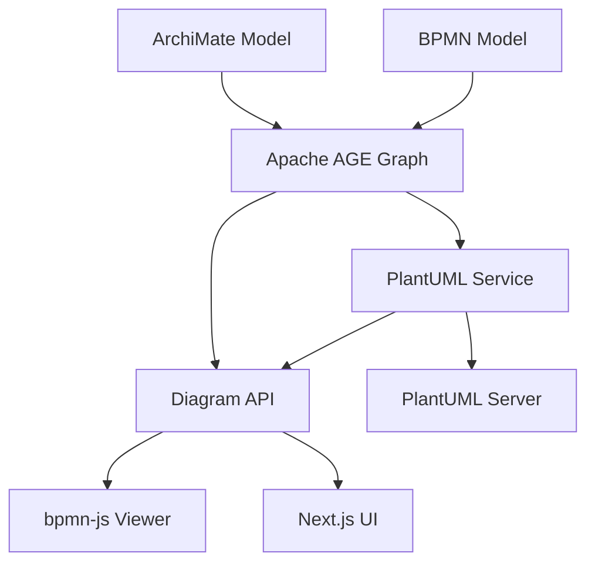

# 006 PlantUML Server - Backend Diagram Service

**Status: ✅ COMPLETED**

### Implementation Update (July 2025)

Successfully implemented PlantUML integration with the following services:
- **model-renderer-plantuml** (was plantuml-server) - Core PlantUML rendering engine on port 8081
- **model-visualizer** (was plantuml-service) - Graph-to-PlantUML translation service on port 8012
- **model-api** - Extended with PlantUML endpoints for unified diagram access

Key features implemented:
- ✅ ArchiMate to PlantUML component diagrams
- ✅ BPMN to PlantUML activity/sequence diagrams  
- ✅ Multi-format export (SVG, PNG, TXT)
- ✅ Integration with Apache AGE graph queries
- ✅ Docker containerization for all services

## Overview

PlantUML is a powerful open-source tool that allows creating diagrams from plain text descriptions. This backlog item proposes integrating a PlantUML server as a backend diagram service into the ameide-core architecture, complementing the existing ArchiMate and BPMN visualization capabilities.

### Key Benefits

1. **Text-based diagram definitions** - Version control friendly, diff-able diagrams
2. **Multiple diagram types** - Sequence, use case, class, activity, component, state, deployment diagrams and more
3. **Dynamic generation** - Generate diagrams on-the-fly from graph data
4. **Multiple output formats** - PNG, SVG, ASCII art, PDF
5. **Integration potential** - Can visualize ArchiMate and BPMN relationships in alternative formats

---

## Architecture Integration

### Current Stack Enhancement



### Proposed Architecture

| Component | Technology | Purpose |
|-----------|-----------|---------|
| **PlantUML Server** | Docker container (plantuml/plantuml-server) | Core rendering engine |
| **PlantUML Service** | FastAPI Python service | Graph-to-PlantUML translation layer |
| **Diagram API Enhancement** | Extended FastAPI endpoints | Unified diagram access |
| **Storage** | AGE graph properties | Cache generated PlantUML definitions |

### Implementation Details

**Translators Implemented**:
1. **ArchiMate Translator** (`translators/archimate.py`)
   - Queries ArchiMate views from AGE graph
   - Generates PlantUML component diagrams with proper stereotypes
   - Supports all ArchiMate element types and relationships

2. **BPMN Translator** (`translators/bpmn.py`) 
   - Converts BPMN processes to activity or sequence diagrams
   - Handles start/end events, tasks, gateways, and flows
   - Supports subprocesses and swimlanes

3. **Sequence Translator** (`translators/sequence.py`)
   - Creates sequence diagrams from architectural interactions
   - Maps ArchiMate scenarios and use cases
   - Shows component communication flows

**API Endpoints**:
- `/plantuml/archimate/{view_id}` - ArchiMate view diagrams
- `/plantuml/bpmn/{process_id}` - BPMN process diagrams  
- `/plantuml/sequence/{scenario_id}` - Interaction sequence diagrams
- `/diagram/{element_id}/plantuml` - Unified endpoint in model-api

---

## Original Proposed Implementation

### Phase 1: PlantUML Server Setup

```yaml
# docker-compose.yml addition
services:
  plantuml-server:
    image: plantuml/plantuml-server:latest
    ports:
      - "8080:8080"
    environment:
      - PLANTUML_LIMIT_SIZE=8192
    healthcheck:
      test: ["CMD", "curl", "-f", "http://localhost:8080/png/SyfFKj2rKt3CoKnELR1Io4ZDoSa70000"]
      interval: 30s
      timeout: 10s
      retries: 3
```

### Phase 2: PlantUML Translation Service

```python
# services/plantuml/main.py
from fastapi import FastAPI, HTTPException
from src.age.query_utils import run_cypher
import httpx
import base64

app = FastAPI(title="PlantUML Translation Service")

@app.get("/plantuml/archimate/{view_id}")
async def archimate_to_plantuml(view_id: str, format: str = "svg"):
    """Convert ArchiMate view to PlantUML diagram."""
    
    # Query ArchiMate elements from AGE
    elements = query_archimate_elements(view_id)
    
    # Generate PlantUML syntax
    puml_text = generate_archimate_plantuml(elements)
    
    # Render via PlantUML server
    diagram = await render_plantuml(puml_text, format)
    
    return diagram

def generate_archimate_plantuml(elements):
    """Generate PlantUML syntax from ArchiMate elements."""
    puml = ["@startuml"]
    puml.append("!include https://raw.githubusercontent.com/plantuml-stdlib/ArchiMate-PlantUML/master/ArchiMate.puml")
    
    # Add elements
    for elem in elements:
        if elem['type'] == 'BusinessProcess':
            puml.append(f"Business_Process({elem['id']}, \"{elem['name']}\")")
        elif elem['type'] == 'ApplicationComponent':
            puml.append(f"Application_Component({elem['id']}, \"{elem['name']}\")")
        # ... more element types
    
    # Add relationships
    for rel in elements.get('relationships', []):
        puml.append(f"Rel_{rel['type']}({rel['source']}, {rel['target']})")
    
    puml.append("@enduml")
    return "\n".join(puml)

async def render_plantuml(puml_text: str, format: str):
    """Send PlantUML text to server for rendering."""
    encoded = base64.urlsafe_b64encode(puml_text.encode()).decode()
    url = f"http://plantuml-server:8080/{format}/{encoded}"
    
    async with httpx.AsyncClient() as client:
        response = await client.get(url)
        return response.content
```

### Phase 3: BPMN to PlantUML Activity Diagrams

```python
@app.get("/plantuml/bpmn/{process_id}")
async def bpmn_to_plantuml_activity(process_id: str, format: str = "svg"):
    """Convert BPMN process to PlantUML activity diagram."""
    
    # Query BPMN elements
    process_data = query_bpmn_process(process_id)
    
    # Generate PlantUML activity diagram
    puml_text = generate_bpmn_activity_plantuml(process_data)
    
    # Render and return
    return await render_plantuml(puml_text, format)

def generate_bpmn_activity_plantuml(process):
    """Generate PlantUML activity diagram from BPMN."""
    puml = ["@startuml"]
    puml.append("start")
    
    for task in process['tasks']:
        if task['type'] == 'userTask':
            puml.append(f":{task['name']}|")
        elif task['type'] == 'serviceTask':
            puml.append(f":{task['name']};")
        elif task['type'] == 'exclusiveGateway':
            puml.append(f"if ({task['name']}) then (yes)")
            # Handle gateway logic
    
    puml.append("stop")
    puml.append("@enduml")
    return "\n".join(puml)
```

### Phase 4: Dynamic Sequence Diagrams

```python
@app.get("/plantuml/sequence/{scenario_id}")
async def generate_sequence_diagram(scenario_id: str):
    """Generate sequence diagram from architectural interactions."""
    
    # Query interaction patterns from graph
    interactions = query_architectural_interactions(scenario_id)
    
    puml = ["@startuml"]
    
    # Define participants
    for component in interactions['components']:
        puml.append(f"participant \"{component['name']}\" as {component['id']}")
    
    # Add interactions
    for interaction in interactions['flows']:
        puml.append(f"{interaction['from']} -> {interaction['to']}: {interaction['message']}")
    
    puml.append("@enduml")
    
    return await render_plantuml("\n".join(puml), "svg")
```

---

## Use Cases

### 1. Architecture Documentation

Generate comprehensive documentation diagrams from the ArchiMate model:
- Component diagrams showing application architecture
- Deployment diagrams for infrastructure views
- Use case diagrams for business capabilities

### 2. Process Visualization

Alternative BPMN visualizations:
- Simplified activity diagrams for stakeholder communication
- Sequence diagrams showing process interactions
- State diagrams for process lifecycle

### 3. Real-time Architecture Views

Dynamic diagrams based on graph queries:
- Current system state diagrams
- Dependency graphs
- Impact analysis visualizations

### 4. Export and Reporting

Multiple format support for different stakeholders:
- SVG for web integration
- PNG for presentations
- ASCII for documentation
- PDF for formal reports

---

## Integration with Existing Services

### Diagram API Extension

```python
# services/diagram_api/main.py (extended)

@app.get("/diagram/{element_id}")
async def get_diagram(element_id: str, format: str = "native", diagram_type: str = None):
    """Unified diagram endpoint supporting multiple formats."""
    
    element = get_element_type(element_id)
    
    if format == "native":
        if element['type'] == 'Process':
            return get_bpmn_xml(element_id)
        elif element['type'] == 'View':
            return get_archimate_view(element_id)
    
    elif format in ["svg", "png", "txt"]:
        # Delegate to PlantUML service
        if diagram_type == "sequence":
            return await plantuml_service.generate_sequence(element_id, format)
        elif diagram_type == "activity":
            return await plantuml_service.generate_activity(element_id, format)
        # ... more diagram types
```

### Next.js UI Integration

```typescript
// services/diagram-ui/components/DiagramViewer.tsx (enhanced)

export function DiagramViewer({ elementId, viewMode }: Props) {
  const [diagramType, setDiagramType] = useState('native');
  
  const diagramUrl = useMemo(() => {
    if (viewMode === 'plantuml') {
      return `/api/diagram/${elementId}?format=svg&diagram_type=${diagramType}`;
    }
    return `/api/diagram/${elementId}.bpmn`;
  }, [elementId, viewMode, diagramType]);
  
  return (
    <div>
      <DiagramTypeSelector 
        value={diagramType}
        onChange={setDiagramType}
        options={['native', 'sequence', 'activity', 'component']}
      />
      {viewMode === 'plantuml' ? (
        
      ) : (
        <BpmnViewer url={diagramUrl} />
      )}
    </div>
  );
}
```

---

## Benefits Analysis

### Advantages

1. **Flexibility** - Generate multiple diagram types from same data
2. **Simplicity** - Text-based definitions are easy to generate programmatically
3. **Performance** - Server-side rendering with caching potential
4. **Standardization** - Well-established syntax with extensive documentation
5. **Integration** - Works alongside existing visualization tools

### Trade-offs

1. **Additional dependency** - Requires Java-based PlantUML server
2. **Learning curve** - PlantUML syntax for complex diagrams
3. **Rendering limitations** - Less interactive than bpmn-js
4. **Style constraints** - Limited customization compared to native renderers

---

## Implementation Checklist

- [ ] **Setup PlantUML server** Docker container with proper resource limits
- [ ] **Create translation service** FastAPI app for graph-to-PlantUML conversion
- [ ] **Implement ArchiMate translator** Support core ArchiMate elements and relationships
- [ ] **Implement BPMN translator** Convert processes to activity/sequence diagrams
- [ ] **Add caching layer** Store generated PlantUML definitions in AGE
- [ ] **Extend Diagram API** Unified endpoint for all diagram types
- [ ] **Update UI components** Add diagram type selector and PlantUML viewer
- [ ] **Write comprehensive tests** Unit tests for translators, integration tests for rendering
- [ ] **Document PlantUML syntax** Guidelines for manual diagram creation
- [ ] **Performance optimization** Implement async rendering and result caching

---

## Future Enhancements

1. **Custom styling** - Organization-specific PlantUML themes
2. **Interactive features** - Clickable elements linking back to graph
3. **Batch generation** - Export all diagrams for documentation
4. **CI/CD integration** - Automatic diagram generation on model changes
5. **Collaborative editing** - PlantUML text editor with live preview

---

## References

- [PlantUML Official Documentation](https://plantuml.com/)
- [PlantUML Server Docker Image](https://hub.docker.com/r/plantuml/plantuml-server)
- [ArchiMate-PlantUML Library](https://github.com/plantuml-stdlib/ArchiMate-PlantUML)
- [PlantUML API Documentation](https://plantuml.com/api)
- [BPMN to PlantUML Patterns](https://github.com/bpmn-io/bpmn-to-image)