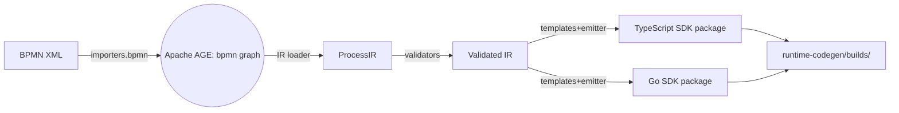

## ✅ IMPLEMENTATION STATUS: REFACTORED (January 2025)

### Update (2025-07-24)
The transpiler architecture has been refactored and split into modular packages following SOLID principles:

**New Package Structure:**
- ✅ `packages/ameide_core-workflows-model2temporal/` - BPMN to Temporal transpiler
- ✅ `packages/ameide_core-workflows-model2camunda/` - BPMN to Camunda transpiler  
- ✅ `packages/ameide_core-agent-model2langgraph/` - Agent model to LangGraph
- ✅ `packages/ameide_core-agent-model2airflow/` - Agent model to Airflow

**SDK Integration:**
- ✅ `packages/ameide_core-sdk` now orchestrates transpilers via `CodegenManager`
- ✅ Transpilers are discovered and invoked dynamically
- ✅ Unified interface through SDK's `transpile()` function

## ✅ ORIGINAL IMPLEMENTATION STATUS: COMPLETED (December 2025)

This document outlined the transpiler architecture for converting BPMN models to executable code. The transpilation layer has been successfully implemented in `packages/ameide_core-transpilers/`.

**Prerequisites completed:**
- ✅ BPMN models successfully imported to AGE (`bpmn` graph schema)
- ✅ Temporal workflows engine deployed (`workflows-engine-temporal`)
- ✅ LangGraph agent runtime deployed (`agent-runtime-langgraph`)
- ✅ Model API service for CRUD operations (`model-api`)

**Transpiler components implemented:**
- ✅ BPMN → Temporal transpiler (Python code generation fully functional)
- ✅ BPMN → LangGraph support (via `impl="wfdesc"` task annotations)
- ✅ Intermediate Representation (IR) layer with dataclasses
- ✅ Code generation templates (Jinja2) for Python, TypeScript templates exist
- ✅ Provenance tracking integration with meta_link edges
- ✅ Runtime hooks for execution tracking
- ⚠️ TypeScript generation (templates exist but incomplete)
- ❌ Go generation (not implemented)
- ❌ CLI interface (using programmatic API)
- ❌ CI/CD pipeline integration

---

Below is a pragmatic file‑and‑module layout that has worked well on mixed‑language Temporal projects. It keeps concerns sharply separated, supports multiple code‑generation targets (Go and TypeScript), and plugs naturally into your existing import/CI workflows.

---

## 1 . Top‑level Monorepo Skeleton

```
ameide-core/
│
├─ importers/                    # already exists
│   └─ bpmn/
│
├─ transpilers/
│   ├─ __init__.py
│   └─ bpmn/                     # notation family
│       └─ temporal/             # runtime target
│           ├─ __init__.py
│           ├─ ir/               # language‑neutral Intermediate Representation
│           │   ├─ __init__.py
│           │   ├─ model.py      # dataclasses: Process, Task, Gateway …
│           │   └─ loader.py     # builds IR from imported BPMN graph
│           │
│           ├─ generators/       # one sub‑dir per Temporal SDK
│           │   ├─ ts/           # TypeScript SDK
│           │   │   ├─ templates/
│           │   │   │   ├─ workflows.ts.j2
│           │   │   │   ├─ activities.ts.j2
│           │   │   │   └─ package.json.j2
│           │   │   └─ emitter.py
│           │   │
│           │   └─ go/          # Go SDK
│           │       ├─ templates/
│           │       │   ├─ workflows.go.j2
│           │       │   └─ activities.go.j2
│           │       └─ emitter.py
│           │
│           ├─ cli.py            # `ameide transpile bpmn-temporal …`
│           └─ validators.py     # BPMN → Temporal compatibility checks
│
├─ runtime‑codegen/              # (already planned)
│   └─ builds/                   # artefacts dropped here by CI
│
├─ tests/
│   └─ transpilers/
│       └─ bpmn_temporal/
│           ├─ test_ir_loader.py
│           ├─ test_validators.py
│           ├─ test_ts_emitter.py
│           └─ fixtures/         # sample BPMN + golden outputs
│
└─ scripts/
    └─ ci/
        ├─ run_transpilers.sh    # invoked by GitHub Actions
        └─ smoke_temporal.sh     # spins up Temporal container & integration tests
```

### Rationale

| Folder             | Role                                                                                                |
| ------------------ | --------------------------------------------------------------------------------------------------- |
| `ir/`              | Pure Python dataclasses; **never** imports SDK‑specific code.                                       |
| `generators/*/`    | One sub‑package per Temporal SDK. Templates live beside the emitter so they stay in sync.           |
| `validators.py`    | Enforces Temporal constraints early (e.g., **no mixed event‑based gateways**, **no script tasks**). |
| `cli.py`           | Single entry‑point for all build scripts and CI.                                                    |
| `runtime‑codegen/` | Remains language‑agnostic; transpiler just drops artefacts here.                                    |

---

## 2 . Intermediate Representation (IR)

*Keep it as small as possible, just enough to express Temporal‑compatible constructs.*

```python
# transpilers/bpmn/temporal/ir/model.py
@dataclass
class Task:
    id: str
    name: str
    impl: Literal["temporal", "wfdesc", "manual"]
    input_vars: list[str]
    output_vars: list[str]

@dataclass
class Gateway:
    id: str
    type: Literal["exclusive", "parallel"]
    condition: str | None  # Temporal supports code-level branching

@dataclass
class ProcessIR:
    id: str
    name: str
    tasks: list[Task]
    gateways: list[Gateway]
    edges: list[tuple[str, str]]  # source_id → target_id
```

* Why IR?

  * **Stable contract** between importer and emitters.
  * Facilitates **unit tests** (golden IR → golden code).
  * Future AI/non‑deterministic paths (wfdesc) can produce a *superset* IR without rewriting emitters.

---

## 3 . Code‑Generation Flow



### Key points

* **Validators** fail CI early if the model uses constructs Temporal cannot execute (e.g. compensation events).
* **Emitter** selects template set according to `--lang` flag; templates are plain **Jinja2** for readability.
* Artefacts are stored under `runtime-codegen/builds/$git_sha/$process_name/…`.

---

## 4 . CLI Interface

```bash
# TypeScript build
ameide transpile bpmn-temporal \
       --graph-path bpmn \
       --process-id order_workflows \
       --lang ts \
       --out runtime-codegen/builds

# Go build
ameide transpile bpmn-temporal \
       --graph-path bpmn \
       --process-id order_workflows \
       --lang go \
       --out runtime-codegen/builds
```

*Implements in `cli.py` using `typer` for zero‑boilerplate CLIs.*

---

## 5 . Continuous‑Integration Hooks

| Stage           | Action                                                                                       | Fail‑fast on  |
| --------------- | -------------------------------------------------------------------------------------------- | ------------- |
| **Import & IR** | Load changed *.bpmn*, regenerate IR, compare to cached IR file (`*.ir.json`)                 | Diff          |
| **Validate**    | Run `validators.validate(ir)`                                                                | Any error     |
| **Generate**    | Emit code, run `prettier --check` / `go vet`                                                 | Lint errors   |
| **Compile**     | `npm run build` or `go vet ./...` inside generated package                                   | Compiler errs |
| **Smoke Test**  | Spin up Temporal test‑server Docker; launch workflows; assert success; verify provenance node | Failure       |
| **Publish**     | On branch `main`, upload ZIP artefact & provenance JSON to pipeline artefacts                | N/A           |

All steps are executed from `scripts/ci/run_transpilers.sh` so developers can reproduce locally.

---

## 6 . Testing Strategy

1. **Unit** –
   *Golden* IR fixtures → emitter → compare to *golden* source files committed in `tests/fixtures/`.
   Ensures templates don't drift.

2. **Integration** –
   Spin up **Temporal test‑server** (single Docker container); run generated workflows with stub activity returning mock data.

3. **Provenance assertion** –
   Verify that Temporal interceptor posts `prov:Activity {src_id=Task.id}` to `provenance‑collector` and that the node exists in AGE.

---

## 7 . Extensibility Hooks

| Area                 | How to Extend                                                                                                                                     |
| -------------------- | ------------------------------------------------------------------------------------------------------------------------------------------------- |
| **Extra SDKs**       | Add `generators/python/` with templates + emitter registering itself via `entry_points`.                                                          |
| **Non‑Temporal RTE** | Create parallel package `transpilers/bpmn/camunda/` sharing the same IR loader.                                                                   |
| **AI Hooks**         | `impl="wfdesc"` tasks already appear in IR. Emitters create **Activity stubs** that enqueue LangGraph calls, plus `meta_link:DECOMPOSES_TO` edge. |

---

## 8 . Why This Works in Your Context

* **Aligns with existing importer code (Python) and AGE storage** – IR loader queries the graph directly via `psycopg2`.
* **Language isolation** – Developers working in Go or TS never touch Python; they receive generated code only.
* **CI visibility** – Every generated artefact is checked in (or cached) so review diffs show exact code changes when a BPMN model changes.
* **Future‑proof** – If project decides to adopt Camunda later, IR and validator packages are reusable; only new emitters are required.

---

### Immediate Next Steps

1. Scaffold folder structure (`mkdir -p transpilers/bpmn/temporal/{ir,generators/{ts,go}}`).
2. Move *one* sample BPMN (`order.bpmn`) into `tests/fixtures/`.
3. Implement **IR loader** and minimal **TS emitter** that handles *start → single task → end* flow.
4. Wire into CI, prove round‑trip from BPMN change to running Temporal workflows.
5. Incrementally add gateways, variables, and error handling.

With this skeleton in place, each sprint can add capability in a single, reviewable slice—and the knowledge graph will start producing real, executable value within a few days, not months.

---

## ✅ ACTUAL IMPLEMENTATION (December 2025)

The transpiler has been implemented following a modified version of this architecture:

### Package Structure

```
packages/ameide_core-transpilers/
├── src/transpilers/
│   ├── core/
│   │   ├── base.py          # BaseTranspiler abstract class
│   │   └── ir.py            # ProcessIR, Task, Gateway, Event dataclasses
│   ├── bpmn_temporal/
│   │   ├── transpiler.py    # Main BPMNTemporalTranspiler
│   │   ├── loader.py        # Loads from GraphProvider
│   │   ├── validator.py     # Temporal compatibility checks
│   │   ├── generator.py     # Code generation orchestrator
│   │   └── templates/
│   │       ├── python/      # Jinja2 templates for Python
│   │       ├── typescript/  # Jinja2 templates for TypeScript
│   │       └── go/          # Placeholder for Go templates
│   └── runtime/
│       ├── provenance.py    # ProvenanceTracker
│       └── temporal_hooks.py # TemporalProvenanceInterceptor
└── tests/
    ├── test_unit_sample_order.py      # MockProvider tests
    └── test_integration_age_sample_order.py # AGE integration tests
```

### Key Design Decisions

1. **GraphProvider Abstraction**: Instead of direct AGE queries, uses protocol-based providers (AGE, Neo4j, Mock)
2. **Async-First**: All graph operations are async, enabling high-performance runtime queries
3. **Provenance Integration**: Built-in support for tracking design→runtime lineage
4. **Test-Driven**: MockProvider enables fast unit testing without database dependencies

### IR Model

```python
@dataclass
class ProcessIR:
    id: str
    name: str
    tasks: List[Task]
    gateways: List[Gateway]
    events: List[Event]
    flows: List[Flow]
    error_boundaries: List[ErrorBoundary]
    data_objects: List[DataObject]
    # Provenance tracking
    graph_uuid: Optional[str]
    src_id: str
    model_type: str = "bpmn"
```

### Code Generation Flow

1. **Load**: GraphProvider → BPMN nodes/edges → ProcessIR
2. **Validate**: Check Temporal constraints (timeouts, supported patterns)
3. **Transform**: Apply defaults, enhance with runtime metadata
4. **Generate**: Jinja2 templates → Python/TypeScript code
5. **Track**: Create provenance links in meta_link graph

### Provenance Tracking

Every transpilation creates meta_link edges:
- `TRANSPILED_TO`: BPMN Process → Temporal Workflow
- `IMPLEMENTS`: BPMN Task → Temporal Activity
- `DECOMPOSES_TO`: BPMN Task (impl="wfdesc") → LangGraph Process

### Testing Strategy

- **Unit Tests**: Use MockProvider for fast, isolated testing
- **Integration Tests**: Test with real AGE instance (optional)
- **Provider-Agnostic**: Same tests run against all providers

### Current Limitations

1. **Python Only**: Full implementation for Python; TypeScript/Go pending
2. **No CLI**: Programmatic API only, no command-line interface
3. **Manual Integration**: Provenance hooks require manual worker configuration
4. **Limited Patterns**: Supports basic BPMN patterns (not all BPMN 2.0 features)